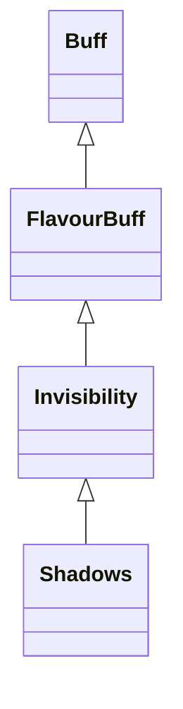

# Shadows 类文档

## 1. 基本信息

| 属性 | 值 |
|------|-----|
| **文件路径** | core/src/main/java/com/shatteredpixel/shatteredpixeldungeon/actors/buffs/Shadows.java |
| **包名** | com.shatteredpixel.shatteredpixeldungeon.actors.buffs |
| **类类型** | public class |
| **继承关系** | extends Invisibility |
| **代码行数** | 128 行 |
| **官方中文名** | 暗影融合 |

## 2. 文件职责说明

Shadows 类表示“暗影融合”Buff。它基于 `Invisibility` 扩展出“贴近阴影时持续隐身”的行为：附着前要求周围没有敌人，持续期间若靠近敌人会立即解除，并且它使用自己的 `left` 计时方式而不是父类固定时长。

**核心职责**：
- 继承并复用 `Invisibility` 的隐形计数与视觉逻辑
- 在附着前检查周围相邻格是否有敌人
- 维护自己的剩余时间 `left`
- 靠近敌人时立即解除暗影融合
- 附着/移除时刷新观察结果

## 3. 结构总览

```
Shadows (extends Invisibility)
├── 字段
│   └── left: float
├── 初始化块
│   ├── announced = false
│   └── type = POSITIVE
└── 方法
    ├── storeInBundle()/restoreFromBundle()
    ├── attachTo(Char): boolean
    ├── detach(): void
    ├── act(): boolean
    ├── prolong(): void
    ├── icon(): int
    ├── iconFadePercent(): float
    └── desc(): String
```

## 4. 继承与协作关系

### 继承关系图



### 协作关系

| 协作类 | 协作方式 |
|--------|----------|
| **Invisibility** | 父类，提供隐形附着、`invisible` 计数和视觉逻辑 |
| **Dungeon.level.mobs** | 用于判断相邻敌人 |
| **Mob** | 相邻敌对单位会阻止或打断暗影融合 |
| **Sample / Assets.Sounds.MELD** | 附着成功时播放融合音效 |
| **Dungeon.observe()** | 附着与结束时刷新观察结果 |
| **BuffIndicator** | 使用 `SHADOWS` 图标 |
| **Messages** | 描述文本国际化 |
| **Bundle** | 存档读写 |

## 5. 字段与常量详解

### 实例字段

| 字段 | 类型 | 说明 |
|------|------|------|
| `left` | float | 暗影融合剩余持续时间 |

### 初始化块

```java
{
    announced = false;
    type = buffType.POSITIVE;
}
```

### Bundle 键

| 常量 | 值 | 用途 |
|------|-----|------|
| `LEFT` | `left` | 保存剩余时间 |

## 6. 构造与初始化机制

Shadows 没有显式构造函数。一般在花园/阴影相关效果中创建，并通过 `prolong()` 把剩余时间重设为 2。

## 7. 方法详解

### storeInBundle() / restoreFromBundle()

保存并恢复 `left`。

### attachTo(Char target)

附着前先检查当前楼层所有怪物：
- 若存在与目标相邻且阵营不同的 `Mob`，直接返回 `false`

若通过检查，再调用 `super.attachTo(target)`；成功后：
- 播放 `MELD` 音效
- 调用 `Dungeon.observe()`

### detach()

先 `super.detach()`，然后调用 `Dungeon.observe()`。

### act()

每回合：
1. 若目标存活：
   - `spend(TICK)`
   - `--left`
   - 若 `left <= 0`，移除自身
   - 遍历当前楼层怪物；若存在相邻敌对单位，立刻移除自身
2. 若目标已死亡，直接移除

### prolong()

把 `left` 直接设为 `2`。

### icon()/iconFadePercent()/desc()

- 图标：`BuffIndicator.SHADOWS`
- 淡出：固定返回 `0`
- 描述：直接返回 `Messages.get(this, "desc")`

## 8. 对外暴露能力

| 方法 | 用途 |
|------|------|
| `prolong()` | 把暗影融合剩余时间重置为 2 |
| `attachTo(Char)` | 附着前检查相邻敌人 |

## 9. 运行机制与调用链

```
Shadows.attachTo(target)
├── 检查相邻敌对 Mob
├── super.attachTo(target)  // Invisibility 逻辑
└── 播放 MELD 并 Dungeon.observe()

每回合
└── Shadows.act()
    ├── left--
    ├── [left <= 0] detach()
    └── [相邻敌人] detach()
```

## 10. 资源、配置与国际化关联

文件：`core/src/main/assets/messages/actors/actors_zh.properties`

```properties
actors.buffs.shadows.name=暗影融合
actors.buffs.shadows.desc=你和周围的阴影融为一体，使你隐形并减缓你的新陈代谢。
```

## 11. 使用示例

```java
Shadows s = Buff.affect(hero, Shadows.class);
s.prolong();
```

## 12. 开发注意事项

- 本类继承 `Invisibility`，因此仍会影响 `target.invisible` 计数。
- 它的持续时间不走父类固定常量，而是用自己的 `left` 字段和 `prolong()` 维持。
- 只要相邻出现敌对单位就会立即解体，这个行为是核心约束。

## 13. 修改建议与扩展点

- 若将来希望让阴影融合在更大范围内判断敌人，可把“相邻”检查抽成可配置规则。
- 若要让剩余时间也显示在图标上，可改写 `iconFadePercent()` 与 `iconTextDisplay()`。

## 14. 事实核查清单

- [x] 已覆盖全部字段与方法
- [x] 已验证继承关系 `extends Invisibility`
- [x] 已验证 `announced = false` 与 `POSITIVE` 初始化
- [x] 已验证附着前相邻敌人检查
- [x] 已验证 `left` 计时和 `prolong()` 逻辑
- [x] 已验证相邻敌人打断逻辑
- [x] 已验证 `Dungeon.observe()` 附着/移除刷新
- [x] 已核对官方中文名来自翻译文件
- [x] 无臆测性机制说明
