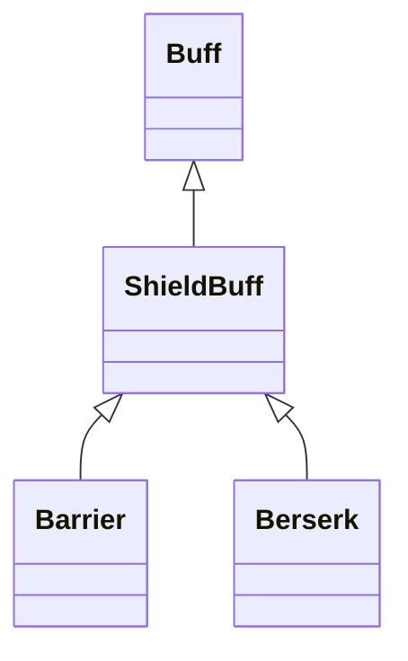

# ShieldBuff 类文档

## 1. 基本信息

| 属性 | 值 |
|------|-----|
| **文件路径** | core/src/main/java/com/shatteredpixel/shatteredpixeldungeon/actors/buffs/ShieldBuff.java |
| **包名** | com.shatteredpixel.shatteredpixeldungeon.actors.buffs |
| **类类型** | public abstract class |
| **继承关系** | extends Buff |
| **代码行数** | 153 行 |
| **直接子类** | Barrier, Berserk, WarriorShield 等护盾型 Buff |

## 2. 文件职责说明

ShieldBuff 是所有护盾 Buff 的抽象父类。它统一管理护盾值、护盾优先级、多护盾伤害吸收顺序，以及与英雄愤怒天赋相关的联动。

**核心职责**：
- 保存当前护盾值 `shielding`
- 提供增减、设置、延后与吸收伤害接口
- 通过 `shieldUsePriority` 定义多护盾消耗顺序
- 提供静态 `processDamage()` 统一结算多个护盾

## 3. 结构总览

```
ShieldBuff (extends Buff) [abstract]
├── 字段
│   ├── shielding: int
│   ├── shieldUsePriority: int
│   └── detachesAtZero: boolean
├── 方法
│   ├── attachTo()/detach()
│   ├── shielding(): int
│   ├── setShield(int): void
│   ├── incShield()/incShield(int)
│   ├── delay(float): void
│   ├── decShield()/decShield(int)
│   ├── absorbDamage(int): int
│   ├── processDamage(Char,int,Object): int$
│   ├── storeInBundle()/restoreFromBundle()
```

## 4. 继承与协作关系

### 继承关系图



### 协作关系

| 协作类 | 协作方式 |
|--------|----------|
| **Buff** | 父类，提供附着与存档基础 |
| **Char** | `needsShieldUpdate` 标记更新盾值显示 |
| **Hero** | 护盾耗尽时可能触发 `PROVOKED_ANGER` |
| **Talent.PROVOKED_ANGER** | 耗尽护盾时附加 `ProvokedAngerTracker` |
| **Hunger** | 饥饿伤害被显式排除，不走护盾吸收 |
| **Bundle** | 存档读写 |

## 5. 字段与常量详解

### 实例字段

| 字段 | 类型 | 默认值 | 说明 |
|------|------|--------|------|
| `shielding` | int | 0 | 当前护盾值 |
| `shieldUsePriority` | int | 0 | 多护盾情况下的消耗优先级，数值越大越先消耗 |
| `detachesAtZero` | boolean | true | 护盾归零时是否自动移除 Buff |

### 注释定义的优先级约定

| 优先级 | 说明 |
|--------|------|
| 2 | 较弱且短期护盾，例如格挡 Buff |
| 1 | 更大但仍短期的护盾 |
| 0 | 其他大多数通用护盾 |

### Bundle 键

| 常量 | 值 | 用途 |
|------|-----|------|
| `SHIELDING` | `shielding` | 保存当前护盾值 |

## 6. 构造与初始化机制

ShieldBuff 是抽象类，不能直接实例化。子类通常在创建后通过 `setShield()` 或 `incShield()` 设定初始护盾值。

## 7. 方法详解

### attachTo(Char target) / detach()

附着与移除时都会设置：

```java
target.needsShieldUpdate = true;
```

确保角色盾值显示刷新。

### shielding()

返回当前护盾值。

### setShield(int shield)

仅在当前护盾值 `<= shield` 时覆盖为新值。

### incShield()/incShield(int)

增加护盾值，并刷新 `needsShieldUpdate`。

### delay(float value)

调用 `spend(value)`，表示延后护盾自然衰减或到期时机，但不增加护盾值。

### decShield()/decShield(int)

减少护盾值，并刷新显示。

### absorbDamage(int dmg)

逻辑：
- 若护盾足够，完全吸收并把伤害置 0
- 若护盾不足，先吃完护盾并返回剩余伤害
- 若护盾归零且 `detachesAtZero` 为真，则移除自身

返回值为**剩余未被护盾吸收的伤害**。

### processDamage(Char target, int damage, Object src)

静态统一结算入口。\n
执行逻辑：
1. 若伤害来源是 `Hunger`，直接返回原伤害，不走护盾。
2. 收集目标身上全部 `ShieldBuff`。
3. 按 `shieldUsePriority` 降序排序。
4. 依次调用每个 Buff 的 `absorbDamage()`。
5. 若某个护盾被打空且目标是英雄并拥有 `PROVOKED_ANGER`，附加 `ProvokedAngerTracker`。
6. 当剩余伤害为 0 时提前结束循环。

### storeInBundle() / restoreFromBundle()

保存并恢复 `shielding`。

## 8. 对外暴露能力

| 方法 | 用途 |
|------|------|
| `setShield()` / `incShield()` / `decShield()` | 读写护盾值 |
| `absorbDamage(int)` | 吸收一次伤害 |
| `processDamage(...)` | 统一处理多护盾结算 |
| `shielding()` | 查询当前护盾值 |

## 9. 运行机制与调用链

```
角色受到伤害
└── ShieldBuff.processDamage(target, damage, src)
    ├── [非 Hunger] 收集所有 ShieldBuff
    ├── 按 shieldUsePriority 排序
    └── 逐个 absorbDamage()

单个护盾吸收
└── ShieldBuff.absorbDamage(dmg)
    ├── 扣减 shielding
    ├── [shielding <= 0 && detachesAtZero] detach()
    └── 返回剩余伤害
```

## 10. 资源、配置与国际化关联

ShieldBuff 本类没有独立翻译键。它是抽象父类，具体名称、图标说明和描述文本都由子类提供。

## 11. 使用示例

```java
ShieldBuff shield = hero.buff(Barrier.class);
int remaining = ShieldBuff.processDamage(hero, 12, enemy);
```

## 12. 开发注意事项

- `Hunger` 伤害显式绕过护盾，这是非常关键的特殊分支。
- 多护盾结算顺序依赖 `shieldUsePriority`，不是附着顺序。
- `delay()` 只改时间，不改数值。

## 13. 修改建议与扩展点

- 若后续护盾类型继续增多，可把优先级规则提取为常量枚举。
- 若要更透明地调试护盾吸收顺序，可在开发版加入详细日志。

## 14. 事实核查清单

- [x] 已覆盖全部字段与方法
- [x] 已验证继承关系 `extends Buff` 且为抽象类
- [x] 已验证 `needsShieldUpdate` 刷新逻辑
- [x] 已验证 `absorbDamage()` 的返回语义
- [x] 已验证 `processDamage()` 的排序与循环逻辑
- [x] 已验证 Hunger 伤害绕过护盾
- [x] 已验证 `ProvokedAngerTracker` 联动
- [x] 已验证 `Bundle` 存档字段
- [x] 已注明本类无独立翻译键这一事实
- [x] 无臆测性机制说明
