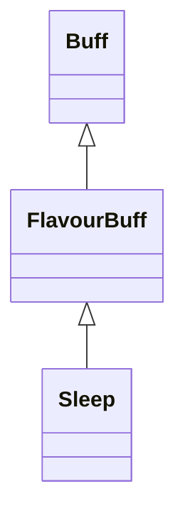

# Sleep 类文档

## 1. 基本信息

| 属性 | 值 |
|------|-----|
| **文件路径** | core/src/main/java/com/shatteredpixel/shatteredpixeldungeon/actors/buffs/Sleep.java |
| **包名** | com.shatteredpixel.shatteredpixeldungeon.actors.buffs |
| **类类型** | public class |
| **继承关系** | extends FlavourBuff |
| **代码行数** | 33 行 |
| **官方中文名** | 睡眠 |

## 2. 文件职责说明

Sleep 类表示“睡眠”Buff。它是一个极简的 FlavourBuff，自身只覆写了视觉表现：Buff 启用时让目标精灵切到 `idle()` 动画状态。

**核心职责**：
- 作为通用睡眠状态类型
- 在视觉层把目标精灵切为静止待机状态
- 提供公开常量 `SWS`

## 3. 结构总览

```
Sleep (extends FlavourBuff)
├── 常量
│   └── SWS: float = 1.5f
└── 方法
    └── fx(boolean): void
```

## 4. 继承与协作关系

### 继承关系图



### 协作关系

| 协作类 | 协作方式 |
|--------|----------|
| **FlavourBuff** | 父类，提供时限型 Buff 行为 |
| **CharSprite** | `fx(true)` 时调用 `idle()` |
| **MagicalSleep** | 附着前通过 `target.isImmune(Sleep.class)` 检查是否免疫睡眠 |

## 5. 字段与常量详解

### 常量

| 常量 | 类型 | 值 | 说明 |
|------|------|----|------|
| `SWS` | float | `1.5f` | 源码公开常量；本类自身未在其他方法中使用 |

## 6. 构造与初始化机制

Sleep 没有显式构造函数，也没有自定义初始化块。其 Buff 类型、公告与持续时间设置依赖父类默认行为或外部施加逻辑。

## 7. 方法详解

### fx(boolean on)

```java
@Override
public void fx(boolean on) {
    if (on) target.sprite.idle();
}
```

仅在开启时把目标精灵切换为待机动作；关闭时没有额外逻辑。

## 8. 对外暴露能力

| 方法/成员 | 用途 |
|-----------|------|
| `SWS` | 对外公开的睡眠相关常量 |
| `fx(boolean)` | 控制睡眠开始时的视觉表现 |

## 9. 运行机制与调用链

```
Buff.affect(target, Sleep.class, duration)
└── Sleep.fx(true)
    └── target.sprite.idle()
```

## 10. 资源、配置与国际化关联

Sleep 本类没有在 `actors_zh.properties` 中定义独立可读文案；相关文字更多由 `MagicalSleep` 或其他上层效果提供。

## 11. 使用示例

```java
Buff.affect(enemy, Sleep.class, 5f);
```

## 12. 开发注意事项

- 本类几乎只是一个“睡眠类型标记 + 基础视觉壳”，真正的睡眠玩法逻辑通常在外部系统里。
- `SWS` 在本类源码中未被直接使用，修改前要先确认其外部依赖。

## 13. 修改建议与扩展点

- 若未来需要更完整的基础睡眠行为，可在本类中加入统一的附着/唤醒逻辑，而不是完全交给其他 Buff。
- 若要改善表现，可在 `fx(true)` 之外加入结束时的恢复动画。

## 14. 事实核查清单

- [x] 已覆盖全部自有方法与常量
- [x] 已验证继承关系 `extends FlavourBuff`
- [x] 已验证 `fx(true)` 只调用 `sprite.idle()`
- [x] 已说明本类无独立翻译键这一事实
- [x] 无臆测性机制说明
