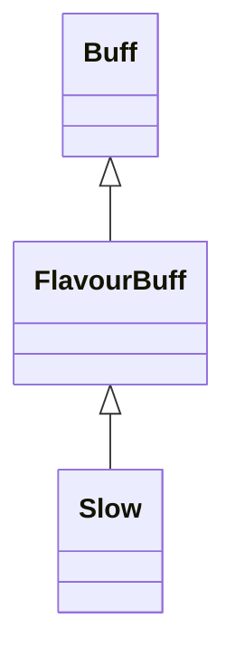

# Slow 类文档

## 1. 基本信息

| 属性 | 值 |
|------|-----|
| **文件路径** | core/src/main/java/com/shatteredpixel/shatteredpixeldungeon/actors/buffs/Slow.java |
| **包名** | com.shatteredpixel.shatteredpixeldungeon.actors.buffs |
| **类类型** | public class |
| **继承关系** | extends FlavourBuff |
| **代码行数** | 51 行 |
| **官方中文名** | 迟缓 |

## 2. 文件职责说明

Slow 类表示“迟缓”Buff。它是一个负面 FlavourBuff，仅定义持续时间、图标、染色与淡出显示，具体“行动耗时翻倍”的效果由外部速度/时间流速系统根据该 Buff 是否存在来实现。

**核心职责**：
- 定义迟缓持续时间 `10f`
- 标记为负面且可公告的 Buff
- 提供时间图标、染色和淡出比例

## 3. 结构总览

```
Slow (extends FlavourBuff)
├── 常量
│   └── DURATION: float = 10f
├── 初始化块
│   ├── type = NEGATIVE
│   └── announced = true
└── 方法
    ├── icon(): int
    ├── tintIcon(Image): void
    └── iconFadePercent(): float
```

## 4. 继承与协作关系

### 继承关系图



### 协作关系

| 协作类 | 协作方式 |
|--------|----------|
| **FlavourBuff** | 父类，提供时限型 Buff 行为 |
| **BuffIndicator** | 使用 `TIME` 图标 |
| **Image** | 图标染色 |

## 5. 字段与常量详解

### 常量

| 常量 | 类型 | 值 | 说明 |
|------|------|----|------|
| `DURATION` | float | `10f` | 默认持续时间 |

### 初始化块

```java
{
    type = buffType.NEGATIVE;
    announced = true;
}
```

## 6. 构造与初始化机制

Slow 没有显式构造函数。常见施加方式：

```java
Buff.affect(target, Slow.class, Slow.DURATION);
```

## 7. 方法详解

### icon()

返回 `BuffIndicator.TIME`。

### tintIcon(Image icon)

```java
icon.hardlight(1f, 0.33f, 0.2f);
```

### iconFadePercent()

公式：

```java
Math.max(0, (DURATION - visualcooldown()) / DURATION)
```

## 8. 对外暴露能力

| 方法/成员 | 用途 |
|-----------|------|
| `DURATION` | 标准持续时间 |
| `icon()` | UI 图标显示 |

## 9. 运行机制与调用链

```
Buff.affect(target, Slow.class, DURATION)
└── FlavourBuff 生命周期运行
    └── UI 读取图标、染色与淡出比例
```

## 10. 资源、配置与国际化关联

文件：`core/src/main/assets/messages/actors/actors_zh.properties`

```properties
actors.buffs.slow.name=迟缓
actors.buffs.slow.desc=减速魔法影响了目标的时间流速，在目标眼中所有的事物都移动得飞快。
```

## 11. 使用示例

```java
Buff.affect(enemy, Slow.class, Slow.DURATION);
```

## 12. 开发注意事项

- 本类不直接改动速度字段，属于“由外部系统读取 Buff 状态再计算”的实现方式。
- 若后续想记录更复杂的减速来源或倍率，需要从 `FlavourBuff` 升级为带字段的 `Buff` 子类。

## 13. 修改建议与扩展点

- 若未来存在多档迟缓效果，可为倍率增加字段和描述参数。
- 若要增强 UI 反馈，可加自定义视觉状态或文字提示。

## 14. 事实核查清单

- [x] 已覆盖全部自有方法与常量
- [x] 已验证继承关系 `extends FlavourBuff`
- [x] 已验证 `NEGATIVE` 与 `announced = true`
- [x] 已验证图标、染色与淡出公式
- [x] 已核对官方中文名来自翻译文件
- [x] 无臆测性机制说明
