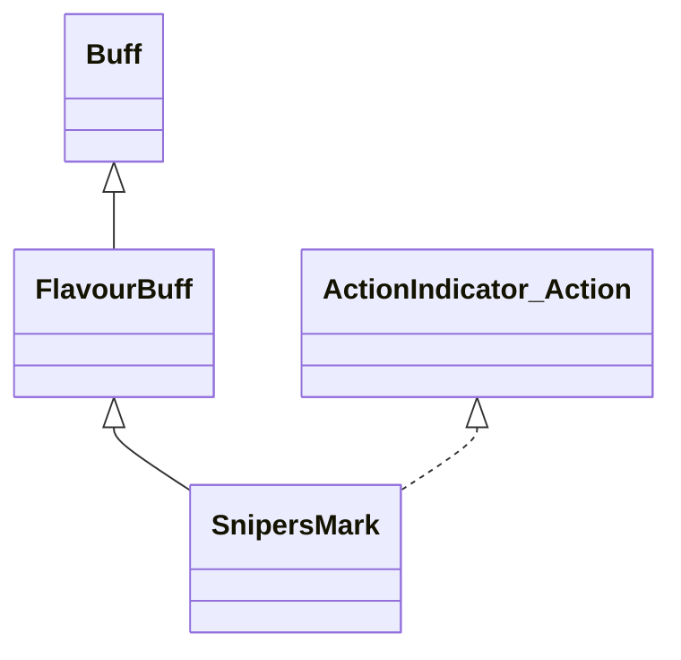

# SnipersMark 类文档

## 1. 基本信息

| 属性 | 值 |
|------|-----|
| **文件路径** | core/src/main/java/com/shatteredpixel/shatteredpixeldungeon/actors/buffs/SnipersMark.java |
| **包名** | com.shatteredpixel.shatteredpixeldungeon.actors.buffs |
| **类类型** | public class |
| **继承关系** | extends FlavourBuff implements ActionIndicator.Action |
| **代码行数** | 142 行 |
| **官方中文名** | 狙击标记 |

## 2. 文件职责说明

SnipersMark 类表示“狙击标记”Buff。它会记录被标记目标的 Actor ID 和额外伤害百分比，并在 ActionIndicator 上提供一次基于灵能弓强化类型的特殊射击入口。

**核心职责**：
- 记录目标 `object` 与额外伤害 `percentDmgBonus`
- 附着时注册动作按钮
- 根据 `SpiritBow.augment` 返回不同动作名称
- 在动作触发时自动瞄准目标并发射灵能箭

## 3. 结构总览

```
SnipersMark (extends FlavourBuff implements ActionIndicator.Action)
├── 字段
│   ├── object: int
│   └── percentDmgBonus: float
├── 常量
│   └── DURATION: float = 4f
├── 初始化块
│   └── type = POSITIVE
└── 方法
    ├── set(int,float): void
    ├── attachTo()/detach()
    ├── storeInBundle()/restoreFromBundle()
    ├── icon()/iconFadePercent()
    ├── actionName()/actionIcon()/indicatorColor()/doAction()
```

## 4. 继承与协作关系

### 继承关系图



### 协作关系

| 协作类 | 协作方式 |
|--------|----------|
| **FlavourBuff** | 父类，提供时限型 Buff 行为 |
| **ActionIndicator.Action** | 提供狙击动作按钮 |
| **SpiritBow** | 读取强化类型并生成 `SpiritArrow` |
| **QuickSlotButton.autoAim()** | 自动瞄准被标记目标 |
| **Actor.findById()** | 通过 `object` 找回目标 |
| **HeroIcon** | 动作按钮图标 |
| **BuffIndicator** | 使用 `MARK` 图标 |
| **Bundle** | 存档读写 |

## 5. 字段与常量详解

### 实例字段

| 字段 | 类型 | 说明 |
|------|------|------|
| `object` | int | 被标记目标的 Actor ID |
| `percentDmgBonus` | float | 本次特殊射击的额外伤害百分比 |

### 常量

| 常量 | 类型 | 值 | 说明 |
|------|------|----|------|
| `DURATION` | float | `4f` | 默认持续时间 |

### 初始化块

```java
{
    type = buffType.POSITIVE;
}
```

### Bundle 键

| 常量 | 值 | 用途 |
|------|-----|------|
| `OBJECT` | `object` | 保存目标 ID |
| `BONUS` | `bonus` | 保存额外伤害百分比 |

## 6. 构造与初始化机制

SnipersMark 没有显式构造函数。外部通常创建后用 `set(object, bonus)` 写入目标与伤害加成。

## 7. 方法详解

### set(int object, float bonus)

直接保存目标 ID 和伤害加成百分比。

### attachTo(Char target) / detach()

- 附着时：先 `ActionIndicator.setAction(this)`，再 `super.attachTo(target)`
- 移除时：先 `super.detach()`，再清除动作按钮

### storeInBundle() / restoreFromBundle()

保存并恢复 `object` 与 `percentDmgBonus`。

### icon() / iconFadePercent()

- 图标：`BuffIndicator.MARK`
- 淡出：`Math.max(0, (DURATION - visualcooldown()) / DURATION)`

### actionName()

读取英雄当前的 `SpiritBow`。若没有弓则返回 `null`。\n
有弓时根据 `augment` 返回：
- `NONE` -> `action_name_snapshot`
- `SPEED` -> `action_name_volley`
- `DAMAGE` -> `action_name_sniper`

### actionIcon() / indicatorColor()

- 图标：`HeroIcon.SNIPERS_MARK`
- 颜色：`0x444444`

### doAction()

执行流程：
1. 获取英雄、灵能弓与 `SpiritArrow`
2. 通过 `Actor.findById(object)` 找回目标
3. 用 `QuickSlotButton.autoAim(ch, arrow)` 找到射击格
4. 给弓写入：

```java
bow.sniperSpecial = true;
bow.sniperSpecialBonusDamage = percentDmgBonus;
```

5. `arrow.cast(hero, cell)` 发射
6. `detach()` 移除标记

## 8. 对外暴露能力

| 方法 | 用途 |
|------|------|
| `set(int,float)` | 设置目标与伤害加成 |
| `doAction()` | 执行特殊狙击射击 |

## 9. 运行机制与调用链

```
外部系统创建标记
└── SnipersMark.set(targetId, bonus)

点击动作按钮
└── SnipersMark.doAction()
    ├── 找到 SpiritBow 和 SpiritArrow
    ├── 用 object 找到目标
    ├── autoAim 计算落点
    ├── 设置 sniperSpecial 和 bonus
    ├── arrow.cast(...)
    └── detach()
```

## 10. 资源、配置与国际化关联

文件：`core/src/main/assets/messages/actors/actors_zh.properties`

```properties
actors.buffs.snipersmark.name=狙击标记
actors.buffs.snipersmark.action_name_snapshot=速射
actors.buffs.snipersmark.action_name_volley=连射
actors.buffs.snipersmark.action_name_sniper=狙杀
```

## 11. 使用示例

```java
SnipersMark mark = Buff.affect(hero, SnipersMark.class, SnipersMark.DURATION);
mark.set(enemy.id(), 0.35f);
```

## 12. 开发注意事项

- 这个 Buff 依赖 `SpiritBow`，没有灵能弓时动作名和动作执行都会提前返回。
- `percentDmgBonus` 只是临时写入弓对象，实际伤害结算不在本类里完成。
- `object` 用的是 Actor ID，因此目标失活或消失后动作会失效返回。

## 13. 修改建议与扩展点

- 若以后狙击标记需要支持更多弓种，可把当前对 `SpiritBow` 的硬依赖抽成接口。
- 若要避免对象 ID 失效，可以考虑增加附着时的目标有效性监听。

## 14. 事实核查清单

- [x] 已覆盖全部字段、方法与 Action 接口实现
- [x] 已验证继承关系 `extends FlavourBuff implements ActionIndicator.Action`
- [x] 已验证 `object` / `percentDmgBonus` 写入与存档逻辑
- [x] 已验证 actionName 与弓强化类型的对应关系
- [x] 已验证 `doAction()` 的自动瞄准与发射流程
- [x] 已验证动作按钮附着/移除逻辑
- [x] 已核对官方中文名与动作名来自翻译文件
- [x] 无臆测性机制说明
