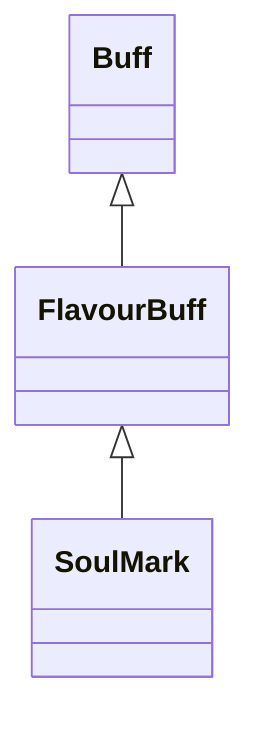

# SoulMark 类文档

## 1. 基本信息

| 属性 | 值 |
|------|-----|
| **文件路径** | core/src/main/java/com/shatteredpixel/shatteredpixeldungeon/actors/buffs/SoulMark.java |
| **包名** | com.shatteredpixel.shatteredpixeldungeon.actors.buffs |
| **类类型** | public class |
| **继承关系** | extends FlavourBuff |
| **代码行数** | 57 行 |
| **官方中文名** | 灵魂标记 |

## 2. 文件职责说明

SoulMark 类表示“灵魂标记”Buff。它是一个负面 FlavourBuff，主要用于给目标附加 `MARKED` 视觉状态并展示对应图标与倒计时。

**核心职责**：
- 定义固定持续时间 `10f`
- 标记为负面且可公告的 Buff
- 在视觉层为目标添加/移除 `MARKED`

## 3. 结构总览

```
SoulMark (extends FlavourBuff)
├── 常量
│   └── DURATION: float = 10f
├── 初始化块
│   ├── type = NEGATIVE
│   └── announced = true
└── 方法
    ├── icon(): int
    ├── tintIcon(Image): void
    ├── iconFadePercent(): float
    └── fx(boolean): void
```

## 4. 继承与协作关系

### 继承关系图



### 协作关系

| 协作类 | 协作方式 |
|--------|----------|
| **FlavourBuff** | 父类，提供时限型 Buff 行为 |
| **CharSprite.State.MARKED** | 视觉标记状态 |
| **BuffIndicator** | 使用 `INVERT_MARK` 图标 |
| **Image** | 图标染色 |

## 5. 字段与常量详解

### 常量

| 常量 | 类型 | 值 | 说明 |
|------|------|----|------|
| `DURATION` | float | `10f` | 默认持续时间 |

### 初始化块

```java
{
    type = buffType.NEGATIVE;
    announced = true;
}
```

## 6. 构造与初始化机制

SoulMark 没有显式构造函数。常见施加方式：

```java
Buff.affect(target, SoulMark.class, SoulMark.DURATION);
```

## 7. 方法详解

### icon()

返回 `BuffIndicator.INVERT_MARK`。

### tintIcon(Image icon)

```java
icon.hardlight(0.5f, 0.2f, 1f);
```

### iconFadePercent()

公式：

```java
Math.max(0, (DURATION - visualcooldown()) / DURATION)
```

### fx(boolean on)

- `on == true`：`target.sprite.add(CharSprite.State.MARKED)`
- `on == false`：`target.sprite.remove(CharSprite.State.MARKED)`

## 8. 对外暴露能力

| 方法/成员 | 用途 |
|-----------|------|
| `DURATION` | 标准持续时间 |
| `fx(boolean)` | 控制目标视觉标记 |

## 9. 运行机制与调用链

```
Buff.affect(target, SoulMark.class, DURATION)
└── SoulMark.fx(true)
    └── target.sprite.add(MARKED)

Buff 结束
└── SoulMark.fx(false)
    └── target.sprite.remove(MARKED)
```

## 10. 资源、配置与国际化关联

文件：`core/src/main/assets/messages/actors/actors_zh.properties`

```properties
actors.buffs.soulmark.name=灵魂标记
actors.buffs.soulmark.desc=术士已经击穿了目标的灵魂。其在受到物理伤害时将会恢复术士的生命。
```

## 11. 使用示例

```java
Buff.affect(enemy, SoulMark.class, SoulMark.DURATION);
```

## 12. 开发注意事项

- 本类只实现视觉标记与 Buff 壳，不在这里直接处理术士吸血回复逻辑。
- 若未来多个系统共用 `MARKED`，需要检查视觉状态冲突。

## 13. 修改建议与扩展点

- 若要携带额外数值信息，可从纯 FlavourBuff 升级为带字段的 Buff。
- 若有更多“标记者”类 Buff，可抽出通用标记视觉父类。

## 14. 事实核查清单

- [x] 已覆盖全部自有方法与常量
- [x] 已验证继承关系 `extends FlavourBuff`
- [x] 已验证 `NEGATIVE` 与 `announced = true`
- [x] 已验证 `MARKED` 视觉状态添加/移除逻辑
- [x] 已验证图标、染色与淡出公式
- [x] 已核对官方中文名来自翻译文件
- [x] 无臆测性机制说明
