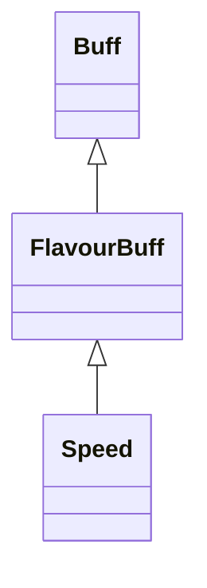

# Speed 类文档

## 1. 基本信息

| 属性 | 值 |
|------|-----|
| **文件路径** | core/src/main/java/com/shatteredpixel/shatteredpixeldungeon/actors/buffs/Speed.java |
| **包名** | com.shatteredpixel.shatteredpixeldungeon.actors.buffs |
| **类类型** | public class |
| **继承关系** | extends FlavourBuff |
| **代码行数** | 28 行 |
| **官方中文名** | 无独立翻译键（本类未在 actors_zh.properties 中单独定义） |

## 2. 文件职责说明

Speed 类是一个极简的速度型 FlavourBuff。它只定义了默认持续时间常量，没有覆写任何图标、描述或行为逻辑。

**核心职责**：
- 作为“速度增益类型”Buff 标记
- 提供固定持续时间 `10f`

## 3. 结构总览

```
Speed (extends FlavourBuff)
└── 常量
    └── DURATION: float = 10f
```

## 4. 继承与协作关系

### 继承关系图



### 协作关系

| 协作类 | 协作方式 |
|--------|----------|
| **FlavourBuff** | 提供全部时限型 Buff 行为 |

## 5. 字段与常量详解

### 常量

| 常量 | 类型 | 值 | 说明 |
|------|------|----|------|
| `DURATION` | float | `10f` | 默认持续时间 |

## 6. 构造与初始化机制

Speed 没有显式构造函数，也没有初始化块。它的类型、公告、图标与描述都依赖父类默认值或外部系统额外约束。

## 7. 方法详解

Speed 本类没有自定义方法，完全继承 `FlavourBuff` / `Buff` 的默认实现。

## 8. 对外暴露能力

| 方法/成员 | 用途 |
|-----------|------|
| `DURATION` | 标准持续时间 |

## 9. 运行机制与调用链

```
Buff.affect(target, Speed.class, Speed.DURATION)
└── FlavourBuff 生命周期运行
```

## 10. 资源、配置与国际化关联

Speed 本类在 `actors_zh.properties` 中没有独立翻译键。若外部系统直接显示其名称或描述，则会依赖 `Buff` 的默认键查找并可能为空。

## 11. 使用示例

```java
Buff.affect(hero, Speed.class, Speed.DURATION);
```

## 12. 开发注意事项

- 这是一个纯“壳类” Buff，所有实际速度效果都不在本类源码中实现。
- 因为本类没有任何 UI 覆写，若以后直接面向玩家显示，最好补齐图标和翻译键。

## 13. 修改建议与扩展点

- 若要真正用于玩家可见的速度增益，建议增加图标、类型和描述。
- 若未来只有具体子类会使用这个类型，也可以保持当前最小实现。

## 14. 事实核查清单

- [x] 已覆盖唯一自有常量
- [x] 已验证继承关系 `extends FlavourBuff`
- [x] 已确认本类无自定义方法
- [x] 已说明无独立翻译键这一事实
- [x] 无臆测性机制说明
