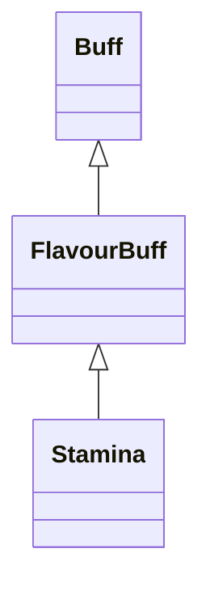

# Stamina 类文档

## 1. 基本信息

| 属性 | 值 |
|------|-----|
| **文件路径** | core/src/main/java/com/shatteredpixel/shatteredpixeldungeon/actors/buffs/Stamina.java |
| **包名** | com.shatteredpixel.shatteredpixeldungeon.actors.buffs |
| **类类型** | public class |
| **继承关系** | extends FlavourBuff |
| **代码行数** | 50 行 |
| **官方中文名** | 体力充沛 |

## 2. 文件职责说明

Stamina 类表示“体力充沛”Buff。它是一个正面 FlavourBuff，本类只定义持续时间、图标、图标染色与淡出显示，具体“移动速度提升 50%”的效果由外部速度系统依据该 Buff 是否存在来实现。

**核心职责**：
- 定义较长持续时间 `100f`
- 提供 `HASTE` 图标和绿色染色
- 标记为正面 Buff

## 3. 结构总览

```
Stamina (extends FlavourBuff)
├── 常量
│   └── DURATION: float = 100f
├── 初始化块
│   └── type = POSITIVE
└── 方法
    ├── icon(): int
    ├── tintIcon(Image): void
    └── iconFadePercent(): float
```

## 4. 继承与协作关系

### 继承关系图



### 协作关系

| 协作类 | 协作方式 |
|--------|----------|
| **FlavourBuff** | 父类，提供时限型 Buff 行为 |
| **BuffIndicator** | 使用 `HASTE` 图标 |
| **Image** | 图标染色 |

## 5. 字段与常量详解

### 常量

| 常量 | 类型 | 值 | 说明 |
|------|------|----|------|
| `DURATION` | float | `100f` | 默认持续时间 |

### 初始化块

```java
{
    type = buffType.POSITIVE;
}
```

## 6. 构造与初始化机制

Stamina 没有显式构造函数。常见施加方式：

```java
Buff.affect(hero, Stamina.class, Stamina.DURATION);
```

## 7. 方法详解

### icon()

返回 `BuffIndicator.HASTE`。

### tintIcon(Image icon)

```java
icon.hardlight(0.5f, 1f, 0.5f);
```

### iconFadePercent()

公式：

```java
Math.max(0, (DURATION - visualcooldown()) / DURATION)
```

## 8. 对外暴露能力

| 方法/成员 | 用途 |
|-----------|------|
| `DURATION` | 标准持续时间 |
| `icon()` | UI 图标显示 |

## 9. 运行机制与调用链

```
Buff.affect(target, Stamina.class, DURATION)
└── FlavourBuff 生命周期运行
    └── UI 读取图标、染色和淡出
```

## 10. 资源、配置与国际化关联

文件：`core/src/main/assets/messages/actors/actors_zh.properties`

```properties
actors.buffs.stamina.name=体力充沛
actors.buffs.stamina.desc=你感受到了体内无尽的精力，让你可以以更快的速度移动！
```

## 11. 使用示例

```java
Buff.affect(hero, Stamina.class, Stamina.DURATION);
```

## 12. 开发注意事项

- 本类没有自定义移动速度实现，只提供 Buff 壳与显示接口。
- 它使用的是 `HASTE` 图标而不是专用 `STAMINA` 图标，这是源码事实。

## 13. 修改建议与扩展点

- 若未来要区分不同来源的速度增益，可在图标或描述上继续扩展来源信息。
- 若需要更直观区分，可为 Stamina 分配专用图标编号。

## 14. 事实核查清单

- [x] 已覆盖全部自有方法与常量
- [x] 已验证继承关系 `extends FlavourBuff`
- [x] 已验证 `POSITIVE` 初始化
- [x] 已验证图标、染色与淡出公式
- [x] 已核对官方中文名来自翻译文件
- [x] 无臆测性机制说明
