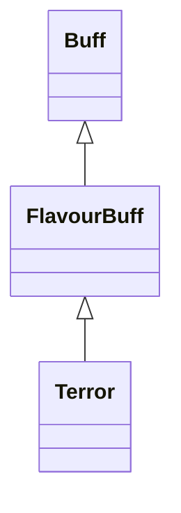

# Terror 类文档

## 1. 基本信息

| 属性 | 值 |
|------|-----|
| **文件路径** | core/src/main/java/com/shatteredpixel/shatteredpixeldungeon/actors/buffs/Terror.java |
| **包名** | com.shatteredpixel.shatteredpixeldungeon.actors.buffs |
| **类类型** | public class |
| **继承关系** | extends FlavourBuff |
| **代码行数** | 74 行 |
| **官方中文名** | 恐惧 |

## 2. 文件职责说明

Terror 类表示“恐惧”Buff。它除了作为标准的负面 FlavourBuff 外，还记录一个对象 ID `object`，并支持通过 `recover()` 让恐惧因受击而提前缩短。

**核心职责**：
- 记录恐惧关联对象 `object`
- 允许通过 `recover()` 提前缩短持续时间
- 使用 `ignoreNextHit` 控制一次受击不触发缩短
- 提供恐惧图标与淡出显示

## 3. 结构总览

```
Terror (extends FlavourBuff)
├── 字段
│   ├── object: int
│   └── ignoreNextHit: boolean
├── 常量
│   └── DURATION: float = 20f
├── 初始化块
│   ├── type = NEGATIVE
│   └── announced = true
└── 方法
    ├── storeInBundle()/restoreFromBundle()
    ├── icon(): int
    ├── iconFadePercent(): float
    └── recover(): void
```

## 4. 继承与协作关系

### 继承关系图



### 协作关系

| 协作类 | 协作方式 |
|--------|----------|
| **FlavourBuff** | 父类，提供时限型 Buff 行为 |
| **BuffIndicator** | 使用 `TERROR` 图标 |
| **Bundle** | 保存 `object` |

## 5. 字段与常量详解

### 实例字段

| 字段 | 类型 | 说明 |
|------|------|------|
| `object` | int | 关联对象 ID 或位置型标识，源码中只负责保存与恢复 |
| `ignoreNextHit` | boolean | 为真时下一次 `recover()` 只清掉标记，不缩短恐惧 |

### 常量

| 常量 | 类型 | 值 | 说明 |
|------|------|----|------|
| `DURATION` | float | `20f` | 默认持续时间 |

### Bundle 键

| 常量 | 值 | 用途 |
|------|-----|------|
| `OBJECT` | `object` | 保存关联对象值 |

## 6. 构造与初始化机制

Terror 没有显式构造函数。通常通过：

```java
Buff.affect(target, Terror.class, Terror.DURATION);
```

附着。

## 7. 方法详解

### storeInBundle() / restoreFromBundle()

保存并恢复 `object`。

### icon()

返回 `BuffIndicator.TERROR`。

### iconFadePercent()

公式：

```java
Math.max(0, (DURATION - visualcooldown()) / DURATION)
```

### recover()

受击后缩短恐惧的接口。\n
逻辑：
- 若 `ignoreNextHit == true`：
  - 把它设回 `false`
  - 不做其他事，直接返回
- 否则：
  - `spend(-5f)`，等于把剩余时间直接减少 5
  - 若 `cooldown() <= 0`，立即 `detach()`

## 8. 对外暴露能力

| 方法 | 用途 |
|------|------|
| `recover()` | 在受击后缩短恐惧持续时间 |
| `object` | 供外部记录恐惧关联对象 |

## 9. 运行机制与调用链

```
Buff.affect(target, Terror.class, DURATION)
└── FlavourBuff 生命周期运行

目标因外部逻辑触发“从恐惧中恢复”
└── Terror.recover()
    ├── [ignoreNextHit] 只清标记
    └── [正常] spend(-5f) 并可能 detach()
```

## 10. 资源、配置与国际化关联

文件：`core/src/main/assets/messages/actors/actors_zh.properties`

```properties
actors.buffs.terror.name=恐惧
actors.buffs.terror.desc=恐惧是使敌人陷入不可控制的恐慌的操纵性魔法。
```

## 11. 使用示例

```java
Terror terror = Buff.affect(enemy, Terror.class, Terror.DURATION);
terror.object = hero.id();
terror.recover();
```

## 12. 开发注意事项

- `recover()` 不是按伤害量缩短，而是每次固定缩短 5f。
- `object` 在本类里不参与逻辑运算，只负责存储；真正用途由外部系统决定。

## 13. 修改建议与扩展点

- 若未来需要不同来源造成不同程度的“恐惧恢复”，可把 `recover()` 改成带参数形式。
- 若 `object` 语义固定下来，可用更明确的字段名替代。

## 14. 事实核查清单

- [x] 已覆盖全部字段与方法
- [x] 已验证继承关系 `extends FlavourBuff`
- [x] 已验证 `NEGATIVE` 与 `announced = true`
- [x] 已验证 `recover()` 的固定缩短逻辑
- [x] 已验证 `ignoreNextHit` 的一次性跳过逻辑
- [x] 已验证 `Bundle` 存档字段
- [x] 已核对官方中文名来自翻译文件
- [x] 无臆测性机制说明
