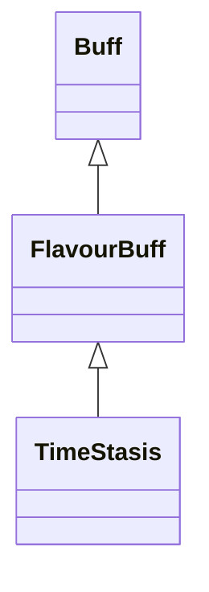

# TimeStasis 类文档

## 1. 基本信息

| 属性 | 值 |
|------|-----|
| **文件路径** | core/src/main/java/com/shatteredpixel/shatteredpixeldungeon/actors/buffs/TimeStasis.java |
| **包名** | com.shatteredpixel.shatteredpixeldungeon.actors.buffs |
| **类类型** | public class |
| **继承关系** | extends FlavourBuff |
| **代码行数** | 83 行 |

## 2. 文件职责说明

TimeStasis 类表示时间静止 Buff。它会让目标同时进入隐形和麻痹状态，并在时间流逝时主动补偿饥饿值，避免玩家频繁进入时间静止时受到额外饥饿惩罚。

**核心职责**：
- 附着时增加 `invisible` 和 `paralysed`
- 进入静止时立即 `next()`
- 覆写 `spend()`，为 `Hunger` 做反向补偿
- 移除时恢复隐形/麻痹计数并刷新观察结果

## 3. 结构总览

```
TimeStasis (extends FlavourBuff)
├── 初始化块
│   ├── type = POSITIVE
│   └── actPriority = BUFF_PRIO - 3
└── 方法
    ├── attachTo(Char): boolean
    ├── spend(float): void
    ├── detach(): void
    └── fx(boolean): void
```

## 4. 继承与协作关系

### 继承关系图



### 协作关系

| 协作类 | 协作方式 |
|--------|----------|
| **FlavourBuff** | 父类，提供时限型 Buff 行为 |
| **Hunger** | 在 `spend()` 中做饥饿补偿 |
| **Dungeon.observe()** | 附着/移除时刷新观察结果 |
| **CharSprite.State.PARALYSED / INVISIBLE** | 控制视觉状态 |

## 5. 字段与常量详解

TimeStasis 没有自有字段。\n
### 初始化块

```java
{
    type = Buff.buffType.POSITIVE;
    actPriority = BUFF_PRIO-3;
}
```

注释说明：其优先级要晚于其他 Buff，从而阻止那些 Buff 继续生效。

## 6. 构造与初始化机制

TimeStasis 没有显式构造函数。外部通常通过 `Buff.affect(...)` 施加，并依赖父类管理持续时间。

## 7. 方法详解

### attachTo(Char target)

若 `super.attachTo(target)` 成功：
- `target.invisible++`
- `target.paralysed++`
- `target.next()`
- 若 `Dungeon.hero != null`，调用 `Dungeon.observe()`

### spend(float time)

先调用 `super.spend(time)`。然后：
- 取得 `Hunger` Buff
- 若存在且未处于 `isStarving()`：

```java
hunger.affectHunger(cooldown(), true);
```

源码注释写明：这是为了不因频繁进入时间静止而额外惩罚玩家饥饿值。

### detach()

结束时：
- 若 `target.invisible > 0`，减 1
- 若 `target.paralysed > 0`，减 1
- `super.detach()`
- `Dungeon.observe()`

### fx(boolean on)

- `on == true`：添加 `PARALYSED`
- `on == false`：
  - 若 `target.paralysed == 0`，移除 `PARALYSED`
  - 若 `target.invisible == 0`，移除 `INVISIBLE`

## 8. 对外暴露能力

| 方法 | 用途 |
|------|------|
| `spend(float)` | 在消耗时间时同步补偿饥饿 |
| `attachTo(Char)` | 进入时间静止时附加隐形和麻痹 |

## 9. 运行机制与调用链

```
Buff.affect(target, TimeStasis.class, duration)
└── TimeStasis.attachTo(target)
    ├── invisible++
    ├── paralysed++
    └── target.next()

时间推进
└── TimeStasis.spend(time)
    ├── super.spend(time)
    └── Hunger.affectHunger(cooldown(), true)
```

## 10. 资源、配置与国际化关联

TimeStasis 本类没有在 `actors_zh.properties` 中定义独立显示文本，更多被作为机制性 Buff 使用。

## 11. 使用示例

```java
Buff.affect(hero, TimeStasis.class, 5f);
```

## 12. 开发注意事项

- `spend()` 的饥饿补偿是本类最关键的特殊逻辑，不能遗漏。
- 本类会同时占用 `invisible` 和 `paralysed` 两个计数系统，移除时也要对应回滚。

## 13. 修改建议与扩展点

- 若未来存在其他“暂停时间”的效果，可把饥饿补偿逻辑抽为共用工具。
- 若需要更明确的 UI 表达，可补充图标与描述资源。

## 14. 事实核查清单

- [x] 已覆盖全部自有方法
- [x] 已验证继承关系 `extends FlavourBuff`
- [x] 已验证 `POSITIVE` 和 `BUFF_PRIO - 3`
- [x] 已验证附着时 `invisible/paralysed` 计数变更
- [x] 已验证 `spend()` 中的饥饿补偿逻辑
- [x] 已验证移除时的状态回滚与视觉清理
- [x] 已说明无独立翻译键这一事实
- [x] 无臆测性机制说明
