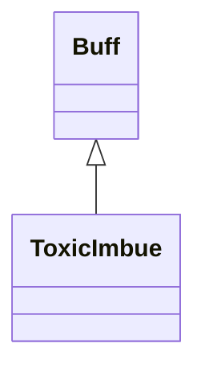

# ToxicImbue 类文档

## 1. 基本信息

| 属性 | 值 |
|------|-----|
| **文件路径** | core/src/main/java/com/shatteredpixel/shatteredpixeldungeon/actors/buffs/ToxicImbue.java |
| **包名** | com.shatteredpixel.shatteredpixeldungeon.actors.buffs |
| **类类型** | public class |
| **继承关系** | extends Buff |
| **代码行数** | 132 行 |
| **官方中文名** | 毒素之力 |

## 2. 文件职责说明

ToxicImbue 类表示“毒素之力”Buff。它会在持续期间每回合以自身为中心释放 `ToxicGas`，并同时让目标对 `ToxicGas` 与 `Poison` 免疫。

**核心职责**：
- 维护剩余时间 `left`
- 每回合生成以自身为中心扩散的 `ToxicGas`
- 给予 `ToxicGas` 和 `Poison` 免疫
- 附着时清除目标身上的 `Poison`

## 3. 结构总览

```
ToxicImbue (extends Buff)
├── 常量
│   └── DURATION: float = 50f
├── 字段
│   └── left: float
├── 初始化块
│   ├── type = POSITIVE
│   ├── announced = true
│   └── immunities.add(ToxicGas/Poison)
└── 方法
    ├── storeInBundle()/restoreFromBundle()
    ├── set(float)/extend(float)
    ├── act(): boolean
    ├── icon()/tintIcon()/iconFadePercent()/iconTextDisplay()/desc()
    └── attachTo(Char): boolean
```

## 4. 继承与协作关系

### 继承关系图



### 协作关系

| 协作类 | 协作方式 |
|--------|----------|
| **Buff** | 父类，提供附着与计时 |
| **Blob / ToxicGas** | 每回合生成毒气 Blob |
| **PathFinder.NEIGHBOURS8** | 枚举周围 8 个方向 |
| **GameScene** | 把生成的 Blob 加入场景 |
| **Poison** | 被加入免疫并在附着时清除 |
| **Messages** | 描述文本国际化 |
| **BuffIndicator** | 使用 `IMBUE` 图标 |
| **Image** | 图标染色 |
| **Bundle** | 存档读写 |

## 5. 字段与常量详解

### 常量

| 常量 | 类型 | 值 | 说明 |
|------|------|----|------|
| `DURATION` | float | `50f` | 默认持续时间 |

### 实例字段

| 字段 | 类型 | 说明 |
|------|------|------|
| `left` | float | 剩余持续时间 |

### 初始化块

第一段：

```java
{
    type = buffType.POSITIVE;
    announced = true;
}
```

第二段：

```java
{
    immunities.add(ToxicGas.class);
    immunities.add(Poison.class);
}
```

### Bundle 键

| 常量 | 值 | 用途 |
|------|-----|------|
| `LEFT` | `left` | 保存剩余时间 |

## 6. 构造与初始化机制

ToxicImbue 没有显式构造函数。常见创建方式：

```java
ToxicImbue t = Buff.affect(hero, ToxicImbue.class);
t.set(ToxicImbue.DURATION);
```

## 7. 方法详解

### set(float duration) / extend(float duration)

- `set()`：直接覆盖 `left = duration`
- `extend()`：`left += duration`

### act()

每回合：
1. 若 `left > 0`：
   - 以自身为中心生成毒气
   - 先设 `centerVolume = 6`
   - 遍历 `NEIGHBOURS8`
   - 对每个非实心相邻格，加入 `Blob.seed(..., 6, ToxicGas.class)`
   - 对实心格，把本应给该格的 6 点体积加回中心
   - 最后在中心格生成 `centerVolume` 点毒气
2. `spend(TICK)`
3. `left -= TICK`
4. 当 `left <= -5` 时移除 Buff

源码注释明确写着：总共扩散 `54` 单位毒气。

### icon()/tintIcon()/iconFadePercent()/iconTextDisplay()/desc()

- 图标：`left > 0 ? BuffIndicator.IMBUE : BuffIndicator.NONE`
- 染色：`icon.hardlight(1f, 1.5f, 0f)`
- 淡出：`Math.max(0, (DURATION - left) / DURATION)`
- 文本：显示 `(int)left`
- 描述：`Messages.get(this, "desc", dispTurns(left))`

### attachTo(Char target)

若 `super.attachTo(target)` 成功：
- `Buff.detach(target, Poison.class)`
- 返回 `true`

## 8. 对外暴露能力

| 方法 | 用途 |
|------|------|
| `set(float)` | 设置持续时间 |
| `extend(float)` | 延长持续时间 |
| `attachTo(Char)` | 附着时清除中毒 |

## 9. 运行机制与调用链

```
ToxicImbue.act()
├── [left > 0] 以目标为中心生成 ToxicGas
├── left -= TICK
└── [left <= -5] detach()
```

## 10. 资源、配置与国际化关联

文件：`core/src/main/assets/messages/actors/actors_zh.properties`

```properties
actors.buffs.toxicimbue.name=毒素之力
actors.buffs.toxicimbue.desc=你被灌注了毒素的力量！
```

## 11. 使用示例

```java
ToxicImbue t = Buff.affect(hero, ToxicImbue.class);
t.set(ToxicImbue.DURATION);
t.extend(10f);
```

## 12. 开发注意事项

- `left <= -5` 才移除，意味着效果结束后还会保留一小段“尾气阶段”。
- 中心毒气体积会因周围实心格被动回流，不能简单写成“中心固定 6、周围固定 6”。
- 图标在 `left <= 0` 时直接变成 `NONE`，但 Buff 可能仍未移除。

## 13. 修改建议与扩展点

- 若未来希望气体扩散规则更灵活，可把 `54` 单位体积分配逻辑抽成单独方法。
- 若想减少 UI 混淆，可考虑在尾气阶段仍保留某种图标提示。

## 14. 事实核查清单

- [x] 已覆盖全部字段、方法、常量与初始化块
- [x] 已验证继承关系 `extends Buff`
- [x] 已验证 `POSITIVE` 与 `announced = true`
- [x] 已验证 `ToxicGas` / `Poison` 免疫与附着时清理逻辑
- [x] 已验证毒气总量与中心回流逻辑
- [x] 已验证 `left <= -5` 的移除条件
- [x] 已验证图标在 `left <= 0` 时隐藏
- [x] 已核对官方中文名来自翻译文件
- [x] 无臆测性机制说明
