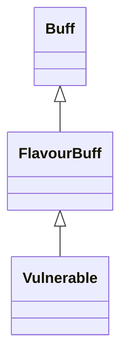

# Vulnerable 类文档

## 1. 基本信息

| 属性 | 值 |
|------|-----|
| **文件路径** | core/src/main/java/com/shatteredpixel/shatteredpixeldungeon/actors/buffs/Vulnerable.java |
| **包名** | com.shatteredpixel.shatteredpixeldungeon.actors.buffs |
| **类类型** | public class |
| **继承关系** | extends FlavourBuff |
| **代码行数** | 44 行 |
| **官方中文名** | 易伤 |

## 2. 文件职责说明

Vulnerable 类表示“易伤”Buff。它是一个极简的负面 FlavourBuff，只定义持续时间、公告、图标和淡出显示。

**核心职责**：
- 定义持续时间 `20f`
- 标记为负面且可公告的 Buff
- 提供 `VULNERABLE` 图标与淡出显示

## 3. 结构总览

```
Vulnerable (extends FlavourBuff)
├── 常量
│   └── DURATION: float = 20f
├── 初始化块
│   ├── type = NEGATIVE
│   └── announced = true
└── 方法
    ├── icon(): int
    └── iconFadePercent(): float
```

## 4. 继承与协作关系

### 继承关系图



### 协作关系

| 协作类 | 协作方式 |
|--------|----------|
| **FlavourBuff** | 父类，提供时限型 Buff 行为 |
| **BuffIndicator** | 使用 `VULNERABLE` 图标 |

## 5. 字段与常量详解

### 常量

| 常量 | 类型 | 值 | 说明 |
|------|------|----|------|
| `DURATION` | float | `20f` | 默认持续时间 |

### 初始化块

```java
{
    type = buffType.NEGATIVE;
    announced = true;
}
```

## 6. 构造与初始化机制

Vulnerable 没有显式构造函数。通常通过：

```java
Buff.affect(target, Vulnerable.class, Vulnerable.DURATION);
```

## 7. 方法详解

### icon()

返回 `BuffIndicator.VULNERABLE`。

### iconFadePercent()

公式：

```java
Math.max(0, (DURATION - visualcooldown()) / DURATION)
```

## 8. 对外暴露能力

| 方法/成员 | 用途 |
|-----------|------|
| `DURATION` | 标准持续时间 |
| `icon()` | UI 图标显示 |

## 9. 运行机制与调用链

```
Buff.affect(target, Vulnerable.class, DURATION)
└── FlavourBuff 生命周期运行
```

## 10. 资源、配置与国际化关联

文件：`core/src/main/assets/messages/actors/actors_zh.properties`

```properties
actors.buffs.vulnerable.name=易伤
actors.buffs.vulnerable.heromsg=你感到外界的伤害愈加疼痛！
actors.buffs.vulnerable.desc=易伤魔法会使得目标受到所有被护甲减免过的物理伤害增加33%%。
```

## 11. 使用示例

```java
Buff.affect(enemy, Vulnerable.class, Vulnerable.DURATION);
```

## 12. 开发注意事项

- 本类本身不直接改伤害数字，易伤增伤在外部伤害结算里根据该 Buff 是否存在来计算。
- 这是纯 FlavourBuff 外壳，没有额外字段与视觉状态。

## 13. 修改建议与扩展点

- 若以后需要不同强度的易伤，可新增倍率字段。
- 若想增强辨识度，可加入自定义染色或视觉状态。

## 14. 事实核查清单

- [x] 已覆盖全部自有方法与常量
- [x] 已验证继承关系 `extends FlavourBuff`
- [x] 已验证 `NEGATIVE` 与 `announced = true`
- [x] 已验证图标与淡出公式
- [x] 已核对官方中文名来自翻译文件
- [x] 无臆测性机制说明
