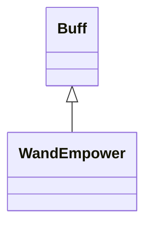

# WandEmpower 类文档

## 1. 基本信息

| 属性 | 值 |
|------|-----|
| **文件路径** | core/src/main/java/com/shatteredpixel/shatteredpixeldungeon/actors/buffs/WandEmpower.java |
| **包名** | com.shatteredpixel.shatteredpixeldungeon.actors.buffs |
| **类类型** | public class |
| **继承关系** | extends Buff |
| **代码行数** | 85 行 |
| **官方中文名** | 盈能法杖 |

## 2. 文件职责说明

WandEmpower 类表示“盈能法杖”Buff。它记录法杖的额外伤害 `dmgBoost` 和剩余有效攻击次数 `left`，用于给接下来的若干次法杖攻击提供增幅。

**核心职责**：
- 保存额外伤害与剩余次数
- 提供法杖图标、染色和剩余次数显示
- 在外部调用 `set()` 时刷新增幅数据
- 支持存档恢复

## 3. 结构总览

```
WandEmpower (extends Buff)
├── 字段
│   ├── dmgBoost: int
│   └── left: int
├── 初始化块
│   └── type = POSITIVE
└── 方法
    ├── icon()/tintIcon()/iconFadePercent()/iconTextDisplay()/desc()
    ├── set(int,int): void
    ├── storeInBundle(): void
    └── restoreFromBundle(): void
```

## 4. 继承与协作关系

### 继承关系图



### 协作关系

| 协作类 | 协作方式 |
|--------|----------|
| **Buff** | 父类，提供附着与存档基础能力 |
| **BuffIndicator** | 使用 `WAND` 图标 |
| **Image** | 图标染色 |
| **Messages** | 描述文本国际化 |
| **Bundle** | 存档读写 |

## 5. 字段与常量详解

### 实例字段

| 字段 | 类型 | 说明 |
|------|------|------|
| `dmgBoost` | int | 额外伤害值 |
| `left` | int | 剩余攻击次数 |

### 初始化块

```java
{
    type = buffType.POSITIVE;
}
```

### Bundle 键

| 常量 | 值 | 用途 |
|------|-----|------|
| `BOOST` | `boost` | 保存额外伤害 |
| `LEFT` | `left` | 保存剩余次数 |

## 6. 构造与初始化机制

WandEmpower 没有显式构造函数。外部通常创建后调用 `set(dmg, shots)` 写入初始数值。

## 7. 方法详解

### icon()/tintIcon()/iconFadePercent()/iconTextDisplay()/desc()

- 图标：`BuffIndicator.WAND`
- 染色：`icon.hardlight(1, 1, 0)`
- 淡出：`Math.max(0, (3-left) / 3f)`
- 文本：显示 `left`
- 描述：`Messages.get(this, "desc", dmgBoost, left)`

### set(int dmg, int shots)

逻辑：

```java
dmgBoost = dmg;
left = Math.max(left, shots);
```

说明：额外伤害值会被直接覆盖，而剩余次数只会保留更大的那个。

### storeInBundle() / restoreFromBundle()

保存并恢复 `dmgBoost` 与 `left`。

## 8. 对外暴露能力

| 方法 | 用途 |
|------|------|
| `set(int,int)` | 设置法杖增幅与剩余次数 |

## 9. 运行机制与调用链

```
外部效果创建 WandEmpower
└── set(dmg, shots)
    ├── 覆盖 dmgBoost
    └── 保留更大的 left
```

## 10. 资源、配置与国际化关联

文件：`core/src/main/assets/messages/actors/actors_zh.properties`

```properties
actors.buffs.wandempower.name=盈能法杖
actors.buffs.wandempower.desc=你的伤害型法杖已被强化，接下来的几次攻击会造成额外伤害。
```

## 11. 使用示例

```java
WandEmpower we = Buff.affect(hero, WandEmpower.class);
we.set(4, 3);
```

## 12. 开发注意事项

- `set()` 不会比较 `dmgBoost` 优劣，新的伤害值总是直接覆盖。
- `left` 的比较规则和 `PhysicalEmpower` 不同，不能混写。

## 13. 修改建议与扩展点

- 若后续希望多来源法杖强化共存，可把当前单实例字段改成列表或分层结构。
- 若需要更一致的行为，可和 `ScrollEmpower` / `PhysicalEmpower` 对齐刷新策略。

## 14. 事实核查清单

- [x] 已覆盖全部字段与方法
- [x] 已验证继承关系 `extends Buff`
- [x] 已验证 `POSITIVE` 初始化
- [x] 已验证 `set()` 对 `dmgBoost` 与 `left` 的不同处理规则
- [x] 已验证图标、染色、文本与描述逻辑
- [x] 已验证 `Bundle` 存档字段
- [x] 已核对官方中文名来自翻译文件
- [x] 无臆测性机制说明
