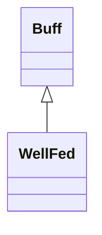

# WellFed 类文档

## 1. 基本信息

| 属性 | 值 |
|------|-----|
| **文件路径** | core/src/main/java/com/shatteredpixel/shatteredpixeldungeon/actors/buffs/WellFed.java |
| **包名** | com.shatteredpixel.shatteredpixeldungeon.actors.buffs |
| **类类型** | public class |
| **继承关系** | extends Buff |
| **代码行数** | 115 行 |
| **官方中文名** | 饱腹 |

## 2. 文件职责说明

WellFed 类表示“饱腹”Buff。它会在持续期间阻止饥饿增长，并以固定节奏恢复生命值；其持续时间与 `Hunger.STARVING` 阈值直接绑定，并受到 `SaltCube` 与 `NO_FOOD` 挑战影响。

**核心职责**：
- 维护剩余持续时间 `left`
- 每隔固定回合回复 1 点生命
- 根据挑战模式初始化不同的持续时长
- 为 Hunger 系统提供“先消耗 WellFed”的联动基础

## 3. 结构总览

```
WellFed (extends Buff)
├── 字段
│   └── left: int
├── 初始化块
│   ├── type = POSITIVE
│   └── announced = true
└── 方法
    ├── act(): boolean
    ├── reset(): void
    ├── extend(float): void
    ├── icon()/iconFadePercent()/iconTextDisplay()/desc()
    ├── storeInBundle()/restoreFromBundle()
```

## 4. 继承与协作关系

### 继承关系图



### 协作关系

| 协作类 | 协作方式 |
|--------|----------|
| **Buff** | 父类，提供附着与计时 |
| **Hero** | 回复满血或 Buff 结束时会停止 `resting` |
| **Hunger.STARVING** | 作为持续时间和淡出基准 |
| **SaltCube** | 调整时间流逝倍率与显示剩余时间 |
| **Challenges.NO_FOOD** | `reset()` 时把持续时间缩短为三分之一 |
| **FloatingText / CharSprite** | 显示恢复生命浮字 |
| **BuffIndicator** | 使用 `WELL_FED` 图标 |
| **Messages** | 描述文本国际化 |
| **Bundle** | 存档读写 |

## 5. 字段与常量详解

### 实例字段

| 字段 | 类型 | 说明 |
|------|------|------|
| `left` | int | 剩余持续回合 |

### 初始化块

```java
{
    type = buffType.POSITIVE;
    announced = true;
}
```

### Bundle 键

| 常量 | 值 | 用途 |
|------|-----|------|
| `LEFT` | `left` | 保存剩余时间 |

## 6. 构造与初始化机制

WellFed 没有显式构造函数。常见用法是创建后调用 `reset()`，把持续时间初始化为标准饱腹时长。

## 7. 方法详解

### act()

每回合逻辑：
1. `left--`
2. 若 `left < 0`：
   - `detach()`
   - 若目标是英雄，`resting = false`
3. 否则若 `left % 18 == 0 && target.HP < target.HT`：
   - 回复 1 点生命
   - 显示治疗浮字
   - 若因此满血且目标是英雄，`resting = false`
4. 以：

```java
spend(TICK / SaltCube.hungerGainMultiplier())
```

推进时间。源码注释强调：`SaltCube` 会减慢该 Buff 的流逝，但不会减少奖励生命。

### reset()

初始化标准持续时间：

```java
left = (int)Hunger.STARVING;
if (Dungeon.isChallenged(Challenges.NO_FOOD)) {
    left /= 3;
}
```

### extend(float duration)

执行 `left += duration`。

### icon()/iconFadePercent()/iconTextDisplay()/desc()

- 图标：`BuffIndicator.WELL_FED`
- 淡出：`Math.max(0, (Hunger.STARVING - left) / Hunger.STARVING)`
- 文本：先按 `SaltCube.hungerGainMultiplier()` 折算 `visualLeft`，再返回 `visualLeft + 1`
- 描述：同样使用折算后的 `visualLeft + 1`

### storeInBundle() / restoreFromBundle()

保存并恢复 `left`。

## 8. 对外暴露能力

| 方法 | 用途 |
|------|------|
| `reset()` | 按标准规则重置饱腹时间 |
| `extend(float)` | 延长持续时间 |

## 9. 运行机制与调用链

```
吃饱后
└── WellFed.reset()
    ├── left = Hunger.STARVING
    └── [NO_FOOD] left /= 3

每回合
└── WellFed.act()
    ├── left--
    ├── [每18回合] 回复 1 HP
    └── spend(TICK / SaltCube.hungerGainMultiplier())
```

## 10. 资源、配置与国际化关联

文件：`core/src/main/assets/messages/actors/actors_zh.properties`

```properties
actors.buffs.wellfed.name=饱腹
actors.buffs.wellfed.desc=你感觉自己吃的非常饱。
```

## 11. 使用示例

```java
WellFed wf = Buff.affect(hero, WellFed.class);
wf.reset();
wf.extend(30f);
```

## 12. 开发注意事项

- 本类的默认时长直接绑定 `Hunger.STARVING`，不是独立常量。
- `SaltCube` 会影响持续时间流速和显示剩余时间，但不会降低回血次数效果。
- `left < 0` 才结束，显示逻辑因此统一做了 `+1`。

## 13. 修改建议与扩展点

- 若未来饱腹与 Hunger 进一步耦合，可把共享阈值抽成更明确的常量层。
- 若回血频率需要职业差异，可把 `18` 提取成可配置参数。

## 14. 事实核查清单

- [x] 已覆盖全部字段与方法
- [x] 已验证继承关系 `extends Buff`
- [x] 已验证 `POSITIVE` 与 `announced = true`
- [x] 已验证 `reset()` 对 `Hunger.STARVING` 和 `NO_FOOD` 的逻辑
- [x] 已验证每 18 回合回复 1 HP
- [x] 已验证 `SaltCube` 对时间流逝和显示的影响
- [x] 已验证 `Bundle` 存档字段
- [x] 已核对官方中文名来自翻译文件
- [x] 无臆测性机制说明
