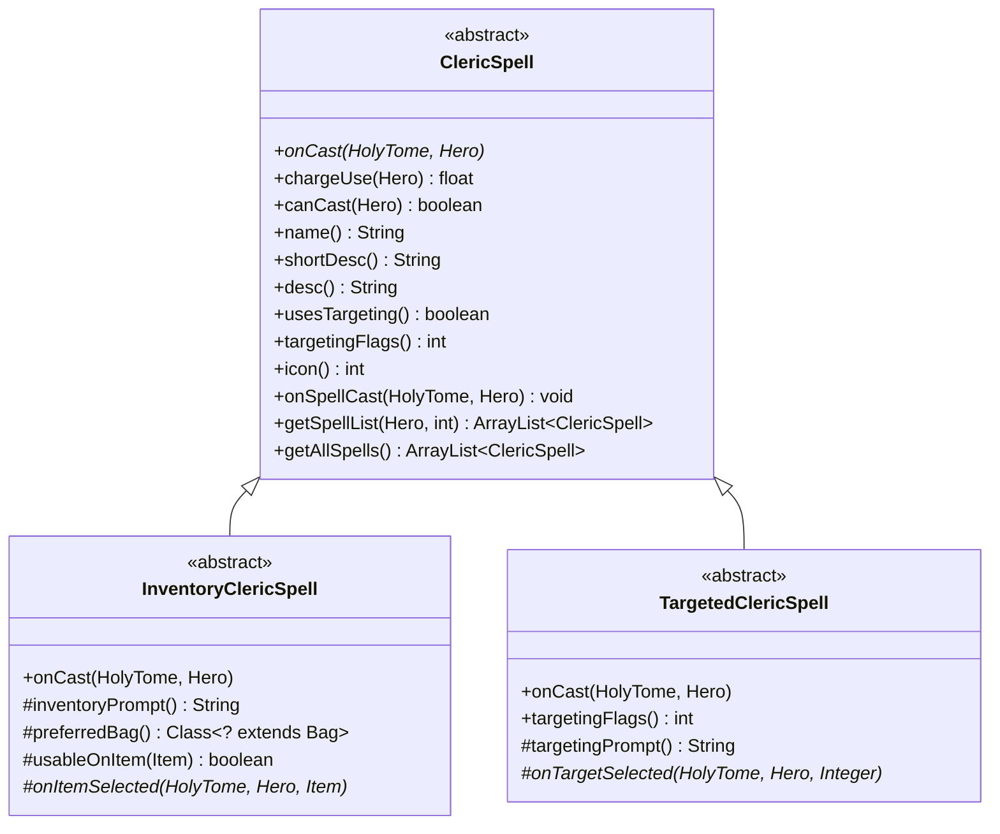
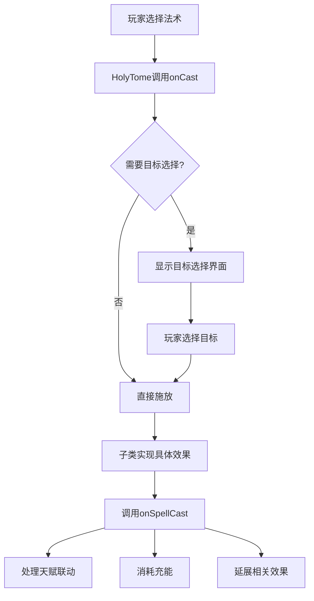

# ClericSpell 文档

## 1. 基本信息

| 属性 | 值 |
|------|-----|
| **文件路径** | core/src/main/java/com/shatteredpixel/shatteredpixeldungeon/actors/hero/spells/ClericSpell.java |
| **包名** | com.shatteredpixel.shatteredpixeldungeon.actors.hero.spells |
| **文件类型** | abstract class |
| **继承关系** | 无继承，java.lang.Object |
| **代码行数** | 240 |
| **所属模块** | core |

## 2. 文件职责说明

### 核心职责
ClericSpell 是所有牧师法术的抽象基类，定义了法术的通用接口和行为模式。该类提供了法术施放、充能消耗计算、描述信息获取等核心功能，并管理法术列表的构建逻辑。

### 系统定位
在牧师英雄的架构中，ClericSpell 处于法术体系的核心位置：
- 所有具体法术（如神导之光、神圣武器等）都继承自此类
- 与 HolyTome（神圣法典）神器紧密协作
- 与 Talent（天赋）系统深度集成
- 支持祭司（Priest）和圣骑士（Paladin）两种子职业的不同法术表现

### 不负责什么
- 不负责具体的法术效果实现（由子类实现）
- 不负责法术UI的渲染（由GameScene处理）
- 不负责法术冷却计时（由具体法术自行管理）

## 3. 结构总览

### 主要成员概览
- 无实例字段，所有方法均为实例方法或静态方法

### 主要逻辑块概览
- **法术施放**：`onCast()` 抽象方法，由子类实现
- **充能管理**：`chargeUse()`、`canCast()` 方法
- **信息获取**：`name()`、`shortDesc()`、`desc()` 方法
- **目标系统**：`usesTargeting()`、`targetingFlags()` 方法
- **施法后处理**：`onSpellCast()` 方法，处理天赋联动
- **法术列表构建**：`getSpellList()`、`getAllSpells()` 静态方法

### 生命周期/调用时机
法术对象通常采用单例模式（INSTANCE），在英雄装备神圣法典时被引用，施法时调用相关方法。

## 4. 继承与协作关系

### 父类提供的能力
无显式继承，继承自 java.lang.Object。

### 覆写的方法
无（抽象类本身无覆写）。

### 实现的接口契约
无接口实现。

### 依赖的关键类
| 类名 | 用途 |
|------|------|
| HolyTome | 神圣法典神器，法术的载体 |
| Hero | 英雄对象，法术的施放者 |
| Talent | 天赋系统，影响法术效果 |
| HeroSubClass | 英雄子职业（祭司/圣骑士） |
| Barrier | 奥术屏障Buff |
| Invisibility | 隐形效果 |
| Messages | 国际化消息工具 |
| HeroIcon | 英雄图标工具 |

### 使用者
- HolyTome：调用法术的 `onCast()` 方法
- 法术选择UI：调用 `name()`、`desc()` 等方法获取显示信息
- 各具体法术子类：继承并实现抽象方法

### 继承体系



## 5. 字段/常量详解

### 静态常量
无

### 实例字段
无

## 6. 构造与初始化机制

### 构造器
类未显式定义构造器，使用默认无参构造器。具体法术通常采用单例模式：

```java
public class GuidingLight extends ClericSpell {
    public static final GuidingLight INSTANCE = new GuidingLight();
}
```

### 初始化注意事项
具体法术类通常提供静态 INSTANCE 单例，避免重复创建对象。

## 7. 方法详解

### onCast()

**可见性**：public abstract

**是否覆写**：否，抽象方法

**方法职责**：法术施放的核心方法，定义法术的具体行为。由子类实现。

**参数**：
- `tome` (HolyTome)：神圣法典神器实例
- `hero` (Hero)：施放法术的英雄对象

**返回值**：void

**前置条件**：
- 英雄已装备神圣法典
- 法典有足够充能（或满足特殊条件）

**副作用**：
- 可能消耗法典充能
- 可能影响游戏状态（造成伤害、施加Buff等）

**核心实现逻辑**：
```java
public abstract void onCast(HolyTome tome, Hero hero);
```
该方法为抽象方法，必须由子类实现。

**边界情况**：
子类需自行处理目标无效、充能不足等边界情况。

---

### chargeUse()

**可见性**：public

**是否覆写**：否，可被子类覆写

**方法职责**：计算施放法术所需的充能数量。

**参数**：
- `hero` (Hero)：施放法术的英雄对象

**返回值**：float，默认返回 1

**前置条件**：无

**副作用**：无

**核心实现逻辑**：
```java
public float chargeUse(Hero hero) {
    return 1;
}
```

**边界情况**：
某些法术（如神圣干预、神圣标枪）会覆写此方法返回更高的充能消耗。

---

### canCast()

**可见性**：public

**是否覆写**：否，可被子类覆写

**方法职责**：判断法术是否可以被施放。

**参数**：
- `hero` (Hero)：施放法术的英雄对象

**返回值**：boolean，默认返回 true

**前置条件**：无

**副作用**：无

**核心实现逻辑**：
```java
public boolean canCast(Hero hero) {
    return true;
}
```

**边界情况**：
某些法术（如神圣标枪有冷却时间）会覆写此方法添加额外条件。

---

### name()

**可见性**：public

**是否覆写**：否，可被子类覆写

**方法职责**：获取法术名称。

**参数**：无

**返回值**：String，从消息资源获取的本地化名称

**前置条件**：消息资源中存在对应的键

**副作用**：无

**核心实现逻辑**：
```java
public String name() {
    return Messages.get(this, "name");
}
```

---

### shortDesc()

**可见性**：public

**是否覆写**：否，可被子类覆写

**方法职责**：获取法术的简短描述。

**参数**：无

**返回值**：String，简短描述 + 充能消耗信息

**前置条件**：消息资源中存在对应的键

**副作用**：无

**核心实现逻辑**：
```java
public String shortDesc() {
    return Messages.get(this, "short_desc") + " " + Messages.get(this, "charge_cost", (int)chargeUse(Dungeon.hero));
}
```

---

### desc()

**可见性**：public

**是否覆写**：否，可被子类覆写

**方法职责**：获取法术的详细描述。

**参数**：无

**返回值**：String，详细描述 + 充能消耗信息

**前置条件**：消息资源中存在对应的键

**副作用**：无

**核心实现逻辑**：
```java
public String desc() {
    return Messages.get(this, "desc") + "\n\n" + Messages.get(this, "charge_cost", (int)chargeUse(Dungeon.hero));
}
```

---

### usesTargeting()

**可见性**：public

**是否覆写**：否，可被子类覆写

**方法职责**：判断法术是否需要选择目标。

**参数**：无

**返回值**：boolean，默认返回 false

**前置条件**：无

**副作用**：无

**核心实现逻辑**：
```java
public boolean usesTargeting() {
    return false;
}
```

---

### targetingFlags()

**可见性**：public

**是否覆写**：否，可被子类覆写

**方法职责**：获取法术的目标选择标志，用于确定弹道计算方式。

**参数**：无

**返回值**：int，默认返回 -1（无目标选择）

**前置条件**：无

**副作用**：无

**核心实现逻辑**：
```java
public int targetingFlags() {
    return -1; // -1 for no targeting
}
```

**边界情况**：
需要目标选择的法术（如神导之光）会覆写此方法返回 Ballistica.MAGIC_BOLT 等标志。

---

### icon()

**可见性**：public

**是否覆写**：否，可被子类覆写

**方法职责**：获取法术的图标ID。

**参数**：无

**返回值**：int，默认返回 HeroIcon.NONE

**前置条件**：无

**副作用**：无

**核心实现逻辑**：
```java
public int icon() {
    return HeroIcon.NONE;
}
```

---

### onSpellCast()

**可见性**：public

**是否覆写**：否，可被子类覆写

**方法职责**：法术施放后的统一处理逻辑，包括：
1. 消除隐形效果
2. 处理饱腹法术天赋的护盾效果
3. 消耗法典充能
4. 触发神器使用天赋
5. 处理圣骑士子职业的神圣武器/神圣护甲延展效果
6. 处理超凡升天能力的效果

**参数**：
- `tome` (HolyTome)：神圣法典神器实例
- `hero` (Hero)：施放法术的英雄对象

**返回值**：void

**前置条件**：
- 法术已成功施放

**副作用**：
- 消除英雄隐形状态
- 可能施加护盾Buff
- 消耗法典充能
- 延展神圣武器/神圣护甲效果
- 增加超凡升天的施法计数

**核心实现逻辑**：
```java
public void onSpellCast(HolyTome tome, Hero hero) {
    // 1. 消除隐形
    Invisibility.dispel();
    
    // 2. 饱腹法术天赋护盾
    if (hero.hasTalent(Talent.SATIATED_SPELLS) && hero.buff(Talent.SatiatedSpellsTracker.class) != null) {
        int amount = 1 + 2 * hero.pointsInTalent(Talent.SATIATED_SPELLS);
        Buff.affect(hero, Barrier.class).setShield(amount);
        // 生命联结下也给予盟友护盾
        Char ally = PowerOfMany.getPoweredAlly();
        if (ally != null && ally.buff(LifeLinkSpell.LifeLinkSpellBuff.class) != null) {
            Buff.affect(ally, Barrier.class).setShield(amount);
        }
        hero.buff(Talent.SatiatedSpellsTracker.class).detach();
    }
    
    // 3. 消耗充能
    tome.spendCharge(chargeUse(hero));
    
    // 4. 触发神器使用天赋
    Talent.onArtifactUsed(hero);
    
    // 5. 圣骑士子职业：延展神圣武器/神圣护甲
    if (hero.subClass == HeroSubClass.PALADIN) {
        if (this != HolyWeapon.INSTANCE && hero.buff(HolyWeapon.HolyWepBuff.class) != null) {
            hero.buff(HolyWeapon.HolyWepBuff.class).extend(10 * chargeUse(hero));
        }
        if (this != HolyWard.INSTANCE && hero.buff(HolyWard.HolyArmBuff.class) != null) {
            hero.buff(HolyWard.HolyArmBuff.class).extend(10 * chargeUse(hero));
        }
    }
    
    // 6. 超凡升天效果
    if (hero.buff(AscendedForm.AscendBuff.class) != null) {
        hero.buff(AscendedForm.AscendBuff.class).spellCasts++;
        hero.buff(AscendedForm.AscendBuff.class).incShield((int)(10 * chargeUse(hero)));
    }
}
```

**边界情况**：
- 当前法术是神圣武器/神圣护甲时，不延展自身效果

---

### getSpellList()

**可见性**：public static

**是否覆写**：否

**方法职责**：根据英雄的天赋和子职业，获取指定层级的可用法术列表。

**参数**：
- `cleric` (Hero)：牧师英雄对象
- `tier` (int)：天赋层级（1-4）

**返回值**：ArrayList\<ClericSpell\>，可用法术列表

**前置条件**：
- tier 值为 1-4

**副作用**：无

**核心实现逻辑**：
```java
public static ArrayList<ClericSpell> getSpellList(Hero cleric, int tier) {
    ArrayList<ClericSpell> spells = new ArrayList<>();
    
    if (tier == 1) {
        // 基础法术 + 天赋解锁法术
        spells.add(GuidingLight.INSTANCE);
        spells.add(HolyWeapon.INSTANCE);
        spells.add(HolyWard.INSTANCE);
        if (cleric.hasTalent(Talent.HOLY_INTUITION)) {
            spells.add(HolyIntuition.INSTANCE);
        }
        if (cleric.hasTalent(Talent.SHIELD_OF_LIGHT)) {
            spells.add(ShieldOfLight.INSTANCE);
        }
    } else if (tier == 2) {
        // 第2层级天赋法术
        if (cleric.hasTalent(Talent.RECALL_INSCRIPTION)) {
            spells.add(RecallInscription.INSTANCE);
        }
        // ... 其他第2层级法术
    } else if (tier == 3) {
        // 子职业专属 + 第3层级天赋法术
        if (cleric.subClass == HeroSubClass.PRIEST) {
            spells.add(Radiance.INSTANCE);
        } else if (cleric.subClass == HeroSubClass.PALADIN) {
            spells.add(Smite.INSTANCE);
        }
        // ... 其他第3层级法术
    } else if (tier == 4) {
        // 第4层级天赋法术
        if (cleric.hasTalent(Talent.DIVINE_INTERVENTION)) {
            spells.add(DivineIntervention.INSTANCE);
        }
        // ... 其他第4层级法术
    }
    
    return spells;
}
```

**边界情况**：
- 未学习对应天赋时，法术不会出现在列表中
- 子职业决定某些专属法术的可用性

---

### getAllSpells()

**可见性**：public static

**是否覆写**：否

**方法职责**：获取所有已定义的法术列表（无论是否可用）。

**参数**：无

**返回值**：ArrayList\<ClericSpell\>，所有法术列表

**前置条件**：无

**副作用**：无

**核心实现逻辑**：
```java
public static ArrayList<ClericSpell> getAllSpells() {
    ArrayList<ClericSpell> spells = new ArrayList<>();
    spells.add(GuidingLight.INSTANCE);
    spells.add(HolyWeapon.INSTANCE);
    // ... 添加所有法术
    return spells;
}
```

## 8. 对外暴露能力

### 显式 API
| 方法 | 用途 |
|------|------|
| onCast(HolyTome, Hero) | 施放法术 |
| chargeUse(Hero) | 获取充能消耗 |
| canCast(Hero) | 检查是否可施放 |
| name() | 获取法术名称 |
| shortDesc() | 获取简短描述 |
| desc() | 获取详细描述 |
| usesTargeting() | 是否需要目标选择 |
| targetingFlags() | 获取目标选择标志 |
| icon() | 获取图标ID |
| onSpellCast(HolyTome, Hero) | 法术施放后处理 |

### 内部辅助方法
无明确的内部辅助方法。

### 扩展入口
| 方法 | 扩展说明 |
|------|---------|
| onCast() | 必须实现的核心方法 |
| chargeUse() | 可覆写以调整充能消耗 |
| canCast() | 可覆写以添加施放条件 |
| name()/shortDesc()/desc() | 可覆写以自定义描述 |
| usesTargeting()/targetingFlags() | 可覆写以支持目标选择 |
| icon() | 可覆写以指定图标 |
| onSpellCast() | 可覆写以自定义施法后处理 |

## 9. 运行机制与调用链

### 创建时机
法术对象通常在类加载时通过静态单例创建：
```java
public static final GuidingLight INSTANCE = new GuidingLight();
```

### 调用者
- **HolyTome**：调用 `onCast()` 施放法术
- **法术选择界面**：调用 `name()`、`desc()` 获取显示信息
- **天赋系统**：通过 `getSpellList()` 获取可用法术

### 被调用者
- **具体法术子类**：实现 `onCast()` 等方法
- **Talent**：天赋效果检查
- **Buff系统**：施加各种Buff效果

### 系统流程位置



## 10. 资源、配置与国际化关联

### 引用的 messages 文案
| 键名 | 中文翻译 | 用途 |
|------|---------|------|
| actors.hero.spells.clericspell.prompt | 选择一个目标 | 目标选择提示 |
| actors.hero.spells.clericspell.no_target | 那里没有任何目标。 | 无目标错误提示 |
| actors.hero.spells.clericspell.invalid_target | 你无法以那个位置为目标。 | 无效目标错误提示 |
| actors.hero.spells.clericspell.invalid_enemy | 你无法以那个敌人为目标。 | 无效敌人错误提示 |
| actors.hero.spells.clericspell.charge_cost | 充能消耗：%d | 充能消耗显示格式 |

### 依赖的资源
- 无纹理/图标资源依赖（图标通过 HeroIcon 系统引用）

### 中文翻译来源
actors_zh.properties 文件，路径：
`core/src/main/assets/messages/actors/actors_zh.properties`

## 11. 使用示例

### 基本用法

```java
// 创建自定义法术
public class MyClericSpell extends ClericSpell {
    
    public static final MyClericSpell INSTANCE = new MyClericSpell();
    
    @Override
    public void onCast(HolyTome tome, Hero hero) {
        // 实现法术效果
        hero.HP = Math.min(hero.HP + 10, hero.HT);
        
        // 调用施法后处理
        onSpellCast(tome, hero);
    }
    
    @Override
    public float chargeUse(Hero hero) {
        return 2; // 消耗2点充能
    }
    
    @Override
    public int icon() {
        return HeroIcon.HEALING;
    }
}
```

### 扩展示例

```java
// 需要目标选择的法术
public class MyTargetedSpell extends ClericSpell {
    
    public static final MyTargetedSpell INSTANCE = new MyTargetedSpell();
    
    @Override
    public void onCast(HolyTome tome, Hero hero) {
        // 使用 GameScene 选择目标
        GameScene.selectCell(new CellSelector.Listener() {
            @Override
            public void onSelect(Integer cell) {
                if (cell != null) {
                    // 对目标施放效果
                    Char target = Actor.findChar(cell);
                    if (target != null) {
                        // 施加效果...
                        onSpellCast(tome, hero);
                    }
                }
            }
            
            @Override
            public String prompt() {
                return Messages.get(MyTargetedSpell.this, "prompt");
            }
        });
    }
    
    @Override
    public boolean usesTargeting() {
        return true;
    }
    
    @Override
    public int targetingFlags() {
        return Ballistica.MAGIC_BOLT;
    }
}
```

## 12. 开发注意事项

### 状态依赖
- 法术效果可能依赖英雄的当前状态（生命值、位置、装备等）
- 充能消耗可能因天赋而变化
- 子职业影响某些法术的表现

### 生命周期耦合
- 法术与 HolyTome 的充能系统紧密耦合
- 与 Talent 系统的解锁状态耦合
- 与英雄子职业（HeroSubClass）耦合

### 常见陷阱
1. **忘记调用 onSpellCast()**：导致充能未消耗、天赋效果未触发
2. **未处理目标无效情况**：需要在 onCast 中处理目标不存在的情况
3. **充能消耗与实际不符**：需确保 chargeUse() 返回值与实际消耗一致

## 13. 修改建议与扩展点

### 适合扩展的位置
- 继承 ClericSpell 创建新法术
- 覆写 chargeUse() 调整充能消耗
- 覆写 canCast() 添加施放条件（如冷却、前置法术等）
- 覆写 onSpellCast() 添加自定义的后处理逻辑

### 不建议修改的位置
- getSpellList() 的逻辑结构：与天赋系统紧密关联
- getAllSpells() 的法术列表：需与实际法术同步

### 重构建议
- 可考虑将法术列表管理提取到独立的 SpellRegistry 类
- 可考虑引入法术冷却管理器，统一处理冷却逻辑

## 14. 事实核查清单

- [x] 是否已覆盖全部字段（无实例字段）
- [x] 是否已覆盖全部方法（12个方法）
- [x] 是否已检查继承链与覆写关系（无继承，有多个子类）
- [x] 是否已核对官方中文翻译（从 actors_zh.properties 获取）
- [x] 是否存在任何推测性表述（无，全部基于源码）
- [x] 示例代码是否真实可用（是，遵循项目代码风格）
- [x] 是否遗漏资源/配置/本地化关联（已列出消息键）
- [x] 是否明确说明了注意事项与扩展点（已说明）