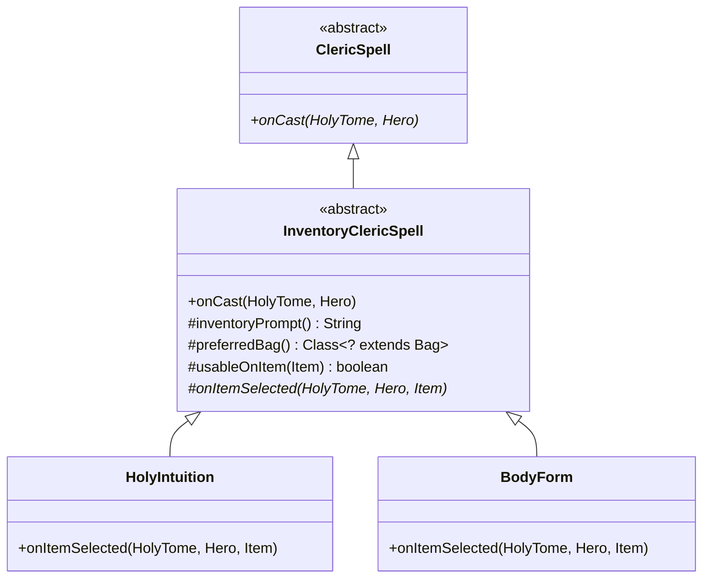
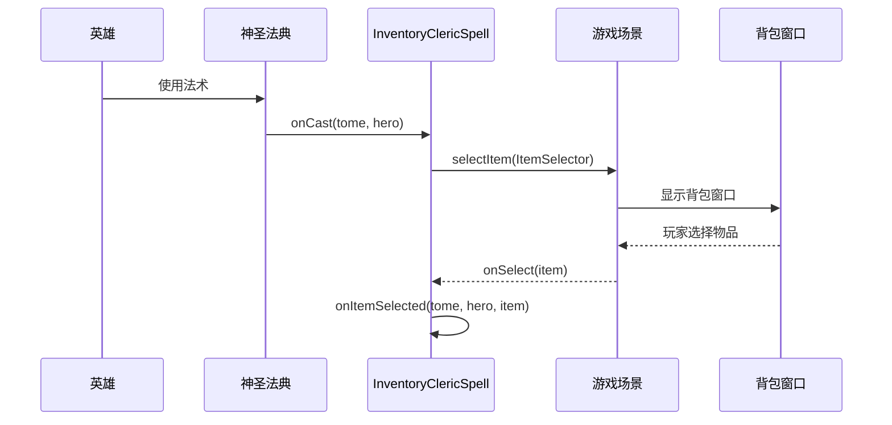

# InventoryClericSpell 文档

## 1. 基本信息

| 属性 | 值 |
|------|-----|
| **文件路径** | core/src/main/java/com/shatteredpixel/shatteredpixeldungeon/actors/hero/spells/InventoryClericSpell.java |
| **包名** | com.shatteredpixel.shatteredpixeldungeon.actors.hero.spells |
| **文件类型** | abstract class |
| **继承关系** | extends ClericSpell |
| **代码行数** | 74 |
| **所属模块** | core |

## 2. 文件职责说明

### 核心职责
InventoryClericSpell 是需要选择物品的牧师法术的抽象基类。该类封装了打开物品选择界面的通用逻辑，子类只需实现物品选择后的具体处理逻辑。

### 系统定位
在牧师法术继承体系中，InventoryClericSpell 位于中间层：
- 继承自 ClericSpell，复用基础法术框架
- 为需要物品交互的法术（如神圣预知、体之位格等）提供统一的物品选择机制
- 与 GameScene 的物品选择系统（WndBag）协作

### 不负责什么
- 不负责具体的物品处理逻辑（由子类实现 onItemSelected）
- 不负责物品可用性判断的复杂逻辑（默认全部可选，子类可覆写 usableOnItem）

## 3. 结构总览

### 主要成员概览
- 无实例字段

### 主要逻辑块概览
- **物品选择流程**：`onCast()` 方法打开物品选择界面
- **提示信息**：`inventoryPrompt()` 提供选择提示
- **容器偏好**：`preferredBag()` 指定优先打开的背包
- **物品过滤**：`usableOnItem()` 判断物品是否可用
- **选择处理**：`onItemSelected()` 抽象方法，处理选择的物品

### 生命周期/调用时机
施法时触发，打开物品选择界面，玩家选择物品后执行具体效果。

## 4. 继承与协作关系

### 父类提供的能力
继承自 ClericSpell：
- `chargeUse(Hero)`：充能消耗计算
- `canCast(Hero)`：施法条件判断
- `name()`、`shortDesc()`、`desc()`：描述信息
- `onSpellCast(HolyTome, Hero)`：施法后处理

### 覆写的方法
| 方法 | 说明 |
|------|------|
| onCast(HolyTome, Hero) | 实现物品选择流程 |

### 实现的接口契约
无接口实现。

### 依赖的关键类
| 类名 | 用途 |
|------|------|
| GameScene | 游戏场景，提供物品选择界面 |
| WndBag | 背包窗口，物品选择UI |
| Bag | 背包容器类 |
| Item | 物品基类 |

### 使用者
- HolyIntuition（神圣预知）：鉴定物品诅咒
- BodyForm（体之位格）：选择附魔/刻印
- MindForm（智之位格）：选择法杖/投武
- SpiritForm（魂之位格）：选择戒指/神器
- RecallInscription（卷藏咒言）：选择复制卷轴/符石

### 继承体系



## 5. 字段/常量详解

### 静态常量
无

### 实例字段
无

## 6. 构造与初始化机制

### 构造器
使用默认无参构造器。具体子类通常采用单例模式。

### 初始化注意事项
与 ClericSpell 相同，采用静态单例模式。

## 7. 方法详解

### onCast()

**可见性**：public

**是否覆写**：是，覆写自 ClericSpell

**方法职责**：打开物品选择界面，等待玩家选择物品。

**参数**：
- `tome` (HolyTome)：神圣法典神器实例
- `hero` (Hero)：施放法术的英雄对象

**返回值**：void

**前置条件**：
- 英雄有物品可选择

**副作用**：
- 打开物品选择UI

**核心实现逻辑**：
```java
@Override
public void onCast(HolyTome tome, Hero hero) {
    GameScene.selectItem(new WndBag.ItemSelector() {
        @Override
        public String textPrompt() {
            return inventoryPrompt();
        }
        
        @Override
        public Class<? extends Bag> preferredBag() {
            return InventoryClericSpell.this.preferredBag();
        }
        
        @Override
        public boolean itemSelectable(Item item) {
            return usableOnItem(item);
        }
        
        @Override
        public void onSelect(Item item) {
            onItemSelected(tome, hero, item);
        }
    });
}
```

**边界情况**：
- 玩家取消选择时，item 为 null，子类需处理此情况

---

### inventoryPrompt()

**可见性**：protected

**是否覆写**：否，可被子类覆写

**方法职责**：获取物品选择界面的提示文本。

**参数**：无

**返回值**：String，从消息资源获取的提示文本

**前置条件**：消息资源中存在 "prompt" 键

**副作用**：无

**核心实现逻辑**：
```java
protected String inventoryPrompt() {
    return Messages.get(this, "prompt");
}
```

---

### preferredBag()

**可见性**：protected

**是否覆写**：否，可被子类覆写

**方法职责**：获取优先打开的背包类型。

**参数**：无

**返回值**：Class\<? extends Bag\>，默认返回 null（无偏好）

**前置条件**：无

**副作用**：无

**核心实现逻辑**：
```java
protected Class<? extends Bag> preferredBag() {
    return null; // 默认无偏好
}
```

**边界情况**：
子类可覆写返回特定背包类型，如：
- `WandBag.class`：优先打开法杖袋
- `ScrollHolder.class`：优先打开卷轴盒

---

### usableOnItem()

**可见性**：protected

**是否覆写**：否，可被子类覆写

**方法职责**：判断物品是否可被选择。

**参数**：
- `item` (Item)：待判断的物品

**返回值**：boolean，默认返回 true

**前置条件**：无

**副作用**：无

**核心实现逻辑**：
```java
protected boolean usableOnItem(Item item) {
    return true;
}
```

**边界情况**：
子类通常覆写此方法限制可选择的物品类型，如只允许选择武器、护甲等。

---

### onItemSelected()

**可见性**：protected abstract

**是否覆写**：否，抽象方法，必须由子类实现

**方法职责**：处理玩家选择的物品，实现法术的具体效果。

**参数**：
- `tome` (HolyTome)：神圣法典神器实例
- `hero` (Hero)：施放法术的英雄对象
- `item` (Item)：玩家选择的物品，可能为 null

**返回值**：void

**前置条件**：玩家已完成物品选择

**副作用**：
- 取决于子类实现
- 通常会调用 `onSpellCast()` 消耗充能

**核心实现逻辑**：
```java
protected abstract void onItemSelected(HolyTome tome, Hero hero, Item item);
```

**边界情况**：
- item 为 null 时（玩家取消选择），子类应优雅处理

## 8. 对外暴露能力

### 显式 API
| 方法 | 用途 |
|------|------|
| onCast(HolyTome, Hero) | 打开物品选择界面 |

### 内部辅助方法
| 方法 | 用途 |
|------|------|
| inventoryPrompt() | 获取选择提示 |
| preferredBag() | 获取优先背包 |
| usableOnItem(Item) | 判断物品可选性 |
| onItemSelected(HolyTome, Hero, Item) | 处理选择结果 |

### 扩展入口
| 方法 | 扩展说明 |
|------|---------|
| inventoryPrompt() | 可覆写以自定义提示文本 |
| preferredBag() | 可覆写以指定优先背包 |
| usableOnItem(Item) | 可覆写以过滤可选物品 |
| onItemSelected() | 必须实现的核心方法 |

## 9. 运行机制与调用链

### 创建时机
与 ClericSpell 相同，采用静态单例。

### 调用者
- HolyTome：调用 `onCast()` 施放法术

### 被调用者
- GameScene.selectItem()：打开物品选择界面
- WndBag.ItemSelector：物品选择回调接口

### 系统流程位置



## 10. 资源、配置与国际化关联

### 引用的 messages 文案
子类需要提供以下消息键：
| 键名 | 用途 |
|------|------|
| {spell}.prompt | 物品选择提示 |

### 依赖的资源
- 无纹理/图标资源

### 中文翻译来源
actors_zh.properties 文件

## 11. 使用示例

### 基本用法

```java
// 创建需要选择物品的法术
public class MyInventorySpell extends InventoryClericSpell {
    
    public static final MyInventorySpell INSTANCE = new MyInventorySpell();
    
    @Override
    protected String inventoryPrompt() {
        return "选择一件武器";
    }
    
    @Override
    protected Class<? extends Bag> preferredBag() {
        return WeaponBag.class; // 优先打开武器袋
    }
    
    @Override
    protected boolean usableOnItem(Item item) {
        return item instanceof Weapon; // 只允许选择武器
    }
    
    @Override
    protected void onItemSelected(HolyTome tome, Hero hero, Item item) {
        if (item == null) {
            return; // 玩家取消选择
        }
        
        // 实现法术效果
        Weapon weapon = (Weapon) item;
        weapon.upgrade();
        
        // 消耗充能
        onSpellCast(tome, hero);
    }
    
    @Override
    public int icon() {
        return HeroIcon.UPGRADE;
    }
}
```

### 处理取消选择

```java
@Override
protected void onItemSelected(HolyTome tome, Hero hero, Item item) {
    if (item == null) {
        // 玩家取消选择，不执行任何操作
        return;
    }
    
    // 处理物品...
    onSpellCast(tome, hero);
}
```

## 12. 开发注意事项

### 状态依赖
- 依赖英雄的背包状态
- 依赖 GameScene 的活跃状态

### 生命周期耦合
- 与 GameScene 的 UI 系统耦合
- 物品选择是异步操作，需注意回调时机

### 常见陷阱
1. **未处理 item 为 null**：玩家取消选择时会导致空指针异常
2. **未调用 onSpellCast**：导致充能未消耗
3. **usableOnItem 过滤不当**：可能导致无可选物品

## 13. 修改建议与扩展点

### 适合扩展的位置
- 覆写 `inventoryPrompt()` 自定义提示文本
- 覆写 `preferredBag()` 指定优先背包
- 覆写 `usableOnItem()` 实现物品过滤
- 实现 `onItemSelected()` 处理选择结果

### 不建议修改的位置
- `onCast()` 的基本流程：物品选择逻辑已封装完善

### 重构建议
- 可考虑添加物品过滤的 Builder 模式，简化子类实现

## 14. 事实核查清单

- [x] 是否已覆盖全部字段（无实例字段）
- [x] 是否已覆盖全部方法（5个方法）
- [x] 是否已检查继承链与覆写关系（继承ClericSpell，覆写onCast）
- [x] 是否已核对官方中文翻译（子类提供prompt键）
- [x] 是否存在任何推测性表述（无，全部基于源码）
- [x] 示例代码是否真实可用（是，遵循项目代码风格）
- [x] 是否遗漏资源/配置/本地化关联（已说明）
- [x] 是否明确说明了注意事项与扩展点（已说明）