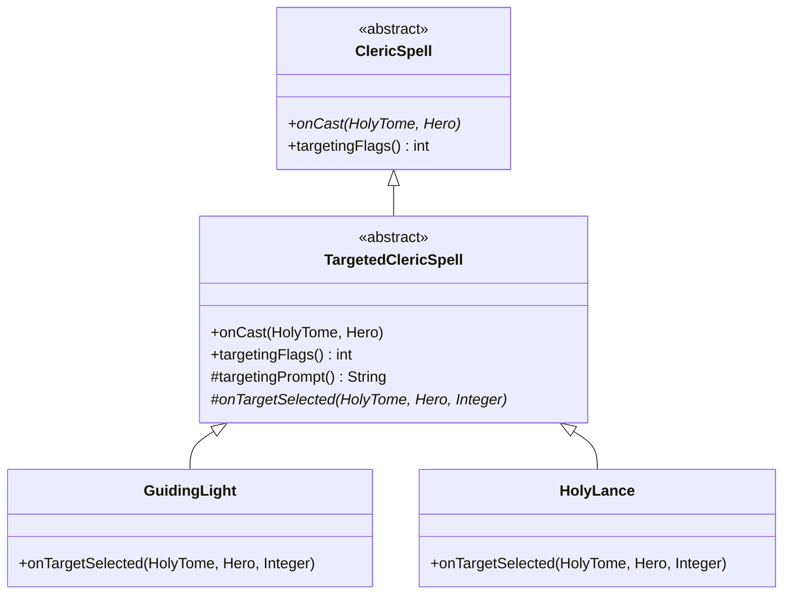
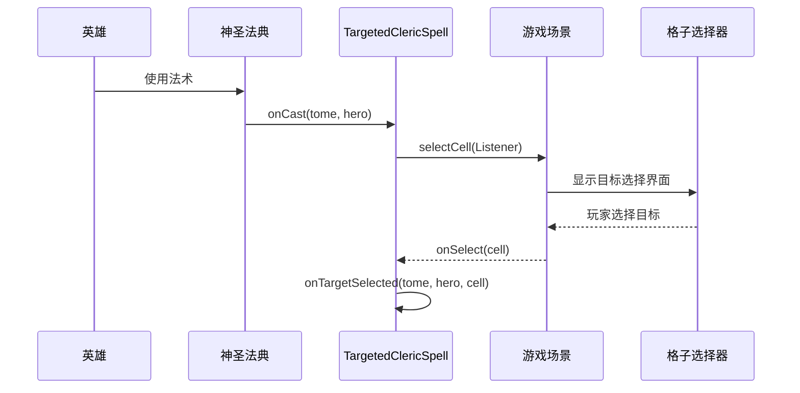

# TargetedClericSpell 文档

## 1. 基本信息

| 属性 | 值 |
|------|-----|
| **文件路径** | core/src/main/java/com/shatteredpixel/shatteredpixeldungeon/actors/hero/spells/TargetedClericSpell.java |
| **包名** | com.shatteredpixel.shatteredpixeldungeon.actors.hero.spells |
| **文件类型** | abstract class |
| **继承关系** | extends ClericSpell |
| **代码行数** | 59 |
| **所属模块** | core |

## 2. 文件职责说明

### 核心职责
TargetedClericSpell 是需要选择目标的牧师法术的抽象基类。该类封装了打开目标选择界面的通用逻辑，子类只需实现目标选择后的具体处理逻辑。

### 系统定位
在牧师法术继承体系中，TargetedClericSpell 位于中间层：
- 继承自 ClericSpell，复用基础法术框架
- 为需要目标选择的法术（如神导之光、神圣标枪等）提供统一的目标选择机制
- 与 GameScene 的格子选择系统（CellSelector）协作

### 不负责什么
- 不负责具体的目标处理逻辑（由子类实现 onTargetSelected）
- 不负责目标有效性验证（子类可自行判断）

## 3. 结构总览

### 主要成员概览
- 无实例字段

### 主要逻辑块概览
- **目标选择流程**：`onCast()` 方法打开目标选择界面
- **提示信息**：`targetingPrompt()` 提供选择提示
- **目标标志**：`targetingFlags()` 返回默认弹道类型
- **选择处理**：`onTargetSelected()` 抽象方法，处理选择的目标

### 生命周期/调用时机
施法时触发，打开目标选择界面，玩家选择目标后执行具体效果。

## 4. 继承与协作关系

### 父类提供的能力
继承自 ClericSpell：
- `chargeUse(Hero)`：充能消耗计算
- `canCast(Hero)`：施法条件判断
- `name()`、`shortDesc()`、`desc()`：描述信息
- `onSpellCast(HolyTome, Hero)`：施法后处理

### 覆写的方法
| 方法 | 说明 |
|------|------|
| onCast(HolyTome, Hero) | 实现目标选择流程 |
| targetingFlags() | 返回默认弹道类型 MAGIC_BOLT |

### 实现的接口契约
无接口实现。

### 依赖的关键类
| 类名 | 用途 |
|------|------|
| GameScene | 游戏场景，提供目标选择界面 |
| CellSelector | 格子选择器，目标选择UI组件 |
| Ballistica | 弹道计算工具 |
| Integer | 目标格子的坐标 |

### 使用者
- GuidingLight（神导之光）：远程攻击
- HolyLance（神圣标枪）：远程高伤害
- HallowedGround（神圣领域）：区域效果
- Sunray（阳炎射线）：远程攻击+致盲
- ShieldOfLight（神圣护盾）：单体护甲增益
- Flash（天堂阶梯）：传送

### 继承体系



## 5. 字段/常量详解

### 静态常量
无

### 实例字段
无

## 6. 构造与初始化机制

### 构造器
使用默认无参构造器。具体子类通常采用单例模式。

### 初始化注意事项
与 ClericSpell 相同，采用静态单例模式。

## 7. 方法详解

### onCast()

**可见性**：public

**是否覆写**：是，覆写自 ClericSpell

**方法职责**：打开目标选择界面，等待玩家选择目标格子。

**参数**：
- `tome` (HolyTome)：神圣法典神器实例
- `hero` (Hero)：施放法术的英雄对象

**返回值**：void

**前置条件**：
- 英雄有可选目标

**副作用**：
- 打开目标选择UI

**核心实现逻辑**：
```java
@Override
public void onCast(HolyTome tome, Hero hero) {
    GameScene.selectCell(new CellSelector.Listener() {
        @Override
        public void onSelect(Integer cell) {
            onTargetSelected(tome, hero, cell);
        }
        
        @Override
        public String prompt() {
            return targetingPrompt();
        }
    });
}
```

**边界情况**：
- 玩家取消选择时，cell 为 null，子类需处理此情况

---

### targetingFlags()

**可见性**：public

**是否覆写**：是，覆写自 ClericSpell

**方法职责**：获取目标选择的弹道计算标志。

**参数**：无

**返回值**：int，返回 Ballistica.MAGIC_BOLT

**前置条件**：无

**副作用**：无

**核心实现逻辑**：
```java
@Override
public int targetingFlags() {
    return Ballistica.MAGIC_BOLT;
}
```

**说明**：
Ballistica.MAGIC_BOLT 表示法术弹道类型，可穿透敌人但不能穿透墙壁。

---

### targetingPrompt()

**可见性**：protected

**是否覆写**：否，可被子类覆写

**方法职责**：获取目标选择界面的提示文本。

**参数**：无

**返回值**：String，从消息资源获取的提示文本

**前置条件**：消息资源中存在 "prompt" 键

**副作用**：无

**核心实现逻辑**：
```java
protected String targetingPrompt() {
    return Messages.get(this, "prompt");
}
```

---

### onTargetSelected()

**可见性**：protected abstract

**是否覆写**：否，抽象方法，必须由子类实现

**方法职责**：处理玩家选择的目标格子，实现法术的具体效果。

**参数**：
- `tome` (HolyTome)：神圣法典神器实例
- `hero` (Hero)：施放法术的英雄对象
- `target` (Integer)：目标格子的坐标，可能为 null

**返回值**：void

**前置条件**：玩家已完成目标选择

**副作用**：
- 取决于子类实现
- 通常会调用 `onSpellCast()` 消耗充能

**核心实现逻辑**：
```java
protected abstract void onTargetSelected(HolyTome tome, Hero hero, Integer target);
```

**边界情况**：
- target 为 null 时（玩家取消选择），子类应优雅处理
- 目标格子可能无角色存在
- 目标格子可能被障碍物阻挡

## 8. 对外暴露能力

### 显式 API
| 方法 | 用途 |
|------|------|
| onCast(HolyTome, Hero) | 打开目标选择界面 |
| targetingFlags() | 获取弹道计算标志 |

### 内部辅助方法
| 方法 | 用途 |
|------|------|
| targetingPrompt() | 获取选择提示 |
| onTargetSelected(HolyTome, Hero, Integer) | 处理选择结果 |

### 扩展入口
| 方法 | 扩展说明 |
|------|---------|
| targetingPrompt() | 可覆写以自定义提示文本 |
| targetingFlags() | 可覆写以修改弹道类型 |
| onTargetSelected() | 必须实现的核心方法 |

## 9. 运行机制与调用链

### 创建时机
与 ClericSpell 相同，采用静态单例。

### 调用者
- HolyTome：调用 `onCast()` 施放法术

### 被调用者
- GameScene.selectCell()：打开目标选择界面
- CellSelector.Listener：目标选择回调接口

### 系统流程位置



## 10. 资源、配置与国际化关联

### 引用的 messages 文案
子类需要提供以下消息键：
| 键名 | 用途 |
|------|------|
| {spell}.prompt | 目标选择提示 |

### 依赖的资源
- 无纹理/图标资源

### 中文翻译来源
actors_zh.properties 文件

## 11. 使用示例

### 基本用法

```java
// 创建需要选择目标的法术
public class MyTargetedSpell extends TargetedClericSpell {
    
    public static final MyTargetedSpell INSTANCE = new MyTargetedSpell();
    
    @Override
    protected String targetingPrompt() {
        return "选择一个敌人";
    }
    
    @Override
    protected void onTargetSelected(HolyTome tome, Hero hero, Integer target) {
        if (target == null) {
            return; // 玩家取消选择
        }
        
        // 查找目标角色
        Char targetChar = Actor.findChar(target);
        if (targetChar == null) {
            return; // 目标格子无角色
        }
        
        // 实现法术效果
        int damage = Random.Int(10, 20);
        targetChar.damage(damage, hero);
        
        // 消耗充能
        onSpellCast(tome, hero);
    }
    
    @Override
    public int icon() {
        return HeroIcon.BLAST;
    }
}
```

### 使用弹道计算

```java
@Override
protected void onTargetSelected(HolyTome tome, Hero hero, Integer target) {
    if (target == null) {
        return;
    }
    
    // 计算弹道路径
    Ballistica trajectory = new Ballistica(hero.pos, target, targetingFlags());
    
    // 获取弹道终点
    int finalTarget = trajectory.collisionPos;
    
    // 在终点造成效果...
    onSpellCast(tome, hero);
}
```

## 12. 开发注意事项

### 状态依赖
- 依赖 GameScene 的活跃状态
- 依赖当前关卡的格子状态

### 生命周期耦合
- 与 GameScene 的 UI 系统耦合
- 目标选择是异步操作，需注意回调时机

### 常见陷阱
1. **未处理 target 为 null**：玩家取消选择时会导致空指针异常
2. **未调用 onSpellCast**：导致充能未消耗
3. **未检查目标有效性**：可能导致对无效目标施法

## 13. 修改建议与扩展点

### 适合扩展的位置
- 覆写 `targetingPrompt()` 自定义提示文本
- 覆写 `targetingFlags()` 修改弹道类型
- 实现 `onTargetSelected()` 处理选择结果

### 不建议修改的位置
- `onCast()` 的基本流程：目标选择逻辑已封装完善

### 重构建议
- 可考虑添加目标过滤机制，如 `isValidTarget(Integer cell)`

## 14. 事实核查清单

- [x] 是否已覆盖全部字段（无实例字段）
- [x] 是否已覆盖全部方法（4个方法）
- [x] 是否已检查继承链与覆写关系（继承ClericSpell，覆写onCast和targetingFlags）
- [x] 是否已核对官方中文翻译（子类提供prompt键）
- [x] 是否存在任何推测性表述（无，全部基于源码）
- [x] 示例代码是否真实可用（是，遵循项目代码风格）
- [x] 是否遗漏资源/配置/本地化关联（已说明）
- [x] 是否明确说明了注意事项与扩展点（已说明）