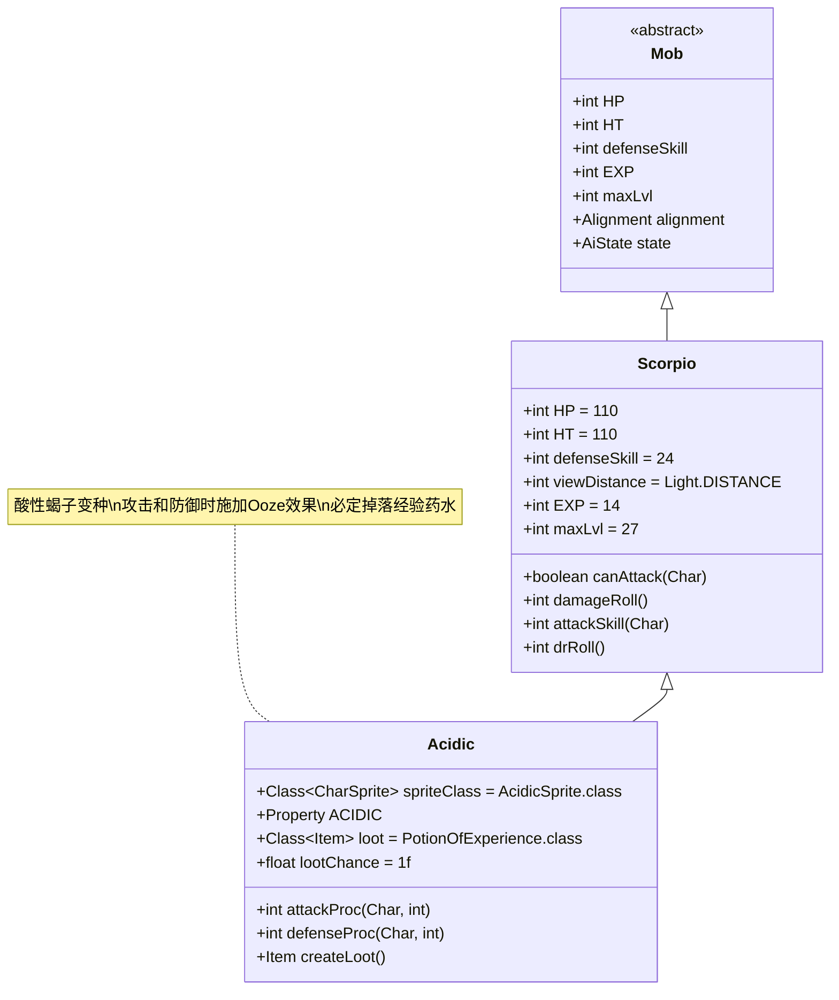

# Acidic 类文档

## 1. 基本信息
| 属性 | 值 |
|------|-----|
| 文件路径 | core/src/main/java/com/shatteredpixel/shatteredpixeldungeon/actors/mobs/Acidic.java |
| 包名 | com.shatteredpixel.shatteredpixeldungeon.actors.mobs |
| 类类型 | public class |
| 继承关系 | extends Scorpio |
| 代码行数 | 60行 |

## 2. 类职责说明
Acidic是Scorpio的变种，具有酸性攻击能力。它会在攻击和防御时对敌人施加Ooze（黏液）效果，使其在一段时间内持续受到伤害。Acidic必定掉落经验药水。

## 4. 继承与协作关系


## 静态常量表
| 常量名 | 类型 | 值 | 说明 |
|--------|------|-----|------|
| (继承自Scorpio) | | | |
| HP/HT | int | 110 | 生命值上限 |
| defenseSkill | int | 24 | 防御技能等级 |
| EXP | int | 14 | 击败后获得的经验值 |
| maxLvl | int | 27 | 最大生成等级 |

## 实例字段表
| 字段名 | 类型 | 修饰符 | 说明 |
|--------|------|--------|------|
| spriteClass | Class<? extends CharSprite> | - | 怪物精灵类（AcidicSprite） |
| properties | ArrayList<Property> | - | 怪物属性列表，包含ACIDIC |
| loot | Class<? extends Item> | - | 掉落物品类型（PotionOfExperience） |
| lootChance | float | - | 掉落概率（1.0，即100%） |

## 7. 方法详解

### attackProc(Char enemy, int damage)
**签名**: `int attackProc(Char enemy, int damage)`
**功能**: 攻击处理，在攻击命中后对敌人施加Ooze效果
**参数**:
- enemy: Char - 被攻击的敌人
- damage: int - 造成的伤害值
**返回值**: int - 处理后的伤害值
**实现逻辑**:
1. 对敌人施加Ooze效果，持续时间为Ooze.DURATION（第44行）
2. 调用父类attackProc方法（第45行）

### defenseProc(Char enemy, int damage)
**签名**: `int defenseProc(Char enemy, int damage)`
**功能**: 防御处理，当与敌人相邻时对敌人施加Ooze效果
**参数**:
- enemy: Char - 攻击者
- damage: int - 受到的伤害值
**返回值**: int - 处理后的伤害值
**实现逻辑**:
1. 检查是否与敌人相邻（第50行）
2. 如果相邻，对敌人施加Ooze效果，持续时间为Ooze.DURATION（第51行）
3. 调用父类defenseProc方法（第53行）

### createLoot()
**签名**: `Item createLoot()`
**功能**: 创建掉落物品实例
**参数**: 无
**返回值**: Item - 经验药水实例
**实现逻辑**:
- 返回新的PotionOfExperience实例（第58行）

## 战斗行为
- **攻击模式**: Acidic继承了Scorpio的远程攻击能力，可以投掷攻击远处的敌人
- **特殊效果**: 所有攻击（包括近战和远程）都会对目标施加Ooze效果
- **防御反击**: 当被近战攻击时，会反击施加Ooze效果
- **AI行为**: 作为Demon类怪物，倾向于保持距离进行远程攻击

## 掉落物品
- **主要掉落**: 经验药水（PotionOfExperience）
- **掉落概率**: 100%（必定掉落）
- **掉落数量**: 1个

## 特殊属性
- **ACIDIC**: 具有酸性属性，能够施加Ooze状态效果
- **DEMONIC**: 继承自Scorpio的恶魔属性

## 11. 使用示例
```java
// Acidic通常由游戏系统自动创建和管理
// 玩家遇到时会自动触发其攻击和防御行为

// Ooze效果的应用示例
Buff.affect(enemy, Ooze.class).set(Ooze.DURATION);
// 这会使敌人在接下来的几回合内持续受到伤害
```

## 注意事项
1. Acidic的Ooze效果无法被免疫，会对所有类型的敌人生效
2. 由于必定掉落经验药水，是获取该物品的可靠来源
3. 在远程战斗中需要特别注意其投掷攻击能力
4. Ooze效果的持续时间固定为Ooze.DURATION常量定义的值

## 最佳实践
1. 玩家应准备抗性或治疗手段来应对Ooze效果
2. 利用远程武器或法术保持距离避免近战接触
3. 优先击杀Acidic以获取稳定的经验药水来源
4. 在设计关卡时，可将Acidic作为中期挑战的重要敌人