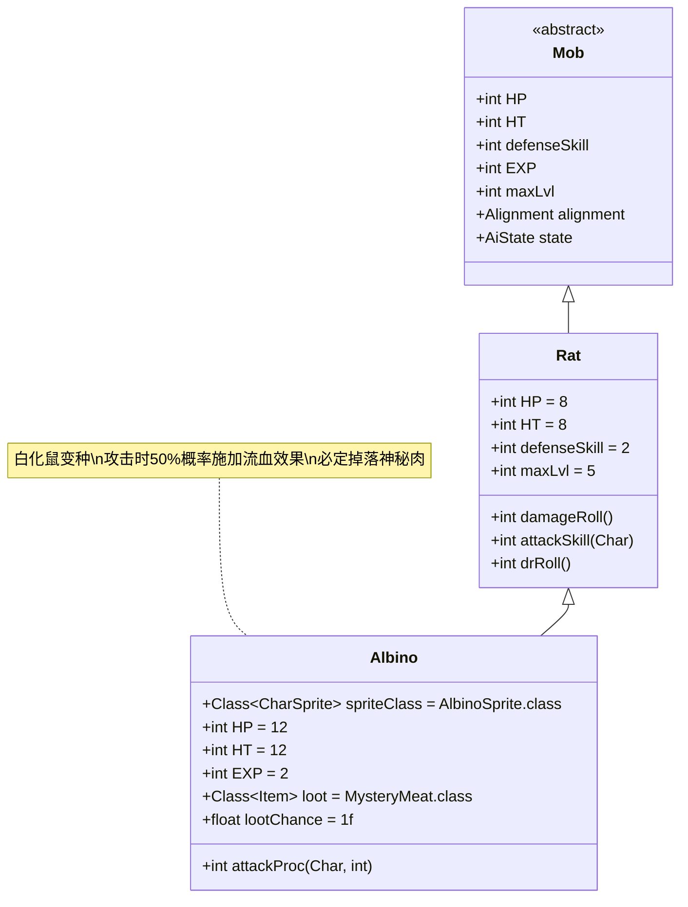

# Albino 类文档

## 1. 基本信息
| 属性 | 值 |
|------|-----|
| 文件路径 | core/src/main/java/com/shatteredpixel/shatteredpixeldungeon/actors/mobs/Albino.java |
| 包名 | com.shatteredpixel.shatteredpixeldungeon.actors.mobs |
| 类类型 | public class |
| 继承关系 | extends Rat |
| 代码行数 | 52行 |

## 2. 类职责说明
Albino是Rat的变种，具有出血攻击能力。它在攻击时有50%的概率对敌人施加Bleeding（流血）效果，造成持续伤害。Albino必定掉落神秘肉。

## 4. 继承与协作关系


## 静态常量表
| 常量名 | 类型 | 值 | 说明 |
|--------|------|-----|------|
| (继承并覆盖) | | | |
| HP/HT | int | 12 | 生命值上限（比普通老鼠高） |
| EXP | int | 2 | 击败后获得的经验值 |

## 实例字段表
| 字段名 | 类型 | 修饰符 | 说明 |
|--------|------|--------|------|
| spriteClass | Class<? extends CharSprite> | - | 怪物精灵类（AlbinoSprite） |
| loot | Class<? extends Item> | - | 掉落物品类型（MysteryMeat） |
| lootChance | float | - | 掉落概率（1.0，即100%） |

## 7. 方法详解

### attackProc(Char enemy, int damage)
**签名**: `int attackProc(Char enemy, int damage)`
**功能**: 攻击处理，在攻击命中且造成伤害时有50%概率施加流血效果
**参数**:
- enemy: Char - 被攻击的敌人
- damage: int - 造成的伤害值
**返回值**: int - 处理后的伤害值
**实现逻辑**:
1. 调用父类attackProc方法（第44行）
2. 检查伤害是否大于0且随机数为0（50%概率）（第45行）
3. 如果条件满足，对敌人施加Bleeding效果，持续时间为2-3回合（第46-47行）
4. 返回处理后的伤害值（第50行）

## 战斗行为
- **攻击模式**: 近战攻击，继承自Rat的基础攻击能力
- **特殊效果**: 50%概率施加流血效果，造成持续伤害2-3回合
- **AI行为**: 标准的敌对AI，会主动攻击玩家

## 掉落物品
- **主要掉落**: 神秘肉（MysteryMeat）
- **掉落概率**: 100%（必定掉落）
- **掉落数量**: 1个

## 特殊属性
- Albino没有特殊的Property标记，但作为Rat的变种具有更强的战斗能力

## 11. 使用示例
```java
// Albino通常由游戏系统自动创建和管理
// 玩家遇到时会自动触发其攻击行为

// 流血效果的应用示例
if (damage > 0 && Random.Int(2) == 0) {
    Buff.affect(enemy, Bleeding.class).set(Random.NormalFloat(2, 3));
}
// 这会使敌人在接下来的2-3回合内持续受到伤害
```

## 注意事项
1. Albino的生命值比普通老鼠更高（12 vs 8）
2. 流血效果会造成持续伤害，需要及时治疗
3. 由于必定掉落神秘肉，是获取该物品的可靠来源
4. 流血效果的持续时间在2-3回合之间随机

## 最佳实践
1. 玩家应准备治疗手段来应对流血效果
2. 利用远程武器避免近战接触减少被攻击机会
3. 优先击杀Albino以获取稳定的神秘肉来源
4. 在早期关卡中，Albino是比普通老鼠更具威胁的敌人