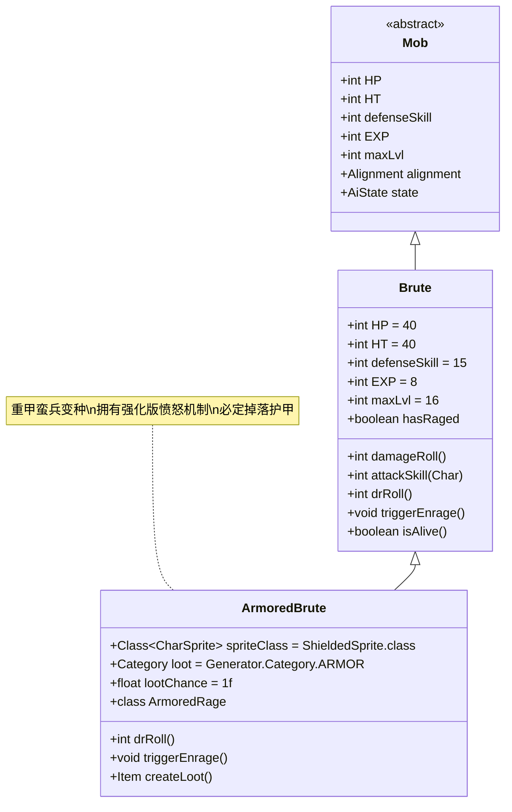

# ArmoredBrute 类文档

## 1. 基本信息
| 属性 | 值 |
|------|-----|
| 文件路径 | core/src/main/java/com/shatteredpixel/shatteredpixeldungeon/actors/mobs/ArmoredBrute.java |
| 包名 | com.shatteredpixel.shatteredpixeldungeon.actors.mobs |
| 类类型 | public class |
| 继承关系 | extends Brute |
| 代码行数 | 94行 |

## 2. 类职责说明
ArmoredBrute是Brute的重甲变种，具有更强的防御能力和特殊的愤怒机制。它在生命值归零时会触发强化版的愤怒状态（ArmoredRage），获得大量护盾并继续战斗。ArmoredBrute必定掉落护甲类物品。

## 4. 继承与协作关系


## 静态常量表
| 常量名 | 类型 | 值 | 说明 |
|--------|------|-----|------|
| (继承自Brute) | | | |
| HP/HT | int | 40 | 生命值上限 |
| defenseSkill | int | 15 | 防御技能等级 |
| EXP | int | 8 | 击败后获得的经验值 |
| maxLvl | int | 16 | 最大生成等级 |

## 实例字段表
| 字段名 | 类型 | 修饰符 | 说明 |
|--------|------|--------|------|
| spriteClass | Class<? extends CharSprite> | - | 怪物精灵类（ShieldedSprite） |
| loot | Category | - | 掉落物品类别（ARMOR） |
| lootChance | float | - | 掉落概率（1.0，即100%） |

## 7. 方法详解

### drRoll()
**签名**: `int drRoll()`
**功能**: 计算伤害减免值
**参数**: 无
**返回值**: int - 伤害减免值
**实现逻辑**:
- 在父类基础上额外增加4点伤害减免（第49行）
- 总计获得4-12点伤害减免

### triggerEnrage()
**签名**: `protected void triggerEnrage()`
**功能**: 触发愤怒状态，在生命值归零时激活
**参数**: 无
**返回值**: void
**实现逻辑**:
1. 对自身施加ArmoredRage效果，并设置护盾值为HT/2 + 1（第54行）
2. 显示护盾状态图标（第55行）
3. 如果玩家可见，显示"愤怒"状态消息（第56-57行）
4. 花费1个回合时间（第59行）
5. 标记hasRaged为true（第60行）

### createLoot()
**签名**: `Item createLoot()`
**功能**: 创建掉落物品实例
**参数**: 无
**返回值**: Item - 护甲实例
**实现逻辑**:
1. 25%概率掉落随机板甲（PlateArmor）（第65-67行）
2. 75%概率掉落随机鳞甲（ScaleArmor）（第68行）

## 战斗行为
- **基础能力**: 继承Brute的高生命值和攻击力
- **防御强化**: 额外+4点伤害减免，使其更难被击败
- **愤怒机制**: 生命值归零时不会立即死亡，而是进入ArmoredRage状态
- **护盾持续**: ArmoredRage状态每3回合消耗护盾，总计可持续约60回合
- **AI行为**: 标准的近战攻击AI，会积极追击玩家

## 掉落物品
- **主要掉落**: 板甲（25%）或鳞甲（75%）
- **掉落概率**: 100%（必定掉落）
- **物品品质**: 随机附魔和升级

## 特殊属性
- ArmoredBrute没有特殊的Property标记，但通过ArmoredRage状态实现特殊机制

## 11. 使用示例
```java
// ArmoredBrute通常由游戏系统自动创建和管理

// 愤怒状态的触发示例
@Override
public boolean isAlive() {
    if (super.isAlive()){
        return true;
    } else {
        if (!hasRaged){
            triggerEnrage(); // 触发愤怒状态
        }
        // 返回护盾是否还有剩余
        return rage != null && rage.shielding() > 0;
    }
}

// ArmoredRage状态的实现
public static class ArmoredRage extends Brute.BruteRage {
    @Override
    public boolean act() {
        // 每3回合消耗护盾
        spend(3*TICK);
        return true;
    }
}
```

## 注意事项
1. ArmoredBrute的生命值归零后仍能继续战斗，直到护盾耗尽
2. 护盾值为最大生命值的一半加1（21点护盾）
3. ArmoredRage状态比普通Brute的愤怒状态持续时间更长（3倍）
4. 必定掉落护甲使其成为获取装备的重要来源

## 最佳实践
1. 玩家需要准备足够的输出能力来快速消耗其护盾
2. 利用控制技能（如眩晕、冰冻）来中断其愤怒状态
3. 优先击杀ArmoredBrute以获取高品质护甲
4. 在设计关卡时，可将ArmoredBrute作为中期的重要挑战敌人