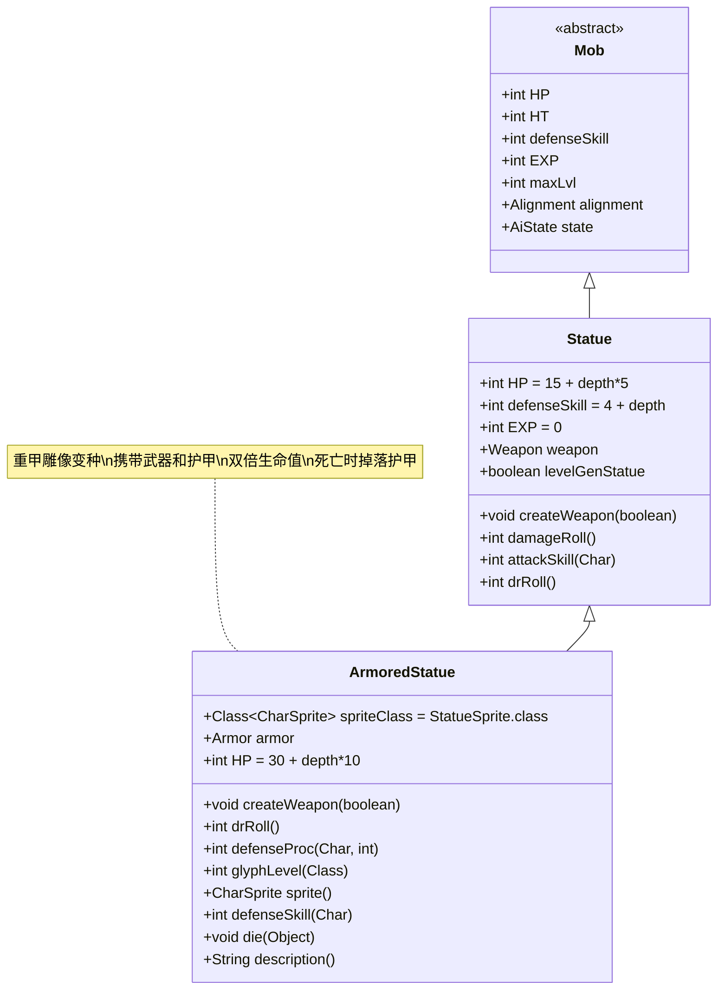

# ArmoredStatue 类文档

## 1. 基本信息
| 属性 | 值 |
|------|-----|
| 文件路径 | core/src/main/java/com/shatteredpixel/shatteredpixeldungeon/actors/mobs/ArmoredStatue.java |
| 包名 | com.shatteredpixel.shatteredpixeldungeon.actors.mobs |
| 类类型 | public class |
| 继承关系 | extends Statue |
| 代码行数 | 129行 |

## 2. 类职责说明
ArmoredStatue是Statue的重甲变种，除了携带武器外还装备了一件随机护甲。它具有双倍的生命值，并且护甲会提供额外的伤害减免、闪避加成和符文效果。死亡时会掉落其装备的护甲。

## 4. 继承与协作关系


## 静态常量表
| 常量名 | 类型 | 值 | 说明 |
|--------|------|-----|------|
| (继承自Statue) | | | |
| EXP | int | 0 | 击败后获得的经验值（无经验） |
| properties | ArrayList<Property> | INORGANIC | 无机物属性 |

## 实例字段表
| 字段名 | 类型 | 修饰符 | 说明 |
|--------|------|--------|------|
| spriteClass | Class<? extends CharSprite> | - | 怪物精灵类（StatueSprite） |
| armor | Armor | protected | 装备的护甲实例 |
| HP/HT | int | - | 生命值上限（30 + 深度*10，双倍于普通雕像） |

## 7. 方法详解

### 构造函数 ArmoredStatue()
**签名**: `public ArmoredStatue()`
**功能**: 初始化重甲雕像实例
**参数**: 无
**返回值**: void
**实现逻辑**:
- 调用父类构造函数（第43行）
- 设置双倍生命值：HP = HT = 30 + Dungeon.depth * 10（第47行）

### createWeapon(boolean useDecks)
**签名**: `public void createWeapon(boolean useDecks)`
**功能**: 创建武器和护甲装备
**参数**:
- useDecks: boolean - 是否使用卡组生成
**返回值**: void
**实现逻辑**:
1. 调用父类createWeapon方法创建武器（第50行）
2. 生成随机护甲（第53行）
3. 设置护甲为非诅咒状态（第54行）
4. 随机附魔护甲符文（第55行）

### drRoll()
**签名**: `int drRoll()`
**功能**: 计算伤害减免值
**参数**: 无
**返回值**: int - 伤害减免值
**实现逻辑**:
- 在父类基础上增加护甲的伤害减免值（armor.DRMin()到armor.DRMax()）（第74-75行）

### defenseProc(Char enemy, int damage)
**签名**: `int defenseProc(Char enemy, int damage)`
**功能**: 防御处理，应用护甲的特殊效果
**参数**:
- enemy: Char - 攻击者
- damage: int - 受到的伤害值
**返回值**: int - 处理后的伤害值
**实现逻辑**:
1. 调用护甲的proc方法处理伤害（第84行）
2. 调用父类defenseProc方法（第85行）

### glyphLevel(Class<? extends Armor.Glyph> cls)
**签名**: `int glyphLevel(Class<? extends Armor.Glyph> cls)`
**功能**: 获取指定符文的等级
**参数**:
- cls: Class<? extends Armor.Glyph> - 符文类
**返回值**: int - 符文等级
**实现逻辑**:
1. 如果护甲存在且具有指定符文，返回护甲等级和父类等级的最大值（第90-92行）
2. 否则返回父类等级（第94行）

### sprite()
**签名**: `CharSprite sprite()`
**功能**: 获取并配置精灵显示
**参数**: 无
**返回值**: CharSprite - 配置后的精灵
**实现逻辑**:
1. 获取父类精灵（第99行）
2. 根据护甲等级设置精灵外观（第100-105行）

### defenseSkill(Char enemy)
**签名**: `int defenseSkill(Char enemy)`
**功能**: 计算防御技能值
**参数**:
- enemy: Char - 敌人
**返回值**: int - 防御技能值
**实现逻辑**:
- 应用护甲的闪避因子调整防御技能（第110-111行）

### die(Object cause)
**签名**: `void die(Object cause)`
**功能**: 死亡处理，掉落护甲
**参数**:
- cause: Object - 死亡原因
**返回值**: void
**实现逻辑**:
1. 识别护甲（第115行）
2. 在当前位置掉落护甲（第116行）
3. 调用父类die方法（第117行）

### description()
**签名**: `String description()`
**功能**: 获取描述文本
**参数**: 无
**返回值**: String - 描述文本
**实现逻辑**:
1. 获取基础描述（第122行）
2. 如果同时有武器和护甲，添加装备描述（第123-126行）

## 战斗行为
- **被动状态**: 初始为被动状态，受到攻击或负面效果后变为狩猎状态
- **双倍生命**: 生命值是普通雕像的两倍，更难被击败
- **护甲效果**: 护甲提供伤害减免、闪避加成和符文效果
- **武器攻击**: 使用随机武器进行攻击，具有武器的特殊效果
- **AI行为**: 被动时不会主动攻击，激活后会积极追击玩家

## 掉落物品
- **主要掉落**: 装备的护甲（必定掉落）
- **次要掉落**: 装备的武器（继承自Statue）
- **物品品质**: 护甲和武器都是随机生成，带有随机符文/附魔

## 特殊属性
- **INORGANIC**: 无机物属性，对某些效果有抗性
- **Grim抗性**: 继承自Statue的Grim附魔抗性

## 11. 使用示例
```java
// ArmoredStatue通常由游戏系统随机生成
Statue statue = Statue.random(true); // 有一定概率生成ArmoredStatue

// 护甲效果的应用示例
@Override
public int drRoll() {
    return super.drRoll() + Random.NormalIntRange(armor.DRMin(), armor.DRMax());
}

@Override
public int defenseProc(Char enemy, int damage) {
    damage = armor.proc(enemy, this, damage); // 应用护甲特殊效果
    return super.defenseProc(enemy, damage);
}
```

## 注意事项
1. ArmoredStatue的生命值随地下城深度线性增长
2. 护甲和武器都是完全随机生成的，可能非常强力
3. 死亡时必定掉落护甲，是获取高品质护甲的重要来源
4. 由于EXP为0，击败后不会获得经验值
5. 护甲的符文效果会正常生效，增加了战斗的复杂性

## 最佳实践
1. 玩家应准备足够的输出能力来应对高生命值
2. 利用护甲的弱点（如特定元素伤害）来提高效率
3. 优先击杀ArmoredStatue以获取随机护甲和武器
4. 在设计关卡时，可将ArmoredStatue作为守卫重要区域的强大敌人