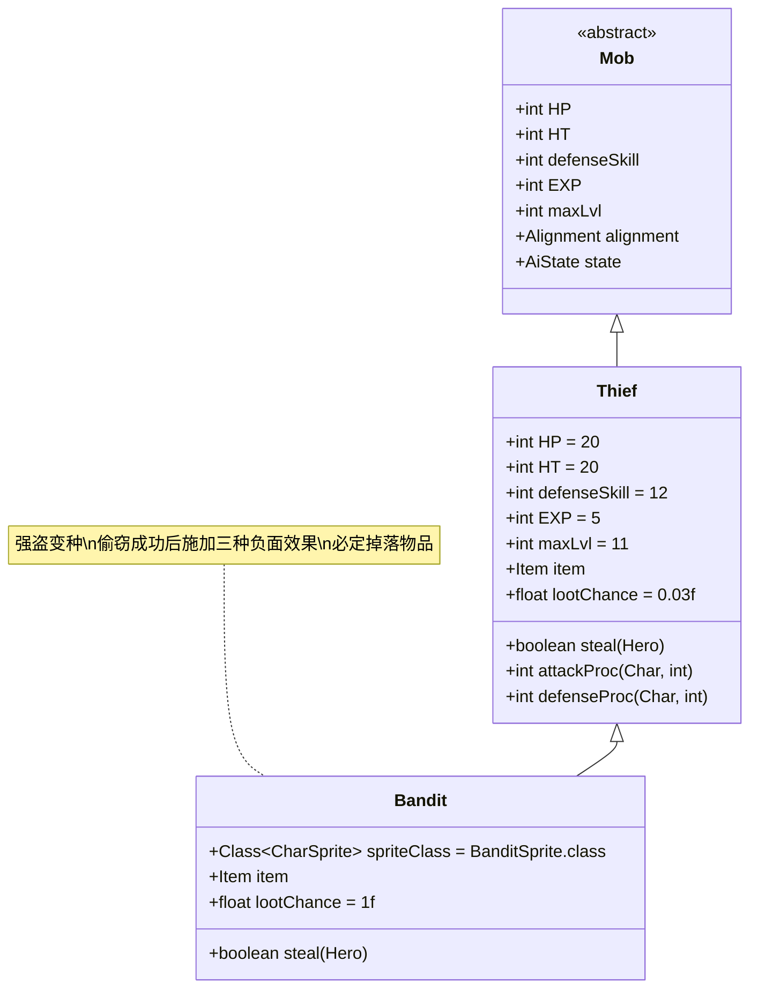

# Bandit 类文档

## 1. 基本信息
| 属性 | 值 |
|------|-----|
| 文件路径 | core/src/main/java/com/shatteredpixel/shatteredpixeldungeon/actors/mobs/Bandit.java |
| 包名 | com.shatteredpixel.shatteredpixeldungeon.actors.mobs |
| 类类型 | public class |
| 继承关系 | extends Thief |
| 代码行数 | 60行 |

## 2. 类职责说明
Bandit是Thief的变种，具有更强的偷窃能力和攻击性。它在成功偷窃玩家物品后会立即对玩家施加失明、中毒和残废三种负面效果，使其成为非常危险的敌人。

## 4. 继承与协作关系


## 静态常量表
| 常量名 | 类型 | 值 | 说明 |
|--------|------|-----|------|
| (继承自Thief) | | | |
| HP/HT | int | 20 | 生命值上限 |
| defenseSkill | int | 12 | 防御技能等级 |
| EXP | int | 5 | 击败后获得的经验值 |
| maxLvl | int | 11 | 最大生成等级 |

## 实例字段表
| 字段名 | 类型 | 修饰符 | 说明 |
|--------|------|--------|------|
| spriteClass | Class<? extends CharSprite> | - | 怪物精灵类（BanditSprite） |
| item | Item | public | 偷窃获得的物品 |
| lootChance | float | - | 掉落概率（1.0，即100%） |

## 7. 方法详解

### steal(Hero hero)
**签名**: `protected boolean steal(Hero hero)`
**功能**: 偷窃处理，在成功偷窃后对玩家施加多种负面效果
**参数**:
- hero: Hero - 被偷窃的英雄
**返回值**: boolean - 是否偷窃成功
**实现逻辑**:
1. 调用父类steal方法尝试偷窃（第47行）
2. 如果偷窃成功：
   - 对玩家施加失明效果，持续时间为Blindness.DURATION/2（第49行）
   - 对玩家施加中毒效果，持续5-6回合（第50行）
   - 对玩家施加残废效果，持续时间为Cripple.DURATION/2（第51行）
   - 刷新视野观察（第52行）
   - 返回true（第54行）
3. 如果偷窃失败，返回false（第56行）

## 战斗行为
- **偷窃机制**: 继承Thief的偷窃能力，会随机偷取玩家背包中的非唯一、未升级物品
- **负面效果**: 成功偷窃后立即施加失明、中毒、残废三种效果
- **逃跑行为**: 偷窃成功后会立即切换到逃跑状态（FLEEING）
- **AI行为**: 如果持有物品且发现敌人，会优先逃跑而非战斗
- **特殊机制**: 失明效果会使玩家暂时无法看到周围环境，增加危险性

## 掉落物品
- **主要掉落**: 偷窃的物品（如果未成功逃跑）
- **次要掉落**: 继承自Thief的常规掉落（戒指或神器）
- **掉落概率**: 100%（必定掉落某种物品）

## 特殊属性
- **UNDEAD**: 继承自Thief的不死族属性

## 11. 使用示例
```java
// Bandit通常由游戏系统自动创建和管理

// 偷窃后的负面效果应用示例
@Override
protected boolean steal(Hero hero) {
    if (super.steal(hero)) {
        // 施加三种负面效果
        Buff.prolong(hero, Blindness.class, Blindness.DURATION/2f);
        Buff.affect(hero, Poison.class).set(Random.IntRange(5, 6));
        Buff.prolong(hero, Cripple.class, Cripple.DURATION/2f);
        Dungeon.observe(); // 刷新视野
        return true;
    }
    return false;
}
```

## 注意事项
1. Bandit的偷窃成功率与普通Thief相同，但后果更严重
2. 失明效果会严重影响玩家的视野和战斗能力
3. 中毒和残废效果会持续多回合，需要及时治疗
4. 由于必定掉落物品，是获取装备的重要来源之一
5. 如果Bandit成功逃跑，偷窃的物品将永久丢失

## 最佳实践
1. 玩家应准备解毒剂和治疗手段来应对负面效果
2. 尽量避免携带过多非必要的物品以减少损失
3. 优先击杀Bandit以防止其逃跑并造成更大威胁
4. 在设计关卡时，可将Bandit作为中期陷阱或伏击敌人的选择