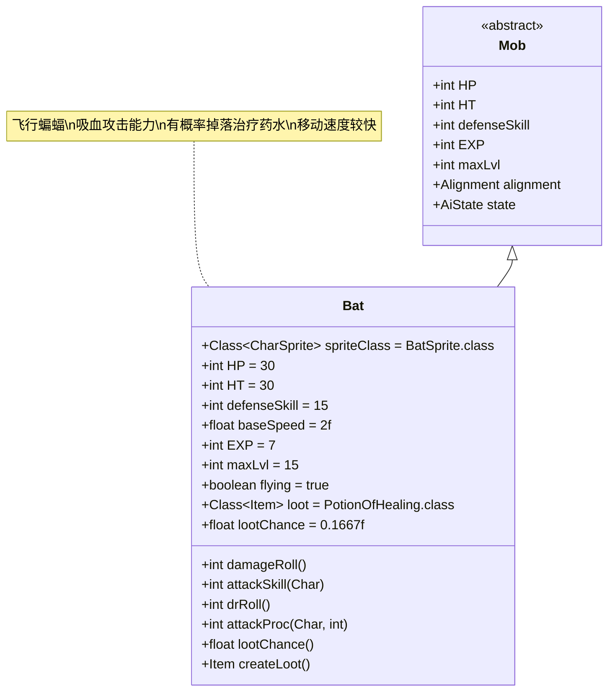

# Bat 类文档

## 1. 基本信息
| 属性 | 值 |
|------|-----|
| 文件路径 | core/src/main/java/com/shatteredpixel/shatteredpixeldungeon/actors/mobs/Bat.java |
| 包名 | com.shatteredpixel.shatteredpixeldungeon.actors.mobs |
| 类类型 | public class |
| 继承关系 | extends Mob |
| 代码行数 | 96行 |

## 2. 类职责说明
Bat是一种飞行怪物，具有吸血攻击能力。它在攻击时会根据造成的伤害值回复自身生命值，并且有概率掉落治疗药水。Bat移动速度快，是早期关卡中较为灵活的敌人。

## 4. 继承与协作关系


## 静态常量表
| 常量名 | 类型 | 值 | 说明 |
|--------|------|-----|------|
| HP/HT | int | 30 | 生命值上限 |
| defenseSkill | int | 15 | 防御技能等级 |
| baseSpeed | float | 2.0 | 基础移动速度（普通怪物的2倍） |
| EXP | int | 7 | 击败后获得的经验值 |
| maxLvl | int | 15 | 最大生成等级 |
| flying | boolean | true | 飞行能力 |
| loot | Class<? extends Item> | PotionOfHealing.class | 掉落物品类型 |
| lootChance | float | 0.1667f | 基础掉落概率（约1/6） |

## 实例字段表
| 字段名 | 类型 | 修饰符 | 说明 |
|--------|------|--------|------|
| spriteClass | Class<? extends CharSprite> | - | 怪物精灵类（BatSprite） |

## 7. 方法详解

### damageRoll()
**签名**: `int damageRoll()`
**功能**: 计算伤害范围
**参数**: 无
**返回值**: int - 伤害值
**实现逻辑**:
- 返回5-18之间的随机伤害值（第53行）

### attackSkill(Char target)
**签名**: `int attackSkill(Char target)`
**功能**: 计算攻击技能等级
**参数**:
- target: Char - 目标
**返回值**: int - 攻击技能等级
**实现逻辑**:
- 固定返回16（第58行）

### drRoll()
**签名**: `int drRoll()`
**功能**: 计算伤害减免值
**参数**: 无
**返回值**: int - 伤害减免值
**实现逻辑**:
- 在基础伤害减免基础上增加0-4点（第63-64行）

### attackProc(Char enemy, int damage)
**签名**: `int attackProc(Char enemy, int damage)`
**功能**: 攻击处理，实现吸血效果
**参数**:
- enemy: Char - 被攻击的敌人
- damage: int - 造成的伤害值
**返回值**: int - 处理后的伤害值
**实现逻辑**:
1. 调用父类attackProc方法（第74行）
2. 计算回复生命值：min(伤害-4, 最大可回复生命值)（第75行）
3. 如果回复值大于0，增加HP并显示治疗效果（第77-80行）
4. 返回处理后的伤害值（第82行）

### lootChance()
**签名**: `float lootChance()`
**功能**: 计算实际掉落概率
**参数**: 无
**返回值**: float - 掉落概率
**实现逻辑**:
- 根据已掉落次数动态调整概率：(7 - 已掉落次数) / 7（第87行）
- 最多掉落7次后概率降为0

### createLoot()
**签名**: `Item createLoot()`
**功能**: 创建掉落物品实例
**参数**: 无
**返回值**: Item - 治疗药水实例
**实现逻辑**:
1. 增加掉落计数（第92行）
2. 调用父类createLoot方法（第93行）

### die(Object cause)
**签名**: `void die(Object cause)`
**功能**: 死亡处理
**参数**:
- cause: Object - 死亡原因
**返回值**: void
**实现逻辑**:
1. 关闭飞行状态（第68行）
2. 调用父类die方法（第69行）

## 战斗行为
- **飞行能力**: 可以跨越地形障碍，移动更加灵活
- **高速移动**: 移动速度是普通怪物的2倍
- **吸血攻击**: 造成伤害后回复生命值（伤害-4，最少0点）
- **AI行为**: 标准的敌对AI，会主动追击玩家
- **生存能力**: 中等生命值配合吸血能力使其具有一定持久战能力

## 掉落物品
- **主要掉落**: 治疗药水（PotionOfHealing）
- **掉落机制**: 最多掉落7次，每次掉落后概率递减
- **初始概率**: 约16.67%（1/6）
- **最终概率**: 第7次后降为0%

## 特殊属性
- **Flying**: 具有飞行能力，不受地面陷阱影响

## 11. 使用示例
```java
// Bat通常由游戏系统自动创建和管理

// 吸血效果的实现示例
@Override
public int attackProc(Char enemy, int damage) {
    damage = super.attackProc(enemy, damage);
    int reg = Math.min(damage - 4, HT - HP); // 计算回复量
    if (reg > 0) {
        HP += reg; // 回复生命值
        sprite.showStatusWithIcon(CharSprite.POSITIVE, Integer.toString(reg), FloatingText.HEALING);
    }
    return damage;
}

// 动态掉落概率示例
@Override
public float lootChance(){
    return super.lootChance() * ((7f - Dungeon.LimitedDrops.BAT_HP.count) / 7f);
}
```

## 注意事项
1. Bat的吸血效果有最小伤害阈值（4点），低于此值无法回复生命
2. 最大回复量受限于当前缺失的生命值
3. 飞行状态下不受地面陷阱和某些地形效果影响
4. 掉落治疗药水的概率会随着游戏进程递减
5. 高速移动使其难以被远程攻击命中

## 最佳实践
1. 玩家应优先使用高伤害攻击来最大化输出效率
2. 利用地形优势（如狭窄通道）限制其移动
3. 准备足够的持续伤害手段来抵消其吸血效果
4. 在早期关卡中，Bat是获取治疗药水的重要来源
5. 设计关卡时可将Bat作为灵活的骚扰型敌人使用