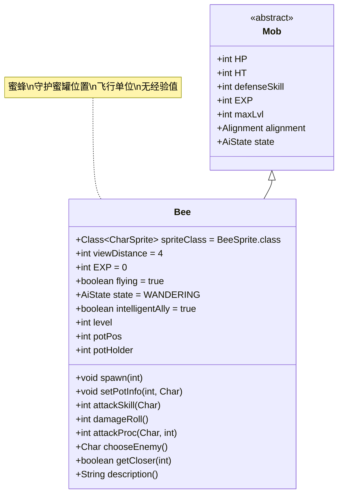

# Bee 类文档

## 1. 基本信息
| 属性 | 值 |
|------|-----|
| 文件路径 | core/src/main/java/com/shatteredpixel/shatteredpixeldungeon/actors/mobs/Bee.java |
| 包名 | com.shatteredpixel.shatteredpixeldungeon.actors.mobs |
| 类类型 | public class |
| 继承关系 | extends Mob |
| 代码行数 | 236行 |

## 2. 类职责说明
Bee是一种飞行怪物，通常由蜜罐（Honeypot）生成。它会守护蜜罐的位置，并攻击靠近蜜罐的敌人。Bee的生命值和属性随生成等级动态变化，死亡时不会提供经验值。

## 4. 继承与协作关系


## 静态常量表
| 常量名 | 类型 | 值 | 说明 |
|--------|------|-----|------|
| viewDistance | int | 4 | 视野距离 |
| EXP | int | 0 | 击败后获得的经验值（无经验） |
| flying | boolean | true | 飞行能力 |
| intelligentAlly | boolean | true | 智能盟友（仅在蜂蜜治疗药剂魅惑时适用） |

## 实例字段表
| 字段名 | 类型 | 修饰符 | 说明 |
|--------|------|--------|------|
| spriteClass | Class<? extends CharSprite> | - | 怪物精灵类（BeeSprite） |
| level | int | private | 生成等级，影响属性 |
| potPos | int | private | 蜜罐位置（-1表示蜜罐已丢失） |
| potHolder | int | private | 蜜罐持有者ID（-1表示无持有者） |

## 7. 方法详解

### spawn(int level)
**签名**: `public void spawn(int level)`
**功能**: 初始化蜜蜂实例并根据等级设置属性
**参数**:
- level: int - 生成等级
**返回值**: void
**实现逻辑**:
1. 设置生成等级（第91行）
2. 计算生命值：HT = (2 + level) * 4（第92行）
3. 计算防御技能：defenseSkill = 9 + level（第93行）

### setPotInfo(int potPos, Char potHolder)
**签名**: `public void setPotInfo(int potPos, Char potHolder)`
**功能**: 设置蜜罐相关信息
**参数**:
- potPos: int - 蜜罐位置
- potHolder: Char - 蜜罐持有者
**返回值**: void
**实现逻辑**:
1. 设置蜜罐位置（第97行）
2. 根据持有者是否为空设置持有者ID（第98-101行）

### attackSkill(Char target)
**签名**: `int attackSkill(Char target)`
**功能**: 计算攻击技能等级
**参数**:
- target: Char - 目标
**返回值**: int - 攻击技能等级
**实现逻辑**:
- 返回防御技能值作为攻击技能（第114-115行）

### damageRoll()
**签名**: `int damageRoll()`
**功能**: 计算伤害范围
**参数**: 无
**返回值**: int - 伤害值
**实现逻辑**:
- 返回HT/10到HT/4之间的随机伤害值（第119行）

### attackProc(Char enemy, int damage)
**签名**: `int attackProc(Char enemy, int damage)`
**功能**: 攻击处理，对其他怪物施加仇恨
**参数**:
- enemy: Char - 被攻击的敌人
- damage: int - 造成的伤害值
**返回值**: int - 处理后的伤害值
**实现逻辑**:
1. 调用父类attackProc方法（第124行）
2. 如果目标是其他怪物，对其施加仇恨（第125-127行）
3. 返回处理后的伤害值（第128行）

### chooseEnemy()
**签名**: `protected Char chooseEnemy()`
**功能**: 选择攻击目标，优先保护蜜罐
**参数**: 无
**返回值**: Char - 选择的敌人
**实现逻辑**:
1. 如果是盟友或蜜罐不存在，使用默认AI（第147-148行）
2. 如果有持有者，攻击持有者（第150-152行）
3. 如果蜜罐在地面，寻找距离蜜罐3格内的敌人（第154-206行）
4. 优先攻击最近的潜在威胁，最后考虑玩家

### getCloser(int target)
**签名**: `protected boolean getCloser(int target)`
**功能**: 移动逻辑，优先接近蜜罐或目标
**参数**:
- target: int - 目标位置
**返回值**: boolean - 是否成功移动
**实现逻辑**:
1. 盟友状态下接近玩家（第214-215行）
2. 有持有者时接近持有者（第216-217行）
3. 否则优先接近蜜罐位置（第218-223行）
4. 调用父类getCloser方法（第225行）

### description()
**签名**: `String description()`
**功能**: 获取描述文本
**参数**: 无
**返回值**: String - 描述文本
**实现逻辑**:
1. 蜂蜜魅惑状态下返回特殊描述（第230-231行）
2. 否则返回默认描述（第233行）

## 战斗行为
- **蜜罐守护**: 会主动攻击距离蜜罐3格范围内的敌人
- **飞行能力**: 可以跨越地形障碍，移动灵活
- **动态属性**: 生命值和防御力随生成等级提升
- **仇恨机制**: 攻击其他怪物时会对其施加仇恨
- **AI复杂性**: 具有复杂的优先级系统来保护蜜罐

## 掉落物品
- **主要掉落**: 无（EXP为0，不提供经验值）
- **特殊机制**: 死亡时可能触发蜜罐相关效果

## 特殊属性
- **Flying**: 具有飞行能力
- **智能盟友**: 在特定条件下可成为玩家的智能盟友

## 11. 使用示例
```java
// Bee通常由蜜罐生成
Bee bee = new Bee();
bee.spawn(level); // 根据等级初始化属性
bee.setPotInfo(potPos, potHolder); // 设置蜜罐信息

// 蜜罐守护逻辑示例
@Override
protected Char chooseEnemy() {
    // 优先保护蜜罐位置
    if (potPos != -1) {
        // 寻找距离蜜罐3格内的敌人
        for (Char ch : Actor.chars()) {
            if (Dungeon.level.distance(ch.pos, potPos) <= 3) {
                return ch;
            }
        }
    }
    return super.chooseEnemy();
}
```

## 注意事项
1. Bee的生命值计算公式：(2 + 等级) * 4
2. 攻击伤害范围：最大生命值的10%-25%
3. 蜜罐丢失后（potPos = -1），Bee会恢复普通AI行为
4. 由于EXP为0，击败Bee不会获得任何经验值
5. 复杂的AI逻辑可能导致性能开销，在大量Bee存在时需注意

## 最佳实践
1. 玩家应优先摧毁蜜罐来削弱Bee的战斗意志
2. 利用远程攻击从安全距离消灭Bee
3. 避免在蜜罐附近与其他怪物战斗，以免吸引Bee的仇恨
4. 蜂蜜治疗药剂可以将Bee转化为临时盟友
5. 设计关卡时可将Bee作为蜜罐的守护机制使用