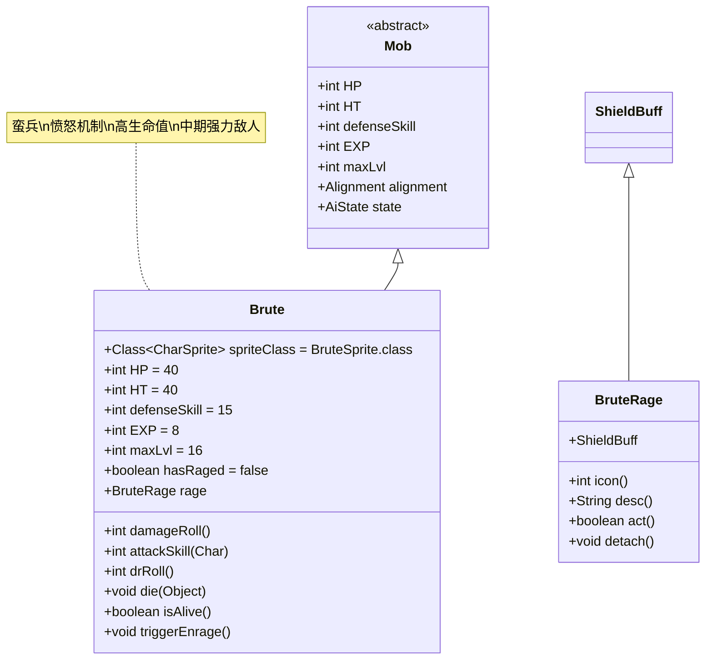

# Brute 类文档

## 1. 基本信息
| 属性 | 值 |
|------|-----|
| 文件路径 | core/src/main/java/com/shatteredpixel/shatteredpixeldungeon/actors/mobs/Brute.java |
| 包名 | com.shatteredpixel.shatteredpixeldungeon.actors.mobs |
| 类类型 | public class |
| 继承关系 | extends Mob |
| 代码行数 | 170行 |

## 2. 类职责说明
Brute是一种强壮的近战怪物，具有愤怒机制。当生命值归零时，会进入愤怒状态（BruteRage），获得护盾并继续战斗一段时间。Brute具有较高的生命值和攻击力，是中期关卡的重要敌人。

## 4. 继承与协作关系


## 静态常量表
| 常量名 | 类型 | 值 | 说明 |
|--------|------|-----|------|
| HP/HT | int | 40 | 生命值上限 |
| defenseSkill | int | 15 | 防御技能等级 |
| EXP | int | 8 | 击败后获得的经验值 |
| maxLvl | int | 16 | 最大生成等级 |

## 实例字段表
| 字段名 | 类型 | 修饰符 | 说明 |
|--------|------|--------|------|
| spriteClass | Class<? extends CharSprite> | - | 怪物精灵类（BruteSprite） |
| loot | Class<? extends Item> | - | 掉落物品类型（Gold） |
| lootChance | float | - | 掉落概率（0.5f，即50%） |
| hasRaged | boolean | protected | 是否已触发愤怒状态 |
| rage | BruteRage | private | 愤怒状态缓存 |

## 7. 方法详解

### damageRoll()
**签名**: `int damageRoll()`
**功能**: 计算伤害范围
**参数**: 无
**返回值**: int - 伤害值
**实现逻辑**:
- 愤怒状态下：15-40点伤害（第59-61行）
- 正常状态下：5-25点伤害（第59-61行）

### attackSkill(Char target)
**签名**: `int attackSkill(Char target)`
**功能**: 计算攻击技能等级
**参数**:
- target: Char - 目标
**返回值**: int - 攻击技能等级
**实现逻辑**:
- 固定返回20（第66行）

### drRoll()
**签名**: `int drRoll()`
**功能**: 计算伤害减免值
**参数**: 无
**返回值**: int - 伤害减免值
**实现逻辑**:
- 在基础伤害减免基础上增加0-8点（第71行）

### die(Object cause)
**签名**: `void die(Object cause)`
**功能**: 死亡处理
**参数**:
- cause: Object - 死亡原因
**返回值**: void
**实现逻辑**:
1. 如果死亡原因是深渊（Chasm），标记hasRaged为true以防止愤怒触发（第78-79行）
2. 调用父类die方法（第76行）

### isAlive()
**签名**: `boolean isAlive()`
**功能**: 检查是否存活（包括愤怒状态）
**参数**: 无
**返回值**: boolean - 是否存活
**实现逻辑**:
1. 如果超级类返回true，直接返回true（第88-89行）
2. 如果未触发愤怒，调用triggerEnrage()（第91-92行）
3. 缓存rage状态（第94-97行）
4. 返回rage存在且护盾值大于0（第99行）

### triggerEnrage()
**签名**: `protected void triggerEnrage()`
**功能**: 触发愤怒状态
**参数**: 无
**返回值**: void
**实现逻辑**:
1. 对自身施加BruteRage效果（第104行）
2. 设置护盾值为HT/2 + 4（24点）（第105行）
3. 显示护盾状态和愤怒特效（第106-108行）
4. 花费1个回合时间（第110行）
5. 标记hasRaged为true（第111行）

## 战斗行为
- **基础能力**: 高生命值（40点）和中等攻击力
- **愤怒机制**: 生命值归零时不会立即死亡，而是进入愤怒状态
- **护盾持续**: 每回合消耗护盾，总计可持续约24回合
- **AI行为**: 标准的近战攻击AI，会积极追击玩家
- **难度提升**: 愤怒状态下攻击力大幅提升（15-40 vs 5-25）

## 掉落物品
- **主要掉落**: 金币（Gold）
- **掉落概率**: 50%
- **掉落数量**: 随机数量的金币

## 特殊属性
- Brute没有特殊的Property标记，但通过BruteRage状态实现特殊机制

## 11. 使用示例
```java
// Brute通常由游戏系统自动创建和管理

// 愤怒机制的核心逻辑
@Override
public boolean isAlive() {
    if (super.isAlive()){
        return true;
    } else {
        if (!hasRaged){
            triggerEnrage(); // 触发愤怒状态
        }
        // 返回护盾是否还有剩余
        return rage != null && rage.shielding() > 0;
    }
}

// BruteRage状态的实现
public static class BruteRage extends ShieldBuff {
    @Override
    public boolean act() {
        if (target.HP > 0){
            detach(); // 如果目标恢复生命，脱离状态
            return true;
        }
        // 每回合消耗护盾
        absorbDamage(Math.round(4*AscensionChallenge.statModifier(target)));
        if (shielding() <= 0){
            target.die(null); // 护盾耗尽后真正死亡
        }
        spend(TICK);
        return true;
    }
}
```

## 注意事项
1. Brute的生命值归零后仍能继续战斗，直到护盾耗尽
2. 护盾值为最大生命值的一半加4（24点护盾）
3. 愤怒状态下攻击力显著提升（最高40点伤害）
4. 如果通过深渊等方式死亡，不会触发愤怒机制
5. 玩家需要准备足够的输出能力来应对愤怒状态

## 最佳实践
1. 玩家应优先使用高爆发伤害快速击败Brute，避免其进入愤怒状态
2. 利用控制技能（如眩晕、冰冻）来中断其愤怒状态
3. 准备足够的治疗手段来应对高伤害输出
4. 在设计关卡时，可将Brute作为中期的重要挑战敌人
5. 考虑与其他敌人配合，形成组合威胁