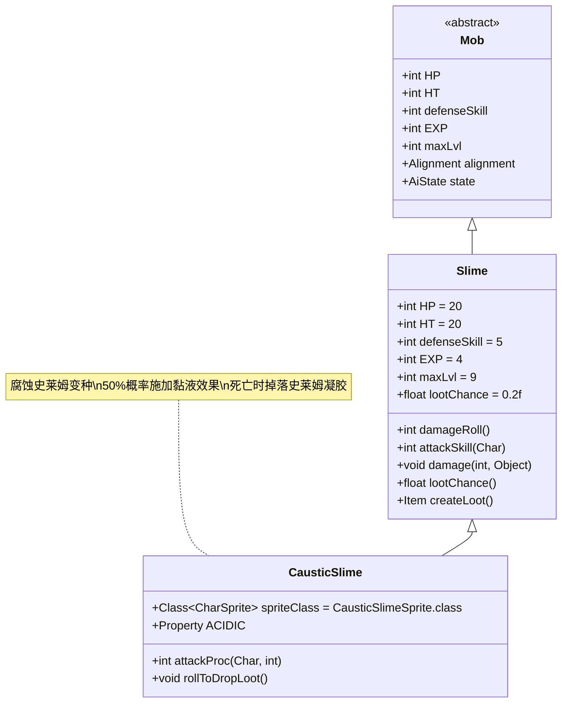

# CausticSlime 类文档

## 1. 基本信息
| 属性 | 值 |
|------|-----|
| 文件路径 | core/src/main/java/com/shatteredpixel/shatteredpixeldungeon/actors/mobs/CausticSlime.java |
| 包名 | com.shatteredpixel.shatteredpixeldungeon.actors.mobs |
| 类类型 | public class |
| 继承关系 | extends Slime |
| 代码行数 | 63行 |

## 2. 类职责说明
CausticSlime是Slime的变种，具有酸性攻击能力。它在攻击时有50%的概率对敌人施加Ooze（黏液）效果，并在死亡时必定掉落GooBlob（史莱姆凝胶）。CausticSlime继承了普通史莱姆的基本属性，并增加了特殊的战斗机制。

## 4. 继承与协作关系


## 静态常量表
| 常量名 | 类型 | 值 | 说明 |
|--------|------|-----|------|
| (继承自Slime) | | | |
| HP/HT | int | 20 | 生命值上限 |
| defenseSkill | int | 5 | 防御技能等级 |
| EXP | int | 4 | 击败后获得的经验值 |
| maxLvl | int | 9 | 最大生成等级 |

## 实例字段表
| 字段名 | 类型 | 修饰符 | 说明 |
|--------|------|--------|------|
| spriteClass | Class<? extends CharSprite> | - | 怪物精灵类（CausticSlimeSprite） |
| properties | ArrayList<Property> | - | 怪物属性列表，包含ACIDIC |

## 7. 方法详解

### attackProc(Char enemy, int damage)
**签名**: `int attackProc(Char enemy, int damage)`
**功能**: 攻击处理，在攻击命中时有50%概率施加Ooze效果
**参数**:
- enemy: Char - 被攻击的敌人
- damage: int - 造成的伤害值
**返回值**: int - 处理后的伤害值
**实现逻辑**:
1. 50%概率（Random.Int(2) == 0）对敌人施加Ooze效果（第43-46行）
2. 如果施加Ooze，显示黑色粒子特效（第45行）
3. 调用父类attackProc方法（第48行）

### rollToDropLoot()
**签名**: `void rollToDropLoot()`
**功能**: 掉落物品处理，必定掉落GooBlob
**参数**: 无
**返回值**: void
**实现逻辑**:
1. 检查英雄等级是否过高（超过maxLvl+2），如果是则不掉落（第53-54行）
2. 调用父类rollToDropLoot方法处理常规掉落（第56行）
3. 在随机相邻位置掉落GooBlob物品（第57-61行）

## 战斗行为
- **酸性攻击**: 50%概率施加Ooze效果，造成持续伤害
- **基础能力**: 继承Slime的低生命值和防御力，但攻击技能较高（12点）
- **伤害减免**: 继承Slime的特殊伤害计算机制，高伤害会受到递减效果
- **AI行为**: 标准的敌对AI，会主动攻击玩家
- **视觉效果**: 施加Ooze效果时显示黑色粒子特效

## 掉落物品
- **主要掉落**: GooBlob（史莱姆凝胶，任务物品）
- **次要掉落**: 继承自Slime的武器掉落（第二级近战武器）
- **掉落机制**: GooBlob必定掉落，武器掉落遵循Slime的概率机制
- **掉落位置**: GooBlob掉落在怪物周围的随机相邻格子

## 特殊属性
- **ACIDIC**: 具有酸性属性，能够施加Ooze状态效果

## 11. 使用示例
```java
// CausticSlime通常由游戏系统自动创建和管理

// 酸性攻击的实现示例
@Override
public int attackProc(Char enemy, int damage) {
    if (Random.Int(2) == 0) {
        Buff.affect(enemy, Ooze.class).set(Ooze.DURATION);
        enemy.sprite.burst(0x000000, 5); // 黑色粒子特效
    }
    return super.attackProc(enemy, damage);
}

// 任务物品掉落示例
@Override
public void rollToDropLoot() {
    if (Dungeon.hero.lvl > maxLvl + 2) return;
    super.rollToDropLoot();
    // 在周围随机位置掉落GooBlob
    int ofs = PathFinder.NEIGHBOURS8[Random.Int(8)];
    Dungeon.level.drop(new GooBlob(), pos + ofs).sprite.drop(pos);
}
```

## 注意事项
1. CausticSlime的Ooze效果无法被免疫，会对所有类型的敌人生效
2. GooBlob是任务相关物品，用于特定的游戏进程
3. 由于英雄等级限制，高等级时可能不会掉落GooBlob
4. 继承了Slime的伤害递减机制，单次高伤害会被削弱
5. 掉落的GooBlob位置是随机的，需要仔细搜索周围区域

## 最佳实践
1. 玩家应准备抗性或治疗手段来应对Ooze效果
2. 利用远程武器避免近战接触减少被攻击机会
3. 击败后仔细搜索周围8个格子以找到GooBlob
4. 在设计关卡时，可将CausticSlime作为任务相关的重要敌人
5. 考虑与其他酸性怪物配合，形成主题一致的区域设计