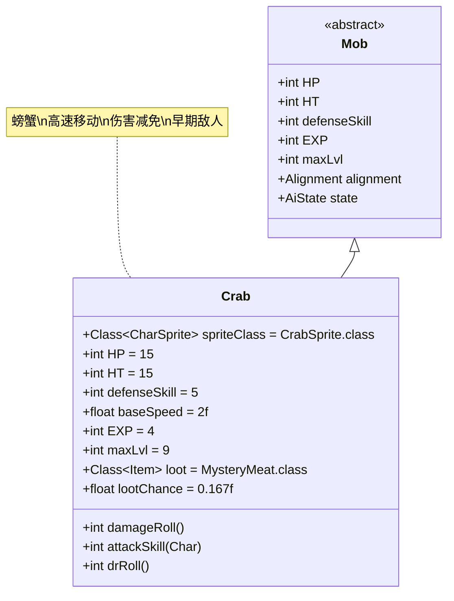

# Crab 类文档

## 1. 基本信息
| 属性 | 值 |
|------|-----|
| 文件路径 | core/src/main/java/com/shatteredpixel/shatteredpixeldungeon/actors/mobs/Crab.java |
| 包名 | com.shatteredpixel.shatteredpixeldungeon.actors.mobs |
| 类类型 | public class |
| 继承关系 | extends Mob |
| 代码行数 | 59行 |

## 2. 类职责说明
Crab是一种早期关卡的螃蟹怪物，具有较高的移动速度和伤害减免能力。它有概率掉落神秘肉，是游戏初期比较常见的敌人之一。

## 4. 继承与协作关系


## 静态常量表
| 常量名 | 类型 | 值 | 说明 |
|--------|------|-----|------|
| HP/HT | int | 15 | 生命值上限 |
| defenseSkill | int | 5 | 防御技能等级 |
| baseSpeed | float | 2.0 | 基础移动速度（普通怪物的2倍） |
| EXP | int | 4 | 击败后获得的经验值 |
| maxLvl | int | 9 | 最大生成等级 |
| loot | Class<? extends Item> | MysteryMeat.class | 掉落物品类型 |
| lootChance | float | 0.167f | 掉落概率（约1/6） |

## 实例字段表
| 字段名 | 类型 | 修饰符 | 说明 |
|--------|------|--------|------|
| spriteClass | Class<? extends CharSprite> | - | 怪物精灵类（CrabSprite） |

## 7. 方法详解

### damageRoll()
**签名**: `int damageRoll()`
**功能**: 计算伤害范围
**参数**: 无
**返回值**: int - 伤害值
**实现逻辑**:
- 返回1-7之间的随机伤害值（第47行）

### attackSkill(Char target)
**签名**: `int attackSkill(Char target)`
**功能**: 计算攻击技能等级
**参数**:
- target: Char - 目标
**返回值**: int - 攻击技能等级
**实现逻辑**:
- 固定返回12（第52行）

### drRoll()
**签名**: `int drRoll()`
**功能**: 计算伤害减免值
**参数**: 无
**返回值**: int - 伤害减免值
**实现逻辑**:
- 在基础伤害减免基础上增加0-4点（第57-58行）

## 战斗行为
- **高速移动**: 移动速度是普通怪物的2倍，使其更难被远程攻击命中
- **伤害减免**: 具有额外的0-4点伤害减免，提升生存能力
- **中等攻击力**: 攻击技能等级为12，配合1-7点伤害输出
- **AI行为**: 标准的敌对AI，会主动追击玩家
- **生存能力**: 中等生命值配合伤害减免使其具有一定持久战能力

## 掉落物品
- **主要掉落**: 神秘肉（MysteryMeat）
- **掉落概率**: 约16.7%（1/6）
- **掉落数量**: 1个

## 特殊属性
- Crab没有特殊的Property标记

## 11. 使用示例
```java
// Crab通常由游戏系统自动创建和管理

// 高速移动和伤害减免的实现示例
{
    spriteClass = CrabSprite.class;
    HP = HT = 15;
    defenseSkill = 5;
    baseSpeed = 2f; // 双倍移动速度
    EXP = 4;
    maxLvl = 9;
    loot = MysteryMeat.class;
    lootChance = 0.167f;
}

@Override
public int drRoll() {
    return super.drRoll() + Random.NormalIntRange(0, 4); // 额外伤害减免
}
```

## 注意事项
1. Crab的移动速度较快，需要提前预判其位置
2. 伤害减免使其对低伤害攻击更具抵抗力
3. 掉落神秘肉的概率相对稳定，是早期获取该物品的来源之一
4. 由于生命值较低，高爆发伤害可以快速击败
5. 主要出现在游戏早期关卡（1-9层）

## 最佳实践
1. 玩家应利用地形优势限制其高速移动
2. 优先使用高伤害攻击来突破其伤害减免
3. 准备足够的输出能力以快速解决战斗
4. 在早期关卡中，Crab是练习战斗技巧的良好目标
5. 设计关卡时可将Crab作为基础敌人，与其他怪物形成组合