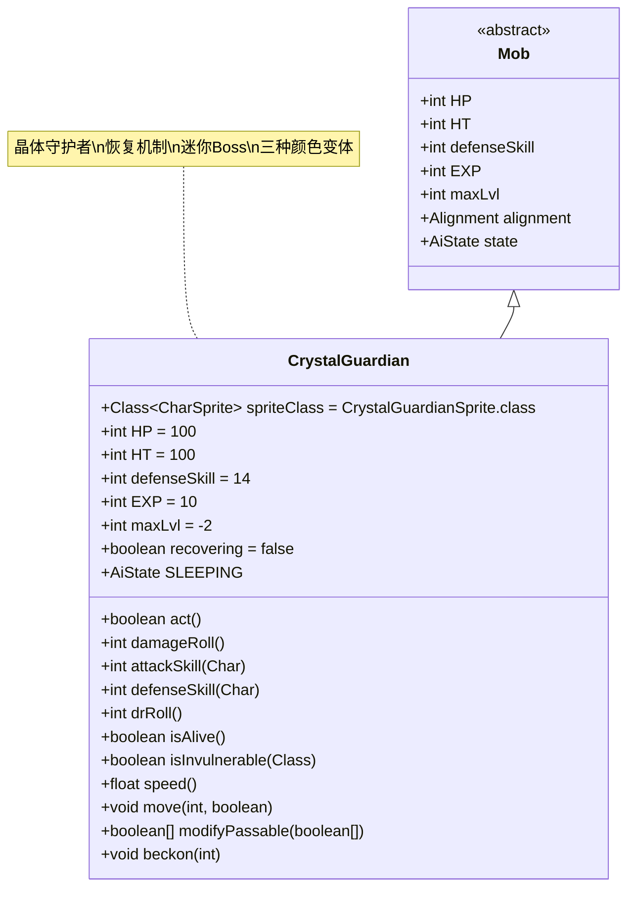

# CrystalGuardian 类文档

## 1. 基本信息
| 属性 | 值 |
|------|-----|
| 文件路径 | core/src/main/java/com/shatteredpixel/shatteredpixeldungeon/actors/mobs/CrystalGuardian.java |
| 包名 | com.shatteredpixel.shatteredpixeldungeon.actors.mobs |
| 类类型 | public class |
| 继承关系 | extends Mob |
| 代码行数 | 282行 |

## 2. 类职责说明
CrystalGuardian是晶体矿脉区域的守护者，具有独特的恢复机制和多种特殊行为。当生命值归零时，它会进入恢复状态而不是立即死亡，每回合回复5点生命值直到完全恢复。CrystalGuardian有三种颜色变体（蓝、绿、红），是迷你Boss级别的敌人。

## 4. 继承与协作关系


## 静态常量表
| 常量名 | 类型 | 值 | 说明 |
|--------|------|-----|------|
| HP/HT | int | 100 | 生命值上限 |
| defenseSkill | int | 14 | 防御技能等级 |
| EXP | int | 10 | 击败后获得的经验值 |
| maxLvl | int | -2 | 最大生成等级（负值表示特殊生成） |
| properties | ArrayList<Property> | INORGANIC, MINIBOSS | 特殊属性标记 |

## 实例字段表
| 字段名 | 类型 | 修饰符 | 说明 |
|--------|------|--------|------|
| spriteClass | Class<? extends CharSprite> | - | 怪物精灵类（三种颜色变体） |
| recovering | boolean | private | 是否处于恢复状态 |
| state | AiState | SLEEPING | 初始AI状态为休眠 |

## 7. 方法详解

### act()
**签名**: `protected boolean act()`
**功能**: 行动逻辑，处理恢复状态
**参数**: 无
**返回值**: boolean - 是否完成行动
**实现逻辑**:
1. 如果处于恢复状态：
   - 移除PinCushion效果（第73-75行）
   - 抛出物品（第76行）
   - 回复5点生命值（第77行）
   - 显示治疗效果（第79行）
   - 如果生命值满，结束恢复状态（第81-83行）
   - 花费1回合时间（第85行）
   - 返回true（第86行）
2. 否则调用父类act方法（第88行）

### damageRoll()
**签名**: `int damageRoll()`
**功能**: 计算伤害范围
**参数**: 无
**返回值**: int - 伤害值
**实现逻辑**:
- 返回10-16之间的随机伤害值（第93行）

### attackSkill(Char target)
**签名**: `int attackSkill(Char target)`
**功能**: 计算攻击技能等级
**参数**:
- target: Char - 目标
**返回值**: int - 攻击技能等级
**实现逻辑**:
- 固定返回20（第98行）

### defenseSkill(Char enemy)
**签名**: `int defenseSkill(Char enemy)`
**功能**: 计算防御技能等级
**参数**:
- enemy: Char - 敌人
**返回值**: int - 防御技能等级
**实现逻辑**:
- 恢复状态下返回0（无法防御）（第103行）
- 正常状态下调用父类方法（第104行）

### drRoll()
**签名**: `int drRoll()`
**功能**: 计算伤害减免值
**参数**: 无
**返回值**: int - 伤害减免值
**实现逻辑**:
- 在基础伤害减免基础上增加0-10点（第115-116行）

### isAlive()
**签名**: `boolean isAlive()`
**功能**: 检查是否存活（包括恢复机制）
**参数**: 无
**返回值**: boolean - 是否存活
**实现逻辑**:
1. 如果HP <= 0：
   - 设置HP = 1（第155行）
   - 移除除Doom和Cripple外的所有Buff（第157-161行）
   - 如果未在恢复，则开始恢复状态（第163-168行）
2. 调用父类isAlive方法（第170行）

### isInvulnerable(Class effect)
**签名**: `boolean isInvulnerable(Class effect)`
**功能**: 检查是否对特定效果免疫
**参数**:
- effect: Class - 效果类
**返回值**: boolean - 是否免疫
**实现逻辑**:
- 恢复状态下免疫除英雄和CrystalSpire外的所有角色攻击（第176-178行）
- 正常状态下调用父类方法（第180行）

### speed()
**签名**: `float speed()`
**功能**: 计算移动速度
**参数**: 无
**返回值**: float - 移动速度
**实现逻辑**:
- 在封闭空间中速度降低至1/4（最低0.25f）（第206-209行）
- 正常空间中返回父类速度（第210行）

### move(int step, boolean travelling)
**签名**: `void move(int step, boolean travelling)`
**功能**: 移动逻辑，处理晶体破坏
**参数**:
- step: int - 移动步数
- travelling: boolean - 是否在旅行模式
**返回值**: void
**实现逻辑**:
1. 调用父类move方法（第214行）
2. 如果移动到晶体矿位置：
   - 破坏晶体（第216-217行）
   - 显示视觉和音效（第219-220行）
   - 花费额外移动时间（第223行）

### modifyPassable(boolean[] passable)
**签名**: `boolean[] modifyPassable(boolean[] passable)`
**功能**: 修改可通行性，允许踩碎晶体
**参数**:
- passable: boolean[] - 可通行数组
**返回值**: boolean[] - 修改后的可通行数组
**实现逻辑**:
- 狩猎状态下可以踩碎晶体，但优先选择其他路径（第229-239行）

### beckon(int cell)
**签名**: `void beckon(int cell)`
**功能**: 呼叫处理
**参数**:
- cell: int - 目标格子
**返回值**: void
**实现逻辑**:
- 休眠状态下不响应呼叫（第244-245行）
- 其他状态下调用父类方法（第247行）

## 战斗行为
- **恢复机制**: 生命值归零时进入恢复状态，每回合回复5点生命值
- **休眠状态**: 初始为休眠状态，只有能到达的敌人才会唤醒
- **晶体互动**: 可以踩碎晶体矿，但会花费额外时间
- **速度惩罚**: 在狭窄空间中移动速度大幅降低
- **免疫机制**: 恢复状态下免疫大部分攻击（除英雄和CrystalSpire）
- **AI行为**: 标准的追踪AI，但会优先保护晶体区域

## 掉落物品
- **主要掉落**: 无固定掉落（需要查看具体实现）
- **特殊机制**: 死亡时会抛出携带的物品

## 特殊属性
- **INORGANIC**: 无机物属性
- **MINIBOSS**: 迷你Boss标记
- **颜色变体**: 蓝色、绿色、红色三种随机变体

## 11. 使用示例
```java
// CrystalGuardian通常由游戏系统自动创建

// 恢复机制的核心逻辑
@Override
public boolean isAlive() {
    if (HP <= 0){
        HP = 1; // 保持最低生命值
        // 移除大部分负面效果
        for (Buff b : buffs()){
            if (!(b instanceof Doom || b instanceof Cripple)) {
                b.detach();
            }
        }
        if (!recovering) {
            recovering = true; // 开始恢复
        }
    }
    return super.isAlive();
}

// 晶体破坏的实现
@Override
public void move(int step, boolean travelling) {
    super.move(step, travelling);
    if (Dungeon.level.map[pos] == Terrain.MINE_CRYSTAL){
        Level.set(pos, Terrain.EMPTY); // 破坏晶体
        spend(1/super.speed()); // 花费额外时间
    }
}
```

## 注意事项
1. CrystalGuardian的生命值归零后不会真正死亡，而是进入恢复状态
2. 恢复状态下的防御技能为0，但对大部分攻击免疫
3. 在狭窄空间中移动极其缓慢（最多需要4回合）
4. 踩碎晶体会触发特殊的视觉和音效效果
5. 必须找到方法阻止其恢复才能真正击败

## 最佳实践
1. 玩家应准备高爆发伤害或特殊机制来阻止其恢复
2. 利用其在狭窄空间中的速度惩罚进行控制
3. 优先清理CrystalSpire等辅助单位以减少威胁
4. 在设计关卡时，CrystalGuardian作为晶体矿脉的核心守护者
5. 考虑与其他晶体相关怪物配合，形成完整的主题区域