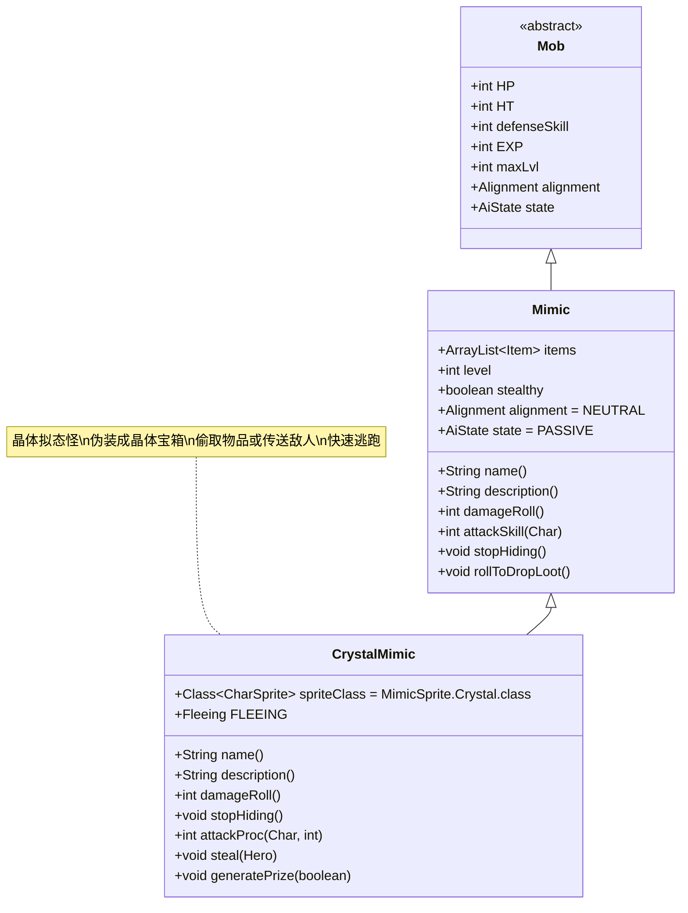

# CrystalMimic 类文档

## 1. 基本信息
| 属性 | 值 |
|------|-----|
| 文件路径 | core/src/main/java/com/shatteredpixel/shatteredpixeldungeon/actors/mobs/CrystalMimic.java |
| 包名 | com.shatteredpixel.shatteredpixeldungeon.actors.mobs |
| 类类型 | public class |
| 继承关系 | extends Mimic |
| 代码行数 | 206行 |

## 2. 类职责说明
CrystalMimic是Mimic的晶体变种，伪装成晶体宝箱。它在被发现或攻击时会立即显露真面目并进入逃跑状态。与普通Mimic不同，CrystalMimic不会造成额外伤害，而是会偷取玩家物品或传送敌人到随机位置。

## 4. 继承与协作关系


## 静态常量表
| 常量名 | 类型 | 值 | 说明 |
|--------|------|-----|------|
| (继承自Mimic) | | | |
| EXP | int | 0 | 击败后获得的经验值（无经验） |
| properties | ArrayList<Property> | DEMONIC | 恶魔属性 |

## 实例字段表
| 字段名 | 类型 | 修饰符 | 说明 |
|--------|------|--------|------|
| spriteClass | Class<? extends CharSprite> | - | 怪物精灵类（MimicSprite.Crystal） |
| items | ArrayList<Item> | inherited | 包含的物品列表 |
| FLEEING | Fleeing | - | 自定义逃跑AI状态 |

## 7. 方法详解

### name()
**签名**: `String name()`
**功能**: 获取名称，根据对齐状态返回不同名称
**参数**: 无
**返回值**: String - 名称
**实现逻辑**:
- 中立状态下返回"晶体宝箱"（Messages.get(Heap.class, "crystal_chest")）（第61-65行）
- 敌对状态下调用父类方法（第63行）

### description()
**签名**: `String description()`
**功能**: 获取描述，根据包含物品类型显示不同描述
**参数**: 无
**返回值**: String - 描述文本
**实现逻辑**:
1. 中立状态下检查物品类型：
   - Artifact（神器）：显示神器描述（第73-74行）
   - Ring（戒指）：显示戒指描述（第75-76行）
   - Wand（法杖）：显示法杖描述（第77-80行）
   - 其他：显示锁定宝箱描述（第84-85行）
2. 如果不是隐身模式，添加隐藏提示（第86-88行）
3. 敌对状态下调用父类方法（第91-92行）

### damageRoll()
**签名**: `int damageRoll()`
**功能**: 计算伤害范围（实际不造成额外伤害）
**参数**: 无
**返回值**: int - 伤害值
**实现逻辑**:
- 中立状态下临时切换为敌对状态计算伤害，然后恢复（第98-105行）
- 这确保了伤害计算的一致性，但实际战斗中主要通过偷窃和传送来影响战斗

### stopHiding()
**签名**: `void stopHiding()`
**功能**: 停止隐藏，显露真面目
**参数**: 无
**返回值**: void
**实现逻辑**:
1. 切换到FLEEING状态（第109行）
2. 设置精灵为空闲状态（第110行）
3. 根据对齐状态施加Haste效果：
   - 中立状态：2回合加速（第113行）
   - 敌对状态：1回合加速（第115行）
4. 如果玩家可见，显示揭示特效和消息（第117-123行）

### attackProc(Char enemy, int damage)
**签名**: `int attackProc(Char enemy, int damage)`
**功能**: 攻击处理，实现特殊战斗机制
**参数**:
- enemy: Char - 被攻击的敌人
- damage: int - 造成的伤害值
**返回值**: int - 处理后的伤害值
**实现逻辑**:
1. 中立状态且目标为英雄时，执行偷窃（第128-129行）
2. 其他情况：
   - 寻找周围可通行且空闲的位置（第132-137行）
   - 将敌人传送到随机位置（第140行）
   - 切换到FLEEING状态（第143行）
3. 调用父类attackProc方法（第145行）

### steal(Hero hero)
**签名**: `protected void steal(Hero hero)`
**功能**: 偷窃玩家物品
**参数**:
- hero: Hero - 被偷窃的英雄
**返回值**: void
**实现逻辑**:
1. 尝试10次寻找合适的物品（非唯一、未升级）（第150-154行）
2. 如果找到合适物品：
   - 显示偷窃消息（第158行）
   - 更新快捷栏（第159-162行）
   - 处理蜜罐特殊情况（第164-171行）
   - 将物品添加到自己的物品列表中（第168, 165行）

### generatePrize(boolean useDecks)
**签名**: `protected void generatePrize(boolean useDecks)`
**功能**: 生成奖励物品
**参数**:
- useDecks: boolean - 是否使用卡组生成
**返回值**: void
**实现逻辑**:
- 确保所有物品都不被诅咒（第179-182行）
- CrystalMimic已包含奖励物品，只需保证其未被诅咒

## 战斗行为
- **伪装机制**: 初始为中立状态，伪装成晶体宝箱
- **揭示触发**: 被攻击、交互或受到负面效果时显露真面目
- **逃跑AI**: 使用自定义的Fleeing状态，比普通Mimic更激进
- **偷窃能力**: 对英雄攻击时会偷取随机物品
- **传送能力**: 对其他敌人攻击时会将其传送到附近位置
- **加速效果**: 揭露后获得Haste效果，移动更快

## 掉落物品
- **主要掉落**: 原本包含的所有物品（通常包含神器、戒指或法杖）
- **特殊机制**: 所有物品都保证未被诅咒
- **掉落地点**: 死亡时在当前位置掉落所有物品

## 特殊属性
- **DEMONIC**: 继承自Mimic的恶魔属性
- **隐身机制**: 可能具有隐身特性（取决于MimicTooth配置）

## 11. 使用示例
```java
// CrystalMimic通常由游戏系统自动创建

// 偷窃和传送机制示例
@Override
public int attackProc(Char enemy, int damage) {
    if (alignment == Alignment.NEUTRAL && enemy == Dungeon.hero){
        steal(Dungeon.hero); // 偷取玩家物品
    } else {
        // 传送其他敌人到随机位置
        ArrayList<Integer> candidates = new ArrayList<>();
        for (int i : PathFinder.NEIGHBOURS8){
            if (Dungeon.level.passable[pos+i] && Actor.findChar(pos+i) == null){
                candidates.add(pos + i);
            }
        }
        if (!candidates.isEmpty()){
            ScrollOfTeleportation.appear(enemy, Random.element(candidates));
        }
        if (alignment == Alignment.ENEMY) state = FLEEING;
    }
    return super.attackProc(enemy, damage);
}
```

## 注意事项
1. CrystalMimic的主要威胁在于偷窃物品而非直接伤害
2. 与其他Mimic不同，它更倾向于逃跑而非战斗
3. 传送能力使其在群体战斗中具有战术价值
4. 所有掉落物品都保证未被诅咒，是安全的获取途径
5. 在隐身模式下更难被发现，增加了游戏难度

## 最佳实践
1. 玩家应谨慎与晶体宝箱交互，准备应对可能的偷窃
2. 利用远程攻击在安全距离揭露其真面目
3. 优先击杀以防止其逃跑并保留珍贵物品
4. 在设计关卡时，CrystalMimic作为高价值奖励的风险机制
5. 考虑与其他晶体主题元素配合，形成完整的区域设计