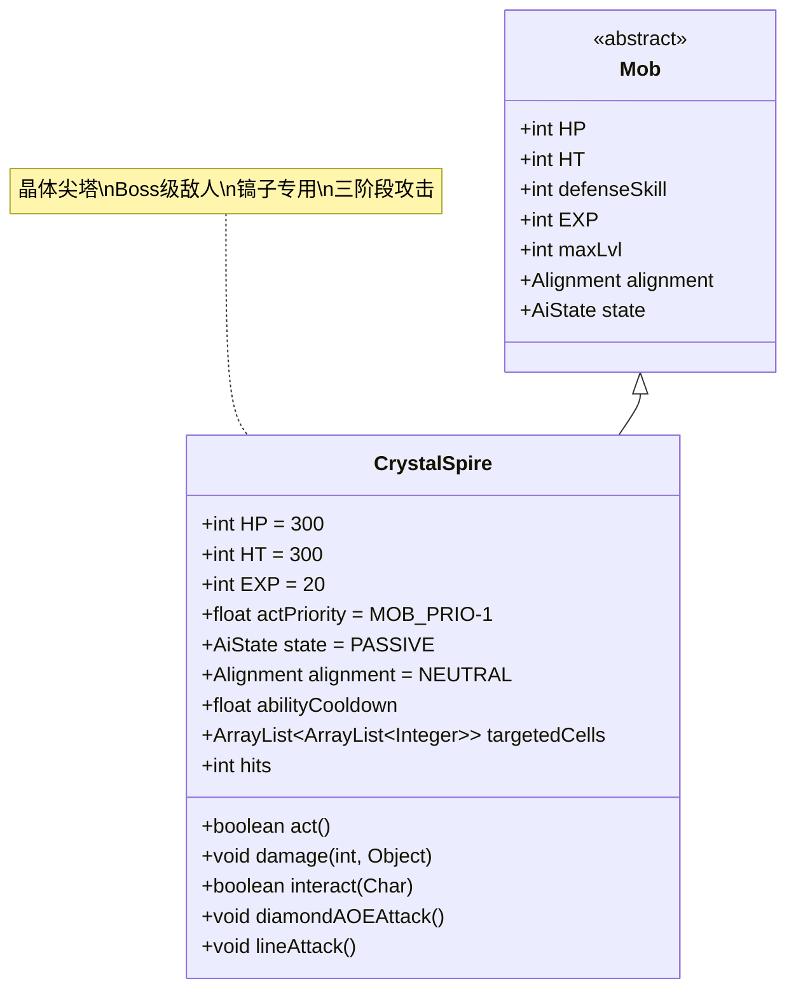

# CrystalSpire 类文档

## 1. 基本信息
| 属性 | 值 |
|------|-----|
| 文件路径 | core/src/main/java/com/shatteredpixel/shatteredpixeldungeon/actors/mobs/CrystalSpire.java |
| 包名 | com.shatteredpixel.shatteredpixeldungeon.actors.mobs |
| 类类型 | public class |
| 继承关系 | extends Mob |
| 代码行数 | 523行 |

## 2. 类职责说明
CrystalSpire是晶体矿脉区域的Boss级敌人，具有复杂的阶段战斗机制。它只能被镐子（Pickaxe）攻击，会召唤晶体并攻击周围的敌人。随着生命值降低，攻击范围和强度会逐步增强。CrystalSpire有三种颜色变体（蓝、绿、红）。

## 4. 继承与协作关系


## 静态常量表
| 常量名 | 类型 | 值 | 说明 |
|--------|------|-----|------|
| HP/HT | int | 300 | 生命值上限 |
| EXP | int | 20 | 击败后获得的经验值 |
| actPriority | float | MOB_PRIO-1 | 行动优先级（晚于其他怪物） |
| ABILITY_CD | int | 15 | 特殊能力冷却时间 |
| properties | ArrayList<Property> | IMMOVABLE, BOSS, INORGANIC, STATIC | 特殊属性标记 |

## 实例字段表
| 字段名 | 类型 | 修饰符 | 说明 |
|--------|------|--------|------|
| spriteClass | Class<? extends CharSprite> | - | 怪物精灵类（三种颜色变体） |
| abilityCooldown | float | private | 特殊能力冷却计时器 |
| targetedCells | ArrayList<ArrayList<Integer>> | private | 攻击目标格子列表 |
| hits | int | private | 被镐子攻击次数 |

## 7. 方法详解

### act()
**签名**: `protected boolean act()`
**功能**: 核心行动逻辑，处理攻击和阶段转换
**参数**: 无
**返回值**: boolean - 是否完成行动
**实现逻辑**:
1. 更新视野和状态（第89-104行）
2. 处理已标记的攻击格子：
   - 在格子上生成晶体（第117-121行）
   - 对格子中的角色造成伤害（第127-136行）
   - 推开受影响的角色（第138-161行）
3. 根据攻击次数和可见性决定行为：
   - 少于3次攻击或不可见：等待（第180-182行）
   - 3次以上且可见：执行特殊攻击（第185-206行）

### diamondAOEAttack()
**签名**: `private void diamondAOEAttack()`
**功能**: 执行菱形范围攻击
**参数**: 无
**返回值**: void
**实现逻辑**:
1. 以英雄位置为中心，进行菱形扩展（第216-220行）
2. 根据生命值阶段增加攻击范围：
   - >2/3生命值：基础范围
   - ≤2/3生命值：第二层扩展（第221-223行）
   - ≤1/3生命值：第三层扩展（第224-226行）

### lineAttack()
**签名**: `private void lineAttack()`
**功能**: 执行直线范围攻击
**参数**: 无
**返回值**: void
**实现逻辑**:
1. 向英雄方向发射直线攻击，最长7格（第247-255行）
2. 根据生命值阶段在直线周围进行菱形扩展（第259-264行）
3. 同样遵循三阶段范围扩展机制

### damage(int dmg, Object src)
**签名**: `public void damage(int dmg, Object src)`
**功能**: 伤害处理，只接受镐子造成的伤害
**参数**:
- dmg: int - 伤害值
- src: Object - 伤害来源
**返回值**: void
**实现逻辑**:
- 只有镐子（Pickaxe）能造成伤害，其他来源伤害为0（第293-296行）

### interact(Char c)
**签名**: `public boolean interact(Char c)`
**功能**: 交互处理，实现镐子攻击机制
**参数**:
- c: Char - 交互角色
**返回值**: boolean - 是否成功交互
**实现逻辑**:
1. 检查是否持有镐子（第314-319行）
2. 执行特殊攻击动画和伤害计算（第320-344行）
3. 根据攻击次数触发不同阶段：
   - 第1次：警告消息（第376-380行）
   - 第3次：激活Boss战（第381-389行）
   - 3次以上：激活水晶守卫和幽魂（第391-442行）

### spreadDiamondAOE(ArrayList<Integer> currentCells)
**签名**: `private ArrayList<Integer> spreadDiamondAOE(ArrayList<Integer> currentCells)`
**功能**: 菱形范围扩展
**参数**:
- currentCells: ArrayList<Integer> - 当前格子列表
**返回值**: ArrayList<Integer> - 扩展后的格子列表
**实现逻辑**:
- 在当前格子的四个方向（上下左右）进行扩展（第234-239行）

## 战斗行为
- **阶段系统**: 
  - 阶段0（0-2次攻击）：被动状态，不攻击
  - 阶段1（3+次攻击）：激活Boss战，开始攻击
  - 阶段2（≤2/3生命值）：攻击范围扩大
  - 阶段3（≤1/3生命值）：攻击范围进一步扩大
- **攻击模式**: 随机选择菱形AOE或直线攻击
- **晶体生成**: 在攻击格子上生成MINE_CRYSTAL地形
- **推击效果**: 将受影响的角色推开到安全位置
- **Boss协调**: 激活并控制周围的CrystalGuardian和CrystalWisp

## 掉落物品
- **主要掉落**: 无固定掉落（通过任务系统奖励）
- **特殊机制**: 击败后会清除所有晶体，并对周围敌人造成影响

## 特殊属性
- **IMMOVABLE**: 不可移动
- **BOSS**: Boss标记
- **INORGANIC**: 无机物属性
- **STATIC**: 静态实体
- **免疫效果**: 免疫所有Buff/Debuff，包括失明

## 11. 使用示例
```java
// CrystalSpire通常由任务系统生成

// 三阶段攻击机制示例
private void diamondAOEAttack(){
    targetedCells.clear();
    ArrayList<Integer> aoeCells = new ArrayList<>();
    aoeCells.add(Dungeon.hero.pos);
    aoeCells.addAll(spreadDiamondAOE(aoeCells));
    targetedCells.add(new ArrayList<>(aoeCells));
    
    // 根据生命值扩展攻击范围
    if (HP < 2*HT/3f){
        aoeCells.addAll(spreadDiamondAOE(aoeCells));
        targetedCells.add(new ArrayList<>(aoeCells));
        if (HP < HT/3f) {
            aoeCells.addAll(spreadDiamondAOE(aoeCells));
            targetedCells.add(aoeCells);
        }
    }
}

// 镐子专用伤害机制
@Override
public void damage(int dmg, Object src) {
    if (!(src instanceof Pickaxe)){
        dmg = 0; // 只接受镐子伤害
    }
    super.damage(dmg, src);
}
```

## 注意事项
1. CrystalSpire只能被镐子（Pickaxe）攻击，其他武器完全无效
2. 攻击3次后才会真正激活Boss战
3. 生命值越低，攻击范围越大，难度越高
4. 击败后会自动清理所有晶体地形
5. 会对周围的CrystalGuardian和CrystalWisp产生连锁影响

## 最佳实践
1. 玩家必须先完成黑smith任务获得镐子才能挑战
2. 准备足够的治疗和位移手段来应对大范围攻击
3. 利用障碍物阻挡直线攻击轨迹
4. 优先清理被激活的CrystalGuardian以减少压力
5. 在设计关卡时，CrystalSpire作为晶体矿脉的最终Boss