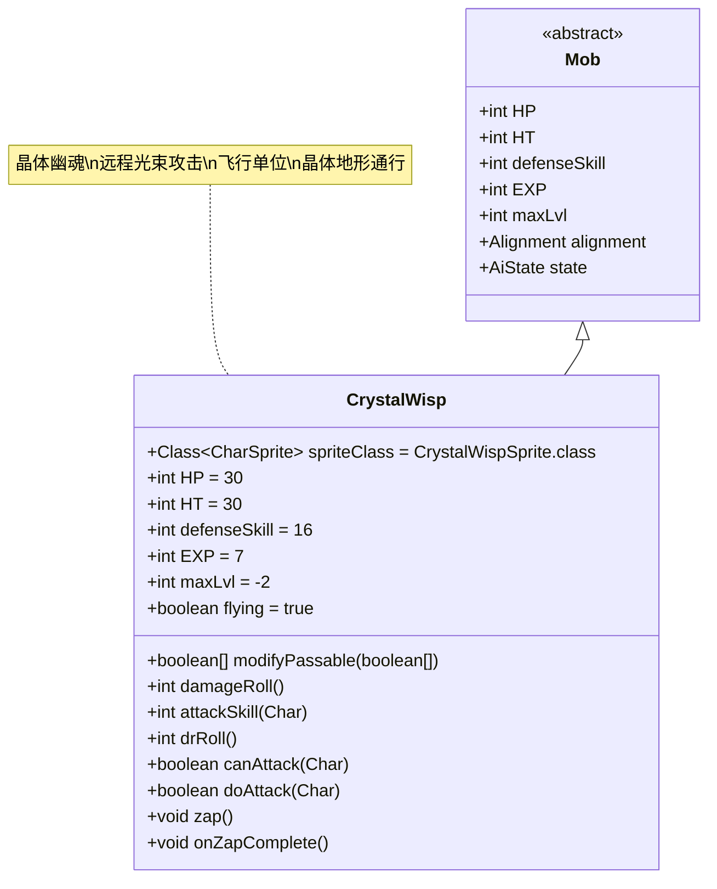

# CrystalWisp 类文档

## 1. 基本信息
| 属性 | 值 |
|------|-----|
| 文件路径 | core/src/main/java/com/shatteredpixel/shatteredpixeldungeon/actors/mobs/CrystalWisp.java |
| 包名 | com.shatteredpixel.shatteredpixeldungeon.actors.mobs |
| 类类型 | public class |
| 继承关系 | extends Mob |
| 代码行数 | 163行 |

## 2. 类职责说明
CrystalWisp是晶体矿脉区域的飞行敌人，具有远程光束攻击能力。它可以在晶体地形上自由移动，并对远处的敌人发射魔法光束。CrystalWisp有三种颜色变体（蓝、绿、红），是晶体区域的重要辅助敌人。

## 4. 继承与协作关系


## 静态常量表
| 常量名 | 类型 | 值 | 说明 |
|--------|------|-----|------|
| HP/HT | int | 30 | 生命值上限 |
| defenseSkill | int | 16 | 防御技能等级 |
| EXP | int | 7 | 击败后获得的经验值 |
| maxLvl | int | -2 | 最大生成等级（负值表示特殊生成） |
| flying | boolean | true | 飞行能力 |
| properties | ArrayList<Property> | INORGANIC | 无机物属性 |

## 实例字段表
| 字段名 | 类型 | 修饰符 | 说明 |
|--------|------|--------|------|
| spriteClass | Class<? extends CharSprite> | - | 怪物精灵类（三种颜色变体） |

## 7. 方法详解

### modifyPassable(boolean[] passable)
**签名**: `boolean[] modifyPassable(boolean[] passable)`
**功能**: 修改可通行性，允许在晶体地形上移动
**参数**:
- passable: boolean[] - 可通行数组
**返回值**: boolean[] - 修改后的可通行数组
**实现逻辑**:
- 将所有MINE_CRYSTAL地形标记为可通行（第70-73行）

### damageRoll()
**签名**: `int damageRoll()`
**功能**: 计算伤害范围
**参数**: 无
**返回值**: int - 伤害值
**实现逻辑**:
- 返回5-10之间的随机伤害值（第78行）

### attackSkill(Char target)
**签名**: `int attackSkill(Char target)`
**功能**: 计算攻击技能等级
**参数**:
- target: Char - 目标
**返回值**: int - 攻击技能等级
**实现逻辑**:
- 固定返回18（第83行）

### drRoll()
**签名**: `int drRoll()`
**功能**: 计算伤害减免值
**参数**: 无
**返回值**: int - 伤害减免值
**实现逻辑**:
- 在基础伤害减免基础上增加0-5点（第88-89行）

### canAttack(Char enemy)
**签名**: `protected boolean canAttack(Char enemy)`
**功能**: 检查是否能攻击目标
**参数**:
- enemy: Char - 敌人
**返回值**: boolean - 是否能攻击
**实现逻辑**:
- 支持魔法光束攻击，可以攻击视线内的任何目标（第93-94行）

### doAttack(Char enemy)
**签名**: `protected boolean doAttack(Char enemy)`
**功能**: 执行攻击，根据距离选择近战或远程
**参数**:
- enemy: Char - 被攻击的敌人
**返回值**: boolean - 是否完成攻击
**实现逻辑**:
1. 如果相邻或无法直线攻击，执行近战攻击（第99-102行）
2. 否则执行远程光束攻击：
   - 显示zap动画（第107行）
   - 返回false表示需要完成动画（第108行）

### zap()
**签名**: `private void zap()`
**功能**: 执行光束攻击的核心逻辑
**参数**: 无
**返回值**: void
**实现逻辑**:
1. 花费1回合时间（第126行）
2. 解除隐身状态（第128行）
3. 检查命中：
   - 命中：造成5-10点LightBeam伤害（第132-133行）
   - 未命中：显示防御消息（第141行）
4. 英雄死亡时触发特殊失败条件（第135-139行）

### onZapComplete()
**签名**: `public void onZapComplete()`
**功能**: 光束攻击完成回调
**参数**: 无
**返回值**: void
**实现逻辑**:
- 调用zap()执行实际伤害（第146行）
- 调用next()继续行动（第147行）

### die(Object cause)
**签名**: `void die(Object cause)`
**功能**: 死亡处理
**参数**:
- cause: Object - 死亡原因
**返回值**: void
**实现逻辑**:
1. 关闭飞行状态（第118行）
2. 调用父类die方法（第119行）

## 战斗行为
- **远程攻击**: 可以对视线内任何位置的敌人发射魔法光束
- **飞行能力**: 可以跨越地形障碍，移动灵活
- **晶体通行**: 可以在MINE_CRYSTAL地形上自由移动
- **AI行为**: 标准的敌对AI，会主动追击玩家
- **伤害类型**: 光束攻击使用特殊的LightBeam类型，可被特定抗性抵抗

## 掉落物品
- **主要掉落**: 无固定掉落（遵循常规掉落机制）
- **特殊机制**: 由于EXP为7，击败后提供适中的经验值

## 特殊属性
- **INORGANIC**: 无机物属性
- **Flying**: 飞行能力
- **LightBeam**: 特殊的魔法攻击类型

## 11. 使用示例
```java
// CrystalWisp通常由游戏系统自动创建

// 远程光束攻击的实现
@Override
protected boolean doAttack(Char enemy) {
    if (Dungeon.level.adjacent(pos, enemy.pos) || 
        new Ballistica(pos, enemy.pos, Ballistica.MAGIC_BOLT).collisionPos != enemy.pos) {
        return super.doAttack(enemy); // 近战攻击
    } else {
        if (sprite != null && (sprite.visible || enemy.sprite.visible)) {
            sprite.zap(enemy.pos); // 显示光束动画
            return false; // 等待动画完成
        } else {
            zap(); // 直接执行伤害
            return true;
        }
    }
}

// 光束伤害的特殊处理
private void zap() {
    // ...
    enemy.damage(dmg, new LightBeam()); // 使用特殊伤害类型
    // ...
}
```

## 注意事项
1. CrystalWisp的远程攻击不受距离限制，只要在视线内即可
2. LightBeam伤害类型可以被特定的抗性或Buff抵抗
3. 在晶体地形上移动时不会受到阻碍
4. 飞行状态下不受地面陷阱影响
5. 死亡时会触发Badges.validateDeathFromEnemyMagic()特殊徽章检查

## 最佳实践
1. 玩家应优先使用远程武器或法术来安全击败CrystalWisp
2. 利用地形障碍阻挡其视线以避免远程攻击
3. 准备针对魔法攻击的防御手段（如抗性装备）
4. 在设计关卡时，CrystalWisp作为晶体区域的空中威胁
5. 与其他晶体相关怪物配合，形成多层次的战斗体验