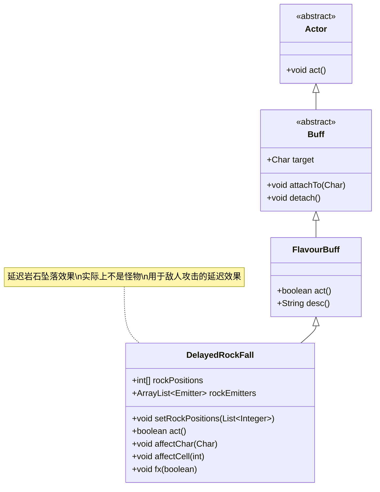

# DelayedRockFall 类文档

## 1. 基本信息
| 属性 | 值 |
|------|-----|
| 文件路径 | core/src/main/java/com/shatteredpixel/shatteredpixeldungeon/actors/mobs/DelayedRockFall.java |
| 包名 | com.shatteredpixel.shatteredpixeldungeon.actors.mobs |
| 类类型 | public class |
| 继承关系 | extends FlavourBuff (实际为Buff类，非Mob类) |
| 代码行数 | 114行 |

## 2. 类职责说明
DelayedRockFall实际上不是怪物（Mob），而是一个特殊的效果缓冲（Buff）。它用于处理延迟的岩石坠落效果，在指定回合数后在预设位置触发岩石坠落。这个类被各种敌人攻击所使用，用来跟踪将在若干回合后坠落的岩石。

## 4. 继承与协作关系


## 静态常量表
| 常量名 | 类型 | 值 | 说明 |
|--------|------|-----|------|
| (无静态常量) | | | 此类主要通过实例字段和方法实现功能 |

## 实例字段表
| 字段名 | 类型 | 修饰符 | 说明 |
|--------|------|--------|------|
| rockPositions | int[] | private | 岩石坠落的位置数组 |
| rockEmitters | ArrayList<Emitter> | private | 岩石粒子发射器列表 |

## 7. 方法详解

### setRockPositions(List<Integer> rockPositions)
**签名**: `public void setRockPositions(List<Integer> rockPositions)`
**功能**: 设置岩石坠落的位置
**参数**:
- rockPositions: List<Integer> - 岩石位置列表
**返回值**: void
**实现逻辑**:
1. 将位置列表转换为整数数组（第48-50行）
2. 调用fx(true)显示视觉效果（第52行）

### act()
**签名**: `public boolean act()`
**功能**: 执行岩石坠落效果的核心逻辑
**参数**: 无
**返回值**: boolean - 是否继续执行
**实现逻辑**:
1. 遍历所有岩石位置（第57行）
2. 在每个位置显示岩石粒子效果（第58行）
3. 检查位置是否有角色：
   - 有角色：调用affectChar()处理角色（第62行）
   - 无角色：调用affectCell()处理格子（第64行）
4. 触发屏幕震动和音效（第68-69行）
5. 从目标上分离此Buff（第71行）

### affectChar(Char ch)
**签名**: `public void affectChar(Char ch)`
**功能**: 处理岩石对角色的影响
**参数**:
- ch: Char - 受影响的角色
**返回值**: void
**实现逻辑**:
- 默认为空实现，由子类重写（第76-77行）

### affectCell(int cell)
**签名**: `public void affectCell(int cell)`
**功能**: 处理岩石对格子的影响
**参数**:
- cell: int - 受影响的格子位置
**返回值**: void
**实现逻辑**:
- 默认为空实现，由子类重写（第80-81行）

### fx(boolean on)
**签名**: `public void fx(boolean on)`
**功能**: 控制岩石视觉效果的显示和隐藏
**参数**:
- on: boolean - 是否显示效果
**返回值**: void
**实现逻辑**:
1. 如果开启效果且位置存在：
   - 为每个位置创建EarthParticle发射器（第87-91行）
2. 如果关闭效果：
   - 关闭所有发射器（第94-96行）

## 使用行为
- **延迟触发**: 在创建时设置持续时间，到期后自动触发岩石坠落
- **多位置支持**: 可以同时处理多个位置的岩石坠落
- **视觉反馈**: 提供岩石粒子效果和屏幕震动反馈
- **可扩展性**: 通过重写affectChar和affectCell方法来自定义效果

## 特殊属性
- **非战斗实体**: 不是真正的怪物，没有AI、攻击或防御能力
- **时间控制**: 继承FlavourBuff的时间控制机制
- **视觉效果**: 内置岩石粒子和震动效果

## 11. 使用示例
```java
// DelayedRockFall通常由其他敌人攻击创建

// 创建延迟岩石效果
DelayedRockFall rockFall = new DelayedRockFall();
List<Integer> positions = Arrays.asList(pos1, pos2, pos3);
rockFall.setRockPositions(positions);
rockFall.attachTo(target); // 附加到目标（通常是地面或角色）
rockFall.set(3); // 3回合后触发

// 自定义岩石对角色的影响（在子类中）
@Override
public void affectChar(Char ch) {
    // 对角色造成伤害
    ch.damage(damageAmount, this);
    // 应用额外效果如眩晕
    Buff.affect(ch, Vertigo.class, 2f);
}
```

## 注意事项
1. DelayedRockFall实际上不是Mob类，而是Buff类
2. 必须通过set()方法设置持续时间才能正常工作
3. 视觉效果会自动管理，在Buff分离时自动清理
4. 默认情况下对角色和格子没有实际影响，需要子类重写相关方法
5. 主要用于实现敌人的延迟区域攻击效果

## 最佳实践
1. 在实现敌人延迟攻击时，创建DelayeRockFall的子类并重写affectChar/affectCell
2. 合理设置持续时间，避免过长或过短影响游戏体验
3. 考虑与其他地形效果结合，如改变地形类型或触发连锁反应
4. 在设计关卡机制时，可用于创建定时陷阱或环境危害
5. 注意性能开销，避免同时创建过多DelayedRockFall实例