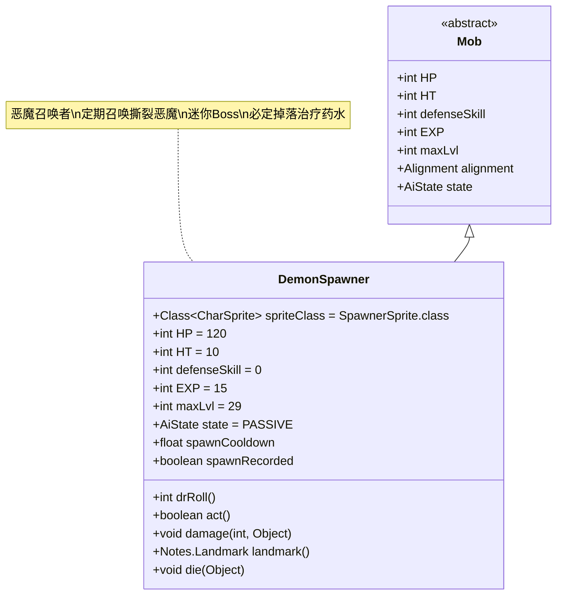

# DemonSpawner 类文档

## 1. 基本信息
| 属性 | 值 |
|------|-----|
| 文件路径 | core/src/main/java/com/shatteredpixel/shatteredpixeldungeon/actors/mobs/DemonSpawner.java |
| 包名 | com.shatteredpixel.shatteredpixeldungeon.actors.mobs |
| 类类型 | public class |
| 继承关系 | extends Mob |
| 代码行数 | 176行 |

## 2. 类职责说明
DemonSpawner是恶魔区域的迷你Boss级召唤者，会定期召唤RipperDemon（撕裂恶魔）。它具有高生命值和伤害减免，但防御技能为0。DemonSpawner必定掉落治疗药水，并在游戏中作为重要的地标标记。

## 4. 继承与协作关系


## 静态常量表
| 常量名 | 类型 | 值 | 说明 |
|--------|------|-----|------|
| HP/HT | int | 120 | 生命值上限 |
| defenseSkill | int | 0 | 防御技能等级（无防御能力） |
| EXP | int | 15 | 击败后获得的经验值 |
| maxLvl | int | 29 | 最大生成等级 |
| loot | Class<? extends Item> | PotionOfHealing.class | 掉落物品类型 |
| lootChance | float | 1.0f | 掉落概率（100%） |
| properties | ArrayList<Property> | IMMOVABLE, MINIBOSS, DEMONIC, STATIC | 特殊属性标记 |

## 实例字段表
| 字段名 | 类型 | 修饰符 | 说明 |
|--------|------|--------|------|
| spriteClass | Class<? extends CharSprite> | - | 怪物精灵类（SpawnerSprite） |
| spawnCooldown | float | private | 召唤冷却计时器 |
| spawnRecorded | boolean | public | 是否已记录召唤者存在（兼容性字段） |

## 7. 方法详解

### drRoll()
**签名**: `int drRoll()`
**功能**: 计算伤害减免值
**参数**: 无
**返回值**: int - 伤害减免值
**实现逻辑**:
- 在基础伤害减免基础上增加0-12点（第65-66行）

### act()
**签名**: `protected boolean act()`
**功能**: 核心行动逻辑，处理召唤机制
**参数**: 无
**返回值**: boolean - 是否完成行动
**实现逻辑**:
1. 首次激活时记录统计信息（第85-88行）
2. 处理升天挑战的冷却时间限制（第90-92行）
3. 冷却时间递减（第94行）
4. 当冷却时间≤0时执行召唤：
   - 寻找周围可通行且空闲的位置（第102-107行）
   - 创建RipperDemon实例并设置位置（第110-116行）
   - 添加视觉推送效果（第119行）
   - 重置召唤冷却时间（第122-126行）
5. 调用父类act方法（第130行）

### damage(int dmg, Object src)
**签名**: `public void damage(int dmg, Object src)`
**功能**: 伤害处理，具有特殊的伤害递减机制
**参数**:
- dmg: int - 伤害值
- src: Object - 伤害来源
**返回值**: void
**实现逻辑**:
1. 如果伤害≥20，应用递减公式（第135-139行）
2. 伤害值同时减少召唤冷却时间（第140行）
3. 调用父类damage方法（第141行）

### landmark()
**签名**: `public Notes.Landmark landmark()`
**功能**: 获取地标标记
**参数**: 无
**返回值**: Notes.Landmark - 地标枚举值
**实现逻辑**:
- 返回DEMON_SPAWNER地标（第146行）

### die(Object cause)
**签名**: `public void die(Object cause)`
**功能**: 死亡处理，更新统计和日志
**参数**:
- cause: Object - 死亡原因
**返回值**: void
**实现逻辑**:
1. 更新存活召唤者统计（第151-153行）
2. 移除地图地标标记（第153行）
3. 显示死亡消息（第155行）
4. 调用父类die方法（第156行）

### beckon(int cell)
**签名**: `void beckon(int cell)`
**功能**: 呼叫处理
**参数**:
- cell: int - 目标格子
**返回值**: void
**实现逻辑**:
- 无操作（不可移动实体）（第70-71行）

### reset()
**签名**: `boolean reset()`
**功能**: 重置状态
**参数**: 无
**返回值**: boolean - 是否重置成功
**实现逻辑**:
- 返回true（第75行）

## 战斗行为
- **被动状态**: 初始为PASSIVE状态，不会主动攻击
- **召唤机制**: 每60回合（基础）召唤一个RipperDemon
- **伤害递减**: 高伤害会受到递减效果（20+伤害递减）
- **冷却干扰**: 受到伤害会减少召唤冷却时间
- **AI行为**: 不会移动或攻击，专注于召唤功能

## 掉落物品
- **主要掉落**: 治疗药水（PotionOfHealing）
- **掉落概率**: 100%（必定掉落）
- **掉落数量**: 1个

## 特殊属性
- **IMMOVABLE**: 不可移动
- **MINIBOSS**: 迷你Boss标记  
- **DEMONIC**: 恶魔属性
- **STATIC**: 静态实体
- **Landmark**: 作为游戏中的重要地标

## 11. 使用示例
```java
// DemonSpawner通常由游戏系统自动生成

// 召唤机制的核心逻辑
@Override
protected boolean act() {
    // ...
    if (spawnCooldown <= 0){
        ArrayList<Integer> candidates = new ArrayList<>();
        for (int n : PathFinder.NEIGHBOURS8) {
            if (Dungeon.level.passable[pos+n] && Actor.findChar(pos+n) == null) {
                candidates.add(pos+n);
            }
        }
        if (!candidates.isEmpty()) {
            RipperDemon spawn = new RipperDemon();
            spawn.pos = Random.element(candidates);
            spawn.state = spawn.HUNTING;
            GameScene.add(spawn, 1);
            // ...
            spawnCooldown += 60; // 重置冷却
        }
    }
    return super.act();
}

// 伤害递减机制
@Override
public void damage(int dmg, Object src) {
    if (dmg >= 20){
        // 应用平方根递减公式
        dmg = 19 + (int)(Math.sqrt(8*(dmg - 19) + 1) - 1)/2;
    }
    spawnCooldown -= dmg; // 伤害减少冷却时间
    super.damage(dmg, src);
}
```

## 注意事项
1. DemonSpawner的防御技能为0，但有高额伤害减免
2. 召唤冷却时间会随地下城深度减少（21层以上）
3. 升天挑战模式下最大冷却时间为20回合
4. 高爆发伤害会被显著削弱，鼓励持续输出
5. 作为地标会在地图上显示特殊标记

## 最佳实践
1. 玩家应优先清理召唤出的RipperDemon以减少压力
2. 利用持续伤害（如中毒、燃烧）来稳定输出
3. 准备足够的位移手段来躲避被召唤的敌人
4. 在设计关卡时，DemonSpawner作为区域控制点使用
5. 考虑与其他恶魔敌人配合，形成完整的恶魔主题区域