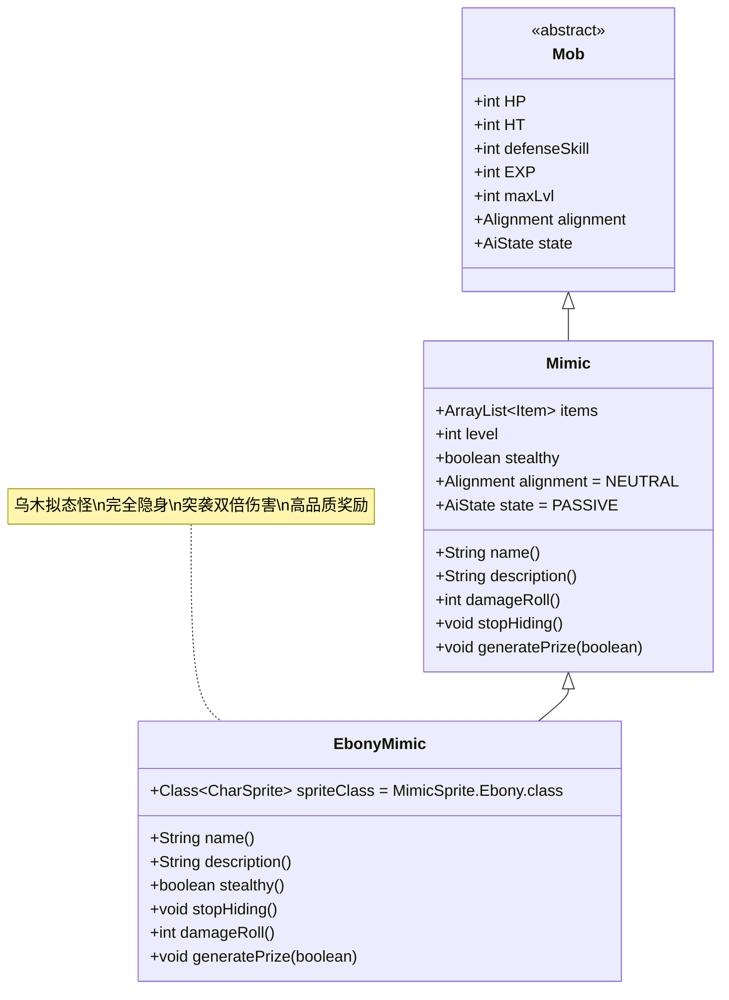

# EbonyMimic 类文档

## 1. 基本信息
| 属性 | 值 |
|------|-----|
| 文件路径 | core/src/main/java/com/shatteredpixel/shatteredpixeldungeon/actors/mobs/EbonyMimic.java |
| 包名 | com.shatteredpixel.shatteredpixeldungeon.actors.mobs |
| 类类型 | public class |
| 继承关系 | extends Mimic |
| 代码行数 | 121行 |

## 2. 类职责说明
EbonyMimic是Mimic的乌木变种，具有完全隐身的能力和更高的突袭伤害。它伪装成宝箱时更加难以被发现，并且在首次攻击时会造成双倍伤害。EbonyMimic提供额外的奖励物品，并保证所有掉落物品都是未被诅咒且至少+1级别的。

## 4. 继承与协作关系


## 静态常量表
| 常量名 | 类型 | 值 | 说明 |
|--------|------|-----|------|
| (继承自Mimic) | | | |
| EXP | int | 0 | 击败后获得的经验值（无经验） |
| properties | ArrayList<Property> | DEMONIC | 恶魔属性 |

## 实例字段表
| 字段名 | 类型 | 修饰符 | 说明 |
|--------|------|--------|------|
| spriteClass | Class<? extends CharSprite> | - | 怪物精灵类（MimicSprite.Ebony） |

## 7. 方法详解

### name()
**签名**: `String name()`
**功能**: 获取名称，根据对齐状态返回不同名称
**参数**: 无
**返回值**: String - 名称
**实现逻辑**:
- 中立状态下返回隐藏名称（Messages.get(this, "hidden_name")）（第53行）
- 敌对状态下调用父类方法（第55行）

### description()
**签名**: `String description()`
**功能**: 获取描述，总是显示隐藏描述
**参数**: 无
**返回值**: String - 描述文本
**实现逻辑**:
- 中立状态下返回隐藏描述（Messages.get(this, "hidden_desc")）（第62行）
- 敌对状态下调用父类方法（第64行）

### stealthy()
**签名**: `boolean stealthy()`
**功能**: 检查是否具有隐身特性
**参数**: 无
**返回值**: boolean - 是否隐身
**实现逻辑**:
- 始终返回true，表示完全隐身（第70行）

### stopHiding()
**签名**: `void stopHiding()`
**功能**: 停止隐藏，显露真面目并处理门机制
**参数**: 无
**返回值**: void
**实现逻辑**:
1. 切换到HUNTING状态（第74行）
2. 设置精灵为空闲状态（第75行）
3. 如果玩家可见，显示揭示特效和消息（第76-82行）
4. 如果位于门位置，触发门开启效果（第83-85行）

### damageRoll()
**签名**: `int damageRoll()`
**功能**: 计算伤害范围，突袭时造成双倍伤害
**参数**: 无
**返回值**: int - 伤害值
**实现逻辑**:
- 中立状态下（突袭）：返回父类伤害的2倍（第91行）
- 敌对状态下：返回正常伤害（第93行）

### generatePrize(boolean useDecks)
**签名**: `protected void generatePrize(boolean useDecks)`
**功能**: 生成高品质奖励物品
**参数**:
- useDecks: boolean - 是否使用卡组生成
**返回值**: void
**实现逻辑**:
1. 调用父类方法生成基础奖励（第99行）
2. 添加一个额外的随机物品（第101行）
3. 确保所有物品都满足高质量标准：
   - 未被诅咒且已知状态（第106-107行）
   - 移除诅咒附魔/符文（第108-113行）
   - 至少+1级别（第114-116行）

## 战斗行为
- **完全隐身**: 比普通Mimic更难被发现，没有视觉提示
- **突袭伤害**: 首次攻击造成双倍伤害，极具威胁性
- **门互动**: 如果位于门位置，揭露时会自动开门
- **AI行为**: 揭露后直接进入狩猎状态，积极追击玩家
- **高价值奖励**: 提供额外且高品质的物品奖励

## 掉落物品
- **主要掉落**: 多个高品质物品（包括额外奖励）
- **物品品质**: 所有装备类物品保证未被诅咒且至少+1
- **物品类型**: 包含武器、护甲、神器、法杖等随机物品
- **特殊机制**: 即使没有MimicTooth也会提供额外奖励

## 特殊属性
- **DEMONIC**: 继承自Mimic的恶魔属性
- **完全隐身**: stealthy()始终返回true
- **高品质保证**: 所有掉落物品都有质量保证

## 11. 使用示例
```java
// EbonyMimic通常由游戏系统自动创建

// 突袭双倍伤害机制
@Override
public int damageRoll() {
    if (alignment == Alignment.NEUTRAL){
        return Math.round(super.damageRoll()*2f); // 突袭时双倍伤害
    } else {
        return super.damageRoll();
    }
}

// 高品质奖励生成
@Override
protected void generatePrize(boolean useDecks) {
    super.generatePrize(useDecks);
    // 添加额外奖励
    items.add(Generator.randomUsingDefaults());
    
    // 确保所有物品高品质
    for (Item i : items){
        if (i instanceof EquipableItem || i instanceof Wand){
            i.cursed = false;
            i.cursedKnown = true;
            // 移除诅咒附魔/符文
            if (i instanceof Weapon && ((Weapon) i).hasCurseEnchant()){
                ((Weapon) i).enchant(null);
            }
            if (i instanceof Armor && ((Armor) i).hasCurseGlyph()){
                ((Armor) i).inscribe(null);
            }
            // 确保至少+1
            if (!(i instanceof Artifact) && i.level() == 0){
                i.upgrade();
            }
        }
    }
}
```

## 注意事项
1. EbonyMimic完全没有视觉提示，极难被发现
2. 突袭伤害非常危险，可能一击造成大量伤害
3. 所有掉落物品都是高品质的，是获取优质装备的重要来源
4. 位于门位置时会自动开门，可能影响关卡布局
5. 即使没有MimicTooth道具也能获得额外奖励

## 最佳实践
1. 玩家应格外谨慎对待所有宝箱，特别是在关键位置
2. 准备足够的防御手段来应对突袭伤害
3. 利用远程探测或特殊能力来识别隐藏的EbonyMimic
4. 在设计关卡时，EbonyMimic作为高风险高回报的挑战
5. 考虑与其他Mimic变体配合，形成多样化的拟态威胁