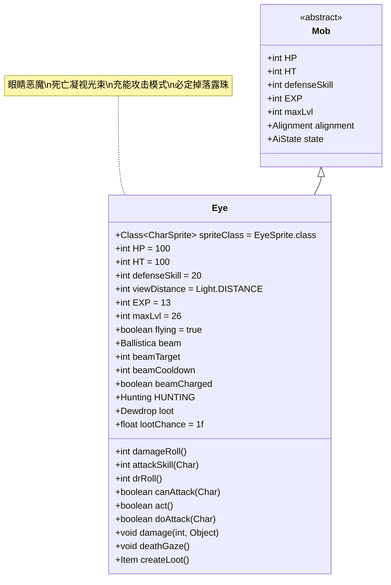

# Eye 类文档

## 1. 基本信息
| 属性 | 值 |
|------|-----|
| 文件路径 | core/src/main/java/com/shatteredpixel/shatteredpixeldungeon/actors/mobs/Eye.java |
| 包名 | com.shatteredpixel.shatteredpixeldungeon.actors.mobs |
| 类类型 | public class |
| 继承关系 | extends Mob |
| 代码行数 | 297行 |

## 2. 类职责说明
Eye是一种具有死亡凝视能力的飞行恶魔，能够发射强力的魔法光束攻击。它采用充能-释放的攻击模式：先进行充能（花费双倍攻击时间），然后释放死亡凝视光束，对直线路径上的所有目标造成高额伤害。Eye必定掉落露珠，并有概率掉落种子或石头。

## 4. 继承与协作关系


## 静态常量表
| 常量名 | 类型 | 值 | 说明 |
|--------|------|-----|------|
| HP/HT | int | 100 | 生命值上限 |
| defenseSkill | int | 20 | 防御技能等级 |
| viewDistance | int | Light.DISTANCE | 视野距离 |
| EXP | int | 13 | 击败后获得的经验值 |
| maxLvl | int | 26 | 最大生成等级 |
| flying | boolean | true | 飞行能力 |
| loot | Dewdrop | new Dewdrop() | 掉落物品基础类型 |
| lootChance | float | 1.0f | 基础掉落概率 |

## 实例字段表
| 字段名 | 类型 | 修饰符 | 说明 |
|--------|------|--------|------|
| spriteClass | Class<? extends CharSprite> | - | 怪物精灵类（EyeSprite） |
| beam | Ballistica | private | 当前光束轨迹 |
| beamTarget | int | private | 光束目标位置（-1表示无目标） |
| beamCooldown | int | private | 光束冷却时间 |
| beamCharged | boolean | public | 是否已完成充能 |
| properties | ArrayList<Property> | - | 恶魔属性标记 |

## 7. 方法详解

### damageRoll()
**签名**: `int damageRoll()`
**功能**: 计算近战伤害范围
**参数**: 无
**返回值**: int - 伤害值
**实现逻辑**:
- 返回20-30之间的随机伤害值（第73行）

### attackSkill(Char target)
**签名**: `int attackSkill(Char target)`
**功能**: 计算攻击技能等级
**参数**:
- target: Char - 目标
**返回值**: int - 攻击技能等级
**实现逻辑**:
- 固定返回30（第78行）

### drRoll()
**签名**: `int drRoll()`
**功能**: 计算伤害减免值
**参数**: 无
**返回值**: int - 伤害减免值
**实现逻辑**:
- 在基础伤害减免基础上增加0-10点（第83行）

### canAttack(Char enemy)
**签名**: `protected boolean canAttack(Char enemy)`
**功能**: 检查是否能攻击目标，处理光束逻辑
**参数**:
- enemy: Char - 敌人
**返回值**: boolean - 是否能攻击
**实现逻辑**:
1. 光束冷却结束时：
   - 检查视线、可见性和直线路径（第97-101行）
   - 设置光束轨迹和目标（第99-100行）
2. 如果已充能，必须攻击（即使目标移动）（第104行）
3. 光束冷却中时使用普通近战逻辑（第107行）

### act()
**签名**: `protected boolean act()`
**功能**: 行动逻辑，处理充能状态和光束更新
**参数**: 无
**返回值**: boolean - 是否完成行动
**实现逻辑**:
1. 非狩猎状态下重置充能状态（第113-116行）
2. 如果有目标但无光束，重新计算光束（第117-120行）
3. 光束冷却时间递减（第121-122行）
4. 调用父类act方法（第123行）

### doAttack(Char enemy)
**签名**: `protected boolean doAttack(Char enemy)`
**功能**: 执行攻击，实现充能-释放机制
**参数**:
- enemy: Char - 被攻击的敌人
**返回值**: boolean - 是否完成攻击
**实现逻辑**:
1. 如果未充能且目标在光束路径上：
   - 显示充能动画（第133行）
   - 花费双倍攻击时间（第134行）
   - 标记为已充能（第135行）
2. 如果已充能：
   - 花费正常攻击时间（第139行）
   - 显示zap动画或直接执行deathGaze（第141-147行）

### damage(int dmg, Object src)
**签名**: `void damage(int dmg, Object src)`
**功能**: 伤害处理，充能状态下伤害减免
**参数**:
- dmg: int - 伤害值
- src: Object - 伤害来源
**返回值**: void
**实现逻辑**:
- 充能状态下伤害除以4（第155行）
- 调用父类damage方法（第156行）

### deathGaze()
**签名**: `void deathGaze()`
**功能**: 执行死亡凝视光束的核心逻辑
**参数**: 无
**返回值**: void
**实现逻辑**:
1. 重置充能状态和冷却时间（第172-173行）
2. 遍历光束路径上的每个位置：
   - 破坏可燃地形（第180-186行）
   - 对角色造成30-50点DeathGaze伤害（第193-207行）
   - 显示视觉效果（第211-212行）
3. 更新视野观察（第225行）
4. 清理光束数据（第228-229行）

### createLoot()
**签名**: `Item createLoot()`
**功能**: 创建掉落物品，支持多种物品类型
**参数**: 无
**返回值**: Item - 掉落物品
**实现逻辑**:
1. 50%概率掉落露珠（Dewdrop）：
   - 在周围随机位置额外掉落一个露珠（第237-247行）
2. 25%概率掉落随机种子（第250行）
3. 25%概率掉落随机石头（第253行）

### die(Object cause)
**签名**: `void die(Object cause)`
**功能**: 死亡处理
**参数**:
- cause: Object - 死亡原因
**返回值**: void
**实现逻辑**:
1. 关闭飞行状态（第161行）
2. 调用父类die方法（第162行）

## 战斗行为
- **充能机制**: 攻击分为充能（2回合）和释放（1回合）两个阶段
- **光束攻击**: 死亡凝视对直线路径上所有目标造成高额伤害
- **地形破坏**: 光束会破坏可燃地形（如草、门等）
- **飞行能力**: 可以跨越地形障碍，移动灵活
- **AI行为**: 使用自定义的Hunting状态，充能后即使看不到目标也会攻击

## 掉落物品
- **主要掉落**: 露珠（Dewdrop，50%）
- **次要掉落**: 随机种子（25%）或随机石头（25%）
- **特殊机制**: 露珠会在周围随机位置额外掉落一个
- **掉落概率**: 平均每次击败获得1个露珠、0.25个种子、0.25个石头

## 特殊属性
- **DEMONIC**: 恶魔属性
- **Flying**: 飞行能力
- **抗性**: 对分解法杖、死亡凝视、分解陷阱有抗性
- **DeathGaze**: 特殊的魔法攻击类型

## 11. 使用示例
```java
// Eye通常由游戏系统自动创建

// 充能-释放攻击机制
@Override
protected boolean doAttack(Char enemy) {
    if (beamCooldown > 0 || (!beamCharged && !beam.subPath(1, beam.dist).contains(enemy.pos))) {
        return super.doAttack(enemy); // 近战攻击
    } else if (!beamCharged) {
        ((EyeSprite)sprite).charge(enemy.pos); // 充能动画
        spend(attackDelay()*2f); // 花费双倍时间
        beamCharged = true;
        return true;
    } else {
        // 释放死亡凝视
        if (Dungeon.level.heroFOV[pos] || Dungeon.level.heroFOV[beam.collisionPos]) {
            sprite.zap(beam.collisionPos); // 显示动画
            return false;
        } else {
            deathGaze(); // 直接执行
            return true;
        }
    }
}

// 死亡凝视光束效果
public void deathGaze(){
    for (int pos : beam.subPath(1, beam.dist)) {
        // 破坏可燃地形
        if (Dungeon.level.flamable[pos]) {
            Dungeon.level.destroy(pos);
        }
        // 对角色造成伤害
        Char ch = Actor.findChar(pos);
        if (ch != null) {
            ch.damage(Random.NormalIntRange(30, 50), new DeathGaze());
        }
    }
}
```

## 注意事项
1. Eye的充能状态下受到的伤害减少75%
2. 死亡凝视光束无法被躲避，但可以被特定抗性抵抗
3. 光束会破坏路径上的可燃地形，可能影响关卡布局
4. 露珠的额外掉落位置是随机的，需要仔细搜索周围区域
5. 即使英雄隐身，充能后的Eye仍会继续攻击

## 最佳实践
1. 玩家应优先使用远程攻击在Eye充能前将其击败
2. 利用地形障碍阻挡光束路径以保护其他角色
3. 准备针对魔法攻击的防御手段（如抗性装备）
4. 击败后仔细搜索周围8个格子以找到额外的露珠
5. 在设计关卡时，Eye作为中期高威胁的飞行敌人