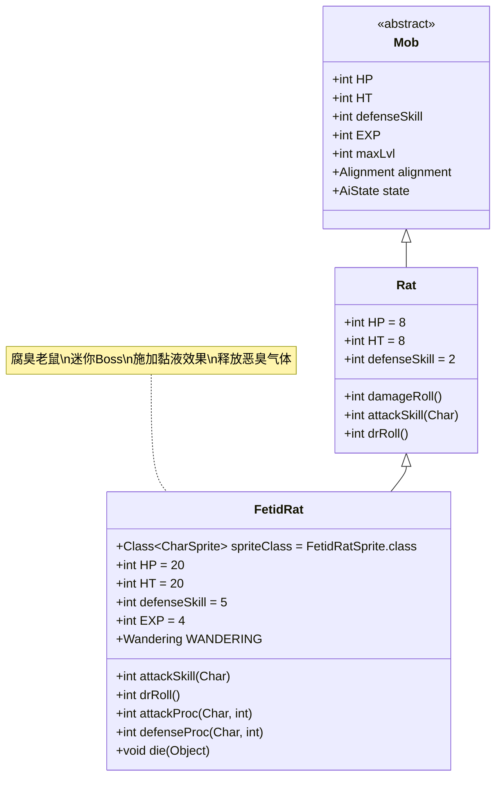

# FetidRat 类文档

## 1. 基本信息
| 属性 | 值 |
|------|-----|
| 文件路径 | core/src/main/java/com/shatteredpixel/shatteredpixeldungeon/actors/mobs/FetidRat.java |
| 包名 | com.shatteredpixel.shatteredpixeldungeon.actors.mobs |
| 类类型 | public class |
| 继承关系 | extends Rat |
| 代码行数 | 111行 |

## 2. 类职责说明
FetidRat是Rat的腐臭变种，具有迷你Boss标记。它在攻击时有33%概率对敌人施加Ooze（黏液）效果，并在受到伤害时释放恶臭气体。FetidRat与鬼魂任务相关，死亡时会推进任务进度。

## 4. 继承与协作关系


## 静态常量表
| 常量名 | 类型 | 值 | 说明 |
|--------|------|-----|------|
| HP/HT | int | 20 | 生命值上限（比普通老鼠高） |
| defenseSkill | int | 5 | 防御技能等级 |
| EXP | int | 4 | 击败后获得的经验值 |
| properties | ArrayList<Property> | MINIBOSS, DEMONIC | 特殊属性标记 |

## 实例字段表
| 字段名 | 类型 | 修饰符 | 说明 |
|--------|------|--------|------|
| spriteClass | Class<? extends CharSprite> | - | 怪物精灵类（FetidRatSprite） |
| WANDERING | Wandering | - | 自定义的漫游AI状态 |
| state | AiState | WANDERING | 初始AI状态为漫游 |

## 7. 方法详解

### attackSkill(Char target)
**签名**: `int attackSkill(Char target)`
**功能**: 计算攻击技能等级
**参数**:
- target: Char - 目标
**返回值**: int - 攻击技能等级
**实现逻辑**:
- 固定返回12（第56行）

### drRoll()
**签名**: `int drRoll()`
**功能**: 计算伤害减免值
**参数**: 无
**返回值**: int - 伤害减免值
**实现逻辑**:
- 在基础伤害减免基础上增加0-2点（第61行）

### attackProc(Char enemy, int damage)
**签名**: `int attackProc(Char enemy, int damage)`
**功能**: 攻击处理，在攻击命中时有33%概率施加Ooze效果
**参数**:
- enemy: Char - 被攻击的敌人
- damage: int - 造成的伤害值
**返回值**: int - 处理后的伤害值
**实现逻辑**:
1. 调用父类attackProc方法（第66行）
2. 33%概率（Random.Int(3) == 0）对敌人施加Ooze效果（第67-68行）
3. 如果目标是英雄且不在水中，减少任务分数50点（第70-72行）
4. 返回处理后的伤害值（第75行）

### defenseProc(Char enemy, int damage)
**签名**: `int defenseProc(Char enemy, int damage)`
**功能**: 防御处理，在受到伤害时释放恶臭气体
**参数**:
- enemy: Char - 攻击者
- damage: int - 受到的伤害值
**返回值**: int - 处理后的伤害值
**实现逻辑**:
1. 在当前位置添加20回合的恶臭气体（StenchGas）（第81行）
2. 调用父类defenseProc方法（第83行）

### die(Object cause)
**签名**: `void die(Object cause)`
**功能**: 死亡处理，推进鬼魂任务进度
**参数**:
- cause: Object - 死亡原因
**返回值**: void
**实现逻辑**:
1. 调用父类die方法（第88行）
2. 调用Ghost.Quest.process()推进任务（第90行）

### randomDestination()
**签名**: `protected int randomDestination()`
**功能**: 自定义漫游目标选择，优先靠近英雄
**参数**: 无
**返回值**: int - 目标位置
**实现逻辑**:
1. 生成两个随机漫游位置（第97-98行）
2. 计算到英雄的距离，选择更近的位置（第100-104行）

## 战斗行为
- **黏液攻击**: 33%概率施加Ooze效果，造成持续伤害
- **恶臭防御**: 受到伤害时释放恶臭气体，影响周围区域
- **智能漫游**: 漫游时优先选择靠近英雄的位置
- **AI行为**: 标准的敌对AI，但具有更积极的接近行为
- **任务关联**: 与鬼魂任务直接相关，死亡时推进任务

## 掉落物品
- **主要掉落**: 继承自Rat的常规掉落机制
- **特殊机制**: 无固定特殊掉落，但与任务进度相关

## 特殊属性
- **MINIBOSS**: 迷你Boss标记
- **DEMONIC**: 恶魔属性
- **免疫**: 对恶臭气体（StenchGas）免疫

## 11. 使用示例
```java
// FetidRat通常由鬼魂任务生成

// 黏液攻击和任务分数处理
@Override
public int attackProc(Char enemy, int damage) {
    damage = super.attackProc(enemy, damage);
    if (Random.Int(3) == 0) {
        Buff.affect(enemy, Ooze.class).set(Ooze.DURATION);
        // 任务分数惩罚
        if (enemy == Dungeon.hero && !Dungeon.level.water[enemy.pos]){
            Statistics.questScores[0] -= 50;
        }
    }
    return damage;
}

// 恶臭气体释放
@Override
public int defenseProc(Char enemy, int damage) {
    GameScene.add(Blob.seed(pos, 20, StenchGas.class)); // 释放恶臭气体
    return super.defenseProc(enemy, damage);
}

// 智能漫游AI
protected class Wandering extends Mob.Wandering{
    @Override
    protected int randomDestination() {
        // 选择更靠近英雄的位置
        int pos1 = super.randomDestination();
        int pos2 = super.randomDestination();
        PathFinder.buildDistanceMap(Dungeon.hero.pos, Dungeon.level.passable);
        if (PathFinder.distance[pos2] < PathFinder.distance[pos1]){
            return pos2;
        } else {
            return pos1;
        }
    }
}
```

## 注意事项
1. FetidRat的生命值是普通老鼠的2.5倍（20 vs 8）
2. 黏液效果会造成持续伤害，需要及时治疗
3. 恶臭气体会影响战斗区域，可能对玩家和其他敌人造成影响
4. 在水中战斗不会触发任务分数惩罚
5. 死亡是鬼魂任务的关键进度点

## 最佳实践
1. 玩家应准备抗性或治疗手段来应对黏液效果
2. 利用远程武器避免近战接触减少被攻击机会
3. 注意恶臭气体的影响范围，合理选择战斗位置
4. 在鬼魂任务中，FetidRat是重要的目标敌人
5. 设计关卡时，可将FetidRat作为任务相关的挑战敌人