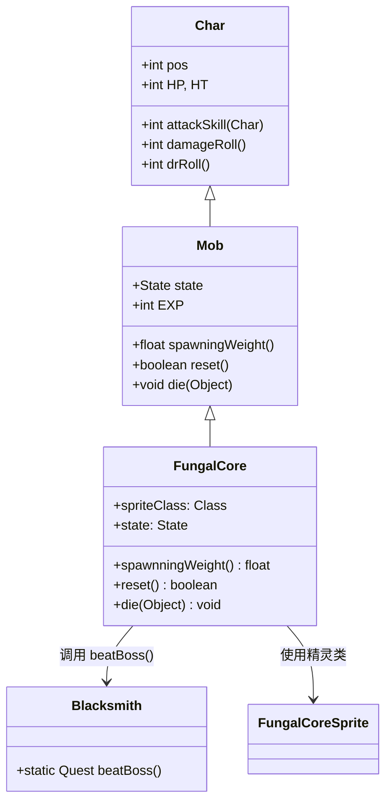

# FungalCore 源码详解

## 1. 基本信息

| 属性 | 值 |
|------|-----|
| **文件路径** | core/src/main/java/com/shatteredpixel/shatteredpixeldungeon/actors/mobs/FungalCore.java |
| **包名** | com.shatteredpixel.shatteredpixeldungeon.actors.mobs |
| **类类型** | class（非抽象） |
| **继承关系** | extends Mob |
| **代码行数** | 56 |
| **中文名称** | 真菌核心 |

---

## 类职责

FungalCore（真菌核心）是游戏中的特殊BOSS单位之一。它负责：

1. **BOSS战斗**：作为特定任务的最终目标进行战斗
2. **任务触发**：死亡时触发铁匠任务的完成逻辑
3. **被动行为**：保持被动状态，不会主动攻击玩家
4. **固定位置**：作为不可移动单位，始终停留在生成位置

**设计模式**：
- **模板方法模式**：重写父类 `die()` 方法处理死亡逻辑
- **被动状态模式**：使用 `PASSIVE` 状态实现无AI行为

---

## 4. 继承与协作关系



---

## 实例字段表

| 字段名 | 类型 | 设置值 | 说明 |
|--------|------|--------|------|
| `spriteClass` | Class | FungalCoreSprite.class | 角色精灵类 |
| `HP` / `HT` | int | 300 | 当前/最大生命值 |
| `EXP` | int | 20 | 击败后获得的经验值 |
| `state` | State | PASSIVE | 初始状态为被动 |

### 特殊属性

| 属性 | 说明 |
|------|------|
| `Property.IMMOVABLE` | 不可移动，固定在生成位置 |
| `Property.BOSS` | BOSS单位，具有特殊地位 |

---

## 7. 方法详解

### 构造块（Instance Initializer）

```java
{
    HP = HT = 300;
    spriteClass = FungalCoreSprite.class;
    
    EXP = 20;
    
    state = PASSIVE;
    
    properties.add(Property.IMMOVABLE);
    properties.add(Property.BOSS);
}
```

**作用**：初始化真菌核心的基础属性，设置高生命值、被动状态和BOSS属性。

---

### spawningWeight()

```java
@Override
public float spawningWeight() {
    return 0;
}
```

**方法作用**：返回在生成池中的权重，影响出现频率。

**返回值**：
- `0`：不会在常规关卡生成中自然出现，仅通过特定任务或脚本生成

---

### reset()

```java
@Override
public boolean reset() {
    return true;
}
```

**方法作用**：重置mob状态，在某些情况下（如房间重置）调用。

**返回值**：
- `true`：表示重置成功，但由于是被动BOSS，实际行为有限

---

### die(Object cause)

```java
@Override
public void die(Object cause) {
    super.die(cause);
    Blacksmith.Quest.beatBoss();
}
```

**方法作用**：定义死亡时的特殊行为，触发铁匠任务完成。

**参数**：
- `cause` (Object)：死亡原因（可能是玩家攻击、陷阱等）

**特殊行为**：
- 调用 `Blacksmith.Quest.beatBoss()` 方法，通知铁匠任务系统BOSS已被击败
- 这通常会解锁新的任务阶段或奖励

---

## AI状态机

### PASSIVE 状态

**触发条件**：初始状态

**行为**：
- 真菌核心始终保持被动状态
- 不会主动攻击玩家或执行任何AI行为
- 玩家必须主动攻击才能与其互动
- 由于具有 `IMMOVABLE` 属性，不会移动位置

---

## 11. 使用示例

### 任务BOSS生成

```java
// 在铁匠任务中生成真菌核心
FungalCore core = new FungalCore();
core.pos = targetPosition;  // 设置BOSS位置

// 添加到游戏场景
GameScene.add(core);
Dungeon.level.mobs.add(core);

// 标记为任务目标
Blacksmith.Quest.setBossTarget(core);
```

### 自定义BOSS变体

```java
// 创建增强版真菌核心
public class EnhancedFungalCore extends FungalCore {
    @Override
    public void die(Object cause) {
        // 先处理原版逻辑
        super.die(cause);
        
        // 添加额外效果
        GLog.p("真菌核心被摧毁了！");
        Sample.INSTANCE.play(Assets.Sounds.BOSS_DIE);
    }
}
```

---

## 注意事项

### 平衡性考虑

1. **难度定位**：真菌核心作为任务BOSS，拥有300点高额生命值
2. **被动机制**：由于是被动状态，玩家可以安全地观察和准备战斗
3. **固定位置**：不可移动特性使其成为固定的战斗目标

### 特殊机制

1. **任务集成**：与铁匠任务系统深度集成，死亡时自动完成任务
2. **无掉落**：作为任务BOSS，通常不会有常规物品掉落
3. **经验奖励**：提供20点经验值，适合作为中期BOSS

### 技术限制

1. **生成控制**：`spawningWeight()` 返回0确保不会意外出现在普通关卡
2. **状态简化**：使用被动状态简化AI逻辑，减少性能开销

---

## 最佳实践

### 任务BOSS实现

```java
// 标准任务BOSS模式
public class QuestBoss extends Mob {
    {
        state = PASSIVE;
        properties.add(Property.IMMOVABLE);
        properties.add(Property.BOSS);
    }
    
    @Override
    public float spawningWeight() {
        return 0; // 不自然生成
    }
    
    @Override
    public void die(Object cause) {
        super.die(cause);
        QuestSystem.completeQuest(this); // 触发任务完成
    }
}
```

### BOSS状态管理

```java
// 动态切换BOSS状态
public void activateBoss() {
    if (state == PASSIVE) {
        state = HUNTING; // 激活BOSS
        enemy = Dungeon.hero; // 设定目标
        target = enemy.pos;
    }
}
```

---

## 相关类

| 类名 | 关系 | 说明 |
|------|------|------|
| `Mob` | 父类 | 所有怪物的基类 |
| `FungalCoreSprite` | 精灵类 | 对应的视觉表现 |
| `Blacksmith.Quest` | 任务系统 | 铁匠任务系统，处理BOSS死亡事件 |
| `Property` | 属性枚举 | 定义IMMOVABLE和BOSS属性 |
| `GameScene` | 场景管理 | 游戏场景，用于添加BOSS |

---

## 消息键

（真菌核心作为任务NPC，可能使用以下消息键）

| 键名 | 值 | 用途 |
|------|-----|------|
| `monsters.fungalcore.name` | fungal core | 怪物名称 |
| `monsters.fungalcore.desc` | A pulsating fungal mass that serves as the heart of the fungal colony. | 怪物描述 |