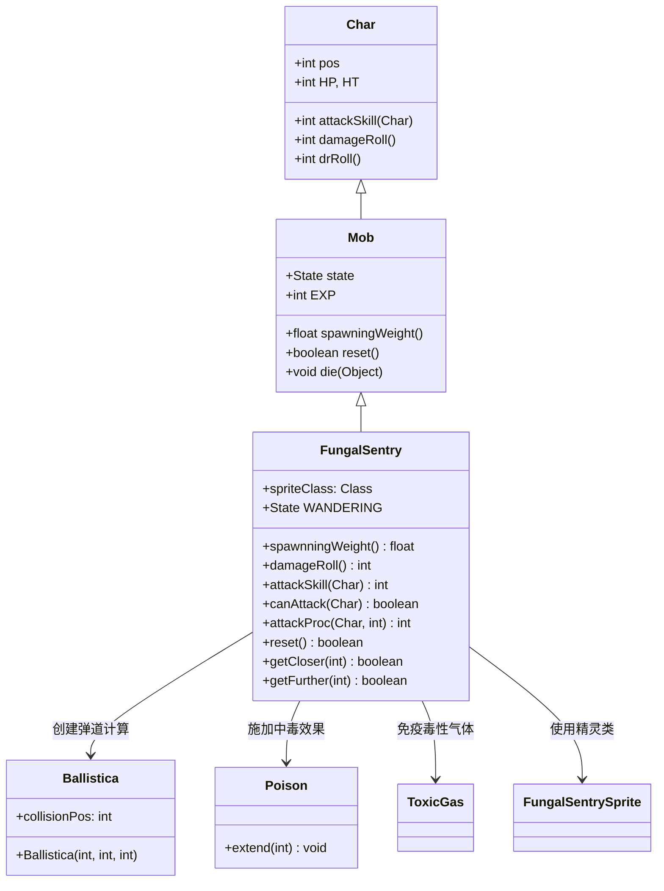

# FungalSentry 源码详解

## 1. 基本信息

| 属性 | 值 |
|------|-----|
| **文件路径** | core/src/main/java/com/shatteredpixel/shatteredpixeldungeon/actors/mobs/FungalSentry.java |
| **包名** | com.shatteredpixel.shatteredpixeldungeon.actors.mobs |
| **类类型** | class（非抽象） |
| **继承关系** | extends Mob |
| **代码行数** | 122 |
| **中文名称** | 真菌哨兵 |

---

## 类职责

FungalSentry（真菌哨兵）是游戏中的小型BOSS单位之一。它负责：

1. **远程攻击**：能够对视线外的敌人进行魔法弹道攻击
2. **毒液效果**：攻击时施加中毒状态，延长持续时间
3. **固定防御**：作为不可移动单位，守护特定区域
4. **高精度打击**：拥有极高的攻击技能等级确保命中率

**设计模式**：
- **模板方法模式**：重写多个父类方法定义特殊行为
- **自定义状态模式**：通过内部 `Waiting` 类实现特殊的AI逻辑

---

## 4. 继承与协作关系



---

## 实例字段表

| 字段名 | 类型 | 设置值 | 说明 |
|--------|------|--------|------|
| `spriteClass` | Class | FungalSentrySprite.class | 角色精灵类 |
| `HP` / `HT` | int | 200 | 当前/最大生命值 |
| `defenseSkill` | int | 12 | 防御技能等级 |
| `EXP` | int | 10 | 击败后获得的经验值 |
| `maxLvl` | int | -2 | 最大出现等级（负值表示不会升级） |
| `state` | State | new Waiting() | 自定义等待状态 |

### 特殊属性

| 属性 | 说明 |
|------|------|
| `Property.IMMOVABLE` | 不可移动，固定在生成位置 |
| `Property.MINIBOSS` | 小型BOSS单位，具有特殊地位 |

### 免疫列表

| 免疫类型 | 说明 |
|----------|------|
| `ToxicGas.class` | 对毒性气体完全免疫 |
| `Poison.class` | 对中毒状态完全免疫 |

---

## 7. 方法详解

### 构造块（Instance Initializer）

```java
{
    spriteClass = FungalSentrySprite.class;
    
    HP = HT = 200;
    defenseSkill = 12;
    
    EXP = 10;
    maxLvl = -2;
    
    state = WANDERING = new Waiting();
    
    properties.add(Property.IMMOVABLE);
    properties.add(Property.MINIBOSS);
}
```

**作用**：初始化真菌哨兵的基础属性，设置高生命值、固定状态和BOSS属性。

---

### spawningWeight()

```java
@Override
public float spawningWeight() {
    return 0;
}
```

**方法作用**：返回在生成池中的权重，影响出现频率。

**返回值**：
- `0`：不会在常规关卡生成中自然出现，仅通过特定脚本或任务生成

---

### damageRoll()

```java
@Override
public int damageRoll() {
    return Random.NormalIntRange(5, 10);
}
```

**方法作用**：计算攻击造成的伤害范围。

**伤害计算**：
- 最小伤害：`5`
- 最大伤害：`10`
- 平均伤害：`7.5`

---

### attackSkill(Char target)

```java
@Override
public int attackSkill(Char target) {
    return 50;
}
```

**方法作用**：返回攻击技能等级，影响命中率。

**参数**：
- `target` (Char)：攻击目标

**返回值**：
- `50`：极高的攻击技能等级，几乎保证命中

---

### canAttack(Char enemy)

```java
@Override
protected boolean canAttack(Char enemy) {
    return super.canAttack(enemy)
            || new Ballistica(pos, enemy.pos, Ballistica.MAGIC_BOLT).collisionPos == enemy.pos;
}
```

**方法作用**：判断是否可以攻击指定敌人，支持远程魔法弹道攻击。

**参数**：
- `enemy` (Char)：潜在攻击目标

**特殊机制**：
- 除了常规近战攻击判定外，还检查是否存在直接的魔法弹道路径
- 使用 `Ballistica.MAGIC_BOLT` 计算弹道，允许直线远程攻击
- 如果弹道终点正好是敌人位置，则可以攻击

---

### attackProc(Char enemy, int damage)

```java
@Override
public int attackProc(Char enemy, int damage) {
    Buff.affect(enemy, Poison.class).extend(6);
    return super.attackProc(enemy, damage);
}
```

**方法作用**：攻击后的额外处理，施加中毒效果。

**参数**：
- `enemy` (Char)：被攻击的敌人
- `damage` (int)：造成的伤害值

**特殊效果**：
- 对目标施加中毒状态，并延长持续时间为6回合
- 由于自身免疫中毒，不用担心反噬

---

### 移动限制方法

```java
@Override
protected boolean getCloser(int target) {
    return false;
}

@Override
protected boolean getFurther(int target) {
    return false;
}
```

**方法作用**：禁止所有移动行为。

**原因**：
- 由于具有 `IMMOVABLE` 属性，不需要任何移动逻辑
- 所有移动尝试都会返回 `false`，确保位置固定

---

### reset()

```java
@Override
public boolean reset() {
    return true;
}
```

**方法作用**：重置mob状态。

**返回值**：
- `true`：表示重置成功

---

## AI状态机

### Waiting 状态

**触发条件**：初始状态

**行为**：
- **始终警觉**：重写 `act()` 方法，总是能发现英雄（即使不在常规视野内）
- **立即响应**：一旦发现敌人就调用 `noticeEnemy()` 进入战斗状态
- **等待逻辑**：未发现敌人时继续等待状态

**特殊实现**：
- `noticeEnemy()` 方法花费1个回合时间，然后调用父类逻辑
- 这种设计使其比普通怪物更警觉，适合作为哨兵角色

---

## 11. 使用示例

### BOSS房间配置

```java
// 在特定房间生成真菌哨兵
FungalSentry sentry = new FungalSentry();
sentry.pos = room.center();  // 放置在房间中心

// 添加到场景
GameScene.add(sentry);
Dungeon.level.mobs.add(sentry);

// 可能与其他真菌单位组合
for (int i = 0; i < 3; i++) {
    FungalSpinner spinner = new FungalSpinner();
    spinner.pos = room.random();  // 随机位置
    Room.spawnMob(spinner, room);
}
```

### 自定义哨兵变体

```java
// 增强版真菌哨兵
public class EliteFungalSentry extends FungalSentry {
    @Override
    public int damageRoll() {
        return Random.NormalIntRange(8, 15);  // 更高伤害
    }
    
    @Override
    public int attackProc(Char enemy, int damage) {
        // 施加更强的中毒效果
        Buff.affect(enemy, Poison.class).set(8);
        return super.attackProc(enemy, damage);
    }
}
```

---

## 注意事项

### 平衡性考虑

1. **难度定位**：作为小型BOSS，拥有200点生命值和高攻击力
2. **远程威胁**：能够攻击视线外的目标，增加战术复杂性
3. **中毒压制**：每次攻击都延长中毒时间，对玩家造成持续压力

### 特殊机制

1. **免疫系统**：对毒性和中毒完全免疫，专门对抗毒系玩家策略
2. **固定位置**：不可移动特性使其成为固定的远程威胁点
3. **高精度**：50点攻击技能确保几乎不可能miss

### 技术限制

1. **生成控制**：`spawningWeight()` 返回0确保精确控制生成位置
2. **等级锁定**：`maxLvl = -2` 防止意外升级
3. **TODO注释**：代码中包含关于攻击判定和治疗机制的待办事项

### TODO事项分析

1. **攻击判定宽松**：注释提到"attack is a little permissive atm?"，可能需要调整弹道逻辑
2. **生存机制缺失**：注释建议"if we want to allow them to be literally killed, probably should give them a heal if hero is out of FOV"，当前设计可能过于脆弱

---

## 最佳实践

### 远程攻击实现

```java
// 标准远程攻击模式
@Override
protected boolean canAttack(Char enemy) {
    return super.canAttack(enemy) 
        || Ballistica.lineOfSight(pos, enemy.pos, Ballistica.PROJECTILE);
}
```

### 状态免疫配置

```java
// 批量添加免疫
{
    immunities.addAll(Arrays.asList(
        ToxicGas.class,
        Poison.class,
        Burning.class,
        Frost.class
    ));
}
```

### 固定位置单位

```java
// 确保不可移动
{
    properties.add(Property.IMMOVABLE);
}

@Override
protected boolean getCloser(int target) { return false; }

@Override  
protected boolean getFurther(int target) { return false; }
```

---

## 相关类

| 类名 | 关系 | 说明 |
|------|------|------|
| `Mob` | 父类 | 所有怪物的基类 |
| `FungalSentrySprite` | 精灵类 | 对应的视觉表现 |
| `Ballistica` | 工具类 | 弹道计算，用于远程攻击判定 |
| `Poison` | Buff类 | 中毒状态，作为攻击附加效果 |
| `ToxicGas` | Blob类 | 毒性气体，哨兵对其免疫 |
| `Property` | 属性枚举 | 定义IMMOVABLE和MINIBOSS属性 |

---

## 消息键

| 键名 | 值 | 用途 |
|------|-----|------|
| `monsters.fungalsentry.name` | fungal sentry | 怪物名称 |
| `monsters.fungalsentry.desc` | A large fungal creature that guards the fungal colony with toxic projectiles. | 怪物描述 |