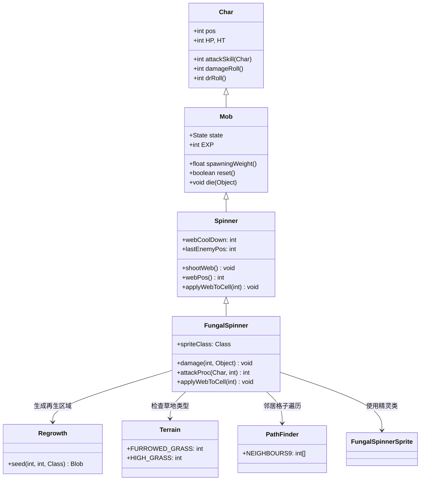

# FungalSpinner 源码详解

## 1. 基本信息

| 属性 | 值 |
|------|-----|
| **文件路径** | core/src/main/java/com/shatteredpixel/shatteredpixeldungeon/actors/mobs/FungalSpinner.java |
| **包名** | com.shatteredpixel.shatteredpixeldungeon.actors.mobs |
| **类类型** | class（非抽象） |
| **继承关系** | extends Spinner |
| **代码行数** | 74 |
| **中文名称** | 真菌纺蛛 |

---

## 类职责

FungalSpinner（真菌纺蛛）是游戏中的特殊变种怪物，基于普通纺蛛进行改造。它负责：

1. **草系环境互动**：利用周围的草地提供伤害减免
2. **生命再生区域**：蛛网生成后转换为再生区域而非普通蛛网
3. **毒性免疫**：对再生效果免疫，避免自伤
4. **无毒攻击**：移除普通纺蛛的中毒攻击效果

**设计模式**：
- **模板方法模式**：重写父类关键方法实现特殊行为
- **装饰器模式**：在基础纺蛛功能上添加真菌特性

---

## 4. 继承与协作关系



---

## 实例字段表

| 字段名 | 类型 | 设置值 | 说明 |
|--------|------|--------|------|
| `spriteClass` | Class | FungalSpinnerSprite.class | 角色精灵类 |
| `HP` / `HT` | int | 40 | 当前/最大生命值（比普通纺蛛少10点） |
| `defenseSkill` | int | 16 | 防御技能等级（比普通纺蛛少1点） |
| `EXP` | int | 7 | 击败后获得的经验值（比普通纺蛛少2点） |
| `maxLvl` | int | -2 | 最大出现等级（负值表示不会升级） |

### 继承自 Spinner 的字段

| 字段名 | 类型 | 说明 |
|--------|------|------|
| `webCoolDown` | int | 蛛网技能冷却时间 |
| `lastEnemyPos` | int | 敌人上次位置记录 |
| `loot` | Class | MysteryMeat.class（继承但可能被覆盖） |
| `lootChance` | float | 0.125f（继承但可能被覆盖） |

### 免疫列表

| 免疫类型 | 说明 |
|----------|------|
| `Regrowth.class` | 对再生区域效果完全免疫 |

---

## 7. 方法详解

### 构造块（Instance Initializer）

```java
{
    spriteClass = FungalSpinnerSprite.class;
    
    HP = HT = 40;
    defenseSkill = 16;
    
    EXP = 7;
    maxLvl = -2;
}
```

**作用**：初始化真菌纺蛛的基础属性，调整生命值、防御和经验以适应其特殊定位。

---

### applyWebToCell(int cell)

```java
@Override
protected void applyWebToCell(int cell) {
    GameScene.add(Blob.seed(cell, 40, Regrowth.class));
}
```

**方法作用**：重写父类的蛛网应用方法，将普通蛛网替换为再生区域。

**参数**：
- `cell` (int)：目标格子坐标

**特殊机制**：
- 使用 `Regrowth.class` 替代 `Web.class`
- 设置持续时间为40回合（比普通蛛网的20回合更长）
- 再生区域会促进草类生长并治疗站在其中的友方单位

---

### damage(int dmg, Object src)

```java
@Override
public void damage(int dmg, Object src) {
    int grassCells = 0;
    for (int i : PathFinder.NEIGHBOURS9) {
        if (Dungeon.level.map[pos+i] == Terrain.FURROWED_GRASS
                || Dungeon.level.map[pos+i] == Terrain.HIGH_GRASS){
            grassCells++;
        }
    }
    //first adjacent grass cell reduces damage taken by 30%, each one after reduces by another 10%
    if (grassCells > 0) dmg = Math.round(dmg * (8-grassCells)/10f);
    
    super.damage(dmg, src);
}
```

**方法作用**：重写伤害计算方法，根据周围草地数量提供伤害减免。

**参数**：
- `dmg` (int)：原始伤害值
- `src` (Object)：伤害来源

**伤害减免机制**：
- **第一个相邻草地**：减少30%伤害（乘以0.7）
- **后续每个草地**：额外减少10%伤害
- **最大减免**：9个草地时减少90%伤害（乘以0.1）
- **计算公式**：`最终伤害 = 原始伤害 × (8 - grassCells) / 10`

**示例**：
| 相邻草地数 | 伤害减免比例 | 最终伤害系数 |
|------------|--------------|--------------|
| 0 | 0% | 1.0 |
| 1 | 30% | 0.7 |
| 2 | 40% | 0.6 |
| 3 | 50% | 0.5 |
| 4 | 60% | 0.4 |
| 5 | 70% | 0.3 |
| 6 | 80% | 0.2 |
| 7+ | 90% | 0.1 |

---

### attackProc(Char enemy, int damage)

```java
@Override
public int attackProc(Char enemy, int damage) {
    return damage; //does not apply poison
}
```

**方法作用**：移除普通纺蛛的中毒攻击效果。

**参数**：
- `enemy` (Char)：被攻击的敌人
- `damage` (int)：造成的伤害值

**特殊处理**：
- 直接返回原始伤害值，不施加任何中毒效果
- 这与普通纺蛛形成鲜明对比（普通纺蛛50%概率施加7-8回合中毒）

---

## 继承的行为特性

### 网络射击能力

真菌纺蛛继承了普通纺蛛的完整网络射击AI：

1. **智能预测**：根据敌人移动方向预测落点
2. **三格散布**：向预测位置及其相邻两格同时发射
3. **冷却机制**：每次射击后有10回合冷却时间
4. **状态切换**：普通纺蛛攻击后会切换到逃跑状态，但真菌纺蛛由于移除了中毒效果，这个机制变得不那么重要

### AI状态机

- **HUNTING状态**：主动追击并使用网络射击
- **FLEEING状态**：逃跑但仍会使用网络射击（如果条件允许）
- **WANDERING状态**：游荡寻找敌人

---

## 11. 使用示例

### 真菌区域配置

```java
// 在有草地的区域生成真菌纺蛛
FungalSpinner spinner = new FungalSpinner();
spinner.pos = grassyArea;  // 放置在草地区域

// 确保周围有足够的草地以发挥其优势
for (int neighbor : PathFinder.NEIGHBOURS9) {
    int cell = spinner.pos + neighbor;
    if (Dungeon.level.passable[cell]) {
        Dungeon.level.set(cell, Terrain.HIGH_GRASS);
    }
}

GameScene.add(spinner);
```

### 自定义变体

```java
// 强化版真菌纺蛛
public class EliteFungalSpinner extends FungalSpinner {
    @Override
    public void damage(int dmg, Object src) {
        // 更强的草地保护
        int grassCells = countAdjacentGrass();
        if (grassCells > 0) {
            dmg = Math.round(dmg * Math.max(0.1f, (6 - grassCells) / 10f));
        }
        super.damage(dmg, src);
    }
    
    private int countAdjacentGrass() {
        // 自定义草地检测逻辑
        int count = 0;
        for (int dir : PathFinder.NEIGHBOURS9) {
            int cell = pos + dir;
            if (Dungeon.level.map[cell] == Terrain.HIGH_GRASS) {
                count++;  // 只计算高草
            }
        }
        return count;
    }
}
```

---

## 注意事项

### 平衡性考虑

1. **环境依赖**：真菌纺蛛的强大完全依赖于周围环境的草地数量
2. **脆弱性**：在无草环境中极其脆弱（40点生命值较低）
3. **战术价值**：玩家需要优先清理周围草地来有效对抗

### 特殊机制

1. **再生区域**：蛛网变成治疗区域，可能意外治疗友方单位
2. **免疫系统**：对再生效果免疫防止自伤干扰
3. **无毒攻击**：移除中毒使其更专注于控制而非持续伤害

### 技术限制

1. **等级锁定**：`maxLvl = -2` 确保不会在高等级关卡出现
2. **继承复杂性**：依赖父类Spinner的复杂AI逻辑
3. **环境检测**：仅检测两种特定草地类型（FURROWED_GRASS和HIGH_GRASS）

### 战斗策略

**对玩家的威胁**：
- 在草地区域几乎不可杀（90%伤害减免）
- 再生区域可能恢复其他敌人的生命值
- 网络射击仍能造成控制效果

**对抗策略**：
- 使用火系技能烧毁周围草地
- 远程攻击从无草方向进攻
- 快速击杀避免其利用环境优势

---

## 最佳实践

### 环境互动怪物设计

```java
// 标准环境互动模式
@Override
public void damage(int dmg, Object src) {
    float multiplier = calculateEnvironmentMultiplier();
    super.damage(Math.round(dmg * multiplier), src);
}

private float calculateEnvironmentMultiplier() {
    // 根据环境特征计算伤害倍数
    return baseMultiplier - (environmentFactor * factorCount);
}
```

### 能力重写模式

```java
// 完全移除父类能力
@Override
public int attackProc(Char enemy, int damage) {
    // 不调用 super.attackProc()，完全替换行为
    return damage;
}
```

### 区域效果替换

```java
// 将一种区域效果替换为另一种
@Override
protected void applyEffectToCell(int cell) {
    // 原效果：Blob.seed(cell, duration, OriginalEffect.class)
    // 新效果：Blob.seed(cell, newDuration, NewEffect.class)
    GameScene.add(Blob.seed(cell, enhancedDuration, EnhancedEffect.class));
}
```

---

## 相关类

| 类名 | 关系 | 说明 |
|------|------|------|
| `Spinner` | 父类 | 基础纺蛛类，提供网络射击AI |
| `FungalSpinnerSprite` | 精灵类 | 对应的视觉表现 |
| `Regrowth` | Blob类 | 再生区域效果，替代普通蛛网 |
| `Web` | Blob类 | 普通蛛网效果（被替代） |
| `Terrain` | 枚举类 | 定义草地地形类型 |
| `PathFinder` | 工具类 | 提供邻居格子遍历常量 |
| `Poison` | Buff类 | 中毒效果（被移除） |

---

## 消息键

| 键名 | 值 | 用途 |
|------|-----|------|
| `monsters.fungalspinner.name` | fungal spinner | 怪物名称 |
| `monsters.fungalspinner.desc` | A spider-like creature that thrives in grassy areas and creates regrowth instead of webs. | 怪物描述 |