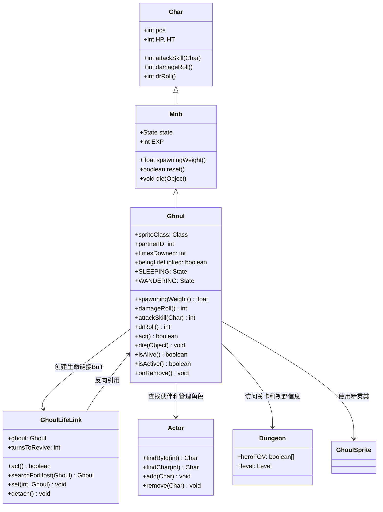

# Ghoul 源码详解

## 1. 基本信息

| 属性 | 值 |
|------|-----|
| **文件路径** | core/src/main/java/com/shatteredpixel/shatteredpixeldungeon/actors/mobs/Ghoul.java |
| **包名** | com.shatteredpixel.shatteredpixeldungeon.actors.mobs |
| **类类型** | class（非抽象） |
| **继承关系** | extends Mob |
| **代码行数** | 377 |
| **中文名称** | 食尸鬼 |

---

## 类职责

Ghoul（食尸鬼）是游戏中的亡灵怪物，具有独特的生命链接机制。它负责：

1. **配对生成**：初始时会生成一个配对的子食尸鬼，形成伙伴关系
2. **生命链接**：死亡时可以链接到附近的同类，延迟真正的死亡
3. **多次复活**：每次被击败后复活的生命值逐渐减少，但复活时间延长
4. **协同AI**：与配对伙伴保持协调行动，互相寻找和跟随

**设计模式**：
- **观察者模式**：通过 `GhoulLifeLink` Buff实现死亡状态的延迟处理
- **状态模式**：自定义 `Sleeping` 和 `Wandering` 状态处理伙伴关系逻辑
- **组合模式**：包含内部静态类 `GhoulLifeLink` 实现复杂的生命机制

---

## 4. 继承与协作关系



---

## 实例字段表

| 字段名 | 类型 | 默认值 | 说明 |
|--------|------|--------|------|
| `spriteClass` | Class | GhoulSprite.class | 角色精灵类 |
| `HP` / `HT` | int | 45 | 当前/最大生命值 |
| `defenseSkill` | int | 20 | 防御技能等级 |
| `EXP` | int | 5 | 击败后获得的经验值 |
| `maxLvl` | int | 20 | 最大出现等级 |
| `loot` | Class | Gold.class | 掉落物品类型 |
| `lootChance` | float | 0.2f | 掉落概率（20%） |
| `partnerID` | int | -1 | 配对伙伴的ID（-1表示无伙伴） |
| `timesDowned` | int | 0 | 被击败次数计数器 |
| `beingLifeLinked` | boolean | false | 是否处于生命链接状态 |

### 特殊属性

| 属性 | 说明 |
|------|------|
| `Property.UNDEAD` | 亡灵单位，具有特殊免疫和弱点 |

### 状态定义

| 状态字段 | 类型 | 说明 |
|----------|------|------|
| `SLEEPING` | Sleeping | 自定义休眠状态 |
| `WANDERING` | Wandering | 自定义游荡状态 |

---

## 7. 方法详解

### 构造块（Instance Initializer）

```java
{
    spriteClass = GhoulSprite.class;
    
    HP = HT = 45;
    defenseSkill = 20;
    
    EXP = 5;
    maxLvl = 20;
    
    SLEEPING = new Sleeping();
    WANDERING = new Wandering();
    state = SLEEPING;

    loot = Gold.class;
    lootChance = 0.2f;
    
    properties.add(Property.UNDEAD);
}
```

**作用**：初始化食尸鬼的基础属性，设置中等生命值、高防御技能和亡灵属性。

---

### spawningWeight()

```java
@Override
public float spawningWeight() {
    return 0.5f;
}
```

**方法作用**：返回在生成池中的权重，影响出现频率。

**返回值**：
- `0.5f`：中等生成权重，会在合适的关卡自然出现

---

### damageRoll()

```java
@Override
public int damageRoll() {
    return Random.NormalIntRange(16, 22);
}
```

**方法作用**：计算攻击造成的伤害范围。

**伤害计算**：
- 最小伤害：`16`
- 最大伤害：`22`
- 平均伤害：`19`

---

### attackSkill(Char target)

```java
@Override
public int attackSkill(Char target) {
    return 24;
}
```

**方法作用**：返回攻击技能等级，影响命中率。

**参数**：
- `target` (Char)：攻击目标

**返回值**：
- `24`：较高的攻击技能等级，保证良好的命中率

---

### drRoll()

```java
@Override
public int drRoll() {
    return super.drRoll() + Random.NormalIntRange(0, 4);
}
```

**方法作用**：计算伤害减免范围。

**伤害减免**：
- 额外减免：`0` 到 `4` 点伤害

---

### act()

```java
@Override
protected boolean act() {
    //create a child
    if (partnerID == -1){
        // ... 生成伙伴逻辑
    }
    return super.act();
}
```

**方法作用**：每回合行为逻辑，处理伙伴生成。

**伙伴生成机制**：
1. **条件检查**：只有当 `partnerID == -1`（无伙伴）时才生成
2. **位置选择**：在四个正交方向中选择可通行且空闲的位置
3. **伙伴创建**：创建新的食尸鬼实例并建立双向链接
4. **状态同步**：如果当前不是休眠状态，新伙伴直接进入游荡状态
5. **Buff继承**：将具有 `revivePersists` 属性的Buff传递给新伙伴

---

### die(Object cause)

```java
@Override
public void die(Object cause) {
    if (cause != Chasm.class && cause != GhoulLifeLink.class && !Dungeon.level.pit[pos]){
        Ghoul nearby = GhoulLifeLink.searchForHost(this);
        if (nearby != null){
            beingLifeLinked = true;
            timesDowned++;
            Actor.remove(this);
            Dungeon.level.mobs.remove(this);
            Buff.append(nearby, GhoulLifeLink.class).set(timesDowned*5, this);
            ((GhoulSprite)sprite).crumple();
            return;
        }
    }
    super.die(cause);
}
```

**方法作用**：定义死亡时的特殊行为，实现生命链接机制。

**参数**：
- `cause` (Object)：死亡原因

**生命链接条件**：
- **排除情况**：掉入深渊（Chasm）或已被生命链接处理过，或掉入陷阱坑（pit）
- **搜索伙伴**：调用 `GhoulLifeLink.searchForHost()` 查找符合条件的附近食尸鬼
- **链接建立**：如果找到伙伴，创建 `GhoulLifeLink` Buff并设置复活时间

**复活时间计算**：
- `timesDowned * 5` 回合
- 每次被击败后复活时间增加5回合

---

### isAlive() 和 isActive()

```java
@Override
public boolean isAlive() {
    return super.isAlive() || beingLifeLinked;
}

@Override
public boolean isActive() {
    return !beingLifeLinked && isAlive();
}
```

**方法作用**：重写生命状态判断，适应生命链接机制。

**状态逻辑**：
- **isAlive()**：即使物理上已"死亡"，只要处于生命链接状态就算存活
- **isActive()**：只有未被链接且存活的状态才算活跃（可以正常行动）

---

### onRemove()

```java
@Override
protected synchronized void onRemove() {
    if (beingLifeLinked) {
        // 特殊Buff处理逻辑
    } else {
        super.onRemove();
    }
}
```

**方法作用**：角色移除时的清理逻辑，处理生命链接状态下的特殊Buff。

**特殊处理**：
- **SacrificialFire.Marked**：延长标记持续时间，确保标记不丢失
- **revivePersists Buffs**：保留这些Buff以便复活时继承
- **其他Buffs**：正常移除

---

## AI状态机

### Sleeping 状态

**触发条件**：初始状态

**行为**：
- **伙伴检测**：检查配对伙伴是否存在且不在休眠状态
- **状态切换**：如果伙伴活跃，则切换到游荡状态并以伙伴为目标
- **正常休眠**：如果没有活跃伙伴，则执行父类休眠逻辑

### Wandering 状态

**触发条件**：被惊醒或伙伴活跃

**行为**：
- **伙伴跟随**：优先跟随配对伙伴
- **距离检查**：如果伙伴距离过远（>1格）或伙伴有其他目标，则前往伙伴位置
- **正常游荡**：如果没有伙伴或伙伴也处于游荡状态且距离合适，则执行父类游荡逻辑

---

## GhoulLifeLink 内部类

### 核心机制

`GhoulLifeLink` 是一个Buff类，负责管理食尸鬼的生命链接状态：

1. **存活检查**：确保宿主和被链接的食尸鬼同阵营
2. **距离限制**：宿主必须能看见被链接食尸鬼，或距离小于4格
3. **复活逻辑**：倒计时结束后尝试复活食尸鬼
4. **位置调整**：如果原位置被占用，寻找相邻空位

### 复活过程

1. **生命值恢复**：`HP = Math.round(HT/10f)`（10%最大生命值）
2. **重新激活**：将食尸鬼重新添加到游戏场景和关卡
3. **视觉效果**：显示治疗状态文本
4. **状态重置**：清除友方敌人关系

### 链接转移

如果当前宿主无法继续维持链接（如死亡或距离过远），会自动寻找新的宿主：

```java
@Override
public void detach() {
    super.detach();
    Ghoul newHost = searchForHost(ghoul);
    if (newHost != null){
        attachTo(newHost);  // 转移到新宿主
        timeToNow();
    } else {
        ghoul.beingLifeLinked = false;
        ghoul.die(this);  // 真正死亡
    }
}
```

---

## 11. 使用示例

### 基本实例化

```java
// 创建食尸鬼实例
Ghoul ghoul = new Ghoul();
ghoul.pos = targetPos;

// 添加到游戏场景
GameScene.add(ghoul);
Dungeon.level.mobs.add(ghoul);

// 食尸鬼会自动在第一回合生成伙伴
```

### 手动配对

```java
// 创建配对的食尸鬼
Ghoul parent = new Ghoul();
Ghoul child = new Ghoul();

parent.partnerID = child.id();
child.partnerID = parent.id();

// 设置不同位置
parent.pos = position1;
child.pos = position2;

GameScene.add(parent);
GameScene.add(child);
```

### 自定义变体

```java
// 强化版食尸鬼
public class EliteGhoul extends Ghoul {
    @Override
    public int damageRoll() {
        return Random.NormalIntRange(20, 28);  // 更高伤害
    }
    
    @Override
    public void die(Object cause) {
        // 更长的复活时间
        if (nearby != null) {
            Buff.append(nearby, GhoulLifeLink.class).set(timesDowned * 8, this);
        } else {
            super.die(cause);
        }
    }
}
```

---

## 注意事项

### 平衡性考虑

1. **难度曲线**：45点生命值适中，但生命链接机制增加挑战性
2. **群体威胁**：成对出现且能互相复活，需要同时处理两个目标
3. **持久战斗**：多次复活机制要求玩家有持续输出能力

### 特殊机制

1. **亡灵特性**：作为亡灵单位，可能对某些伤害类型有特殊反应
2. **Buff继承**：复活时保留特定Buff，可能影响战斗策略
3. **视野依赖**：生命链接需要宿主能看见被链接目标或距离足够近

### 技术限制

1. **序列化支持**：完整的Bundle保存/恢复逻辑确保游戏状态正确
2. **性能考虑**：伙伴搜索使用优化的遍历算法避免性能问题
3. **冲突处理**：处理与决斗冻结等特殊状态的交互

### 战斗策略

**对玩家的威胁**：
- 成对出现增加同时处理难度
- 复活机制延长战斗时间
- 高攻击力（16-22）造成显著威胁

**对抗策略**：
- 优先击杀其中一个以打破配对
- 使用范围攻击同时打击两个目标
- 利用距离限制分离它们

---

## 最佳实践

### 复杂状态管理

```java
// 生命链接状态模式
private boolean beingLifeLinked = false;

@Override
public boolean isAlive() {
    return super.isAlive() || beingLifeLinked;
}

@Override
public boolean isActive() {
    return !beingLifeLinked && isAlive();
}
```

### 动态伙伴系统

```java
// 运行时伙伴生成
@Override
protected boolean act() {
    if (partnerID == -1) {
        createPartner();
    }
    return super.act();
}
```

### 条件性死亡处理

```java
// 有条件的真实死亡
@Override
public void die(Object cause) {
    if (shouldLink()) {
        establishLifeLink();
    } else {
        super.die(cause);
    }
}
```

---

## 相关类

| 类名 | 关系 | 说明 |
|------|------|------|
| `Mob` | 父类 | 所有怪物的基类 |
| `GhoulSprite` | 精灵类 | 对应的视觉表现 |
| `GhoulLifeLink` | 内部类 | 生命链接Buff实现 |
| `Actor` | 工具类 | 角色管理和查找 |
| `Dungeon` | 全局类 | 访问关卡和英雄信息 |
| `Property.UNDEAD` | 属性 | 亡灵单位标识 |
| `Challenge` | 系统类 | 决斗系统，影响冻结状态 |

---

## 消息键

| 键名 | 值 | 用途 |
|------|-----|------|
| `monsters.ghoul.name` | ghoul | 怪物名称 |
| `monsters.ghoul.desc` | A reanimated corpse that can link its life force to other ghouls, allowing it to revive after death. | 怪物描述 |