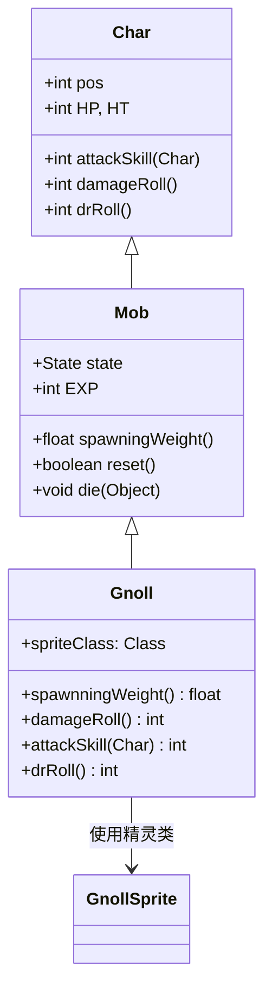

# Gnoll 源码详解

## 1. 基本信息

| 属性 | 值 |
|------|-----|
| **文件路径** | core/src/main/java/com/shatteredpixel/shatteredpixeldungeon/actors/mobs/Gnoll.java |
| **包名** | com.shatteredpixel.shatteredpixeldungeon.actors.mobs |
| **类类型** | class（非抽象） |
| **继承关系** | extends Mob |
| **代码行数** | 58 |
| **中文名称** | 狗头人 |

---

## 类职责

Gnoll（狗头人）是游戏中的基础敌人单位之一。它负责：

1. **早期威胁**：作为低等级关卡的常见敌人提供基础挑战
2. **经济奖励**：高概率掉落金币，为玩家提供早期经济支持
3. **简单AI**：使用标准的Mob AI行为模式，适合新手玩家学习战斗机制
4. **伤害输出**：提供稳定的低伤害攻击，测试玩家的基础防御能力

**设计模式**：
- **模板方法模式**：重写父类的核心战斗方法定义具体数值
- **简单配置模式**：通过构造块快速设置基础属性

---

## 4. 继承与协作关系



---

## 实例字段表

| 字段名 | 类型 | 设置值 | 说明 |
|--------|------|--------|------|
| `spriteClass` | Class | GnollSprite.class | 角色精灵类 |
| `HP` / `HT` | int | 12 | 当前/最大生命值 |
| `defenseSkill` | int | 4 | 防御技能等级 |
| `EXP` | int | 2 | 击败后获得的经验值 |
| `maxLvl` | int | 8 | 最大出现等级 |
| `loot` | Class | Gold.class | 掉落物品类型 |
| `lootChance` | float | 0.5f | 掉落概率（50%） |

---

## 7. 方法详解

### 构造块（Instance Initializer）

```java
{
    spriteClass = GnollSprite.class;
    
    HP = HT = 12;
    defenseSkill = 4;
    
    EXP = 2;
    maxLvl = 8;
    
    loot = Gold.class;
    lootChance = 0.5f;
}
```

**作用**：初始化狗头人的基础属性，设置低生命值、低防御和高金币掉落率。

---

### spawningWeight()

**继承自父类**：使用默认的生成权重，在早期关卡自然出现。

---

### damageRoll()

```java
@Override
public int damageRoll() {
    return Random.NormalIntRange(1, 6);
}
```

**方法作用**：计算攻击造成的伤害范围。

**伤害计算**：
- 最小伤害：`1`
- 最大伤害：`6`
- 平均伤害：`3.5`

**特点**：典型的d6骰子伤害范围，提供稳定的低伤害输出。

---

### attackSkill(Char target)

```java
@Override
public int attackSkill(Char target) {
    return 10;
}
```

**方法作用**：返回攻击技能等级，影响命中率。

**参数**：
- `target` (Char)：攻击目标

**返回值**：
- `10`：基础攻击技能等级，适合早期游戏平衡

---

### drRoll()

```java
@Override
public int drRoll() {
    return super.drRoll() + Random.NormalIntRange(0, 2);
}
```

**方法作用**：计算伤害减免范围。

**伤害减免**：
- 额外减免：`0` 到 `2` 点伤害
- 提供轻微的防御能力，但不足以显著影响战斗

---

## AI状态机

狗头人使用标准的Mob AI状态机：

### SLEEPING 状态

**触发条件**：初始状态或未发现敌人

**行为**：保持静止，直到发现英雄或被惊醒。

### WANDERING 状态

**触发条件**：被惊醒但未发现敌人

**行为**：在区域内随机游荡，寻找英雄。

### HUNTING 状态

**触发条件**：发现英雄

**行为**：主动追击并攻击英雄，使用标准的寻路算法。

---

## 11. 使用示例

### 关卡生成

```java
// 在早期关卡生成狗头人
Gnoll gnoll = new Gnoll();
gnoll.pos = room.random();  // 随机位置

// 标准生成方法
Room.spawnMob(gnoll, room);
```

### 批量生成

```java
// 生成多个狗头人形成小型群体
for (int i = 0; i < Random.IntRange(2, 4); i++) {
    Gnoll gnoll = new Gnoll();
    gnoll.pos = room.random();
    Room.spawnMob(gnoll, room);
}
```

### 自定义变体

```java
// 强化版狗头人
public class EliteGnoll extends Gnoll {
    @Override
    public int damageRoll() {
        return Random.NormalIntRange(3, 8);  // 更高伤害
    }
    
    @Override
    public int attackSkill(Char target) {
        return 15;  // 更高命中率
    }
}
```

---

## 注意事项

### 平衡性考虑

1. **难度定位**：作为早期敌人，12点生命值和1-6点伤害适合新手玩家
2. **经济价值**：50%的金币掉落率提供良好的早期经济支持
3. **经验值**：2点经验值适合作为基础敌人

### 特殊机制

1. **无特殊能力**：狗头人没有特殊技能或Buff，纯粹依靠基础属性
2. **标准AI**：使用完全标准的Mob AI，无自定义行为
3. **等级限制**：`maxLvl = 8` 确保只在早期关卡出现

### 技术特点

1. **简洁实现**：仅58行代码，是最简单的Mob实现之一
2. **高效性能**：无复杂逻辑，对游戏性能影响最小
3. **可扩展性**：作为基础类，容易被其他Gnoll变种继承

### 战斗策略

**对玩家的威胁**：
- 单个威胁较小，但群体出现时需要小心
- 低伤害但可能累积造成压力
- 高金币掉落率鼓励玩家积极战斗

**对抗策略**：
- 直接攻击即可快速解决
- 注意群体战斗时的位置控制
- 利用高掉落率获取早期资源

---

## 最佳实践

### 基础敌人设计

```java
// 标准基础敌人模板
public class BasicEnemy extends Mob {
    {
        HP = HT = [health_value];
        defenseSkill = [defense_value];
        EXP = [exp_value];
        maxLvl = [max_level];
        
        loot = [loot_class].class;
        lootChance = [chance_value];
    }
    
    @Override
    public int damageRoll() {
        return Random.NormalIntRange([min_dmg], [max_dmg]);
    }
    
    @Override
    public int attackSkill(Char target) {
        return [attack_skill];
    }
}
```

### 经济平衡

```java
// 高价值低威胁敌人
{
    loot = Gold.class;
    lootChance = 0.5f;  // 50%高概率
    // 但保持低生命值和伤害
    HP = HT = 12;
    damageRoll = 1-6;
}
```

---

## 相关类

| 类名 | 关系 | 说明 |
|------|------|------|
| `Mob` | 父类 | 所有怪物的基类 |
| `GnollSprite` | 精灵类 | 对应的视觉表现 |
| `Gold` | 掉落物品 | 金币，主要掉落物 |
| `Random` | 工具类 | 随机数生成 |

---

## 消息键

| 键名 | 值 | 用途 |
|------|-----|------|
| `monsters.gnoll.name` | gnoll | 怪物名称 |
| `monsters.gnoll.desc` | A primitive humanoid with a canine head. Gnolls are known for their greed and aggression. | 怪物描述 |