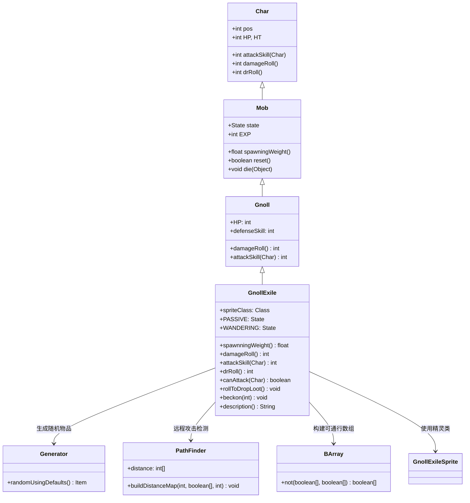

# GnollExile 源码详解

## 1. 基本信息

| 属性 | 值 |
|------|-----|
| **文件路径** | core/src/main/java/com/shatteredpixel/shatteredpixeldungeon/actors/mobs/GnollExile.java |
| **包名** | com.shatteredpixel.shatteredpixeldungeon.actors.mobs |
| **类类型** | class（非抽象） |
| **继承关系** | extends Gnoll |
| **代码行数** | 189 |
| **中文名称** | 狗头人放逐者 |

---

## 类职责

GnollExile（狗头人放逐者）是狗头人的强化变种，具有独特的被动-主动切换机制。它负责：

1. **被动观察**：初始处于被动状态，不会自动攻击玩家
2. **强化属性**：拥有普通狗头人2倍的生命值和50%的其他属性提升
3. **远程攻击**：攻击范围扩展到2格距离，增加战术复杂性
4. **丰富战利品**：被击败后掉落2-3个随机物品，提供高价值奖励
5. **状态转换**：受到负面Buff或被惊醒时会切换到主动攻击状态

**设计模式**：
- **状态模式**：通过自定义 `Passive` 和 `Wandering` 状态实现行为切换
- **装饰器模式**：在基础狗头人功能上添加特殊机制
- **条件触发模式**：基于特定条件（负面Buff、视野发现）触发状态转换

---

## 4. 继承与协作关系



---

## 实例字段表

| 字段名 | 类型 | 设置值 | 说明 |
|--------|------|--------|------|
| `spriteClass` | Class | GnollExileSprite.class | 角色精灵类 |
| `HP` / `HT` | int | 24 | 当前/最大生命值（普通狗头人2倍） |
| `defenseSkill` | int | 6 | 防御技能等级（比普通狗头人高50%） |
| `lootChance` | float | 0f | 掉落概率（重写为0，使用自定义掉落逻辑） |

### 状态定义

| 状态字段 | 类型 | 说明 |
|----------|------|------|
| `PASSIVE` | Passive | 自定义被动状态 |
| `WANDERING` | Wandering | 自定义游荡状态 |

---

## 7. 方法详解

### 构造块（Instance Initializer）

```java
{
    spriteClass = GnollExileSprite.class;
    
    PASSIVE = new Passive();
    WANDERING = new Wandering();
    state = PASSIVE;
    
    defenseSkill = 6;
    HP = HT = 24;
    
    lootChance = 0f; //see rollToDropLoot
}
```

**作用**：初始化狗头人放逐者的基础属性，设置强化数值和被动初始状态。

---

### damageRoll()

```java
@Override
public int damageRoll() {
    return Random.NormalIntRange(1, 10);
}
```

**方法作用**：计算攻击造成的伤害范围。

**伤害计算**：
- 最小伤害：`1`
- 最大伤害：`10`
- 平均伤害：`5.5`
- 比普通狗头人（1-6）有更高的伤害上限

---

### attackSkill(Char target)

```java
@Override
public int attackSkill(Char target) {
    return 15;
}
```

**方法作用**：返回攻击技能等级，影响命中率。

**参数**：
- `target` (Char)：攻击目标

**返回值**：
- `15`：比普通狗头人（10）高50%，确保更好的命中率

---

### canAttack(Char enemy)

```java
@Override
protected boolean canAttack(Char enemy) {
    if (Dungeon.level.adjacent(pos, enemy.pos)){
        return true;
    }
    
    if (Dungeon.level.distance(pos, enemy.pos) <= 2){
        boolean[] passable = BArray.not(Dungeon.level.solid, null);
        
        for (Char ch : Actor.chars()) {
            passable[ch.pos] = ch == this;
        }
        
        PathFinder.buildDistanceMap(enemy.pos, passable, 2);
        
        if (PathFinder.distance[pos] <= 2){
            return true;
        }
    }
    
    return super.canAttack(enemy);
}
```

**方法作用**：重写攻击判定，支持2格范围的远程攻击。

**攻击范围机制**：
1. **近战攻击**：相邻格子直接可以攻击
2. **远程攻击**：距离≤2格时进行路径检测
3. **路径验证**：使用 `PathFinder.buildDistanceMap()` 验证2格内是否有有效路径
4. **障碍处理**：将其他角色视为障碍物（除了自身）

**战术影响**：
- 玩家无法安全地在1格外观察
- 增加了战斗的复杂性和威胁性

---

### rollToDropLoot()

```java
@Override
public void rollToDropLoot() {
    super.rollToDropLoot();
    
    if (Dungeon.hero.lvl > maxLvl + 2) return;
    
    //drops 2 or 3 random items
    ArrayList<Item> items = new ArrayList<>();
    items.add(Generator.randomUsingDefaults());
    items.add(Generator.randomUsingDefaults());
    if (Random.Int(2) == 0) items.add(Generator.randomUsingDefaults());
    
    for (Item item : items){
        int ofs;
        do {
            ofs = PathFinder.NEIGHBOURS9[Random.Int(9)];
        } while (Dungeon.level.solid[pos + ofs] && !Dungeon.level.passable[pos + ofs]);
        Dungeon.level.drop(item, pos + ofs).sprite.drop(pos);
    }
}
```

**方法作用**：重写掉落逻辑，提供丰富的战利品。

**掉落机制**：
- **基础掉落**：先调用父类逻辑处理常规掉落
- **等级限制**：英雄等级超过 `maxLvl + 2` 时不掉落额外物品
- **物品数量**：固定2个物品，50%概率掉落第3个
- **物品类型**：使用 `Generator.randomUsingDefaults()` 生成随机物品
- **掉落位置**：在9个邻近格子中随机选择可通行位置

**经济价值**：
- 高价值敌人，鼓励玩家挑战
- 提供多样化的装备和物品

---

### beckon(int cell)

```java
@Override
public void beckon(int cell) {
    if (state != PASSIVE) {
        super.beckon(cell);
    } else {
        //still attracts if passive, but doesn't remove passive state
        target = cell;
    }
}
```

**方法作用**：处理被召唤时的行为，保持被动状态。

**特殊逻辑**：
- **非被动状态**：使用标准召唤逻辑
- **被动状态**：仅设置目标位置，不改变状态
- **设计意图**：允许被其他效果吸引但保持被动特性

---

### description()

```java
@Override
public String description() {
    String desc = super.description();
    if (state == PASSIVE){
        desc += "\n\n" + Messages.get(this, "desc_passive");
    } else {
        desc += "\n\n" + Messages.get(this, "desc_aggro");
    }
    return desc;
}
```

**方法作用**：根据当前状态返回不同的描述文本。

**状态相关描述**：
- **被动状态**：显示 `desc_passive` 消息
- **主动状态**：显示 `desc_aggro` 消息
- **用户体验**：帮助玩家理解当前行为状态

---

## AI状态机

### Passive 状态

**触发条件**：初始状态

**行为**：
- **负面Buff检测**：如果受到任何负面Buff，立即切换到 `WANDERING` 状态
- **视野通知**：当玩家进入视野时，每10回合显示一次被动状态消息
- **敌人发现**：发现敌人时显示警告消息并切换到主动状态
- **持续游荡**：即使在被动状态下也会正常游荡

**特殊实现**：
- `seenNotifyCooldown` 控制消息显示频率
- 使用 `GLog.p()` 显示被动消息，`GLog.w()` 显示警告消息

### Wandering 状态

**触发条件**：被动状态被打破（受到负面Buff或发现敌人）

**行为**：
- **标准AI**：使用标准的Mob游荡和追击逻辑
- **状态通知**：切换到此状态时显示警告消息
- **不可逆**：一旦切换到主动状态，无法回到被动状态

---

## 11. 使用示例

### 被动敌人配置

```java
// 创建狗头人放逐者
GnollExile exile = new GnollExile();
exile.pos = strategicPosition;  // 放置在关键位置

// 添加到场景
GameScene.add(exile);
Dungeon.level.mobs.add(exile);

// 玩家可以安全接近，但要注意不要触发负面状态
```

### 自定义掉落控制

```java
// 修改掉落逻辑
@Override
public void rollToDropLoot() {
    // 只在特定条件下掉落
    if (shouldDropExtraLoot()) {
        super.rollToDropLoot();
        dropSpecialItem();
    }
}
```

### 状态监控

```java
// 监控放逐者状态变化
if (exile.state == GnollExile.Passive.class) {
    // 安全处理逻辑
} else {
    // 战斗准备逻辑
}
```

---

## 注意事项

### 平衡性考虑

1. **风险与回报**：高生命值和伤害 vs. 丰富的战利品
2. **状态机制**：被动状态提供战术选择，但容易被意外触发
3. **等级适配**：`maxLvl` 限制确保在合适关卡出现

### 特殊机制

1. **远程攻击**：2格攻击范围显著增加威胁性
2. **负面Buff敏感**：任何Debuff都会触发主动状态
3. **丰富掉落**：2-3个随机物品提供高价值奖励

### 技术特点

1. **路径检测**：使用完整的路径查找算法验证远程攻击
2. **状态持久化**：完整的状态管理和消息系统
3. **性能优化**：冷却计时器避免频繁消息显示

### 战斗策略

**对玩家的威胁**：
- 被动状态下看似安全，但容易被意外激怒
- 2格攻击范围限制安全距离
- 高生命值需要更多输出

**对抗策略**：
- 避免使用Debuff技能
- 保持2格以上距离观察
- 准备足够的输出快速解决

---

## 最佳实践

### 被动-主动状态设计

```java
// 标准被动敌人模式
private class Passive extends Mob.Wandering {
    @Override
    public boolean act(boolean enemyInFOV, boolean justAlerted) {
        // 检查触发条件
        if (shouldBecomeActive()) {
            state = ACTIVE_STATE;
            return true;
        }
        // 被动行为
        return super.act(enemyInFOV, justAlerted);
    }
}
```

### 丰富掉落系统

```java
// 多物品掉落模式
@Override
public void rollToDropLoot() {
    // 基础掉落
    super.rollToDropLoot();
    
    // 条件性额外掉落
    if (meetsConditions()) {
        for (int i = 0; i < getDropCount(); i++) {
            dropItem(generateItem());
        }
    }
}
```

### 远程攻击实现

```java
// 扩展攻击范围模式
@Override
protected boolean canAttack(Char enemy) {
    if (isAdjacent(enemy)) return true;
    if (isInRange(enemy, extendedRange)) {
        return hasClearPath(enemy, extendedRange);
    }
    return false;
}
```

---

## 相关类

| 类名 | 关系 | 说明 |
|------|------|------|
| `Gnoll` | 父类 | 基础狗头人类 |
| `GnollExileSprite` | 精灵类 | 对应的视觉表现 |
| `Generator` | 工具类 | 随机物品生成 |
| `PathFinder` | 工具类 | 路径查找和距离计算 |
| `BArray` | 工具类 | 数组操作工具 |
| `Messages` | 本地化类 | 状态描述消息 |

---

## 消息键

| 键名 | 值 | 用途 |
|------|-----|------|
| `monsters.gnollexile.name` | gnoll exile | 怪物名称 |
| `monsters.gnollexile.desc` | A gnoll that has been cast out from its tribe. It watches warily but will not attack unless provoked. | 怪物描述 |
| `monsters.gnollexile.desc_passive` | This gnoll seems to be watching you carefully, but isn't hostile... yet. | 被动状态描述 |
| `monsters.gnollexile.desc_aggro` | The gnoll's eyes narrow as it prepares to attack! | 主动状态描述 |
| `monsters.gnollexile.seen_passive` | The gnoll exile watches you passively. | 被动状态消息 |
| `monsters.gnollexile.seen_aggro` | The gnoll exile notices you and becomes aggressive! | 主动状态消息 |