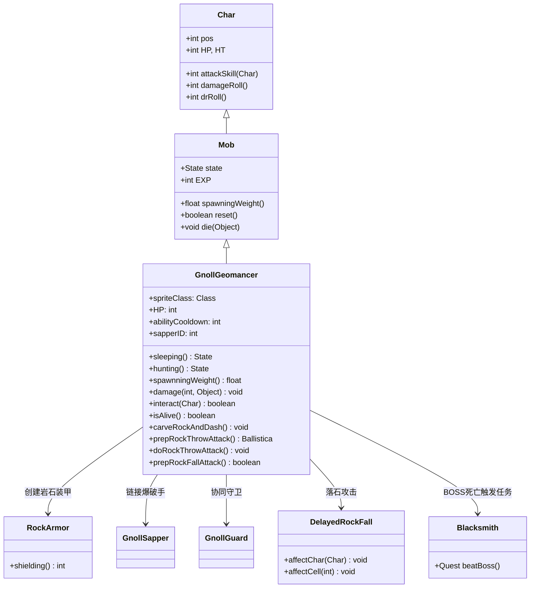

# GnollGeomancer 源码详解

## 1. 基本信息

| 属性 | 值 |
|------|-----|
| **文件路径** | core/src/main/java/com/shatteredpixel/shatteredpixeldungeon/actors/mobs/GnollGeomancer.java |
| **包名** | com.shatteredpixel.shatteredpixeldungeon.actors.mobs |
| **类类型** | class（非抽象） |
| **继承关系** | extends Mob |
| **代码行数** | 898 |
| **中文名称** | 狗头人地法师 |

---

## 类职责

GnollGeomancer（狗头人地法师）是游戏中的BOSS级敌人，具有复杂的岩石操控能力。它负责：

1. **岩石操控**：投掷巨石和召唤落石攻击玩家
2. **地形改造**：破坏墙壁、创造开阔区域、放置矿石巨石
3. **装甲保护**：拥有岩石装甲提供伤害减免和无敌机制
4. **协作战斗**：与狗头人爆破手和守卫协同作战
5. **阶段机制**：生命值分阶段，每个阶段有不同的能力和行为

**设计模式**：
- **状态模式**：通过自定义 `Sleeping` 和 `Hunting` 状态实现复杂AI
- **观察者模式**：使用静态方法供其他单位（如爆破手）调用其能力
- **组合模式**：包含多个内部类（RockArmor、Boulder、GnollRockFall等）

---

## 4. 继承与协作关系



---

## 实例字段表

| 字段名 | 类型 | 设置值 | 说明 |
|--------|------|--------|------|
| `spriteClass` | Class | GnollGeomancerSprite.class | 角色精灵类 |
| `HP` / `HT` | int | 150 | 当前/最大生命值 |
| `EXP` | int | 20 | 击败后获得的经验值 |
| `actPriority` | int | MOB_PRIO-1 | 行动优先级（比普通怪物晚行动） |
| `viewDistance` | int | 12 | 视野距离（可穿透高草和遮蔽） |

### 特殊属性

| 属性 | 说明 |
|------|------|
| `Property.BOSS` | BOSS单位，具有特殊地位 |
| `Property.IMMOVABLE` | 不可移动（但可通过技能主动移动） |

### 状态定义

| 状态字段 | 类型 | 说明 |
|----------|------|------|
| `SLEEPING` | Sleeping | 自定义休眠状态 |
| `HUNTING` | Hunting | 自定义追击状态 |

### 内部状态字段

| 字段名 | 类型 | 说明 |
|--------|------|------|
| `abilityCooldown` | int | 技能冷却计时器 |
| `sapperID` | int | 链接的爆破手ID |
| `throwingRocksFromPos` | int[] | 投掷岩石的起始位置 |
| `hits` | int | 被镐击中的次数计数器 |

---

## 7. 方法详解

### 构造块（Instance Initializer）

```java
{
    HP = HT = 150;
    spriteClass = GnollGeomancerSprite.class;
    
    EXP = 20;
    actPriority = MOB_PRIO-1;
    
    SLEEPING = new Sleeping();
    HUNTING = new Hunting();
    state = SLEEPING;
    
    viewDistance = 12;
    
    properties.add(Property.BOSS);
    properties.add(Property.IMMOVABLE);
}
```

**作用**：初始化地法师的基础属性，设置高生命值、BOSS属性和特殊视野。

---

### 核心战斗机制

#### 生命值阶段系统

地法师的生命值分为3个阶段（每50点为一阶段）：
- **阶段3（101-150HP）**：初始休眠状态
- **阶段2（51-100HP）**：激活战斗，获得岩石装甲
- **阶段1（1-50HP）**：最终阶段，可以被真正击败

#### 岩石装甲机制

- 通过 `RockArmor` Buff提供伤害减免
- 装甲值为25点，受到攻击时优先消耗装甲
- 只有当装甲被完全破坏后才能对地法师造成真实伤害
- 在休眠状态下免疫除镐子外的所有伤害

#### 技能系统

**岩石投掷**（Rock Throw）：
- 从地图上的矿石巨石中选择最近的目标投掷
- 造成6-12点伤害并施加麻痹效果
- 可击退目标到相邻格子

**落石攻击**（Rock Fall）：
- 在目标周围大范围召唤落石
- 同样造成6-12点伤害和麻痹
- 会在空地上生成新的矿石巨石

#### 移动机制 - "凿岩冲刺"

- 主动技能：`carveRockAndDash()`
- 寻找最近的爆破手出生点作为目标
- 最多移动12格距离
- 移动路径上的墙壁被破坏，生成开阔区域
- 可能改变地形并掉落暗金

---

### 关键方法分析

#### interact(Char c)

```java
@Override
public boolean interact(Char c) {
    // 镐子攻击的特殊处理
    if (c != Dungeon.hero || buff(RockArmor.class) == null) {
        return super.interact(c);
    } else {
        // 特殊的镐子伤害计算
        int dmg = p.damageRoll(GnollGeomancer.this);
        // 限制初始伤害不超过15
        if (wasSleeping) dmg = Math.min(dmg, 15);
        // 不能超过装甲值
        dmg = Math.min(dmg, buff(RockArmor.class).shielding());
        
        // 第3次击中时激活BOSS
        if (hits == 3){
            carveRockAndDash();  // 凿岩冲刺
            state = HUNTING;     // 切换到战斗状态
            BossHealthBar.assignBoss(this);  // 显示BOSS血条
            // 激活所有相关单位
            activateAllUnits();
        }
    }
}
```

**作用**：处理玩家使用镐子与地法师互动的特殊逻辑。

#### damage(int dmg, Object src)

```java
@Override
public void damage(int dmg, Object src) {
    // 计算当前生命值阶段
    int hpBracket = HT / 3;
    int curbracket = HP / hpBracket;
    
    // 更新最终阶段标志
    inFinalBracket = curbracket == 0;
    
    // 应用伤害
    super.damage(dmg, src);
    
    // 减少技能冷却
    abilityCooldown -= dmg/10f;
    
    // 检查是否进入新阶段
    if (newBracket != curbracket) {
        // 确保不会跨阶段死亡
        HP = (curbricket-1)*hpBracket + 1;
        
        // 执行凿岩冲刺并获得新装甲
        carveRockAndDash();
        Buff.affect(this, RockArmor.class).setShield(25);
    }
}
```

**作用**：重写伤害处理，实现阶段机制和技能冷却减少。

#### isAlive()

```java
@Override
public boolean isAlive() {
    // 在最终阶段前无法真正死亡
    return super.isAlive() || !inFinalBracket;
}
```

**作用**：确保地法师在进入最终生命值阶段前不会真正死亡。

#### act()

```java
@Override
protected boolean act() {
    if (throwingRocksFromPos != null){
        // 执行岩石投掷动画和效果
        for (int rock : throwingRocksFromPos) {
            if (rock != -1 && Dungeon.level.map[rock] == Terrain.MINE_BOULDER) {
                doRockThrowAttack(this, rock, throwingRockToPos);
            }
        }
        // 重置投掷状态
        throwingRocksFromPos = null;
        return false; // 等待动画完成
    } else {
        return super.act();
    }
}
```

**作用**：处理岩石投掷的多回合动画序列。

---

## AI状态机

### Sleeping 状态

**触发条件**：初始状态

**行为**：
- 完全被动，不会自动醒来
- 免疫除镐子和特定Buff外的所有效果
- 只能通过镐子攻击激活（需要3次命中）
- 描述文本显示特殊的休眠状态信息

### Hunting 状态

**触发条件**：被镐子击中3次或受到足够伤害

**行为**：
- **目标选择**：优先攻击英雄，失去视野时寻找新目标
- **技能使用**：根据冷却时间、生命值阶段和爆破手状态决定使用投掷还是落石
- **协作机制**：激活链接的爆破手和守卫单位
- **移动限制**：由于IMMOVABLE属性，主要通过技能移动而非普通移动

**技能决策逻辑**：
1. 如果目标靠近路障，优先使用岩石投掷
2. 避免连续使用落石攻击
3. 生命值越低，同时投掷的岩石数量越多（最多3个）
4. 有存活的爆破手时更频繁使用技能

---

## 协作系统

### 与爆破手的链接

- `linkSapper(GnollSapper)`：建立与爆破手的链接
- `hasSapper()`：检查是否有存活的链接爆破手
- `loseSapper()`：失去爆破手链接时的处理

**协作效果**：
- 地法师获得额外的无敌保护（`isInvulnerable`返回true）
- 爆破手存活时地法师更积极地使用技能
- 地法师移动时会将爆破手和守卫传送到附近

### 与守卫的互动

- 激活时会激怒所有狗头人守卫
- 守卫会向地法师位置聚集
- 形成完整的BOSS战斗群组

---

## 死亡与任务系统

### 死亡处理

```java
@Override
public void die(Object cause) {
    super.die(cause);
    Blacksmith.Quest.beatBoss();  // 触发铁匠任务
    // 清理附近的矿石巨石
    for (int i = 0; i < Dungeon.level.length(); i++){
        if (Dungeon.level.map[i] == Terrain.MINE_BOULDER && Dungeon.level.trueDistance(i, pos) <= 6){
            Level.set(i, Terrain.EMPTY_DECO);
            Splash.at(i, 0x555555, 15);
        }
    }
}
```

**作用**：死亡时触发任务完成并清理战场。

### 任务集成

- 作为铁匠任务的关键BOSS
- 死亡后解锁任务下一阶段
- 提供20点经验值奖励

---

## 11. 使用示例

### BOSS房间配置

```java
// 创建地法师BOSS
GnollGeomancer geomancer = new GnollGeomancer();
geomancer.pos = bossRoom.center();

// 创建配套单位
for (int i = 0; i < 3; i++) {
    GnollSapper sapper = new GnollSapper();
    sapper.spawnPos = getSpawnPosition(i);
    Room.spawnMob(sapper, room);
    
    GnollGuard guard = new GnollGuard();
    guard.pos = getGuardPosition(i);
    Room.spawnMob(guard, room);
}

GameScene.add(geomancer);
```

### 自定义难度调整

```java
// 调整地法师难度
public class EasyGnollGeomancer extends GnollGeomancer {
    @Override
    public int damageRoll() {
        return Random.NormalIntRange(2, 4);  // 降低基础伤害
    }
    
    @Override
    protected void carveRockAndDash() {
        // 缩短冲刺距离
        Ballistica path = new Ballistica(pos, dashPos, Ballistica.STOP_TARGET);
        if (path.dist > 8) {  // 原为12
            dashPos = path.path.get(8);
        }
        super.carveRockAndDash();
    }
}
```

---

## 注意事项

### 平衡性考虑

1. **多阶段设计**：防止玩家一次性击败，增加战斗持久性
2. **技能多样性**：投掷和落石提供不同的战术应对
3. **协作机制**：与爆破手、守卫形成完整的战斗生态系统
4. **地形互动**：破坏墙壁创造开阔区域，改变战斗环境

### 特殊机制

1. **无敌机制**：休眠状态下几乎完全无敌，必须使用镐子
2. **阶段保护**：每个生命值阶段都有保护机制
3. **视野穿透**：12格视野可穿透障碍物，防止玩家躲藏
4. **行动优先级**：MOB_PRIO-1确保在其他单位后行动，便于协调

### 技术特点

1. **静态方法共享**：技能逻辑通过静态方法供爆破手调用
2. **完整序列化**：支持游戏保存/加载的完整状态恢复
3. **性能优化**：使用缓存和预计算减少运行时开销
4. **视觉反馈**：丰富的特效和音效增强战斗体验

### 战斗策略

**对玩家的威胁**：
- 高生命值（150点）和阶段机制延长战斗
- 远程技能覆盖大范围，限制玩家移动
- 地形破坏可能困住玩家或创造不利位置
- 协作单位增加同时处理的难度

**对抗策略**：
- 必须使用镐子激活BOSS
- 优先击杀爆破手削弱地法师能力
- 利用路障阻挡投掷攻击
- 在开阔区域战斗避免被围攻

---

## 最佳实践

### 复杂BOSS设计

```java
// 多阶段BOSS模板
public class MultiPhaseBoss extends Mob {
    private int currentPhase = MAX_PHASES;
    
    @Override
    public void damage(int dmg, Object src) {
        super.damage(dmg, src);
        checkPhaseTransition();
    }
    
    private void checkPhaseTransition() {
        int newPhase = calculateCurrentPhase();
        if (newPhase != currentPhase) {
            onPhaseChange(newPhase);
            currentPhase = newPhase;
        }
    }
    
    protected void onPhaseChange(int newPhase) {
        // 阶段转换逻辑
    }
}
```

### 技能冷却管理

```java
// 基于伤害的冷却减少
@Override
public void damage(int dmg, Object src) {
    abilityCooldown -= dmg * cooldownReductionFactor;
    super.damage(dmg, src);
}
```

### 协作单位系统

```java
// 单位链接模式
private int partnerID = -1;

public void linkPartner(Char partner) {
    this.partnerID = partner.id();
    updateVisualState();
}

public boolean hasPartner() {
    return partnerID != -1 && Actor.findById(partnerID).isAlive();
}
```

---

## 相关类

| 类名 | 关系 | 说明 |
|------|------|------|
| `Mob` | 父类 | 所有怪物的基类 |
| `GnollSapper` | 协作类 | 狗头人爆破手，地法师的支援单位 |
| `GnollGuard` | 协作类 | 狗头人守卫，地法师的护卫单位 |
| `RockArmor` | 内部类 | 岩石装甲Buff，提供伤害减免 |
| `DelayedRockFall` | 内部类 | 落石攻击的延迟效果 |
| `Blacksmith.Quest` | 任务系统 | 铁匠任务，处理BOSS死亡事件 |
| `Terrain` | 枚举类 | 定义各种地形类型，包括MINE_BOULDER |

---

## 消息键

| 键名 | 值 | 用途 |
|------|-----|------|
| `monsters.gnollgeomancer.name` | gnoll geomancer | 怪物名称 |
| `monsters.gnollgeomancer.desc` | A powerful gnoll shaman that can manipulate stone and earth. It appears to be dormant... | 怪物描述 |
| `monsters.gnollgeomancer.desc_sleeping` | The geomancer seems to be in a deep slumber. Perhaps a pickaxe could wake it? | 休眠状态描述 |
| `monsters.gnollgeomancer.desc_armor` | The geomancer is protected by a thick layer of rock armor. | 装甲状态描述 |
| `monsters.gnollgeomancer.desc_armor_sapper` | The geomancer's rock armor pulses with energy from its linked sapper. | 有爆破手时的装甲描述 |
| `monsters.gnollgeomancer.warning` | The geomancer stirs slightly... | 第一次击中警告 |
| `monsters.gnollgeomancer.alert` | The geomancer awakens! | 激活BOSS警告 |
| `monsters.gnollgeomancer.rock_kill` | You were crushed by the geomancer's boulder! | 岩石击杀消息 |
| `monsters.gnollgeomancer.rockfall_kill` | You were buried under the geomancer's rockfall! | 落石击杀消息 |