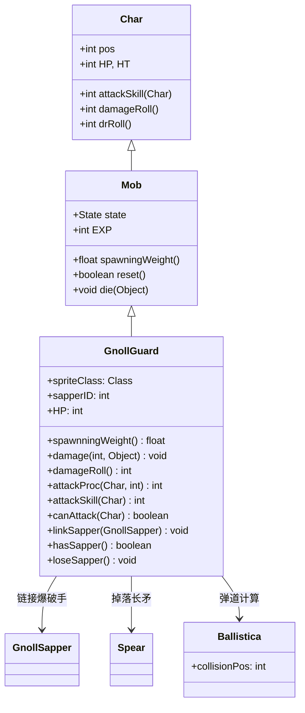

# GnollGuard 源码详解

## 1. 基本信息

| 属性 | 值 |
|------|-----|
| **文件路径** | core/src/main/java/com/shatteredpixel/shatteredpixeldungeon/actors/mobs/GnollGuard.java |
| **包名** | com.shatteredpixel.shatteredpixeldungeon.actors.mobs |
| **类类型** | class（非抽象） |
| **继承关系** | extends Mob |
| **代码行数** | 152 |
| **中文名称** | 狗头人守卫 |

---

## 类职责

GnollGuard（狗头人守卫）是狗头人地法师战斗群组的重要成员，具有长矛远程攻击能力。它负责：

1. **远程攻击**：使用长矛进行2格距离的远程攻击，伤害显著高于近战
2. **协作防御**：与狗头人爆破手链接，获得75%的伤害减免
3. **护卫行为**：自动向链接的爆破手位置移动，提供保护
4. **装备掉落**：有10%概率掉落长矛武器，为玩家提供装备

**设计模式**：
- **组合模式**：通过 `linkSapper()` 方法与爆破手建立协作关系
- **条件伤害模式**：根据距离和链接状态动态调整伤害和防御
- **自定义状态模式**：重写 `Wandering` 状态实现护卫行为

---

## 4. 继承与协作关系



---

## 实例字段表

| 字段名 | 类型 | 设置值 | 说明 |
|--------|------|--------|------|
| `spriteClass` | Class | GnollGuardSprite.class | 角色精灵类 |
| `HP` / `HT` | int | 35 | 当前/最大生命值 |
| `defenseSkill` | int | 15 | 防御技能等级 |
| `EXP` | int | 7 | 击败后获得的经验值 |
| `maxLvl` | int | -2 | 最大出现等级（负值表示不会升级） |
| `loot` | Class | Spear.class | 掉落物品类型 |
| `lootChance` | float | 0.1f | 掉落概率（10%） |
| `sapperID` | int | -1 | 链接的爆破手ID（-1表示无链接） |

### 状态定义

| 状态字段 | 类型 | 说明 |
|----------|------|------|
| `WANDERING` | Wandering | 自定义游荡状态 |

---

## 7. 方法详解

### 构造块（Instance Initializer）

```java
{
    spriteClass = GnollGuardSprite.class;
    
    HP = HT = 35;
    defenseSkill = 15;
    
    EXP = 7;
    maxLvl = -2;
    
    loot = Spear.class;
    lootChance = 0.1f;
    
    WANDERING = new Wandering();
}
```

**作用**：初始化狗头人守卫的基础属性，设置中等生命值、高防御和特殊掉落。

---

### damage(int dmg, Object src)

```java
@Override
public void damage(int dmg, Object src) {
    if (hasSapper()) dmg /= 4;
    super.damage(dmg, src);
}
```

**方法作用**：重写伤害处理，实现与爆破手链接时的伤害减免。

**伤害减免机制**：
- **有链接爆破手**：受到伤害减少75%（除以4）
- **无链接爆破手**：正常受到全额伤害
- **战术意义**：鼓励玩家优先击杀爆破手来削弱守卫

---

### damageRoll()

```java
@Override
public int damageRoll() {
    if (enemy != null && !Dungeon.level.adjacent(pos, enemy.pos)){
        return Random.NormalIntRange(16, 22);
    } else {
        return Random.NormalIntRange(6, 12);
    }
}
```

**方法作用**：根据攻击距离返回不同的伤害范围。

**伤害计算**：
- **远程攻击**（2格距离）：16-22点伤害（平均19点）
- **近战攻击**（相邻）：6-12点伤害（平均9点）
- **伤害倍数**：远程伤害约是近战的2.1倍

---

### attackProc(Char enemy, int damage)

```java
@Override
public int attackProc(Char enemy, int damage) {
    int dmg = super.attackProc(enemy, damage);
    if (enemy == Dungeon.hero && !Dungeon.level.adjacent(pos, enemy.pos) && dmg > 12){
        GLog.n(Messages.get(this, "spear_warn"));
    }
    return dmg;
}
```

**方法作用**：远程攻击造成高伤害时显示警告消息。

**警告条件**：
- 攻击目标是英雄
- 进行远程攻击（非相邻）
- 造成的伤害大于12点
- **用户体验**：提醒玩家注意远程威胁

---

### canAttack(Char enemy)

```java
@Override
protected boolean canAttack(Char enemy) {
    return Dungeon.level.distance(enemy.pos, pos) <= 2
            && new Ballistica(pos, enemy.pos, Ballistica.PROJECTILE).collisionPos == enemy.pos
            && new Ballistica(enemy.pos, pos, Ballistica.PROJECTILE).collisionPos == pos;
}
```

**方法作用**：判断是否可以攻击敌人，实现精确的远程攻击判定。

**攻击条件**：
1. **距离限制**：敌人必须在2格范围内
2. **双向视线**：从守卫到敌人和从敌人到守卫都必须有清晰的弹道路径
3. **无遮挡**：路径上不能有墙壁或其他障碍物

**战术影响**：
- 玩家无法通过简单的拐角躲避远程攻击
- 需要利用地形阻挡视线才能安全接近

---

### 协作系统方法

#### linkSapper(GnollSapper sapper)

```java
public void linkSapper(GnollSapper sapper){
    this.sapperID = sapper.id();
    if (sprite instanceof GnollGuardSprite){
        ((GnollGuardSprite) sprite).setupArmor();
    }
}
```

**作用**：建立与爆破手的链接，并更新视觉装甲效果。

#### hasSapper()

```java
public boolean hasSapper(){
    return sapperID != -1
            && Actor.findById(sapperID) instanceof GnollSapper
            && ((GnollSapper)Actor.findById(sapperID)).isAlive();
}
```

**作用**：检查是否有存活的链接爆破手。

#### loseSapper()

```java
public void loseSapper(){
    if (sapperID != -1){
        sapperID = -1;
        if (sprite instanceof GnollGuardSprite){
            ((GnollGuardSprite) sprite).loseArmor();
        }
    }
}
```

**作用**：失去爆破手链接时移除装甲视觉效果。

---

## AI状态机

### Wandering 状态

**触发条件**：默认AI状态

**行为**：
- **普通游荡**：无爆破手链接时使用标准随机游荡
- **护卫行为**：有爆破手链接时自动向爆破手位置移动
- **目标导向**：始终尝试保持在爆破手附近提供保护

**实现细节**：
```java
@Override
protected int randomDestination() {
    if (hasSapper()){
        return ((GnollSapper)Actor.findById(sapperID)).pos;
    } else {
        return super.randomDestination();
    }
}
```

---

## 11. 使用示例

### BOSS群组配置

```java
// 创建守卫-爆破手配对
GnollSapper sapper = new GnollSapper();
GnollGuard guard = new GnnollGuard();

// 建立链接
guard.linkSapper(sapper);
sapper.linkPartner(guard);

// 设置位置
sapper.pos = sapperPosition;
guard.pos = guardPosition;

GameScene.add(sapper);
GameScene.add(guard);
```

### 自定义变体

```java
// 强化版守卫
public class EliteGnollGuard extends GnollGuard {
    @Override
    public int damageRoll() {
        if (enemy != null && !Dungeon.level.adjacent(pos, enemy.pos)){
            return Random.NormalIntRange(20, 28);  // 更高远程伤害
        } else {
            return Random.NormalIntRange(8, 16);   // 更高近战伤害
        }
    }
    
    @Override
    public void damage(int dmg, Object src) {
        if (hasSapper()) dmg /= 2;  // 50%减免而非75%
        super.damage(dmg, src);
    }
}
```

---

## 注意事项

### 平衡性考虑

1. **协作依赖**：守卫的强大完全依赖于爆破手的存在
2. **远程威胁**：16-22点远程伤害对中期玩家来说构成显著威胁
3. **装备价值**：10%的长矛掉落率提供有价值的武器奖励

### 特殊机制

1. **双向视线检测**：确保远程攻击的公平性和可预测性
2. **伤害分层**：远程和近战伤害差异巨大，影响战斗策略
3. **视觉反馈**：链接状态通过装甲视觉效果清晰显示

### 技术特点

1. **完整的序列化**：支持游戏保存/加载的链接状态恢复
2. **高效的查找**：使用Actor.findById()快速定位链接单位
3. **性能优化**：避免在每次攻击时重复计算链接状态

### 战斗策略

**对玩家的威胁**：
- 远程高伤害迫使玩家谨慎接近
- 与爆破手的协作形成攻防一体的战斗组合
- 75%伤害减免使其在有爆破手时极其耐打

**对抗策略**：
- 优先击杀爆破手削弱守卫的防御
- 利用地形阻挡视线避免远程攻击
- 快速近身战斗利用其较低的近战伤害

---

## 最佳实践

### 协作单位设计

```java
// 标准协作模式
private int partnerID = -1;

public void linkPartner(Unit partner) {
    this.partnerID = partner.id();
    updateVisualState();
}

public boolean hasPartner() {
    return partnerID != -1 && isValidPartner();
}

private boolean isValidPartner() {
    Char partner = Actor.findById(partnerID);
    return partner instanceof ExpectedType && partner.isAlive();
}
```

### 距离相关伤害

```java
// 距离分层伤害模式
@Override
public int damageRoll() {
    if (isAtRange(target, range)) {
        return calculateRangedDamage();
    } else {
        return calculateMeleeDamage();
    }
}
```

### 双向视线检测

```java
// 公平的远程攻击判定
@Override
protected boolean canAttack(Char enemy) {
    return distance <= maxRange
        && hasClearLineOfSight(pos, enemy.pos)
        && hasClearLineOfSight(enemy.pos, pos);
}
```

---

## 相关类

| 类名 | 关系 | 说明 |
|------|------|------|
| `Mob` | 父类 | 所有怪物的基类 |
| `GnollSapper` | 协作类 | 狗头人爆破手，守卫的保护对象 |
| `Spear` | 掉落物品 | 长矛武器，可能的掉落物 |
| `Ballistica` | 工具类 | 弹道计算，用于视线检测 |
| `GnollGuardSprite` | 精灵类 | 对应的视觉表现 |

---

## 消息键

| 键名 | 值 | 用途 |
|------|-----|------|
| `monsters.gnollguard.name` | gnoll guard | 怪物名称 |
| `monsters.gnollguard.desc` | A heavily armored gnoll warrior wielding a long spear. It appears to be guarding something... | 怪物描述 |
| `monsters.gnollguard.desc_armor` | The guard's armor glows with protective energy from its linked sapper. | 装甲状态描述 |
| `monsters.gnollguard.spear_warn` | The guard thrusts its spear at you! | 远程攻击警告 |