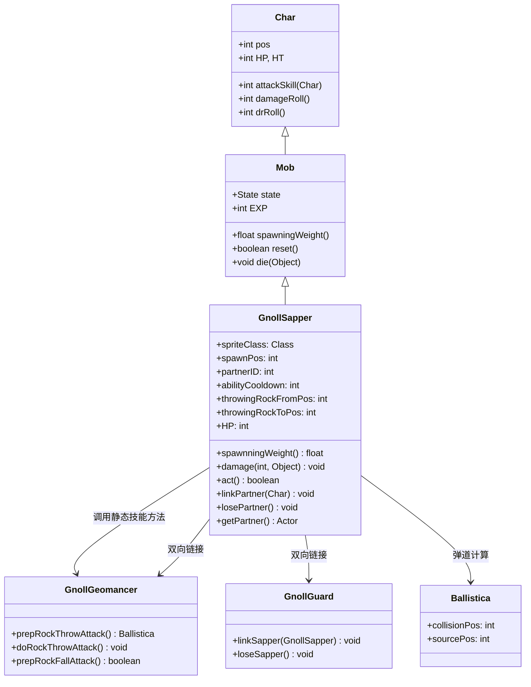

# GnollSapper 源码详解

## 1. 基本信息

| 属性 | 值 |
|------|-----|
| **文件路径** | core/src/main/java/com/shatteredpixel/shatteredpixeldungeon/actors/mobs/GnollSapper.java |
| **包名** | com.shatteredpixel.shatteredpixeldungeon.actors.mobs |
| **类类型** | class（非抽象） |
| **继承关系** | extends Mob |
| **代码行数** | 269 |
| **中文名称** | 狗头人爆破手 |

---

## 类职责

GnollSapper（狗头人爆破手）是狗头人地法师战斗群组的核心支援单位，具有岩石操控能力。它负责：

1. **岩石攻击**：投掷巨石和召唤落石攻击玩家，继承地法师的技能系统
2. **协作链接**：与地法师或守卫建立双向链接，提供伤害减免和协同作战
3. **出生点锚定**：始终围绕出生点活动，不会远离初始位置太远
4. **技能共享**：重用地法师的静态方法实现完整的岩石技能系统
5. **行动协调**：设置较低的行动优先级，便于与其他单位形成配合

**设计模式**：
- **组合模式**：通过链接机制与地法师/守卫形成协作关系
- **委托模式**：重用地法师的静态方法实现复杂的岩石技能逻辑
- **锚定行为模式**：围绕出生点活动，限制移动范围

---

## 4. 继承与协作关系



---

## 实例字段表

| 字段名 | 类型 | 设置值 | 说明 |
|--------|------|--------|------|
| `spriteClass` | Class | GnollSapperSprite.class | 角色精灵类 |
| `HP` / `HT` | int | 45 | 当前/最大生命值 |
| `defenseSkill` | int | 15 | 防御技能等级 |
| `EXP` | int | 10 | 击败后获得的经验值 |
| `maxLvl` | int | -2 | 最大出现等级（负值表示不会升级） |
| `actPriority` | int | MOB_PRIO-1 | 行动优先级（比普通怪物晚行动） |
| `spawnPos` | int | - | 出生点位置（关卡生成时设置） |
| `partnerID` | int | -1 | 链接伙伴的ID（地法师或守卫） |

### 特殊属性

| 属性 | 说明 |
|------|------|
| `Property.MINIBOSS` | 小型BOSS单位，具有特殊地位 |

### 技能相关字段

| 字段名 | 类型 | 说明 |
|--------|------|------|
| `abilityCooldown` | int | 技能冷却计时器 |
| `lastAbilityWasRockfall` | boolean | 上次技能是否为落石攻击 |
| `throwingRockFromPos` | int | 投掷岩石的起始位置 |
| `throwingRockToPos` | int | 投掷岩石的目标位置 |

### 状态定义

| 状态字段 | 类型 | 说明 |
|----------|------|------|
| `HUNTING` | Hunting | 自定义追击状态 |
| `WANDERING` | Wandering | 自定义游荡状态 |

---

## 7. 方法详解

### 构造块（Instance Initializer）

```java
{
    actPriority = Actor.MOB_PRIO-1;
    spriteClass = GnollSapperSprite.class;
    
    HP = HT = 45;
    defenseSkill = 15;
    
    EXP = 10;
    maxLvl = -2;
    
    properties.add(Property.MINIBOSS);
    
    HUNTING = new Hunting();
    WANDERING = new Wandering();
    state = SLEEPING;
}
```

**作用**：初始化爆破手的基础属性，设置中等生命值、MINIBOSS属性和特殊行动优先级。

---

### 协作链接系统

#### linkPartner(Char c)

```java
public void linkPartner(Char c){
    losePartner();
    partnerID = c.id();
    if (c instanceof GnollGuard) {
        ((GnollGuard) c).linkSapper(this);
    } else if (c instanceof GnollGeomancer){
        ((GnollGeomancer) c).linkSapper(this);
    }
}
```

**作用**：建立与地法师或守卫的双向链接。

**链接机制**：
- **断开旧链接**：调用 `losePartner()` 确保只有一个有效链接
- **建立新链接**：根据伙伴类型调用对应的链接方法
- **双向同步**：确保双方都记录对方的ID

#### losePartner()

```java
public void losePartner(){
    if (partnerID != -1){
        if (Actor.findById(partnerID) instanceof GnollGuard) {
            ((GnollGuard) Actor.findById(partnerID)).loseSapper();
        } else if (Actor.findById(partnerID) instanceof GnollGeomancer) {
            ((GnollGeomancer) Actor.findById(partnerID)).loseSapper();
        }
        partnerID = -1;
    }
}
```

**作用**：断开与伙伴的链接，并通知伙伴更新状态。

#### getPartner()

```java
public Actor getPartner(){
    return Actor.findById(partnerID);
}
```

**作用**：获取当前链接的伙伴对象。

---

### 核心战斗机制

#### 网球技能系统

爆破手完全重用地法师的技能系统：

- **岩石投掷**：调用 `GnollGeomancer.prepRockThrowAttack()` 和 `doRockThrowAttack()`
- **落石攻击**：调用 `GnollGeomancer.prepRockFallAttack()`
- **技能决策**：使用相同的50/50随机选择逻辑，但永远不会连续使用落石

**技能差异**：
- **冷却时间**：4-6回合（比地法师的3-5略长）
- **落石范围**：2格半径（比地法师的小）
- **伤害输出**：基础近战伤害较低（1-6），主要依赖技能

#### 损伤与冷却

```java
@Override
public void damage(int dmg, Object src) {
    super.damage(dmg, src);
    abilityCooldown -= dmg/10f;
}
```

**作用**：受到伤害时减少技能冷却时间，鼓励玩家积极攻击。

---

### AI状态机

#### Hunting 状态

**触发条件**：发现敌人

**行为**：
- **伙伴激活**：如果链接的地法师或守卫处于休眠状态，会唤醒它们
- **协同攻击**：确保伙伴也以同一目标为目标
- **技能使用**：根据冷却时间和位置决定使用投掷还是落石
- **移动限制**：不会主动接近敌人，只在能攻击范围内进行近战

**特殊逻辑**：
- **出生点约束**：如果追踪目标距离出生点超过3格，会返回出生点
- **伙伴验证**：检查伙伴是否仍为友方，否则断开链接
- **路障偏好**：当目标靠近路障时优先使用岩石投掷

#### Wandering 状态

**触发条件**：未发现敌人

**行为**：
- **锚定行为**：总是尝试返回出生点位置
- **区域限制**：不会远离出生点太远

**实现**：
```java
@Override
protected int randomDestination() {
    return spawnPos;
}
```

---

### act() 方法

```java
@Override
protected boolean act() {
    if (throwingRockFromPos != -1){
        // 执行岩石投掷动画
        if (attacked) {
            GnollGeomancer.doRockThrowAttack(this, throwingRockFromPos, throwingRockToPos);
        }
        throwingRockFromPos = -1;
        return !attacked;
    } else {
        return super.act();
    }
}
```

**作用**：处理岩石投掷的多回合动画序列，确保技能效果正确执行。

---

## 11. 使用示例

### BOSS群组集成

```java
// 在关卡生成中创建爆破手
GnollSapper sapper = new GnollSapper();
sapper.spawnPos = designatedSpawnPosition;  // 设置出生点
sapper.pos = initialPosition;

// 链接到地法师
sapper.linkPartner(geomancer);

GameScene.add(sapper);
Dungeon.level.mobs.add(sapper);
```

### 自定义变体

```java
// 强化版爆破手
public class EliteGnollSapper extends GnollSapper {
    @Override
    public int damageRoll() {
        return Random.NormalIntRange(3, 8);  // 提高基础伤害
    }
    
    @Override
    protected boolean act() {
        // 更频繁的技能使用
        abilityCooldown = Math.max(0, abilityCooldown - 1);
        return super.act();
    }
}
```

---

## 注意事项

### 平衡性考虑

1. **支援定位**：45点生命值适中，但主要价值在于技能和协作
2. **技能依赖**：技能效果完全依赖地图上的矿石巨石存在
3. **出生点限制**：不会远离出生点，防止过度扩散威胁
4. **经验奖励**：10点经验值反映其MINIBOSS地位

### 特殊机制

1. **技能共享**：通过静态方法重用地法师的复杂技能逻辑
2. **双向链接**：与地法师/守卫的双向状态同步
3. **行动协调**：MOB_PRIO-1确保在其他单位后行动，便于配合
4. **出生点锚定**：始终围绕出生点活动，形成固定的威胁区域

### 技术特点

1. **高效复用**：避免重复实现复杂的岩石技能系统
2. **完整序列化**：支持游戏保存/加载的所有状态字段
3. **性能优化**：使用预计算和缓存减少运行时开销
4. **错误处理**：伙伴验证机制防止无效链接

### 战斗策略

**对玩家的威胁**：
- 远程技能覆盖范围大，限制玩家移动
- 与地法师/守卫的协作形成完整的战斗生态系统
- 出生点锚定使其成为固定的技能威胁点

**对抗策略**：
- 优先击杀以削弱整个战斗群组
- 利用其不主动接近的特性进行远程消耗
- 破坏地图上的矿石巨石限制其技能使用

---

## 最佳实践

### 技能复用模式

```java
// 复杂技能系统复用
public class SkillUser extends Mob {
    public void useSharedSkill() {
        // 调用其他类的静态方法
        ComplexSystem.executeSkill(this, target);
    }
}
```

### 双向链接模式

```java
// 安全的双向链接
public void linkPartner(Unit partner) {
    this.partnerID = partner.id();
    partner.linkBack(this);  // 伙伴也记录此单位
}

public void losePartner() {
    if (isValidPartner()) {
        partner.unlinkBack(this);
    }
    partnerID = -1;
}
```

### 锚定行为模式

```java
// 围绕特定点活动
private int anchorPoint;

@Override
protected int randomDestination() {
    // 总是返回锚定点
    return anchorPoint;
}

// 限制最大距离
if (distanceFromAnchor() > maxDistance) {
    return moveToAnchor();
}
```

---

## 相关类

| 类名 | 关系 | 说明 |
|------|------|------|
| `Mob` | 父类 | 所有怪物的基类 |
| `GnollGeomancer` | 技能提供者 | 提供岩石技能的静态方法 |
| `GnollGuard` | 协作伙伴 | 可链接的守卫单位 |
| `Ballistica` | 工具类 | 弹道计算，用于技能瞄准 |
| `Terrain` | 枚举类 | 定义MINE_BOULDER等地形类型 |
| `GnollSapperSprite` | 精灵类 | 对应的视觉表现 |

---

## 消息键

| 键名 | 值 | 用途 |
|------|-----|------|
| `monsters.gnollsapper.name` | gnoll sapper | 怪物名称 |
| `monsters.gnollsapper.desc` | A gnoll explosives expert that can manipulate stone and earth. It seems to be focused on a specific location... | 怪物描述 |