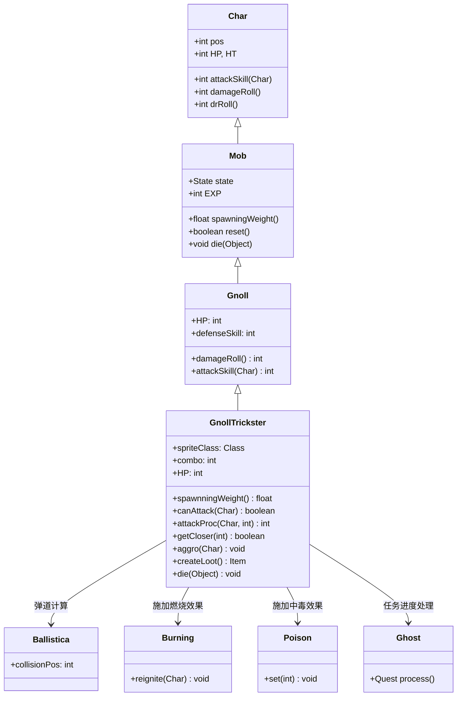

# GnollTrickster 源码详解

## 1. 基本信息

| 属性 | 值 |
|------|-----|
| **文件路径** | core/src/main/java/com/shatteredpixel/shatteredpixeldungeon/actors/mobs/GnollTrickster.java |
| **包名** | com.shatteredpixel.shatteredpixeldungeon.actors.mobs |
| **类类型** | class（非抽象） |
| **继承关系** | extends Gnoll |
| **代码行数** | 176 |
| **中文名称** | 狗头人诡术师 |

---

## 类职责

GnollTrickster（狗头人诡术师）是狗头人的特殊变种，具有远程攻击和连击增伤机制。它负责：

1. **远程攻击**：优先使用远程攻击而非近战，保持安全距离
2. **连击系统**：连续命中玩家会增加伤害效果，形成威胁递增机制
3. **状态施加**：根据连击数施加中毒或燃烧效果，提高持续伤害
4. **智能游荡**：在游荡时优先选择接近英雄的位置
5. **任务集成**：死亡时触发幽灵任务进度

**设计模式**：
- **装饰器模式**：在基础狗头人功能上添加特殊机制
- **连击状态模式**：通过 `combo` 字段实现递增的伤害效果
- **智能行为模式**：改进的游荡AI选择更优位置

---

## 4. 继承与协作关系



---

## 实例字段表

| 字段名 | 类型 | 设置值 | 说明 |
|--------|------|--------|------|
| `spriteClass` | Class | GnollTricksterSprite.class | 角色精灵类 |
| `HP` / `HT` | int | 20 | 当前/最大生命值（比普通狗头人多8点） |
| `defenseSkill` | int | 5 | 防御技能等级（比普通狗头人高1点） |
| `EXP` | int | 5 | 击败后获得的经验值（比普通狗头人多3点） |
| `loot` | Category | Generator.Category.MISSILE | 掉落物品类别（投掷武器） |
| `lootChance` | float | 1f | 掉落概率（100%必掉） |

### 特殊属性

| 属性 | 说明 |
|------|------|
| `Property.MINIBOSS` | 小型BOSS单位，具有特殊地位 |

### 状态管理

| 字段名 | 类型 | 默认值 | 说明 |
|--------|------|--------|------|
| `combo` | int | 0 | 连击计数器，记录连续命中次数 |

### 状态定义

| 状态字段 | 类型 | 说明 |
|----------|------|------|
| `WANDERING` | Wandering | 自定义游荡状态 |

---

## 7. 方法详解

### 构造块（Instance Initializer）

```java
{
    spriteClass = GnollTricksterSprite.class;
    
    HP = HT = 20;
    defenseSkill = 5;
    
    EXP = 5;
    
    WANDERING = new Wandering();
    state = WANDERING;
    
    loot = Generator.Category.MISSILE;
    lootChance = 1f;
    
    properties.add(Property.MINIBOSS);
}
```

**作用**：初始化诡术师的基础属性，设置强化数值、MINIBOSS属性和100%投掷武器掉落。

---

### canAttack(Char enemy)

```java
@Override
protected boolean canAttack(Char enemy) {
    return !Dungeon.level.adjacent(pos, enemy.pos)
            && (super.canAttack(enemy) || new Ballistica(pos, enemy.pos, Ballistica.PROJECTILE).collisionPos == enemy.pos);
}
```

**方法作用**：重写攻击判定，强制使用远程攻击。

**攻击逻辑**：
- **条件1**：敌人不能在相邻格子（强制远程）
- **条件2**：要么满足标准远程条件，要么有清晰的弹道路径
- **战术意义**：确保诡术师始终保持距离，避免近战

---

### attackProc(Char enemy, int damage)

```java
@Override
public int attackProc(Char enemy, int damage) {
    damage = super.attackProc(enemy, damage);
    
    if (combo >= 1){
        Statistics.questScores[0] -= 50;  // 连击惩罚
    }
    
    combo++;  // 连击计数增加
    int effect = Random.Int(4) + combo;  // 效果强度 = 随机(0-3) + 连击数
    
    if (effect > 2) {
        if (effect >= 6 && enemy.buff(Burning.class) == null) {
            // 施加燃烧效果
            if (Dungeon.level.flamable[enemy.pos]) {
                GameScene.add(Blob.seed(enemy.pos, 4, Fire.class));
            }
            Buff.affect(enemy, Burning.class).reignite(enemy);
        } else {
            // 施加中毒效果
            Buff.affect(enemy, Poison.class).set((effect - 2));
        }
    }
    return damage;
}
```

**方法作用**：实现连击增伤和状态施加机制。

**连击系统**：
- **连击计数**：每次攻击成功都增加 `combo`
- **效果强度**：`Random.Int(4) + combo`，最低为连击数，最高为连击数+3
- **效果阈值**：
  - `effect <= 2`：无额外效果
  - `3 <= effect < 6`：施加 `(effect - 2)` 回合中毒
  - `effect >= 6`：施加燃烧效果（如果目标没有燃烧）

**连击惩罚**：
- 连续被击中会减少任务分数（`Statistics.questScores[0] -= 50`）

---

### getCloser(int target)

```java
@Override
protected boolean getCloser(int target) {
    combo = 0; // 移动时重置连击
    if (state == HUNTING) {
        return enemySeen && getFurther(target);  // 追击状态下反而远离
    } else {
        return super.getCloser(target);
    }
}
```

**方法作用**：重写移动逻辑，适应远程战斗风格。

**移动策略**：
- **重置连击**：任何移动都会重置 `combo`，鼓励玩家主动进攻打断连击
- **追击远离**：在HUNTING状态下，看到敌人时反而尝试远离（保持远程距离）
- **普通接近**：其他状态下正常接近目标

---

### aggro(Char ch)

```java
@Override
public void aggro(Char ch) {
    // cannot be aggroed to something it can't see
    if (ch == null || fieldOfView == null
            || fieldOfView.length != Dungeon.level.length() || fieldOfView[ch.pos]) {
        super.aggro(ch);
    }
}
```

**方法作用**：限制仇恨机制，只能对视野内的目标产生仇恨。

**设计意图**：
- 防止被不可见的目标吸引
- 保持远程单位的行为一致性
- 避免意外的AI行为

---

### createLoot()

```java
@Override
public Item createLoot() {
    MissileWeapon drop = (MissileWeapon)super.createLoot();
    drop.level(0);           // 重置为0级
    if (drop.hasCurseEnchant()){  // 移除诅咒附魔
        drop.enchant(null);
    }
    drop.cursed = false;     // 确保不被诅咒
    drop.identify(false);    // 标记为已识别
    drop.quantity((drop.quantity()+1)/2);  // 数量减半（向上取整）
    return drop;
}
```

**方法作用**：自定义掉落物品，确保投掷武器的质量。

**掉落优化**：
- **等级重置**：确保掉落的是基础等级武器
- **移除诅咒**：保证掉落物品可用性
- **预识别**：节省玩家识别步骤
- **数量调整**：投掷武器数量减半但保证至少1个

---

### die(Object cause)

```java
@Override
public void die(Object cause) {
    super.die(cause);
    Ghost.Quest.process();  // 触发幽灵任务进度
}
```

**方法作用**：死亡时处理任务系统集成。

**任务集成**：
- 作为幽灵任务的关键目标
- 死亡后推进任务进度
- 可能解锁新的任务阶段

---

### Wandering 状态

```java
protected class Wandering extends Mob.Wandering{
    @Override
    protected int randomDestination() {
        // 选择两个随机位置中更接近英雄的那个
        int pos1 = super.randomDestination();
        int pos2 = super.randomDestination();
        PathFinder.buildDistanceMap(Dungeon.hero.pos, Dungeon.level.passable);
        if (PathFinder.distance[pos2] < PathFinder.distance[pos1]){
            return pos2;
        } else {
            return pos1;
        }
    }
}
```

**方法作用**：改进游荡AI，优先选择接近英雄的位置。

**智能行为**：
- **双选项比较**：生成两个随机位置并选择更优的
- **距离优化**：总是选择距离英雄更近的位置
- **战术意义**：增加遇到玩家的概率，提高游戏节奏

---

## 11. 使用示例

### 任务目标配置

```java
// 创建幽灵任务的诡术师目标
GnollTrickster trickster = new GnollTrickster();
trickster.pos = targetPosition;

// 添加到场景
GameScene.add(trickster);
Dungeon.level.mobs.add(trickster);

// 任务系统会自动跟踪其状态
```

### 自定义难度调整

```java
// 调整连击机制
public class EasyGnollTrickster extends GnollTrickster {
    @Override
    public int attackProc(Char enemy, int damage) {
        // 降低连击增长速度
        if (Random.Int(3) == 0) {  // 33%概率才增加连击
            combo++;
        }
        // 其余逻辑保持不变
        return super.attackProc(enemy, damage);
    }
}
```

---

## 注意事项

### 平衡性考虑

1. **连击风险**：连续被击中会导致伤害效果指数级增长
2. **远程优势**：强制远程攻击使其更难被近身击败
3. **100%掉落**：保证玩家获得投掷武器奖励
4. **MINIBOSS定位**：20点生命值配合连击机制提供适当挑战

### 特殊机制

1. **连击重置**：移动会重置连击，鼓励积极进攻
2. **视野限制**：只能对可见目标产生仇恨，防止意外行为
3. **智能游荡**：主动寻找接近玩家的位置
4. **任务集成**：与幽灵任务系统的深度集成

### 技术特点

1. **完整的序列化**：支持保存/加载的连击状态恢复
2. **性能优化**：距离计算只在必要时执行
3. **错误处理**：视野检查防止空指针异常
4. **掉落质量**：确保掉落物品的可用性和价值

### 战斗策略

**对玩家的威胁**：
- 远程攻击避免被近身反击
- 连击机制惩罚被动防守策略
- 中毒和燃烧效果造成持续压力
- 智能游荡增加遭遇概率

**对抗策略**：
- 主动进攻打断其连击积累
- 利用移动重置连击的机制
- 快速解决避免连击效果叠加
- 准备抗性药水应对状态效果

---

## 最佳实践

### 连击状态系统

```java
// 连击效果递增模式
private int combo = 0;

@Override
public int attackProc(Char enemy, int damage) {
    combo++;
    int effectStrength = baseEffect + combo * multiplier;
    applyEffect(enemy, effectStrength);
    return damage;
}

@Override
protected boolean getCloser(int target) {
    combo = 0;  // 移动重置连击
    return super.getCloser(target);
}
```

### 远程优先AI

```java
// 强制远程攻击模式
@Override
protected boolean canAttack(Char enemy) {
    return !isAdjacent(enemy) && hasClearLineOfSight(enemy);
}

@Override
protected boolean getCloser(int target) {
    if (inCombatState()) {
        return getFurther(target);  // 战斗中保持距离
    }
    return super.getCloser(target);
}
```

### 智能游荡

```java
// 优化的游荡AI
@Override
protected int randomDestination() {
    int option1 = super.randomDestination();
    int option2 = super.randomDestination();
    return isBetterOption(option1, option2) ? option2 : option1;
}

private boolean isBetterOption(int pos1, int pos2) {
    // 根据具体需求定义"更好"的标准
    return distanceToTarget(pos2) < distanceToTarget(pos1);
}
```

---

## 相关类

| 类名 | 关系 | 说明 |
|------|------|------|
| `Gnoll` | 父类 | 基础狗头人类 |
| `GnollTricksterSprite` | 精灵类 | 对应的视觉表现 |
| `Ballistica` | 工具类 | 弹道计算，用于远程攻击判定 |
| `Burning` | Buff类 | 燃烧效果，高连击时施加 |
| `Poison` | Buff类 | 中毒效果，中等连击时施加 |
| `Ghost.Quest` | 任务系统 | 幽灵任务，处理死亡事件 |
| `Generator.Category.MISSILE` | 掉落类别 | 投掷武器类别 |

---

## 消息键

| 键名 | 值 | 用途 |
|------|-----|------|
| `monsters.gnolltrickster.name` | gnoll trickster | 怪物名称 |
| `monsters.gnolltrickster.desc` | A cunning gnoll that prefers to attack from a distance. The longer you let it hit you, the more dangerous it becomes... | 怪物描述 |