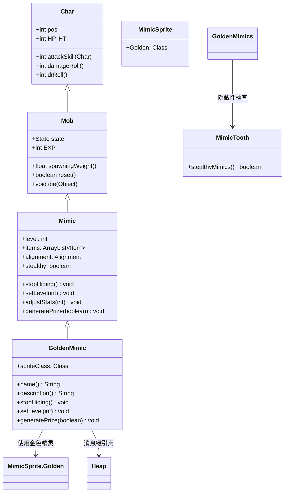

# GoldenMimic 源码详解

## 1. 基本信息

| 属性 | 值 |
|------|-----|
| **文件路径** | core/src/main/java/com/shatteredpixel/shatteredpixeldungeon/actors/mobs/GoldenMimic.java |
| **包名** | com.shatteredpixel.shatteredpixeldungeon.actors.mobs |
| **类类型** | class（非抽象） |
| **继承关系** | extends Mimic |
| **代码行数** | 109 |
| **中文名称** | 黄金拟态怪 |

---

## 类职责

GoldenMimic（黄金拟态怪）是拟态怪的强化变种，具有更高质量的战利品和增强的属性。它负责：

1. **伪装机制**：继承基础拟态怪的伪装能力，表现为上锁的箱子
2. **优质战利品**：所有掉落物品保证未诅咒，50%概率+1升级
3. **属性强化**：生命值、攻击力等基础属性提升33%
4. **视觉表现**：使用特殊的金色精灵类进行渲染

**设计模式**：
- **装饰器模式**：在基础拟态怪功能上添加强化特性
- **模板方法模式**：重写关键方法实现特殊行为
- **继承扩展模式**：通过继承复用基础拟态怪的复杂逻辑

---

## 4. 继承与协作关系



---

## 实例字段表

| 字段名 | 类型 | 设置值 | 说明 |
|--------|------|--------|------|
| `spriteClass` | Class | MimicSprite.Golden.class | 角色精灵类（金色变种） |

### 继承自 Mimic 的字段

| 字段名 | 类型 | 说明 |
|--------|------|------|
| `level` | int | 拟态怪等级，影响属性强度 |
| `items` | ArrayList<Item> | 掉落物品列表 |
| `alignment` | Alignment | 对齐状态（NEUTRAL/ENEMY） |
| `stealthy` | boolean | 是否启用隐蔽模式 |

---

## 7. 方法详解

### 构造块（Instance Initializer）

```java
{
    spriteClass = MimicSprite.Golden.class;
}
```

**作用**：设置特殊的金色精灵类，提供独特的视觉表现。

---

### name()

```java
@Override
public String name() {
    if (alignment == Alignment.NEUTRAL){
        return Messages.get(Heap.class, "locked_chest");
    } else {
        return super.name();
    }
}
```

**方法作用**：根据伪装状态返回不同的名称。

**名称逻辑**：
- **伪装状态**（NEUTRAL）：显示为"locked_chest"（上锁的箱子）
- **激活状态**（ENEMY）：使用父类的标准怪物名称

---

### description()

```java
@Override
public String description() {
    if (alignment == Alignment.NEUTRAL){
        if (MimicTooth.stealthyMimics()){
            return Messages.get(Heap.class, "locked_chest_desc");
        } else {
            return Messages.get(Heap.class, "locked_chest_desc") + "\n\n" + Messages.get(this, "hidden_hint");
        }
    } else {
        return super.description();
    }
}
```

**方法作用**：根据伪装状态和玩家装备返回不同的描述。

**描述逻辑**：
- **伪装状态 + 隐蔽拟态**：仅显示标准箱子描述
- **伪装状态 + 普通拟态**：显示箱子描述 + 隐藏提示
- **激活状态**：使用父类的标准怪物描述

---

### stopHiding()

```java
public void stopHiding(){
    state = HUNTING;
    if (sprite != null) sprite.idle();
    if (Actor.chars().contains(this) && Dungeon.level.heroFOV[pos]) {
        enemy = Dungeon.hero;
        target = Dungeon.hero.pos;
        GLog.w(Messages.get(this, "reveal") );
        CellEmitter.get(pos).burst(Speck.factory(Speck.STAR), 10);
        Sample.INSTANCE.play(Assets.Sounds.MIMIC, 1, 0.85f);
    }
}
```

**方法作用**：停止伪装并激活战斗状态。

**激活效果**：
- **状态切换**：从PASSIVE切换到HUNTING
- **视觉特效**：播放星光粒子效果
- **音效**：播放特殊的拟态怪音效（音调稍高：0.85f）
- **消息提示**：显示"revealed"警告消息

---

### setLevel(int level)

```java
@Override
public void setLevel(int level) {
    super.setLevel(Math.round(level*1.33f));
}
```

**方法作用**：重写等级设置，提供33%的属性强化。

**强化计算**：
- **基础等级**：`Math.round(level * 1.33f)`
- **属性提升**：生命值、攻击力、防御力等都相应提升33%

**示例**：
| 原始等级 | 强化后等级 | 生命值提升 |
|----------|------------|------------|
| 5 | 7 | 42 → 60 (+43%) |
| 10 | 13 | 66 → 90 (+36%) |
| 15 | 20 | 96 → 126 (+31%) |

---

### generatePrize(boolean useDecks)

```java
@Override
protected void generatePrize(boolean useDecks) {
    super.generatePrize(useDecks);
    //all existing prize items are guaranteed uncursed, and have a 50% chance to be +1 if they were +0
    for (Item i : items){
        if (i instanceof EquipableItem || i instanceof Wand){
            i.cursed = false;
            i.cursedKnown = true;
            if (i instanceof Weapon && ((Weapon) i).hasCurseEnchant()){
                ((Weapon) i).enchant(null);
            }
            if (i instanceof Armor && ((Armor) i).hasCurseGlyph()){
                ((Armor) i).inscribe(null);
            }
            if (!(i instanceof Artifact) && i.level() == 0 && Random.Int(2) == 0){
                i.upgrade();
            }
        }
    }
}
```

**方法作用**：生成高质量的战利品，确保物品价值。

**战利品优化**：
1. **移除诅咒**：
   - 所有可装备物品和法杖都标记为未诅咒
   - 武器移除诅咒附魔
   - 护甲移除诅咒符文
2. **概率升级**：
   - 非神器物品有50%概率从+0升级到+1
   - 神器物品保持原等级（避免过度强化）

**物品类别处理**：
- **武器**：移除诅咒附魔，可能升级
- **护甲**：移除诅咒符文，可能升级  
- **法杖**：仅移除诅咒，不升级（法杖等级机制不同）
- **神器**：不升级（保持平衡性）
- **消耗品**：无特殊处理（金币、药水等）

---

## 伪装与激活机制

### 伪装状态（Alignment.NEUTRAL）

- **外观**：显示为上锁的箱子（locked_chest）
- **行为**：完全被动，不会主动攻击
- **交互**：玩家尝试打开时会激活
- **AI状态**：PASSIVE状态

### 激活触发条件

1. **玩家交互**：尝试与"箱子"互动
2. **受到伤害**：被任何攻击击中
3. **负面Buff**：受到任何负面状态效果
4. **AI状态改变**：从PASSIVE切换到其他状态

### 激活后行为

- **对齐切换**：Alignment.NEUTRAL → Alignment.ENEMY
- **AI状态**：PASSIVE → HUNTING
- **目标设定**：立即以英雄为目标
- **战斗开始**：下一回合开始正常战斗

---

## 11. 使用示例

### 生成黄金拟态怪

```java
// 创建带有特定物品的黄金拟态怪
Item[] chestContents = {new Gold(50), new PotionOfHealing()};
GoldenMimic mimic = (GoldenMimic) Mimic.spawnAt(position, GoldenMimic.class, chestContents);

// 添加到游戏场景
GameScene.add(mimic);
Dungeon.level.mobs.add(mimic);
```

### 自定义战利品

```java
// 创建自定义黄金拟态怪
public class CustomGoldenMimic extends GoldenMimic {
    @Override
    protected void generatePrize(boolean useDecks) {
        // 调用父类生成基础奖励
        super.generatePrize(useDecks);
        
        // 添加额外的特殊物品
        items.add(new SpecialArtifact());
    }
}
```

---

## 注意事项

### 平衡性考虑

1. **属性强化**：33%的属性提升使其比普通拟态怪更具威胁
2. **战利品质量**：保证未诅咒和50%升级概率提供高价值奖励
3. **生成控制**：`spawningWeight()` 返回0确保不会自然生成
4. **视觉区分**：金色外观帮助玩家识别其特殊性

### 特殊机制

1. **诅咒免疫**：所有掉落物品都经过诅咒清理
2. **升级限制**：神器物品不会被升级，保持游戏平衡
3. **隐蔽兼容**：与"拟态牙"饰品的隐蔽功能完全兼容
4. **音效差异化**：使用稍高的音调区分于普通拟态怪

### 技术特点

1. **完整继承**：复用父类所有复杂逻辑（伪装、激活、AI等）
2. **最小重写**：只重写必要的方法，保持代码简洁
3. **类型安全**：使用instanceof检查确保类型安全
4. **向后兼容**：与现有拟态怪系统完全兼容

### 战斗策略

**对玩家的威胁**：
- 更高的生命值和伤害输出
- 相同的伪装机制但更强的战斗力
- 可能掉落+1装备增加诱惑力

**对抗策略**：
- 保持距离观察可疑箱子
- 准备足够的输出能力应对强化属性
- 利用其不会主动攻击的特性进行准备

---

## 最佳实践

### 强化变种设计

```java
// 标准强化变种模式
public class EnhancedVariant extends BaseClass {
    @Override
    public void setLevel(int level) {
        super.setLevel(Math.round(level * enhancementFactor));
    }
    
    @Override
    protected void generatePrize(boolean useDecks) {
        super.generatePrize(useDecks);
        enhanceLootQuality();
    }
}
```

### 战利品质量保证

```java
// 战利品优化模式
protected void optimizeLoot(List<Item> items) {
    for (Item item : items) {
        if (isEnhanceable(item)) {
            removeCurses(item);
            upgradeIfEligible(item);
        }
    }
}

private boolean isEnhanceable(Item item) {
    return item instanceof EquipableItem || item instanceof Wand;
}

private void removeCurses(Item item) {
    item.cursed = false;
    item.cursedKnown = true;
    // 移除特定诅咒效果
}

private void upgradeIfEligible(Item item) {
    if (!isArtifact(item) && item.level() == 0 && shouldUpgrade()) {
        item.upgrade();
    }
}
```

---

## 相关类

| 类名 | 关系 | 说明 |
|------|------|------|
| `Mimic` | 父类 | 基础拟态怪类，提供核心伪装逻辑 |
| `MimicSprite.Golden` | 精灵类 | 金色拟态怪的视觉表现 |
| `Heap` | 消息源 | 提供箱子相关的本地化消息 |
| `MimicTooth` | 饰品类 | 提供隐蔽拟态功能检测 |
| `Generator` | 工具类 | 随机物品生成 |

---

## 消息键

| 键名 | 值 | 用途 |
|------|-----|------|
| `monsters.goldenmimic.name` | golden mimic | 怪物名称 |
| `heaps.locked_chest` | locked chest | 伪装状态名称 |
| `heaps.locked_chest_desc` | A chest sealed with a heavy lock. | 伪装状态描述 |
| `monsters.mimic.hidden_hint` | ...but something seems off about it. | 隐藏提示（非隐蔽模式） |
| `monsters.mimic.reveal` | The chest suddenly opens its eyes! | 激活警告消息 |