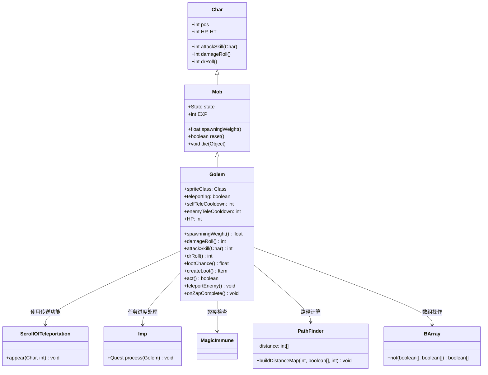

# Golem 源码详解

## 1. 基本信息

| 属性 | 值 |
|------|-----|
| **文件路径** | core/src/main/java/com/shatteredpixel/shatteredpixeldungeon/actors/mobs/Golem.java |
| **包名** | com.shatteredpixel.shatteredpixeldungeon.actors.mobs |
| **类类型** | class（非抽象） |
| **继承关系** | extends Mob |
| **代码行数** | 257 |
| **中文名称** | 魔像 |

---

## 类职责

Golem（魔像）是游戏中具有传送能力的强力敌人。它负责：

1. **传送攻击**：能够将玩家传送到远处位置，扰乱战斗节奏
2. **自我传送**：在游荡状态下可以传送自己到目标位置
3. **装备掉落**：掉落高品质武器或护甲，并使用递减概率机制
4. **任务集成**：死亡时触发小恶魔任务进度
5. **魔法免疫**：作为无机物单位，对某些魔法效果有天然抗性

**设计模式**：
- **状态模式**：自定义 `Wandering` 和 `Hunting` 状态实现复杂AI
- **递减概率模式**：使用指数衰减控制装备掉落频率
- **传送系统集成**：重用卷轴传送系统的完整功能

---

## 4. 继承与协作关系



---

## 实例字段表

| 字段名 | 类型 | 设置值 | 说明 |
|--------|------|--------|------|
| `spriteClass` | Class | GolemSprite.class | 角色精灵类 |
| `HP` / `HT` | int | 120 | 当前/最大生命值 |
| `defenseSkill` | int | 15 | 防御技能等级 |
| `EXP` | int | 12 | 击败后获得的经验值 |
| `maxLvl` | int | 22 | 最大出现等级 |
| `loot` | Category | WEAPON/ARMOR | 掉落物品类别（随机选择） |
| `lootChance` | float | 0.2f | 初始掉落概率（20%） |

### 特殊属性

| 属性 | 说明 |
|------|------|
| `Property.INORGANIC` | 无机物单位，对某些效果有抗性 |
| `Property.LARGE` | 大型单位，占用更多空间 |

### 传送相关字段

| 字段名 | 类型 | 说明 |
|--------|------|------|
| `teleporting` | boolean | 是否正在执行自我传送 |
| `selfTeleCooldown` | int | 自我传送冷却时间 |
| `enemyTeleCooldown` | int | 敌人传送冷却时间 |

### 状态定义

| 状态字段 | 类型 | 说明 |
|----------|------|------|
| `WANDERING` | Wandering | 自定义游荡状态 |
| `HUNTING` | Hunting | 自定义追击状态 |

---

## 7. 方法详解

### 构造块（Instance Initializer）

```java
{
    spriteClass = GolemSprite.class;
    
    HP = HT = 120;
    defenseSkill = 15;
    
    EXP = 12;
    maxLvl = 22;
    
    loot = Random.oneOf(Generator.Category.WEAPON, Generator.Category.ARMOR);
    lootChance = 0.2f;
    
    properties.add(Property.INORGANIC);
    properties.add(Property.LARGE);
    
    WANDERING = new Wandering();
    HUNTING = new Hunting();
}
```

**作用**：初始化魔像的基础属性，设置高生命值、大型单位属性和高品质掉落。

---

### damageRoll()

```java
@Override
public int damageRoll() {
    return Random.NormalIntRange(25, 30);
}
```

**方法作用**：计算攻击造成的伤害范围。

**伤害特点**：
- **高伤害输出**：25-30点伤害，是中期非常强力的威胁
- **伤害集中**：范围较小（仅6点差异），提供稳定的伤害预期
- **平均伤害**：27.5点，对中期玩家来说构成显著威胁

---

### attackSkill(Char target)

```java
@Override
public int attackSkill(Char target) {
    return 28;
}
```

**方法作用**：返回攻击技能等级，影响命中率。

**参数**：
- `target` (Char)：攻击目标

**返回值**：
- `28`：极高的攻击技能等级，几乎保证命中

---

### drRoll()

```java
@Override
public int drRoll() {
    return super.drRoll() + Random.NormalIntRange(0, 12);
}
```

**方法作用**：计算伤害减免范围。

**伤害减免**：
- **高额减免**：0-12点额外伤害减免
- **平均减免**：6点，提供显著的防御能力
- **战术意义**：配合120点高生命值，使其非常耐打

---

### lootChance()

```java
@Override
public float lootChance() {
    //each drop makes future drops 1/3 as likely
    // so loot chance looks like: 1/5, 1/15, 1/45, 1/135, etc.
    return super.lootChance() * (float)Math.pow(1/3f, Dungeon.LimitedDrops.GOLEM_EQUIP.count);
}
```

**方法作用**：实现递减概率的装备掉落机制。

**递减机制**：
- **初始概率**：20% (1/5)
- **后续概率**：每次掉落后续概率变为前一次的1/3
- **概率序列**：20% → 6.67% → 2.22% → 0.74% → ...

**设计意图**：
- 鼓励早期挑战魔像获取装备
- 防止后期过度farm获得过多高品质装备
- 保持游戏经济平衡

---

### createLoot()

```java
public Item createLoot() {
    Dungeon.LimitedDrops.GOLEM_EQUIP.count++;
    //uses probability tables for demon halls
    if (loot == Generator.Category.WEAPON){
        return Generator.randomWeapon(5, true);
    } else {
        return Generator.randomArmor(5);
    }
}
```

**方法作用**：生成高品质的战利品。

**战利品质量**：
- **武器**：使用恶魔大厅概率表生成5级武器
- **护甲**：使用恶魔大厅概率表生成5级护甲
- **品质保证**：比普通掉落的同等级装备更优质

---

### rollToDropLoot()

```java
@Override
public void rollToDropLoot() {
    Imp.Quest.process(this);
    super.rollToDropLoot();
}
```

**方法作用**：处理任务系统集成。

**任务集成**：
- 调用 `Imp.Quest.process()` 更新小恶魔任务进度
- 可能用于特定任务要求击杀魔像

---

### 核心传送机制

#### act()

```java
@Override
protected boolean act() {
    selfTeleCooldown--;
    enemyTeleCooldown--;
    if (teleporting){
        ((GolemSprite)sprite).teleParticles(false);
        if (Actor.findChar(target) == null && Dungeon.level.openSpace[target]) {
            ScrollOfTeleportation.appear(this, target);
            selfTeleCooldown = 30;
        } else {
            target = Dungeon.level.randomDestination(this);
        }
        teleporting = false;
        spend(TICK);
        return true;
    }
    return super.act();
}
```

**作用**：处理自我传送的多回合动画序列。

**自我传送流程**：
1. 播放传送粒子特效
2. 验证目标位置是否安全（无其他角色且开放空间）
3. 执行传送并设置30回合冷却
4. 如果目标不安全，重新选择随机目的地

#### teleportEnemy()

```java
public void teleportEnemy(){
    spend(TICK);
    
    int bestPos = enemy.pos;
    for (int i : PathFinder.NEIGHBOURS8){
        if (Dungeon.level.passable[pos + i]
            && Actor.findChar(pos+i) == null
            && Dungeon.level.trueDistance(pos+i, enemy.pos) > Dungeon.level.trueDistance(bestPos, enemy.pos)){
            bestPos = pos+i;
        }
    }
    
    if (enemy.buff(MagicImmune.class) != null){
        bestPos = enemy.pos;
    }
    
    if (bestPos != enemy.pos){
        ScrollOfTeleportation.appear(enemy, bestPos);
        if (enemy instanceof Hero){
            ((Hero) enemy).interrupt();
            Dungeon.observe();
            GameScene.updateFog();
        }
    }
    
    enemyTeleCooldown = 20;
}
```

**作用**：将敌人传送到最佳位置。

**传送逻辑**：
1. **寻找最佳位置**：在8个邻近格子中选择距离当前敌人位置最远的可通行位置
2. **魔法免疫检查**：如果敌人有魔法免疫Buff，则不传送
3. **英雄特殊处理**：传送英雄时中断其行动并更新视野
4. **冷却设置**：设置20回合的敌人传送冷却

#### canTele(int target)

```java
private boolean canTele(int target){
    if (enemyTeleCooldown > 0) return false;
    PathFinder.buildDistanceMap(target, BArray.not(Dungeon.level.solid, null), Dungeon.level.distance(pos, target)+1);
    if (PathFinder.distance[pos] == Integer.MAX_VALUE){
        return false;
    }
    return true;
}
```

**作用**：检查是否可以进行传送攻击。

**传送条件**：
- 冷却时间已过
- 存在从当前位置到目标位置的有效路径（考虑阻挡地形但可绕行）

---

## AI状态机

### Wandering 状态

**触发条件**：未发现敌人

**行为**：
- **正常移动**：尝试接近目标位置
- **自我传送**：在非BOSS关卡且冷却时间内，有概率进行自我传送
- **视觉特效**：传送时播放粒子效果

**实现细节**：
```java
@Override
protected boolean continueWandering() {
    // ...
    else if (!Dungeon.bossLevel() && target != -1 && target != pos && selfTeleCooldown <= 0) {
        ((GolemSprite)sprite).teleParticles(true);
        teleporting = true;
        spend(2*TICK);
    }
    // ...
}
```

### Hunting 状态

**触发条件**：发现敌人

**行为**：
- **远程传送**：当距离≥1且满足随机条件时，传送敌人
- **近战优先**：如果可以近战攻击，优先使用近战
- **路径验证**：确保传送路径有效
- **目标切换**：如果当前目标无法到达或传送，尝试切换目标

**传送触发条件**：
- 距离敌人至少1格
- 随机概率：`Random.Int(100/distance)` == 0（距离越远概率越高）
- 敌人不是IMMOVABLE单位
- 传送冷却已过
- 存在有效传送路径

---

## 11. 使用示例

### 关卡生成配置

```java
// 在适当关卡生成魔像
Golem golem = new Golem();
golem.pos = room.random();

// 标准生成方法
Room.spawnMob(golem, room);
```

### 自定义传送逻辑

```java
// 修改传送行为的魔像变种
public class EnhancedGolem extends Golem {
    @Override
    public void teleportEnemy() {
        // 传送到更远的位置
        int bestPos = findFarthestPosition(enemy.pos);
        ScrollOfTeleportation.appear(enemy, bestPos);
        enemyTeleCooldown = 15; // 缩短冷却时间
    }
}
```

---

## 注意事项

### 平衡性考虑

1. **高威胁性**：120点生命值+25-30点伤害使其成为中期主要威胁
2. **传送机制**：传送能力增加战术复杂性，但有冷却限制
3. **掉落平衡**：递减概率机制防止过度farm
4. **等级适配**：maxLvl=22确保在合适关卡出现

### 特殊机制

1. **双重传送**：既能传送自己也能传送敌人
2. **魔法免疫检查**：尊重敌人的魔法免疫状态
3. **BOSS关卡限制**：在BOSS关卡不会自我传送
4. **大型单位特性**：作为LARGE单位影响移动和位置选择

### 技术特点

1. **完整序列化**：支持保存/加载的所有传送状态
2. **性能优化**：路径计算只在必要时执行
3. **系统集成**：重用现有的传送卷轴系统
4. **视觉反馈**：完整的粒子特效和音效支持

### 战斗策略

**对玩家的威胁**：
- 高伤害输出和高生命值
- 传送能力可能将玩家传送到不利位置
- 远距离时仍有主动攻击能力

**对抗策略**：
- 利用魔法免疫饰品防止被传送
- 保持近距离避免触发传送
- 快速解决避免多次传送骚扰
- 准备足够的输出应对高生命值

---

## 最佳实践

### 传送能力设计

```java
// 安全的传送实现模式
public void teleportTarget(Char target, int newPos) {
    // 1. 验证目标位置安全性
    if (!isValidTeleportPosition(newPos)) return;
    
    // 2. 检查目标是否有免疫
    if (hasTeleportImmunity(target)) return;
    
    // 3. 执行传送
    ScrollOfTeleportation.appear(target, newPos);
    
    // 4. 设置冷却时间
    teleportCooldown = calculateCooldown();
    
    // 5. 特殊处理（如英雄中断）
    handleSpecialCases(target);
}
```

### 递减概率系统

```java
// 指数衰减掉落概率
@Override
public float lootChance() {
    float baseChance = getBaseChance();
    float decayFactor = Math.pow(decayRate, dropCount);
    return baseChance * decayFactor;
}
```

### 状态感知AI

```java
// 条件性特殊能力
@Override
public boolean act(boolean enemyInFOV, boolean justAlerted) {
    if (shouldUseSpecialAbility()) {
        useSpecialAbility();
        return true;
    }
    return super.act(enemyInFOV, justAlerted);
}

private boolean shouldUseSpecialAbility() {
    return distance >= minDistance 
        && cooldown <= 0 
        && Random.chance(calculateProbability());
}
```

---

## 相关类

| 类名 | 关系 | 说明 |
|------|------|------|
| `Mob` | 父类 | 所有怪物的基类 |
| `GolemSprite` | 精灵类 | 对应的视觉表现 |
| `ScrollOfTeleportation` | 工具类 | 传送功能实现 |
| `Imp.Quest` | 任务系统 | 小恶魔任务，处理死亡事件 |
| `MagicImmune` | Buff类 | 魔法免疫状态，影响传送效果 |
| `PathFinder` | 工具类 | 路径查找和距离计算 |
| `BArray` | 工具类 | 布尔数组操作 |

---

## 消息键

| 键名 | 值 | 用途 |
|------|-----|------|
| `monsters.golem.name` | golem | 怪物名称 |
| `monsters.golem.desc` | A construct of animated stone and metal. It seems to be able to manipulate space itself... | 怪物描述 |