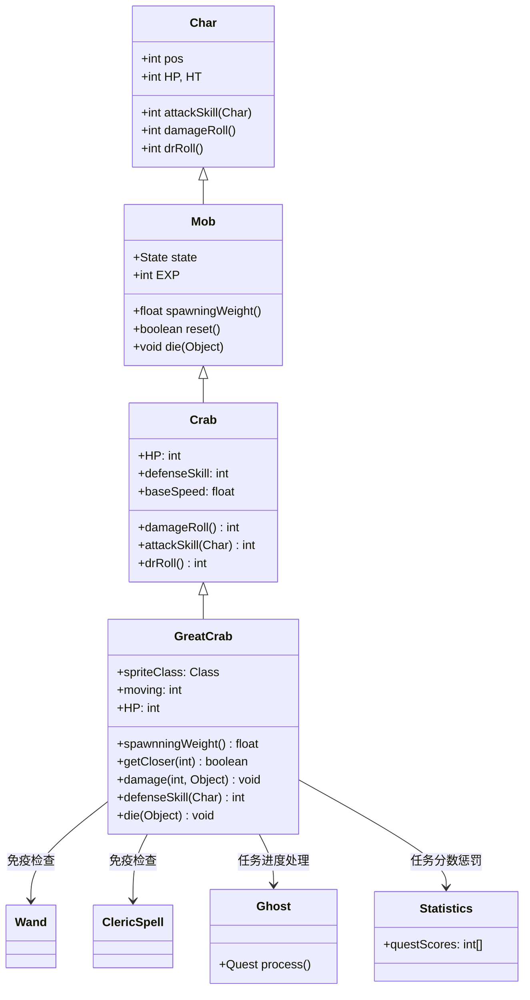

# GreatCrab 源码详解

## 1. 基本信息

| 属性 | 值 |
|------|-----|
| **文件路径** | core/src/main/java/com/shatteredpixel/shatteredpixeldungeon/actors/mobs/GreatCrab.java |
| **包名** | com.shatteredpixel.shatteredpixeldungeon.actors.mobs |
| **类类型** | class（非抽象） |
| **继承关系** | extends Crab |
| **代码行数** | 135 |
| **中文名称** | 巨蟹 |

---

## 类职责

GreatCrab（巨蟹）是螃蟹的强化变种，具有独特的防御机制。它负责：

1. **完全防御**：能够完全阻挡来自当前目标的近战攻击
2. **法杖免疫**：能看到玩家时完全免疫英雄的法杖和牧师法术伤害
3. **减速移动**：通过自定义移动逻辑实现缓慢但稳定的移动速度
4. **任务集成**：死亡时触发幽灵任务进度
5. **高价值掉落**：100%掉落2个神秘肉，提供稳定的食物来源

**设计模式**：
- **装饰器模式**：在基础螃蟹功能上添加特殊防御机制
- **条件防御模式**：根据视野、状态和攻击源类型动态调整防御能力
- **移动控制模式**：通过计数器控制移动频率实现减速效果

---

## 4. 继承与协作关系



---

## 实例字段表

| 字段名 | 类型 | 设置值 | 说明 |
|--------|------|--------|------|
| `spriteClass` | Class | GreatCrabSprite.class | 角色精灵类 |
| `HP` / `HT` | int | 25 | 当前/最大生命值（比普通螃蟹多67%） |
| `defenseSkill` | int | 0 | 防御技能等级（实际通过方法动态计算） |
| `baseSpeed` | float | 1f | 基础移动速度（比普通螃蟹慢50%） |
| `EXP` | int | 6 | 击败后获得的经验值 |
| `loot` | MysteryMeat | quantity(2) | 掉落2个神秘肉 |
| `lootChance` | float | 1f | 掉落概率（100%必掉） |

### 特殊属性

| 属性 | 说明 |
|------|------|
| `Property.MINIBOSS` | 小型BOSS单位，具有特殊地位 |

### 移动控制

| 字段名 | 类型 | 默认值 | 说明 |
|--------|------|--------|------|
| `moving` | int | 0 | 移动计数器，用于控制移动频率 |

### 状态定义

| 状态字段 | 类型 | 说明 |
|----------|------|------|
| `WANDERING` | Wandering | 自定义游荡状态 |

---

## 7. 方法详解

### 构造块（Instance Initializer）

```java
{
    spriteClass = GreatCrabSprite.class;
    
    HP = HT = 25;
    defenseSkill = 0; //see damage()
    baseSpeed = 1f;
    
    EXP = 6;
    
    WANDERING = new Wandering();
    state = WANDERING;
    
    loot = new MysteryMeat().quantity(2);
    lootChance = 1f;
    
    properties.add(Property.MINIBOSS);
}
```

**作用**：初始化巨蟹的基础属性，设置强化生命值、MINIBOSS属性和100%双倍食物掉落。

---

### getCloser(int target)

```java
@Override
protected boolean getCloser(int target) {
    //this is used so that the crab remains slower, but still detects the player at the expected rate.
    moving++;
    if (moving < 3) {
        return super.getCloser(target);
    } else {
        moving = 0;
        return true;
    }
}
```

**方法作用**：重写移动逻辑，实现减速效果。

**移动机制**：
- **计数器控制**：每3回合才真正移动1次
- **速度计算**：实际移动速度为 `1/3` 倍基础速度
- **检测保持**：虽然移动慢，但仍然能正常检测玩家位置

**战术影响**：
- 给玩家更多时间准备和观察
- 增加围攻的可能性
- 降低追逐威胁

---

### damage(int dmg, Object src)

```java
@Override
public void damage(int dmg, Object src){
    //crab blocks all wand damage from the hero if it sees them.
    //Direct damage is negated, but add-on effects and environmental effects go through as normal.
    if (enemySeen
            && state != SLEEPING
            && paralysed == 0
            && (src instanceof Wand || src instanceof ClericSpell)
            && enemy == Dungeon.hero
            && enemy.invisible == 0){
        GLog.n(Messages.get(this, "noticed"));
        sprite.showStatus(CharSprite.NEUTRAL, Messages.get(this, "def_verb"));
        Sample.INSTANCE.play(Assets.Sounds.HIT_PARRY, 1, Random.Float(0.96f, 1.05f));
        Statistics.questScores[0] -= 50;
    } else {
        super.damage(dmg, src);
    }
}
```

**方法作用**：实现法杖和牧师法术免疫机制。

**免疫条件**：
1. **看到敌人**：`enemySeen == true`
2. **非休眠状态**：`state != SLEEPING`
3. **未被麻痹**：`paralysed == 0`
4. **攻击源类型**：`src instanceof Wand || src instanceof ClericSpell`
5. **目标是英雄**：`enemy == Dungeon.hero`
6. **英雄可见**：`enemy.invisible == 0`

**免疫效果**：
- **完全阻挡**：直接伤害被完全抵消
- **视觉反馈**：显示"def_verb"状态文本
- **音效提示**：播放格挡音效
- **任务惩罚**：减少50点任务分数
- **例外情况**：附加效果和环境效果仍然生效

---

### defenseSkill(Char enemy)

```java
@Override
public int defenseSkill(Char enemy) {
    //crab blocks all melee attacks from its current target
    if (enemySeen
            && state != SLEEPING
            && paralysed == 0
            && enemy == this.enemy
            && enemy.invisible == 0){
        if (sprite != null && sprite.visible) {
            Sample.INSTANCE.play(Assets.Sounds.HIT_PARRY, 1, Random.Float(0.96f, 1.05f));
            GLog.n(Messages.get(this, "noticed"));
        }
        if (enemy == Dungeon.hero){
            Statistics.questScores[0] -= 50;
        }
        return INFINITE_EVASION;
    }
    return super.defenseSkill(enemy);
}
```

**方法作用**：实现近战完全防御机制。

**防御条件**：
1. **看到敌人**：`enemySeen == true`
2. **非休眠状态**：`state != SLEEPING`
3. **未被麻痹**：`paralysed == 0`
4. **当前目标**：`enemy == this.enemy`
5. **敌人可见**：`enemy.invisible == 0`

**防御效果**：
- **无限闪避**：返回 `INFINITE_EVASION`，完全避免近战伤害
- **视觉音效**：与法杖免疫相同的反馈效果
- **任务惩罚**：同样减少50点任务分数

---

### die(Object cause)

```java
@Override
public void die(Object cause) {
    super.die(cause);
    Ghost.Quest.process();
}
```

**方法作用**：死亡时触发幽灵任务进度。

**任务集成**：
- 作为幽灵任务的关键目标之一
- 死亡后推进任务进度
- 可能解锁新的任务阶段

---

### Wandering 状态

```java
protected class Wandering extends Mob.Wandering{
    @Override
    protected int randomDestination() {
        //of two potential wander positions, picks the one closest to the hero
        int pos1 = super.randomDestination();
        int pos2 = super.randomDestination();
        PathFinder.buildDistanceMap(Dungeon.hero.pos, Dungeon.level.passable);
        if (PathFinder.distance[pos2] < PathFinder.distance[pos1]){
            return pos2;
        } else {
            return pos1;
        }
    }
}
```

**方法作用**：改进游荡AI，优先选择接近英雄的位置。

**智能行为**：
- **双选项比较**：生成两个随机位置并选择更优的
- **距离优化**：总是选择距离英雄更近的位置
- **战术意义**：增加遇到玩家的概率，提高游戏节奏

---

## 11. 使用示例

### 任务目标配置

```java
// 创建幽灵任务的巨蟹目标
GreatCrab greatCrab = new GreatCrab();
greatCrab.pos = targetPosition;

// 添加到场景
GameScene.add(greatCrab);
Dungeon.level.mobs.add(greatCrab);

// 任务系统会自动跟踪其状态
```

### 自定义防御变体

```java
// 调整防御机制的巨蟹变种
public class ToughGreatCrab extends GreatCrab {
    @Override
    public int defenseSkill(Char enemy) {
        // 扩展防御条件，对所有敌人都有效
        if (enemySeen && state != SLEEPING && paralysed == 0) {
            return INFINITE_EVASION;
        }
        return super.defenseSkill(enemy);
    }
}
```

---

## 注意事项

### 平衡性考虑

1. **防御强度**：完全免疫近战和法杖伤害使其非常难缠
2. **移动速度**：缓慢移动平衡了强大的防御能力
3. **100%掉落**：保证玩家获得食物奖励，鼓励挑战
4. **MINIBOSS定位**：25点生命值配合强大防御提供适当挑战

### 特殊机制

1. **条件免疫**：只有满足所有条件时才会激活免疫
2. **任务惩罚**：每次成功防御都会减少任务分数
3. **智能游荡**：主动寻找接近玩家的位置
4. **任务集成**：与幽灵任务系统的深度集成

### 技术特点

1. **双重防御**：分别处理近战和远程魔法攻击
2. **状态依赖**：防御能力依赖于多个状态条件
3. **视觉反馈**：完整的状态显示和音效支持
4. **性能优化**：条件检查高效，避免不必要的计算

### 战斗策略

**对玩家的威胁**：
- 近战和法杖攻击完全无效，需要其他手段
- 缓慢移动使其容易被包围
- 高生命值需要持续输出

**对抗策略**：
- 使用环境伤害（陷阱、火等）
- 利用隐身状态绕过防御
- 使用非直接伤害的技能
- 快速解决避免多次任务分数损失

---

## 最佳实践

### 条件防御系统

```java
// 完全防御模式
@Override
public int defenseSkill(Char enemy) {
    if (shouldBlockAttack(enemy)) {
        showDefenseFeedback();
        return INFINITE_EVASION;
    }
    return super.defenseSkill(enemy);
}

private boolean shouldBlockAttack(Char enemy) {
    return enemySeen 
        && state != SLEEPING 
        && paralysed == 0 
        && isValidTarget(enemy);
}
```

### 移动控制模式

```java
// 计数器控制移动
private int moveCounter = 0;

@Override
protected boolean getCloser(int target) {
    moveCounter++;
    if (moveCounter >= moveInterval) {
        moveCounter = 0;
        return super.getCloser(target);
    }
    return false;
}
```

### 智能游荡AI

```java
// 优化的游荡行为
@Override
protected int randomDestination() {
    int option1 = super.randomDestination();
    int option2 = super.randomDestination();
    return distanceToTarget(option2) < distanceToTarget(option1) ? option2 : option1;
}
```

---

## 相关类

| 类名 | 关系 | 说明 |
|------|------|------|
| `Crab` | 父类 | 基础螃蟹类 |
| `GreatCrabSprite` | 精灵类 | 对应的视觉表现 |
| `Wand` | 攻击源 | 法杖攻击源类型 |
| `ClericSpell` | 攻击源 | 牧师法术攻击源类型 |
| `Ghost.Quest` | 任务系统 | 幽灵任务，处理死亡事件 |
| `Statistics` | 全局类 | 任务分数管理 |

---

## 消息键

| 键名 | 值 | 用途 |
|------|-----|------|
| `monsters.greatcrab.name` | great crab | 怪物名称 |
| `monsters.greatcrab.desc` | A massive crustacean with an incredibly tough shell. It seems to be able to block most attacks... | 怪物描述 |
| `monsters.greatcrab.noticed` | The great crab notices your attack! | 防御提示消息 |
| `monsters.greatcrab.def_verb` | blocked | 防御状态文本 |