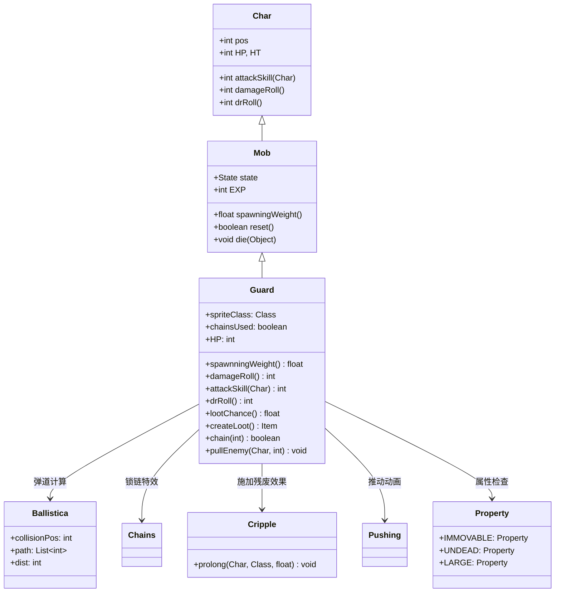

# Guard 源码详解

## 1. 基本信息

| 属性 | 值 |
|------|-----|
| **文件路径** | core/src/main/java/com/shatteredpixel/shatteredpixeldungeon/actors/mobs/Guard.java |
| **包名** | com.shatteredpixel.shatteredpixeldungeon.actors.mobs |
| **类类型** | class（非抽象） |
| **继承关系** | extends Mob |
| **代码行数** | 192 |
| **中文名称** | 守卫 |

---

## 类职责

Guard（守卫）是具有锁链拉拽能力的亡灵敌人。它负责：

1. **锁链技能**：能够将远处的敌人拉拽到自己附近，限制其移动
2. **一次使用限制**：每场战斗只能使用一次锁链技能
3. **递减掉落**：使用指数衰减机制控制护甲掉落频率
4. **亡灵特性**：作为亡灵单位具有特殊属性和免疫
5. **中程威胁**：在5格距离内可以触发锁链技能，增加战术复杂性

**设计模式**：
- **状态模式**：自定义 `Hunting` 状态实现技能触发逻辑
- **一次性技能模式**：通过布尔标志控制技能使用次数
- **递减概率模式**：使用指数衰减控制装备掉落频率

---

## 4. 继承与协作关系



---

## 实例字段表

| 字段名 | 类型 | 设置值 | 说明 |
|--------|------|--------|------|
| `spriteClass` | Class | GuardSprite.class | 角色精灵类 |
| `HP` / `HT` | int | 40 | 当前/最大生命值 |
| `defenseSkill` | int | 10 | 防御技能等级 |
| `EXP` | int | 7 | 击败后获得的经验值 |
| `maxLvl` | int | 14 | 最大出现等级 |
| `loot` | Category | Generator.Category.ARMOR | 掉落物品类别（护甲） |
| `lootChance` | float | 0.2f | 初始掉落概率（20%） |

### 特殊属性

| 属性 | 说明 |
|------|------|
| `Property.UNDEAD` | 亡灵单位，具有特殊免疫和弱点 |

### 技能状态

| 字段名 | 类型 | 默认值 | 说明 |
|--------|------|--------|------|
| `chainsUsed` | boolean | false | 锁链技能是否已使用 |

### 状态定义

| 状态字段 | 类型 | 说明 |
|----------|------|------|
| `HUNTING` | Hunting | 自定义追击状态 |

---

## 7. 方法详解

### 构造块（Instance Initializer）

```java
{
    spriteClass = GuardSprite.class;
    
    HP = HT = 40;
    defenseSkill = 10;
    
    EXP = 7;
    maxLvl = 14;
    
    loot = Generator.Category.ARMOR;
    lootChance = 0.2f;
    
    properties.add(Property.UNDEAD);
    
    HUNTING = new Hunting();
}
```

**作用**：初始化守卫的基础属性，设置中等生命值、亡灵属性和护甲掉落。

---

### damageRoll()

```java
@Override
public int damageRoll() {
    return Random.NormalIntRange(4, 12);
}
```

**方法作用**：计算攻击造成的伤害范围。

**伤害特点**：
- **中等伤害**：4-12点伤害，平均8点
- **伤害波动**：8点范围提供一定的不可预测性
- **战术定位**：适合中期关卡的威胁水平

---

### attackSkill(Char target)

```java
@Override
public int attackSkill(Char target) {
    return 12;
}
```

**方法作用**：返回攻击技能等级，影响命中率。

**参数**：
- `target` (Char)：攻击目标

**返回值**：
- `12`：中等攻击技能等级，保证合理的命中率

---

### drRoll()

```java
@Override
public int drRoll() {
    return super.drRoll() + Random.NormalIntRange(0, 7);
}
```

**方法作用**：计算伤害减免范围。

**伤害减免**：
- **中等减免**：0-7点额外伤害减免
- **平均减免**：3.5点，提供适度的防御能力

---

### lootChance() 和 createLoot()

```java
@Override
public float lootChance() {
    //each drop makes future drops 1/3 as likely
    // so loot chance looks like: 1/5, 1/15, 1/45, 1/135, etc.
    return super.lootChance() * (float)Math.pow(1/3f, Dungeon.LimitedDrops.GUARD_ARM.count);
}

@Override
public Item createLoot() {
    Dungeon.LimitedDrops.GUARD_ARM.count++;
    return super.createLoot();
}
```

**方法作用**：实现递减概率的护甲掉落机制。

**递减机制**：
- **初始概率**：20% (1/5)
- **后续概率**：每次掉落后续概率变为前一次的1/3
- **概率序列**：20% → 6.67% → 2.22% → 0.74% → ...

**设计意图**：
- 鼓励早期挑战守卫获取护甲
- 防止后期过度farm获得过多高品质护甲
- 保持游戏经济平衡

---

### 核心锁链技能

#### chain(int target)

```java
private boolean chain(int target){
    if (chainsUsed || enemy.properties().contains(Property.IMMOVABLE))
        return false;

    Ballistica chain = new Ballistica(pos, target, Ballistica.PROJECTILE);

    if (chain.collisionPos != enemy.pos
            || chain.path.size() < 2
            || Dungeon.level.pit[chain.path.get(1)])
        return false;
    else {
        // ... 寻找最佳拉拽位置
        // ... 执行拉拽动画和效果
    }
    chainsUsed = true;
    return true;
}
```

**方法作用**：执行锁链拉拽技能。

**技能条件**：
1. **未使用过**：`!chainsUsed`
2. **目标可移动**：`!enemy.properties().contains(Property.IMMOVABLE)`
3. **有效视线**：弹道终点必须是目标位置
4. **路径有效**：路径长度至少2格，且第二格不是陷阱坑

**拉拽逻辑**：
- **位置选择**：从守卫开始沿弹道寻找最近的可通行位置
- **大型单位处理**：大型单位需要开放空间才能被拉拽
- **视觉特效**：播放锁链粒子效果和音效
- **状态更新**：标记技能已使用

#### pullEnemy(Char enemy, int pullPos)

```java
private void pullEnemy(Char enemy, int pullPos){
    enemy.pos = pullPos;
    enemy.sprite.place(pullPos);
    Dungeon.level.occupyCell(enemy);
    Cripple.prolong(enemy, Cripple.class, 4f);
    if (enemy == Dungeon.hero) {
        Dungeon.hero.interrupt();
        Dungeon.observe();
        GameScene.updateFog();
    } else {
        enemy.sprite.visible = Dungeon.level.heroFOV[pullPos];
    }
}
```

**方法作用**：执行实际的拉拽效果。

**拉拽效果**：
- **位置更新**：将目标移动到指定位置
- **状态施加**：施加4秒的残废效果（Cripple）
- **英雄特殊处理**：中断英雄行动并更新视野
- **可见性更新**：确保被拉拽单位的可见性正确

---

## AI状态机

### Hunting 状态

```java
private class Hunting extends Mob.Hunting{
    @Override
    public boolean act(boolean enemyInFOV, boolean justAlerted) {
        enemySeen = enemyInFOV;
        
        if (!chainsUsed
                && enemyInFOV
                && !isCharmedBy(enemy)
                && !canAttack(enemy)
                && Dungeon.level.distance(pos, enemy.pos) < 5
                && chain(enemy.pos)){
            return !(sprite.visible || enemy.sprite.visible);
        } else {
            return super.act(enemyInFOV, justAlerted);
        }
    }
}
```

**触发条件**：
- **技能可用**：`!chainsUsed`
- **看到敌人**：`enemyInFOV`
- **未被魅惑**：`!isCharmedBy(enemy)`
- **无法近战**：`!canAttack(enemy)`（距离>1）
- **距离合适**：`distance < 5`

**行为逻辑**：
- 如果满足所有条件且成功使用锁链技能，返回动画控制状态
- 否则使用标准的追击逻辑

---

## 11. 使用示例

### 关卡生成配置

```java
// 在适当关卡生成守卫
Guard guard = new Guard();
guard.pos = room.random();

// 标准生成方法
Room.spawnMob(guard, room);
```

### 自定义技能限制

```java
// 修改技能使用次数的守卫变种
public class EnhancedGuard extends Guard {
    private int chainsUses = 0;
    private static final int MAX_CHAINS_USES = 2;
    
    @Override
    private boolean chain(int target) {
        if (chainsUses >= MAX_CHAINS_USES || 
            enemy.properties().contains(Property.IMMOVABLE)) {
            return false;
        }
        // ... 执行锁链逻辑
        chainsUses++;
        return true;
    }
}
```

---

## 注意事项

### 平衡性考虑

1. **技能限制**：一次使用限制防止技能滥用
2. **距离约束**：5格距离限制确保技能有合理范围
3. **掉落平衡**：递减概率机制防止过度farm
4. **等级适配**：maxLvl=14确保在合适关卡出现

### 特殊机制

1. **目标限制**：不能拉拽IMMOVABLE单位（如BOSS）
2. **路径验证**：完整的弹道路径检查确保技能合理性
3. **视觉反馈**：完整的粒子特效、音效和消息支持
4. **状态持久化**：支持保存/加载的技能状态恢复

### 技术特点

1. **完整序列化**：`chainsUsed` 状态正确保存和恢复
2. **性能优化**：条件检查高效，避免不必要的计算
3. **系统集成**：重用现有的Cripple和Pushing系统
4. **错误处理**：完整的边界条件检查防止异常

### 战斗策略

**对玩家的威胁**：
- 锁链技能可能将玩家拉入不利位置
- 亡灵属性可能对某些伤害类型有特殊反应
- 中等伤害和生命值构成稳定威胁

**对抗策略**：
- 保持5格以上距离避免触发锁链
- 利用IMMOVABLE地形阻挡技能
- 快速解决避免被拉拽到危险位置
- 准备抗残废的手段

---

## 最佳实践

### 一次性技能设计

```java
// 一次性技能模式
private boolean skillUsed = false;

private boolean useSpecialSkill() {
    if (skillUsed) return false;
    
    // 执行技能逻辑
    skillUsed = true;
    return true;
}

@Override
public void storeInBundle(Bundle bundle) {
    bundle.put("skill_used", skillUsed);
}

@Override
public void restoreFromBundle(Bundle bundle) {
    skillUsed = bundle.getBoolean("skill_used");
}
```

### 距离限制技能

```java
// 距离约束技能
if (Dungeon.level.distance(pos, target.pos) <= maxRange 
    && hasClearLineOfSight(target.pos)) {
    executeSkill(target);
}
```

### 递减概率系统

```java
// 指数衰减掉落
@Override
public float lootChance() {
    return baseChance * Math.pow(decayFactor, usageCount);
}
```

---

## 相关类

| 类名 | 关系 | 说明 |
|------|------|------|
| `Mob` | 父类 | 所有怪物的基类 |
| `GuardSprite` | 精灵类 | 对应的视觉表现 |
| `Ballistica` | 工具类 | 弹道计算，用于技能路径验证 |
| `Chains` | 特效类 | 锁链视觉特效 |
| `Cripple` | Buff类 | 残废状态，拉拽后的负面效果 |
| `Pushing` | 特效类 | 推动动画，用于位置移动 |
| `Property` | 枚举类 | 定义IMMOVABLE、UNDEAD等属性 |

---

## 消息键

| 键名 | 值 | 用途 |
|------|-----|------|
| `monsters.guard.name` | guard | 怪物名称 |
| `monsters.guard.desc` | An undead warrior bound to protect this area. It wields heavy chains... | 怪物描述 |
| `monsters.guard.scorpion` | Scorpio! | 技能使用时的喊话 |